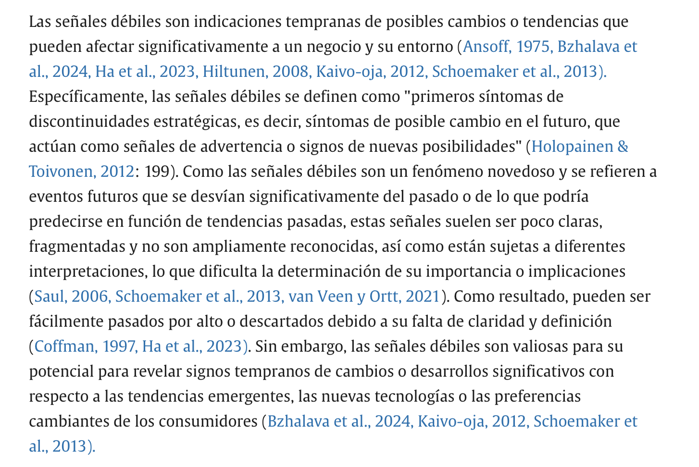
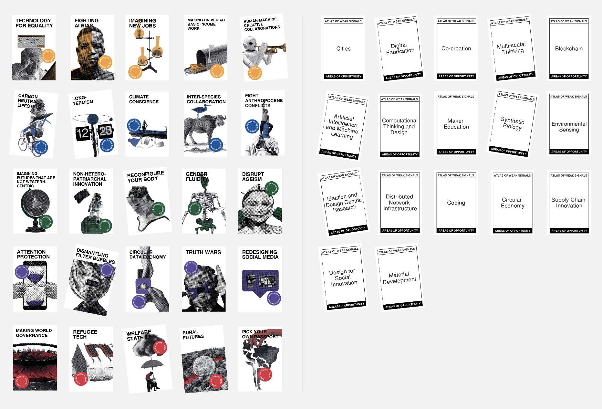
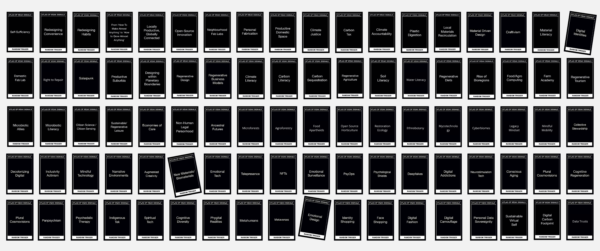
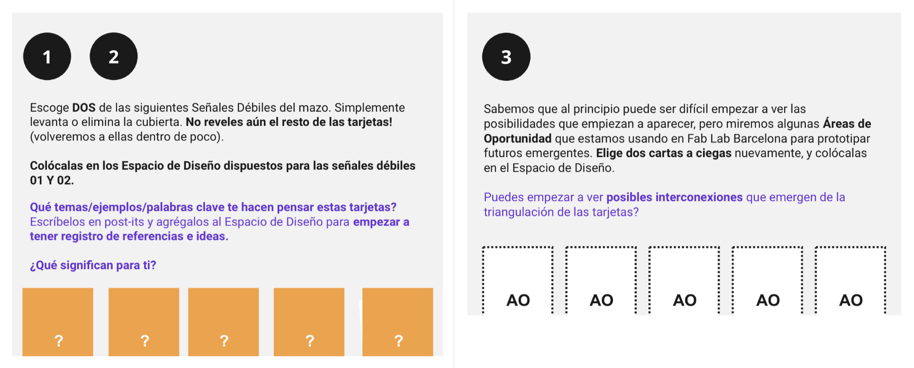
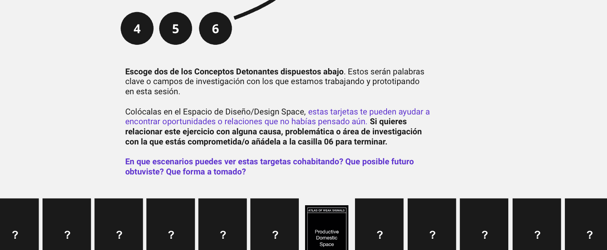
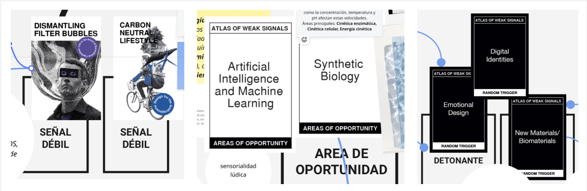
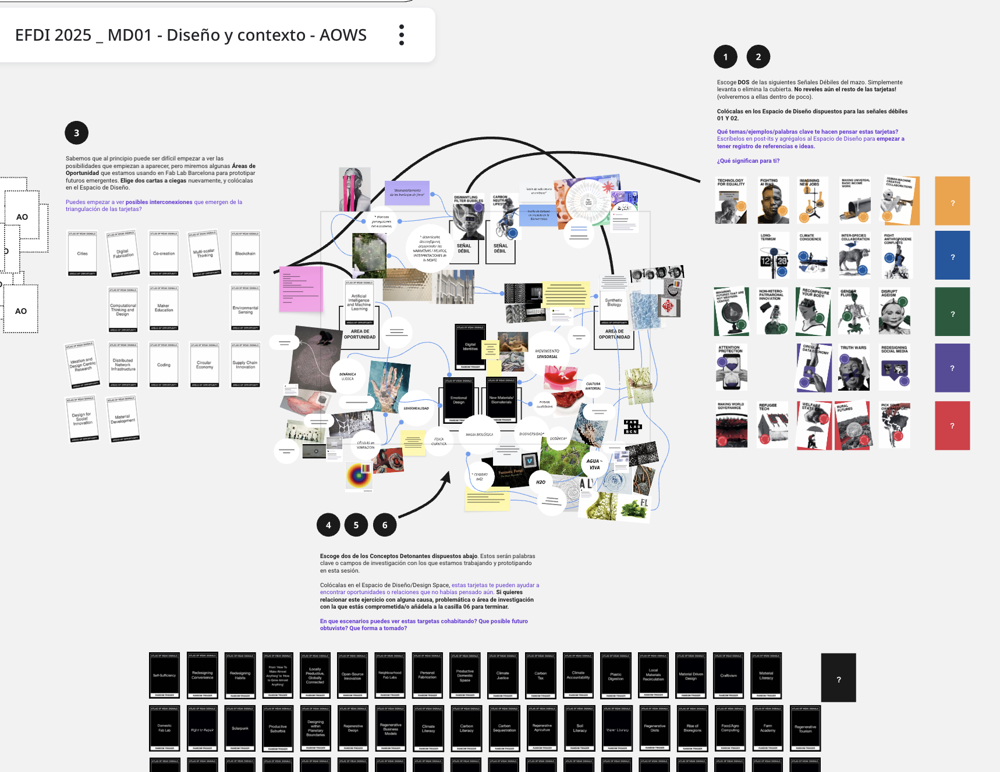
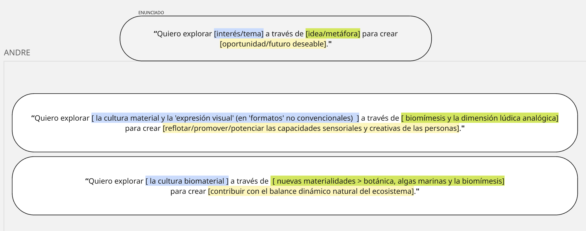
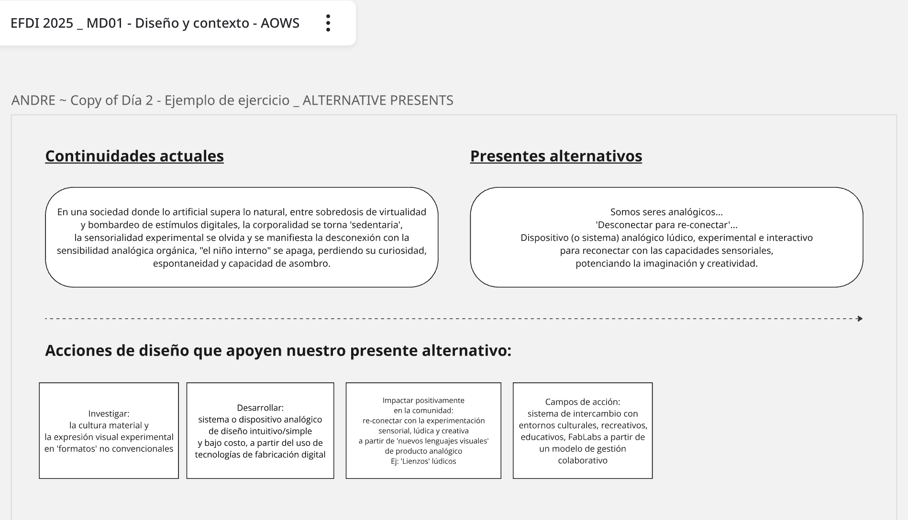
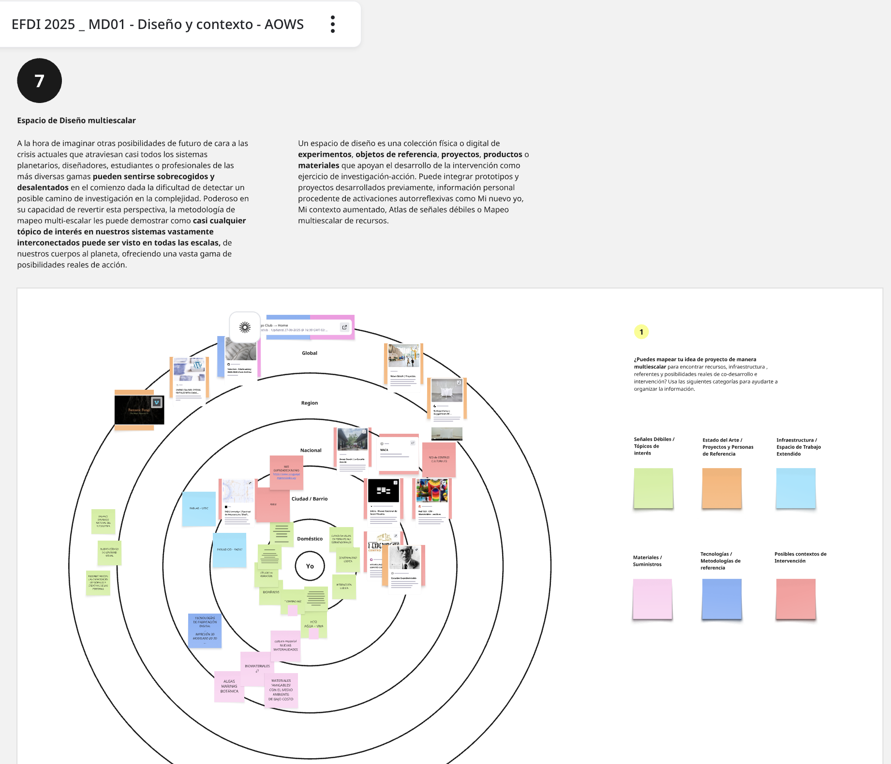

---
hide:
    - toc
---

# **MD** 01

>## **PROYECTO Y CONTEXTO** 
*DISEÑO*

 
 
 
 
 

_____

## **MARCO TEÓRICO / GLOSARIO** MD01

## **WS** . Weak Signals

# ❝  [[^ cita]](https://www.sciencedirect.com/science/article/pii/S0016328725000448) 

## **AOWS** . Atlas of Weak Signals 
Entonces las WEAK SIGNALS, son un indicador anticipado de cambio que tiene el potencial de desencadenar eventos importantes en el futuro, refieren al _["primer síntoma de un cambio o un signo de un problema o tema creciente que puede ser significativo en el futuro."](https://www.sciencedirect.com/science/article/pii/S1389934123001703#ab0010)_

Un _ATLAS OF WEAK SIGNALS_ es una herramienta metodológica proyectual basada en la teoría sobre las “Señales débiles” [(Ansoff, 1975)](https://www.sciencedirect.com/science/article/pii/S0016328725000448#bib3), y útil para configurar el desarrollo conceptual de un proyecto y un sustento argumentativo (idea/hipótesis), centrados en el **diseño de _Futuros Emergentes._**

En esta línea, el _ATLASOWS_, permite identificar posibles **oportunidades de intervención, tendencias actuales o los problemas emergentes** en el proyecto. Permite recopilar y organizar un grupo representativo de _SEÑALES DÉBILES_ que puedan describir posibles _‘vectores, discontinuidades y víctimas emergentes puede servir como una **taxonomía de palabras clave** que ofrece un punto de partida desde dónde analizar los sistemas actuales y construir posibles escenarios'_[(AOWS-Future Education and Literacy for Design).](http://www.fuel4design.org/index.php/atlas-of-weak-signals/)

En ese sentido, el _AOWS TOOLKIT_ como herramienta creativa proyectual “disparadora”,  facilita la investigación y la experimentación inicial del proceso creativo y brinda una estructura base a partir de la creación de un **ESPACIO DE DISEÑO** visual para la ideación del proyecto. 

La baraja de cartas _AOWS_ tiene 4 componentes combinables entre sí. Las _1) **SEÑALES DÉBILES** (weak signals) pueden combinarse con 2) **ÁREAS DE OPORTUNIDAD** (areas of opportunity), 3) _**RETOS DE DISEÑO ESPECÍFICOS**(specific design challenges) y 4) **DETONANTES ALEATORIOS**(random triggers)._

A través del **juego combinatorio** entre los distintos componentes y sus conexiones, lograremos explorar diversas configuraciones identificando nuevas oportunidades: áreas de interés y perspectivas/posicionamiento conceptual, escenarios y líneas de acción en el proceso de diseño con características/variables distintas al punto de partida original/inicial; que ayuden a “aterrizar el proyecto” a explorar la teoría hacia la práctica, a analizar y reflexionar sobre las distintas claves temáticas y construir una narrativa de contexto, y un relato conceptual que dé sentido al proyecto.

**SEÑALES DÉBILES + ÁREAS DE OPORTUNIDAD**

_Nota (pie de foto weak signals):_ _'Estas 25 señales débiles reflejan las tendencias actuales o los problemas emergentes identificados por la lente del programa (Master in Design for Emergent Futures, ELISAVA and cultural analyst José Luis de Vicente) pero pueden crecer o modificarse para adaptarse a los intereses del grupo que desea implementar la metodología’_ [(AOWS-Future Education and Literacy for Design).](http://www.fuel4design.org/index.php/atlas-of-weak-signals/)

**DETONANTES**

## **EF** . Emergent Futures  
Los "futuros emergentes" en el proceso de diseño refieren a la exploración de posibles escenarios futuros, identificando señales y tendencias presentes para anticipar cambios sociales, tecnológicos y culturales, y a partir de ello crear diseños innovadores y transformadores que aborden desafíos a gran escala. Este encuadre Futuros Emergentes [_‘desafía a cambiar la forma en que las cosas funcionan hoy, diseñando para el mañana'_.](http://www.fuel4design.org/index.php/design-futures-scouting/)
No busca predecir un único futuro, sino explorar una multiplicidad de futuros potenciales para informar la creación de productos, plataformas e intervenciones que mejoren la vida de las personas, promoviendo la equidad y la sostenibilidad. 

## **DS** . Desgin Spaces
En términos generales, _"Un espacio de diseño es una colección física o digital ***de experimentos, objetos de referencia, proyectos, productos o materiales*** que apoyan el desarrollo de la intervención como ejercicio de investigación-acción. Puede integrar prototipos y proyectos desarrollados previamente, información personal procedente de activaciones autorreflexivas como Mi nuevo yo, ***Mi contexto aumentado, Atlas de señales débiles o Mapeo multiescalar de recursos."***_ <http://www.fuel4design.org/index.php/design-spaces/>

DESIGN SPACE ‘MIRO' 
En esta ocasión el _Design Space_, fue representado a través del entorno virtual colaborativo _'Miro'_,  oficiando de “lienzo” digital, donde expresamos una *_visión conceptual global y desarrollo deseable de ideación_* del proyecto integrando y combinando un pool de herramientas creativas metodológicas proyectuales convenientes. [My MIRO](https://miro.com/app/board/uXjVJNzzOUI=/)

 

_____

## **HERRAMIENTAS CREATIVAS APLICADAS .** MD01

 

Las dinámicas sobre del encuadre metodologico creativo sobre el ***AOWS & Emergent Futures*** estuvieron a cargo de _Julia Leirado (Future Learning Expert)_, desarrollandose de la siguiente manera:

### **DINÁMICA**  1

**SEÑALES DÉBILES + ÁREAS DE OPORTUNIDAD + DETONANTES** . ENUNCIADO

**SEÑALES DÉBILES + ÁREAS DE OPORTUNIDAD + DETONANTES** . RESULTADO 

Los componentes AOWS tomados aleatoriamente y trabajados como disparadores conceptuales del proceso conceptual se ilustra debajo. A partir de estos, en una secuencia de tres etapas, fui construyendo el contenido asociado a las interpretaciones primarias sobre cada componente y paulatinamente linkeando entre sí aquellos factores comunes asociados entre lo visual y lo escrito. De esta forma el mapa conceptual crece con sentido hasta convertirse en un Atlas 'semiótico' interconectado.

En la continuidad del proceso para esta etapa inicial divergente del mapeo de ideas, me interesaría ampliar/profundizar en la inclusión de otras variables componentes pero en este caso a elección según la conveniencia o del camino conceptual que encuadre más acotado del rumbo del proyecto. 

_Nota:_ Las cartas viradas son potenciales componentes a integrar el Mapa/Atlas conceptual del proyecto.

**ESPACIO DE DISEÑO . RESULTADO .**  (ATLASOWS - MAPA CONCEPTUAL DE IDEACIÓN)

### **DINÁMICA**  2

### **DINÁMICA**  3
ALTERNATIVE PRESENTS
Esta herramienta consta en visualizar (en primera persona) una perspectiva realista mayor de nuestro proyecto, configurada a partir de 3 componentes: _Continuidades actuales + Presentes alternativos + Acciones de diseño que apoyen nuestro presente alternativo._ 

**ALTERNATIVE PRESENTS**. RESULTADO

### **DINÁMICA**  4
**ESPACIO DE DISEÑO MULTIESCALAR**
El espacio multiescalar consiste en visualizar de forma realista y macro la potencial escala y alcance del proyecto. Esta herramienta permite mapear realidades de escala diversa a investigar, desde lo individual hacia lo masivo (doméstico, ciudades/barrios, nacional, región, global). El guía de 6 categorías diferentes nos ayudan a encontrar recursos, infraestructura , referentes y posibilidades reales de co-desarrollo e intervención. Enmarcar y acotar el proyecto identificando aquellos posibles agentes de cambio participantes e interconectados, desencadenantes de múltiples dimensiones definitorias del proyecto.

_"A la hora de imaginar otras posibilidades de futuro de cara a las crisis actuales que atraviesan casi todos los sistemas planetarios, diseñadores, estudiantes o profesionales de las más diversas gamas pueden sentirse sobrecogidos y desalentados en el comienzo dada la dificultad de detectar un posible camino de investigación en la complejidad. Poderoso en su capacidad de revertir esta perspectiva, ***la metodología de mapeo multi-escalar les puede demostrar como casi cualquier tópico de interés en nuestros sistemas vastamente interconectados puede ser visto en todas las escalas***, de nuestros cuerpos al planeta, ofreciendo una vasta gama de posibilidades reales de acción.”_ <http://www.fuel4design.org/index.php/design-futures-scouting/>

 

**ESPACIO DE DISEÑO MULTIESCALAR** . RESULTADO

_____

## **LINKS DE INTERÉS .** MD01

Aquí, un conjunto de referencias bibliográficas virtuales y diversos recursos online utilizados como fuente de información consultada para el desarrollo teórico/práctico del Módulo Técnico MD01 (Material académico e-learning/Moodle; Clases virtuales sincrónicas/Meets; otros Links de interés).

Atlas of weak signals
<https://fablabbcn.org/blog/emergent-ideas/atlas-of-weak-signals>

Cartas AOWS Download 
<https://fablabbcn.org/wp-content/uploads/2022/03/WeakSignals-.pdf> 

<https://fablabbcn.org/wp-content/uploads/2022/03/WeakSignals-manual.pdf> 

Futuros Emergentes
<https://fablabbcn.org/blog/tags/emergent-futures>

Future Education and Literacy for Design / AOWS
<http://www.fuel4design.org/index.php/atlas-of-weak-signals/>

Future Education and Literacy for Design / DESIGN FUTURES SCOUTING
<http://www.fuel4design.org/index.php/design-futures-scouting/>

Future Education and Literacy for Design / FUTURES DESIGN TOOLKIT
<http://www.fuel4design.org/index.php/design-futures-toolkit/>

—---

Fabricademy worldwide ~ Textile & Technology Academy 
FABRICADEMY 2017-2024 
<https://fabricademy.fabcloud.io/handbook/classes/06_biofabricating/>

FABRICADEMY 2025-2026 
<https://class.textile-academy.org/tutorials/#materials-grown-mycelium> 

DomingoClub
<https://domingoclub.com/>

Guía / Documentación
<https://docs.google.com/document/d/17WyqWgCPyeTcVlHtk5DHF-f0aMlIOj5CXjm3gcGP-i8/edit?tab=t.0#heading=h.bdaq9dk1xq5v>

MOODLE MD01

[🧑‍💻 MD01_EFDI_MOODLE](https://ev1.utec.edu.uy/moodle/course/view.php?id=15375&section=11)

MEETS  MD01 

[🎬 MD01_CLASE 15/09](https://drive.google.com/file/d/1-UcFQNnW3PcgWsEp0dHobVBY0VB2UzbB/view)
[🎬 MD01_CLASE 16/09 ](https://ev1.utec.edu.uy/moodle/mod/url/view.php?id=687130)
[🎬 MD01_CLASE 18/09](https://ev1.utec.edu.uy/moodle/mod/url/view.php?id=687494)

   

 

_____

## **REFLEXIONES .** MD01 

# ❝ 
Naturalmente durante los trayectos creativos existe un proceso de maduración implícito de las ideas. En ese sentido pienso, que el _AOWS ~ Emergent Futures_ es una herramienta creativa que en la evolución continua de la investigación del proyecto se transforma su alcance hacia una herramienta de mayor alcance para el análisis y el pensamiento crítico en el proceso generativo del proyecto. En este sentido sería interesante explorar/profundizar la aplicación de estas herramientas en distintos niveles de uso y nuevos alcances a medida que el proyecto crece hacia la investigación-acción. 

# ❞
 

