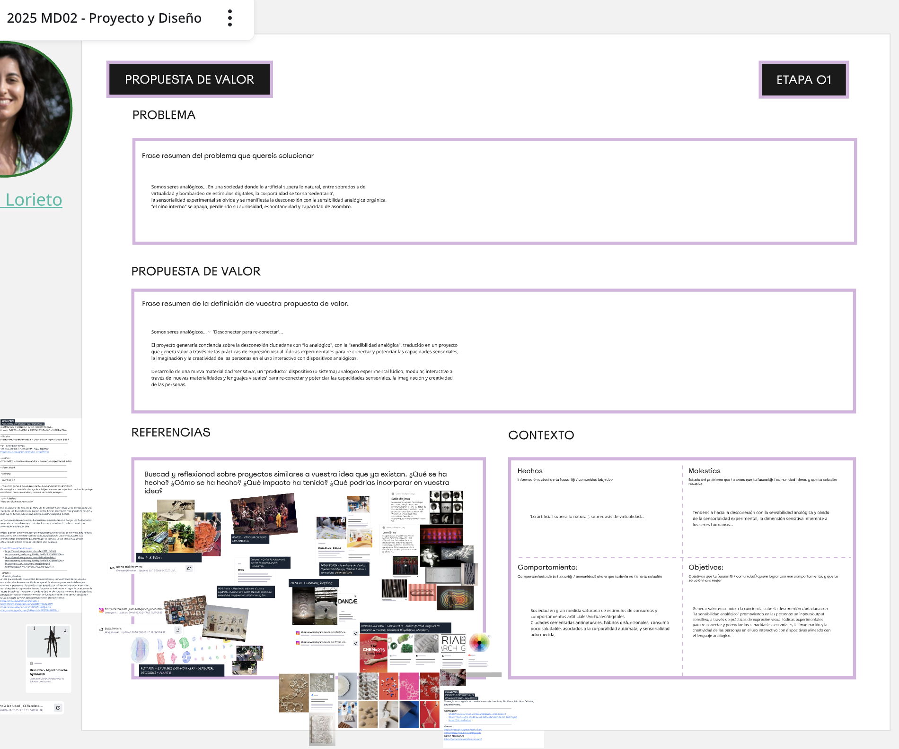
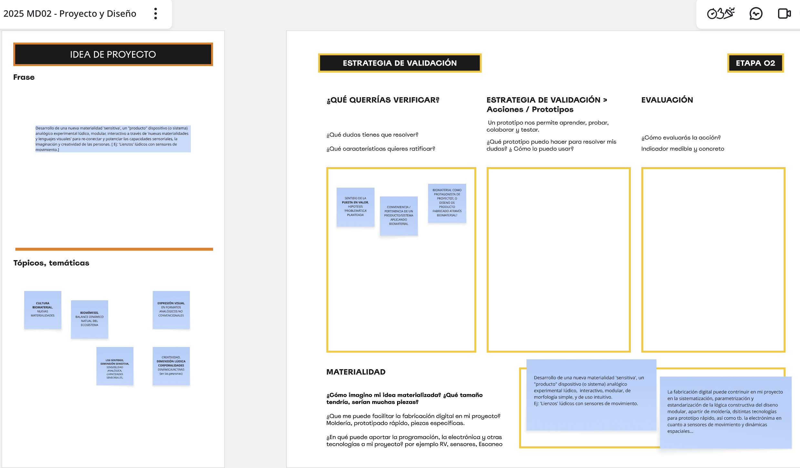

---
hide:
    - toc
---

# **MD** 02

>## **PROYECTO & DISEÑO** 
*DISEÑO*

 
 
 
 
 

_____

 

Este módulo orientado hacia el **_Proyecto y Diseño_**, abordó conceptos globales sobre la **TRAYECTORIA del PROCESO DE DISEÑO**, como oportunidad de práctica para la ideación futura, integrando a la línea temporal del proceso creativo nuevas dimensiones y secuencia de fases que nutren y estructuran el proceso de ideación proyectual. 

En el marco del **'Pensamiento de Diseño’**, este gráfico “Garabato” (**_The Squiggle_** ~ _Damien Newman_), transmite en cierta medida el espíritu de "nebulosa” en el que se encuentra actualmente mi proceso creativo proyectual de diseño, cuestionandome si la idea de proyecto tiene o no sentido, o si va en la dirección correcta, etc. 

Si bien hemos transitado ya por instancias iniciales previas (MD01~MI01) disparadoras y desencadenantes del rumbo y objetivos del desarrollo proyectual, la sensación aún es de reconocer mi estado creativo de avance en fase de  **"incertidumbre"** del proceso en mayor medida; Donde la investigación, la conceptualización, referentes afines, entre tantas otras variables que van trazando un camino de proyecto, están aún en una etapa aún divergente para poco a poco en un proceso fluctuante hacia la convergencia hacerse más evidente.

❝ _El **diseño** es una disciplina y una práctica que es capaz de lidiar con la **incertidumbre**_. ❞  [+ info ~ Design for the Pluriverse. Arturo Escobar](https://www.dukeupress.edu/designs-for-the-pluriverse)
 

En este sentido, el camino de avance sobre el proceso de diseño e ideación de proyecto puede crecer aún más reflexionando acerca de otras dimensiones que lo configuran, como a través del **prototipado, de los tests y de potenciales intervenciones estratégicas transversales al proyecto**, podemos llegar a tener una línea de desarrollo más clara, aunque no signifique que el proyecto esté acabado, pero al menos mínimamente dilucidar una visión y propósito del proyecto más clara a seguir.

❝ [...] **_El viaje de investigación_**, _descubrimiento de ideas, generación de conceptos creativos, iteración de prototipos y, finalmente, concluir en una sola_ **_solución diseñada_**.❞ 
[ + info ~ Process of Design Squiggle ](https://thedesignsquiggle.com/about)

 

_____

 

## **HERRAMIENTAS PRÁCTICAS APLICADAS .** MD02

En un encuadre sobre el proceso de diseño y nuevas etapas de avance, las dinámicas prácticas buscaron darle continuidad al proceso creativo de proyecto final a desarrollar, y reflexionar sobre distintas dimensiones de proceso que enriquecerán la investigación y madurarán la conceptualización e ideación del proyecto (propuesta idea y valor, su contexto, referentes temáticos, intervenciones-acciones diseño, prototipado-estrategia validación, etc.) desarrollándose de la siguiente forma:

 

## **DINÁMICA**  1
 
## PROPUESTA DE VALOR + JAM SESSION 

Definir de forma acertada un proyecto de diseño implica un desafío condicionado por múltiples variables; entre otras cosas, una investigación y análisis ‘exhaustivo' que permita' establecer objetiva y claramente la necesidad, la propuesta de valor, o ‘enunciado del problema' central que el proyecto busca resolver. Establecer una hoja de ruta confiable/validada (legítima, idealmente orientada al intercambio interdisciplinario) hacia una solución específica, práctica/tangible. El proceso creativo demanda compromiso, en lo actitudinal y temporal para transcurrir positivamente y que signifique una identidad genuina de la investigación de proyecto. 

En este desafío de construcción creativa me encuentro aún explorando y en este sentido enriquecí la propuesta proyectual relevando referentes bajo un denominador común **PROYECTOS SENSORIALES EXPERIMENTALES** por así decirlo; Proyectos disparadores/inspiradores que se identifican con la impronta/esencia de mi ‘concepto fuerza' de proyecto. En esta línea se buscó reflexionar sobre nuestra propuesta proyectual, identificando sus claves identitarias, analizando su impacto y propuesta de valor que los definen (qué, cómo, dónde, para qué, etc). 

**PROPUESTA DE VALOR** ~ PROBLEMÁTICA, CONTEXTO, REFERENTES

 

**JAM SESSION** ~ INTERVENCIONES / ACCIONES DE DISEÑO 

De forma individual la **_'Jam Session'_** se focalizó en la generación de ideas vinculadas a la temática de proyecto bocetada hasta el momento, identificando de forma libre/espontánea ciertas intervenciones/acciones de diseño situadas en un contexto específico. El objetivo es ir involucrando ese contexto (actores/usuarios potenciales, problemáticas, situaciones disparadoras, etc) que comenzamos a mapear y valorar aquellas acciones que podríamos implementar para validando y definir nuestro proyecto, ingresando para el avance del proceso en la fase de prototipado y encauzando poco a poco hacia una fase de convergencia. 

 

## **DINÁMICA**  2
 

## IDEA PROYECTO + ESTRATEGIA DE VALIDACIÓN ~ PROTOTIPADO

De momento estoy sumergida en un abanico de preguntas a responder, y fluctuando en un versus temático de proyecto, sin visualizar claramente un único objetivo central de proyecto, coexistiendo dos grandes temáticas: ¿hacer foco en lo biomaterial como protagonista de proyecto?, o ¿dirigir el proyecto hacia el diseño ​de ​producto ​fabricado a través biomaterial?... En este proceso creador, me interesa por sobre todo 'pensar simple' reflejado tanto en el desarrollo de ideación como en el resultado productivo 'final' del proyecto. En este sentido buscaré simplificar en mayor medida el propósito proyectual.

 

 
_____

## **REFLEXIONES .** MD02

Este módulo integra las reflexiones a lo largo del desarrollo del MD02.

 
_____

## **LINKS DE INTERÉS .** MD02

The Squiggle ~ Damien Newman 
https://thedesignsquiggle.com/about

Homo crustaceous ~ Michael Garfield 
https://aeon.co/essays/are-humans-destined-to-evolve-into-crabs
__

**PROYECTOS / PLATAFORMAS ~ referentes** 

MAKING SENSE ~ DOCUMENTATION
http://makingsenseeu.tumblr.com 
http://plazadelsol.cat/es/el-proyecto/ 

SEA POLLUTION ~ DOCUMENTATION
https://github.com/josephinebourghardt/SeaPollution
https://cleanbeachinitiative.org

MIRO ACTIVIDAD PRÁCTICA MD02 ~ REFERENTES AFÍN AL PROCESO PROYECTO
https://miro.com/app/board/uXjVJ0RGljI=/

MIRO ~ ACTIVIDAD PRÁCTICA MD01
https://miro.com/app/board/uXjVJNzzOUI=/

