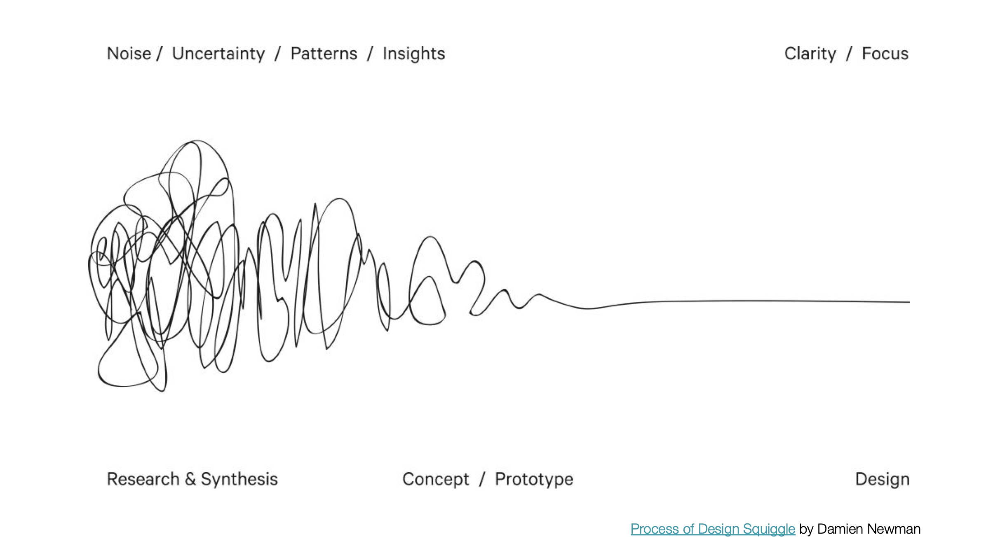

---
hide:
    - toc
---

# **MD** 03

>## **PROYECTO & DISEÑO**
*DISEÑO*

 
 
 
 
 
_____

 
## **HERRAMIENTAS PRÁCTICAS APLICADAS .** MD03

En un encuadre sobre el proceso de diseño y nuevas etapas de avance, la dinámica práctica buscó darle continuidad al desarrollo del proceso creativo de proyecto final hacia su crecimiento y concreción, analizando las distintas dimensiones de proceso para madurar y enriquecer la ideación del proyecto. Se plantearon tres áreas globales: **1) PORQUÉ, QUÉ, CÓMO del PFI** (Proyecto Final Innovador) + **2) PROTOTIPO** + **3) PLANIFICACIÓN**, como guía estructural del proyecto sobre la definición de conceptos claves específicos para cada una, desarrollándose de la siguiente forma:
[+ info ~ DINÁMICA PRÁCTICA MIRO - MD03 > PROYECTO & DISEÑO ](https://miro.com/app/board/uXjVJ0RGljI=/?focusWidget=3458764661290711232)

 
## PFI ~ **CONCEPTOS CLAVE**

 
## PROTOTIPO ~ **CONCEPTOS CLAVE**

 
## PROTOTIPO ~ **PLANIFICACIÓN**

## **REFLEXIONES .** MD02
# ❝ 
Sostengo con certeza experiencial propia, que al igual que los músculos y la bioquímica corporal se activan, y biológicamente hacen sinergia en el sistema fisiológico de nuestro **organismo vivo**, nuestros pensamientos y emociones también lo hacen cuando nos ponemos **en movimiento**, activando una **dinámica creativa de ideación**. 
# ❞

 
