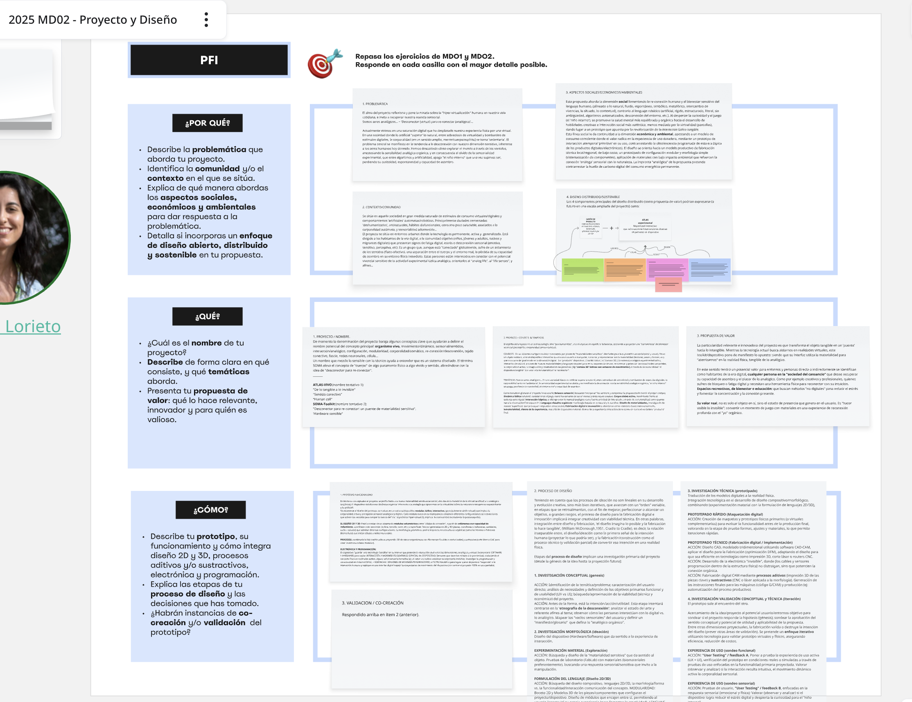
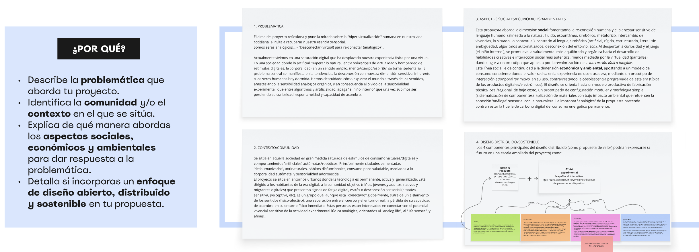
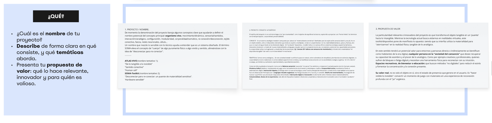
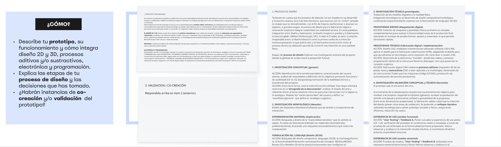
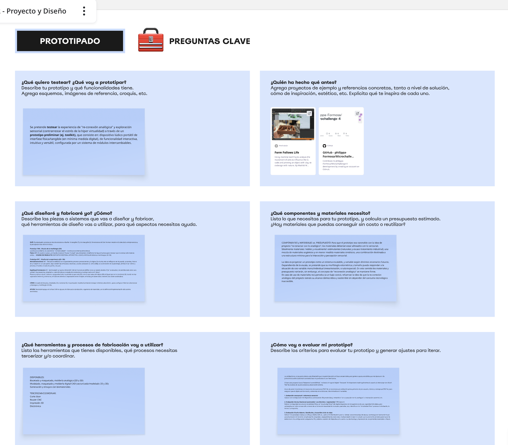
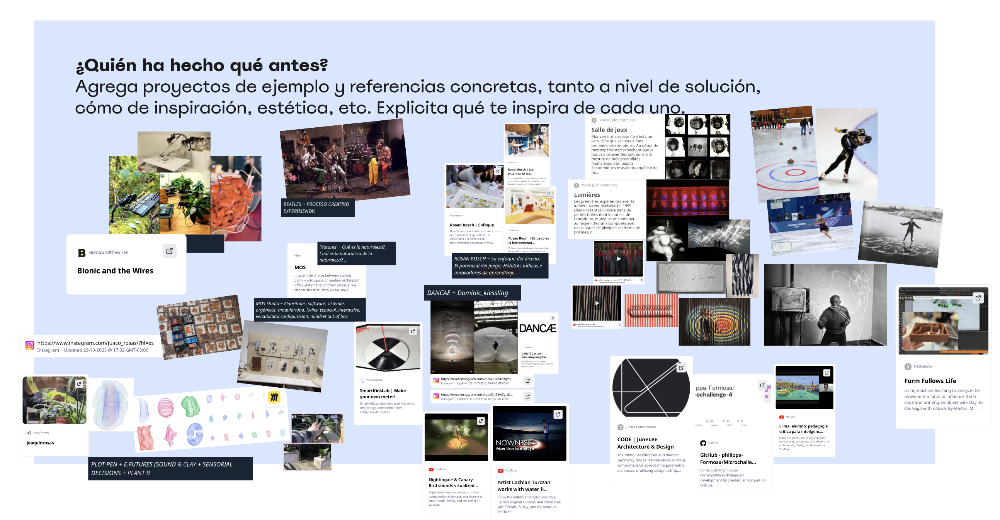

---
hide:
    - toc
---

# **MD** 03

>## **PROYECTO & DISEÑO**
*DISEÑO*

 
_____

 
 

## **HERRAMIENTAS PRÁCTICAS APLICADAS .** MD03

En un encuadre sobre el proceso de diseño y nuevas etapas de avance, esta dinámica práctica buscó darle continuidad al desarrollo del proceso creativo de _Proyecto Final_ hacia su crecimiento y concreción, analizando las distintas dimensiones de proceso para madurar y enriquecer la ideación del proyecto. Repasando los módulos previos de Diseño MD01 y MD02, nos introducimos a una nueva fase de avance donde se plantearon tres áreas globales: **1) PORQUÉ, QUÉ, CÓMO del Proyecto Final Integrador** (PFI) + **2) PROTOTIPADO** (Preguntas Claves y Planificación), como guía estructural del proyecto sobre la definición de conceptos claves específicos para cada una, desarrollándose de la siguiente forma:
[+ info ~ DINÁMICA PRÁCTICA MIRO - MD03 > PROYECTO & DISEÑO ](https://miro.com/app/board/uXjVJ0RGljI=/?focusWidget=3458764661290711232)

## PFI ~ **CONCEPTOS CLAVE** . HIPÓTESIS

 

## PFI ~ **PROTOTIPADO** . CONCEPTOS CLAVE

 
_____

## **REFLEXIONES .** MD03
# ❝ 
Sostengo con certeza de la experiencia propia, que al igual que los músculos y la bioquímica corporal se activan, (mientras biológicamente hacen sinergia en el sistema fisiológico de nuestro **organismo vivo**), la **energía vital se activa**, tal como nuestros pensamientos y emociones también lo hacen, cuando ponemos en acción nuestra mente, y estando **en movimiento, haciendo,** se activa una **dinámica y construcción creativa de ideación**. 
# ❞

 
_____

## **LINKS DE INTERÉS .** MD03

MIRO ~ ACTIVIDAD PRÁCTICA MD03
https://miro.com/app/board/uXjVJ0RGljI=/?focusWidget=3458764661290711232

MIRO ~ ACTIVIDAD PRÁCTICA MD02 ~ REFERENTES AFÍN AL PROCESO PROYECTO
https://miro.com/app/board/uXjVJ0RGljI=/

MIRO ~ ACTIVIDAD PRÁCTICA MD01
https://miro.com/app/board/uXjVJNzzOUI=/