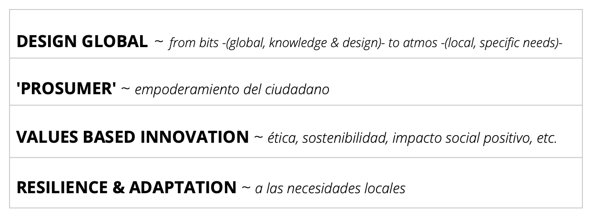
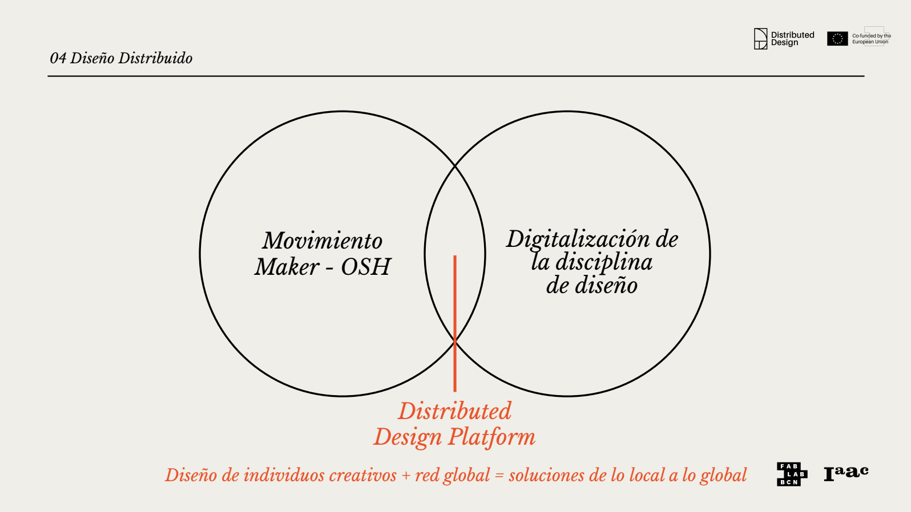
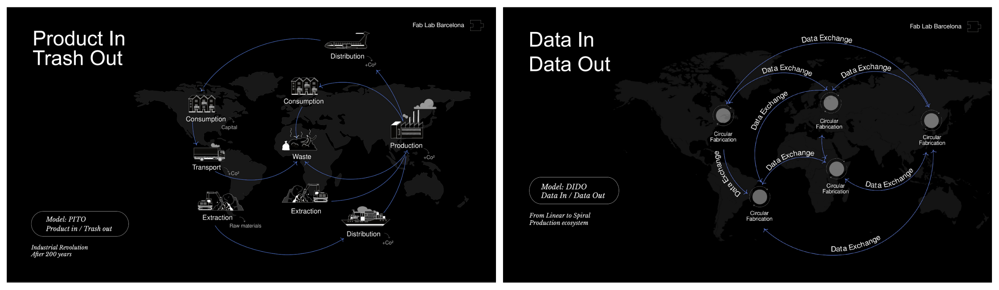
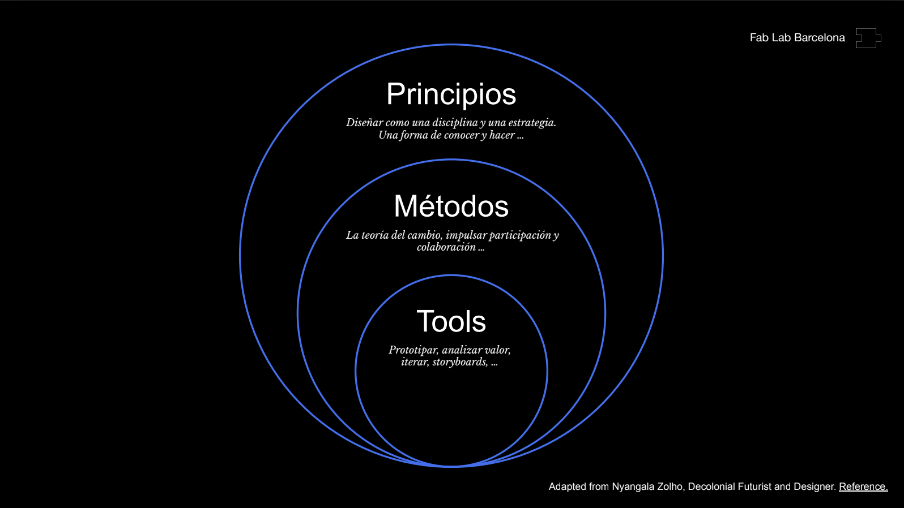
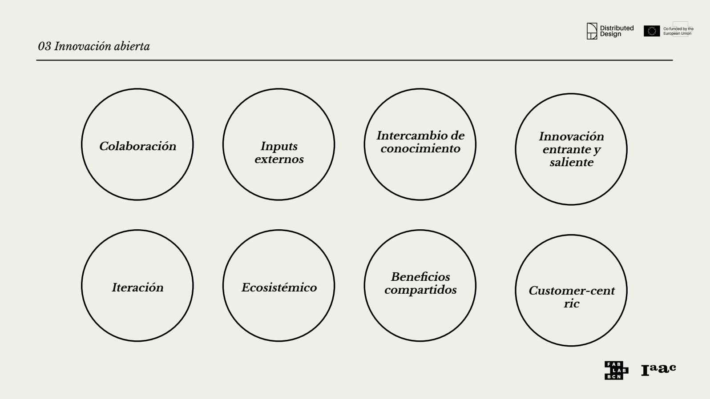
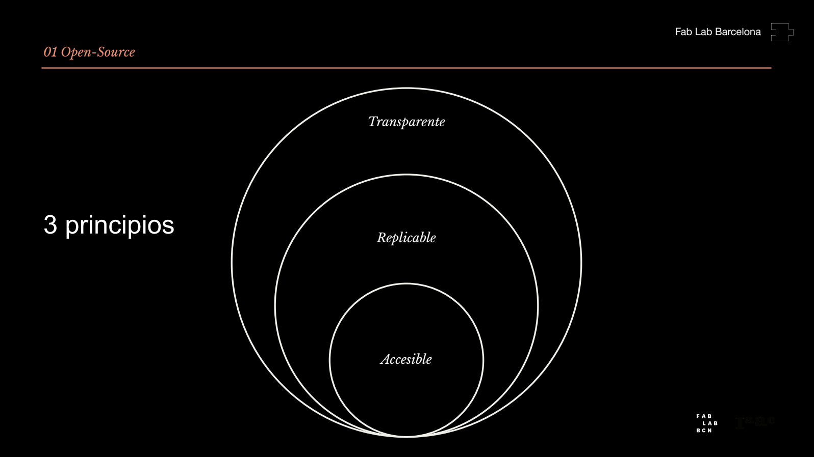
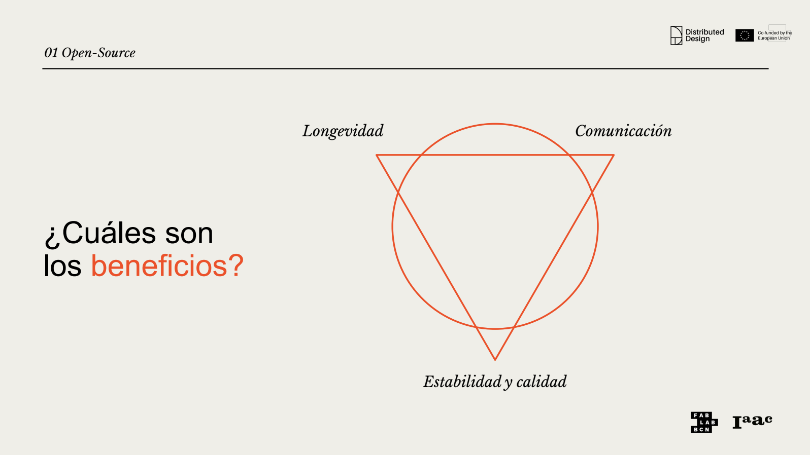

---
hide:
    - toc
---

# **MI** 01

>## **INNOVACIÓN ABIERTA & DISTRIBUIDA** 
*INNOVACIÓN Y SOSTENIBILIDAD*

 
 
 
 
 

_____

## **MARCO TEÓRICO / GLOSARIO .** MI01

❝ **_Diseño Distribuido e Innovación Abierta_**: _Una fórmula de creación que fomenta futuros abiertos, colaborativos, y regenerativos._ ❞ 

Este módulo orientado hacia la **Innovación y Sostenibilidad**, abordó globalmente un panorama conceptual sobre la **_INNOVACIÓN ABIERTA Y DISTRIBUIDA (IAD)_**, como nuevo paradigma sobre el impacto de producción y consumo hacia nuevas oportunidades de prácticas en diseño futuras; Integrando principalmente dimensiones de contexto de crisis planetaria,  socioeconómicas, ambientales, políticas, tecnológicas, geográficas, biológicas, entre otras.

❝ _El_ **_diseño_** _es una disciplina y una práctica que es capaz de_ **_lidiar con la incertidumbre_**. ❞  
[[+ info ~ _Design for the Pluriverse. Arturo Escobar_]](https://www.dukeupress.edu/designs-for-the-pluriverse) 

Las dinámicas y encuadre teórico sobre el estado del arte entorno a la IAD, fueron presentadas por [_Paola Zanchetta_](https:https://distributeddesign.eu/talent/paola-zanchetta/) 
, (Researcher & Distributed Designer) **❝**[...]**❞**. Es tan amplia la temática que paralelamente a esta base, consulté otras fuentes bibliográficas y literatura referente a la temática (web temáticas, artículos académicos, etc), mencionadas a continuación:

[[+ info ~ LINKS DE INTERÉS]](https:) 

 

## **DISTRIBUTED** . Design

Si pensamos en el concepto primario de **_"Diseño distribuido"_** como un enfoque ingenieril/arquitectónico para la creación de -SISTEMAS informáticos- en donde sus componentes (hardware/software) se dispersan y distribuyen en múltiples máquinas conectadas en red (local y remotamente) para un trabajo coordinado, (percibiendo el sistema completo como si fuera una sola entidad coherente y unificada), en lugar de un único sistema centralizado que realiza todo el trabajo, podríamos indirectamente linkear este "arquetipo" general, como base conceptual para entender el **_Diseño de Fabricación Distribuido_**. 

Entonces el "Diseño distribuido" o mejor dicho el **_Diseño de fabricación distribuida_**, implica redefinir el paradigma de la producción industrial en masa que ha dominado durante décadas.

En otras palabras significa **un cambio en el paradigma del diseño** que apunta hacia un **diseño des-objetivador**, que va más allá del objeto, y no se centra en el producto/proyecto tangible, sino que se enfoca (en un sentido más amplio) en un  **SISTEMA complejo de RED DE INTERACCIONES**, fomentando un **diseño más consciente, relacional y menos utilitario**. Se basa en la idea, 

###### ❝ _los bits viajan globalmente, mientras que los átomos se quedan localmente._ ❞

Es decir el _Diseño de Fabricación Distribuida_ aprovecha la digitalización del diseño (bits o diseños digitales) y el movimiento maker para crear un modelo de producción (atoms o fabricación física) y consumo más sostenible y democratizado; un cambio de un modelo de producción del "tomar, hacer, desechar", a una alternativa más circular, inclusiva y localmente centrada, facilitada por la tecnología digital y la conectividad global.

Es así que la **_Distributed Design Platform_** _(DDP)_, funciona como un centro o hub de intercambio y creación de redes de trabajo o networks para el movimiento maker de creadores y diseñadores en Europa. 
Fomenta un enfoque que desafía la producción en masa industrial, permitiendo la creación de productos físicos de forma local a partir de diseños compartidos globalmente en formato digital. 

La **_Distributed Design Platform_** promueve una serie de valores de diseño clave (que se alejan del modelo de producción industrial masiva). Estos valores son la base que impulsa la innovación distribuida en el campo del diseño, y guían las prácticas de diseño, se entrelazan y potencian mutuamente, brindando nuevas alternativas al presente para **crear futuros emergentes, más sostenibles, inclusivos y resilientes**. La _DDP_ defiende la capacidad creativa, centrándose en **prácticas de diseño abiertas, colaborativas, regenerativas e inclusivas (ecosistémicas).**

## VALORES DE DISEÑO

## FUTUROS EMERGENTES . características 

 

[[ + info ~ _Design Distributed Platform_ ] ](http://https://distributeddesign.eu/) 

 

## **DISTRIBUTED** . Design

La **_Innovación Abierta_** _(InAb)_, el desarrollo del concepto se remonta a comienzos del siglo XXI; el uso del término como tal se le atribuye al investigador académico [ _Henry Chesbourg_ ](http://https://haas.berkeley.edu/faculty/henry-chesbrough/) y entidades precursoras que llevaron a la práctica este modelo de pensamiento para la innovación y desarrollo como estrategia emprendedora/empresarial. Por ejemplo _"e.Lilly"_: primera plataforma de innovación abierta online (para conectar con el conocimiento científico mundial), buscó obtener rédito de la inteligencia colectiva a través de Internet. 

Básicamente la InAb, refiere a un modelo de práctica destinado al desarrollo innovador, a partir de la colaboración y la co-creación, que si bien han existido desde siempre en el ser humano (antiguo comercio industrial o en la artesanía en transferencia de 'know how' entre culturas), actualmente es una tendencia en crecimiento. En otras palabras, la InAb crece frente a la oportunidad de co-crear múltiples ideas y soluciones que pueden aportarse entre individuos, profesionales y organizaciones diversas, retroalimentandose en el beneficio mutuo del intercambio colaborativo, dando lugar a un ecosistema de innovación creativa ‘libre'/compartida.

❝ _Separation between producers and consumers is minimal in the digital commons._ ❞ 
[[ _Digital Commons ~ Elinor Ostrom, Nobel Prize en Ciencias Económicas, 2009_ ] ](http://) 

En este sentido, la reflexión de Elinor Ostrom sobre los "produc-sumidores" en los bienes digitales refiere a la idea de que, en un entorno digital, la distinción tradicional (modelo de "productor" y "consumidor") entre quién crea algo (el productor) y quién lo utiliza (el consumidor), difumina estas fronteras y a menudo desaparece, siendo la participación activa que  crea un sistema más colaborativo y sostenible, gobernado por la propia comunidad. 

❝ [...] La co-creación es un método para que las personas recuperen su capacidad para diseñar sus vidas, sus entornos. [...] deje que la co-creación se expanda a tantos reinos de la vida como pueda.❞  
[[ + info  ~ _OpenDesignNow_ ] ](http://https://opendesignnow.org/index.php/tag/co-creation/) 

 

## **OPEN SOURCE** . Hardware

❝ **_Open Source Hardware (OSHW)_** es un término para **artefactos tangibles** (máquinas, dispositivos u otras cosas físicas) **cuyo diseño se ha lanzado al público** de tal manera que cualquiera puede hacer, modificar, distribuir y usar esas cosas. ❞
[[ + info ~ _OSWA_ ] ](http://https://oshwa.org/resources/open-source-hardware-definition/) 

El **hardware** (atoms) es diferente del **software** (bits), en este sentido, los recursos físicos siempre deben comprometerse para la creación de bienes físicos. Se establecen directrices para el desarrollo y evaluación de licencias OSH y los términos de distribución de Open Source Hardware deben cumplir con los siguientes criterios: documentación, alcance, software necesario, trabajos derivados, redistribución gratuita, atribución, distribución de la licencia, entre otras.

"La tecnología digital e Internet han cambiado irrevocablemente nuestro mundo. [...] A medida que los equipos se vuelven cada vez más inteligentes y económicos, estos avances también están afectando a los productos físicos y a los procesos de producción.”  

[[ + info ~ _OpenDesignNow_ ] ](http://https://opendesignnow.org/index.html%3Fp=38.html)

❝ Free software is a matter of liberty, not price.❞ 
[[ _“Copyleft”, Richard Stallman's, GNU Manifesto ~ Free Software Foundation, 1985_] ](http://)

 

## **OPEN SOURCE** . Networking

❝ _Una red es una acumulación de nodos con conectores que los unen entre sí. A medida que se añaden nuevos nodos, pueden incorporarse nuevos conectores a una red existente, y así es como las redes crecen en tamaño. Sin embargo, esta sencilla descripción no refleja la creciente relevancia de la teoría de redes para comprender una gama cada vez más diversa de fenómenos en nuestro mundo contemporáneo. [...] La capacidad de colaborar virtualmente en proyectos en paralelo, con la ayuda del intercambio electrónico de archivos, tiene importantes repercusiones en el proceso de diseño. Esto significa que, en lugar de que un único diseñador sea el autor de un proyecto, múltiples y posiblemente miles de diseñadores, usuarios y consumidores pueden contribuir de manera significativa._❞  (Erlhoff M. et al., 2008, p.268).

El valor **Open** que la **_Distributed Design Platform_** promueve plantea una apertura en la mentalidad y el enfoque de los diseñadores, fomentando el intercambio de procesos creativos y diseños digitales mediante datos de código abierto. Este intercambio e interacción con la comunidad es decir **la manera de comunicar junto a la documentación digital** (a través del World.Wide.Web., _Tim Berners-Lee, 1990_), entendiendo ¿para quién genero valor?, así como ¿cuál es la diversidad de lenguajes, de modalidades de intercambio?, según las generaciones que lo consumen (X,Y,Z o anteriores); **empodera, democratiza**, en parte, el acceso a las herramientas de diseño, al proceso de diseño y producción, permitiendo que las **ideas sean transparentes, replicables y accesibles** (más allá de la competición) y posibilitando un desarrollo de la práctica para todos.

❝ _Una_ **_documentación sólida_** _es un factor crucial para el éxito a largo plazo y tiene una relación clara con el tipo de feedback que generan los proyectos de código abierto_. ❞ 

 

## **REGENERATIVE** . Design

El valor **_Regenerativo_** implica ir más allá de la simple **_Sostenibilidad_**, el diseño regenerativo **busca restaurar y renovar los sistemas** de los que forma parte. Este enfoque aspira a que **la producción y el diseño aporten valor positivo al medio ambiente y a la sociedad**, en lugar de simplemente mitigar los daños minimizando el impacto negativo y conservando los recursos para no agotarlos. Considerando que estamos viviendo desde una **dimensión antropocéntrica** (consumimos más de lo que generamos) no solo vale con hacer las cosas más sostenibles sino también ser conscientes en cómo regenerar los recursos consumidos. 
[[ + info ~ _Design Distributed Platform_ ]](https://distributeddesign.eu/) 

## REGENERATIVO . equivale 

 
## REGENERATIVO . principios ~ estrategias

 

## **ECOSYSTEMIC** . Design
❝ Construir una **_solución sistémica_**: nuevas formas de colaborar y de innovar juntos ❞ 

El valor Ecosistémico implica diseñar con una conciencia clara de la interconexión entre los aspectos culturales, naturales y sociales. **El diseño no se aborda de forma aislada**, sino que **se considera como parte de un ecosistema más amplio**. El objetivo es crear diseños que mejoren la salud de los sistemas sociales y ambientales, no solo que los reemplacen o devalúen. 

 

## **COLLABORATIVE** . Design

_"_A pesar de que se puede decir que todo diseño es intrínsecamente colaborativo, el término «diseño colaborativo» se refiere normalmente a las actividades de diseño llevadas a cabo dentro de equipos de diseño. Estos equipos están formados por varios colaboradores (miembros del equipo) que participan activamente en el proceso creativo. [...] Incluso en las iniciativas más prototípicamente individualistas, los diseñadores siempre han trabajado con otros, ya sea directa o indirectamente._" (Erlhoff M. et al., 2008, p.66).

El valor **Colaborativo** implica que en lugar de una producción jerárquica y aislada, se promueve la colaboración significativa entre diseñadores, fabricantes y usuarios. A través de **enfoques de codiseño y participación involucrada, se empodera a los ciudadanos, las comunidades** para que se conviertan en **participantes activos** del **proceso creativo** de diseño y producción (no diseñar para ellos sino con ellos). 

❝ _Es importante entender **quién se queda fuera_** ❞ 

En el emprendimiento del proyecto es clave identificar a quienes va dirigido el proyecto, **para quien genero valor**, y al mismo tiempo, reconocer **aquellos actores excluidos** del proyecto y proceso de creación conjunta. [[ + info ~ _Design Distributed Platform_ ] ](https://distributeddesign.eu/) 

En un mundo globalizado, los proyectos de "diseño intercultural" (donde los productos, cruzan fronteras o los diseñadores/entidades operan directamente dentro del ámbito de otra cultura), han obligado a los miembros de un mismo equipo a comunicarse quizás únicamente a través de medios remotos. 

Esto ha dado lugar según _Erlhoff M. et al. (2008)_, a comprender las capacidades y habilidades colaborativas como un elemento cada vez más importante a la hora de formar equipos (dispares interdisciplinarios, o de un mismo campo/disciplina), y a considerar cómo también éstas varían en los diferentes contextos de medios de comunicación, para facilitar el intercambio de trabajo en la actualidad y a futuro.

Independientemente de la estructura o la naturaleza del equipo, los **métodos de comunicación clara** son fundamentales para el diseño colaborativo.

 

_____

## **HERRAMIENTAS DE ANÁLISIS APLICADAS .** MI01

Las dinámicas prácticas buscaron reflexionar acerca del potencial del **_Diseño Distribuído y la Innovación Abierta_**, analizar los principios del _DDAI_, identificando aquellas variables que generan valor en cada proyecto/experimento prototipado o en desarrollo. En este sentido se analizaron (grupalmente, a partir del referente Precious Plastic) tanto casos referentes preexistentes (Mekanika, Making Sense, Slow Lab ~ Dinámica 1), como nuestro proyecto final en desarrollo (Dinámica 2). Entonces a partir de una herramienta-guía de preguntas establecidas se analizan los principios conceptuales principales del diseño _DDIA (Abierto, Colaborativo, Regenerativo, Ecosistémico)_, y se intenta (responder) identificar coincidencia o disonancia sobre la perspectiva DDIA, y analizar aquellas variables que aportan valor para nuestro proyecto para crear de posibles futuros emergentes. Desde este encuadre el **_Análisis de perspectiva DDIA_** alcanzado es aún una aproximación primaria, dado que el rumbo y objetivo de mi Proyecto Final está en pleno proceso de construcción. 

[[+ info ~ _DINÁMICA PRÁCTICA MIRO > PRINCIPIOS DDAI ]_](https://distributeddesign.eu/) 

 

## **DINÁMICA**  1

**TRÍADA DE PROYECTOS 'DDIA' ANALIZADOS** ~  CASOS DE ANÁLISIS REFERENTES DESARROLLADOS

 

## **DINÁMICA**  2
**HERRAMIENTA DE ANÁLISIS GUÍA** ~ PERSPECTIVA DDIA HACIA FUTUROS EMERGENTES 

**PROYECTO 'PET' WASTE INTO VALUE** ~  CASO ANÁLISIS REFERENTE DESARROLLADO 

**PROYECTO PERSONAL A PROTOTIPAR** ~ ANÁLISIS DE CASO EN DESARROLLO 

Frente a un proyecto en plena construcción que aún no tiene horizonte claro/profundo sobre los objetivos que lo determinan, aplicar los principios del DDIA (guía de preguntas análisis), se hizo un tanto hipotético, logrando de momento una aproximación primaria o superficial. Pienso que esta herramienta empezará a cobrar mayor significado al madurar el sentido y variables del proyecto. 

 

## **REFLEXIONES .** MI01

# ❝ 
Inevitablemente la temática DDAI y desarrollo de este módulo, ha sido un pellizcón a mi manera de concebir la práctica creativa en la profesión del diseño/diseñadores como agente de cambio para ampliar fronteras más allá! 
Influyó, invitando a cuestionarse el 'cómo hacer’ diseño con todo lo que eso implica, a integrar la idea de nuevos o cambios de paradigma sobre como crear/idear, cómo llevar a la práctica un proceso de creación desde la concepción de ideas hasta la proyección de desarrollo material final. 
Me interpela sobre una cualidad distinta "disruptiva” más democrática sobre el desarrollo del proceso de práctica del diseño, del 'cómo crear’. 

El proceso y decantación del contenido durante la documentación de este módulo ha puesto en evidencia la conexión directa entre el MT01 y el MI01, es decir el concepto de Diseño Distribuido es el factor común que los vincula, y más allá, una "idea fuerza" transversal al recorrido del programa de posgrado.

# ❞

 

## **LINKS DE INTERÉS .** MI01