---
hide:
    - toc
---

# **MI** 02

>## **DESARROLLO SOSTENIBLE Y ECONOMÍA CIRCULAR** 
*INNOVACIÓN Y SOSTENIBILIDAD*

 
 
 
 
 

_____

## **HERRAMIENTAS PRÁCTICAS APLICADAS .** MI02
 

### **BIOMATERIALES ~ FP03** . MI02

En el marco de la temática _DESARROLLO SOSTENIBLE Y ECONOMÍA CIRCULAR_ y dando continuidad a esta, se desarrolló en Minas la **_Práctica de Fabricación Presencial en Laboratorio ~ FP03_** sobre **BIOMATERIALES**. 
 [_[ + info ~ MI02 LAB Biomateriales ]_]([https://](https://docs.google.com/presentation/d/1Ci8PVQfWiSEo9Ng5epxuEVUxm2cekapxJoDby4djh8s/edit?slide=id.g22099908f62_1_394#slide=id.g22099908f62_1_394))

A partir de una introducción teórica sobre el universo de los biomateriales, su biología, naturaleza, diseño, la distinción entre biomateriales y bioplásticos, biobasados, biodegradables, entre otros, nos aproximamos a la práctica de fabricación experimental en dos macro "tipologías" de biomateriales (100% biodegradable naturalmente): BIOCERÁMICOS y BIOPLÁSTICOS (BIOPOLÍMEROS); Definidos a través de distintos componentes biológicos y obteniendo bio-compuestos con diversas propiedades y cualidades perceptivas, tanto, químicas, físicas, como sensoriales (rigidez, elasticidad, transparencia, permeabilidad, porosidad, aspereza, granulometría, conductividad, etc). Desde este encuadre, la práctica consistió en [4 dinámicas experimentales](https://drive.google.com/file/d/1UjrUSgAecJdGaavxHnt0KPnOQDl5YYvf/view?usp=share_link) presentadas a continuación:

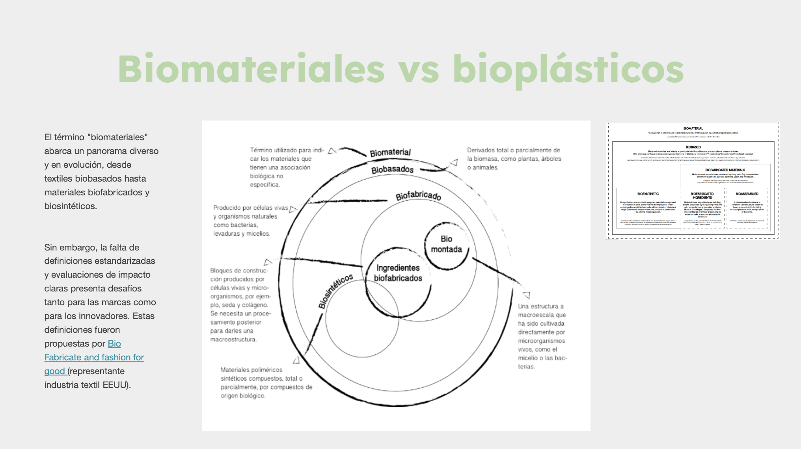
[_[ + info ~ Fashion for Good - Biofabricate ]_]([https://](https://www.fashionforgood.com/report/understanding-bio-material-innovations/))
 

### **BIOCERÁMICOS & BIOPLÁSTICOS** . Componentes 

La estructura de estos materiales depende de cómo se organizan sus moléculas para darles resistencia y flexibilidad. 

BIOPLÁSTICO: Un plástico biodegradable o bioplástico está fabricado con materias primas orgánicas como restos de frutas, celulosa o legumbres y, al ser depositado con los residuos orgánicos, entra en contacto con microorganismos que lo degradan y termina desapareciendo completamente. Un bioplástico 100% biodegradable en entornos naturales sin depender de procesos y tecnologías industriales (a alta temperaturas), suele estructurarse básicamente en tres pilares componentes:  POLÍMERO BASE + PLASTIFICANTE + ADITIVO. 

BIOCERÁMICO: La estructura base de un biocerámico 100% biodegradable y de fabricación artesanal (sin hornos industriales de alta temperatura) suele estructurarse en la **unión de una carga mineral + un aglutinante orgánico**. A diferencia del bioplástico, el protagonista es el componente sólido y rígido. Su estructura se divide en tres elementos esenciales: CARGA MINERAL ("cuerpo") + AGLUTINANTE NATURAL ("pegamento") + REFUERZO ESTRUCTURAL ("Armadura").

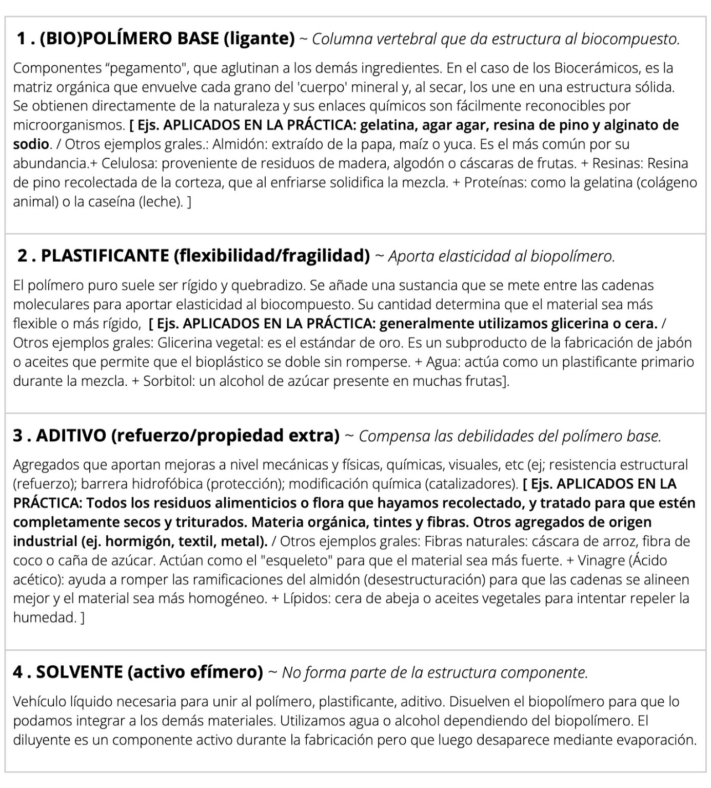
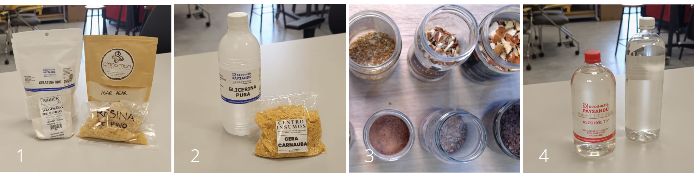

## **DINÁMICA**  1 ~ **RESINA COLOFONIA** . Biocompuesto 

**FÓRMULA + COMPONENTES**
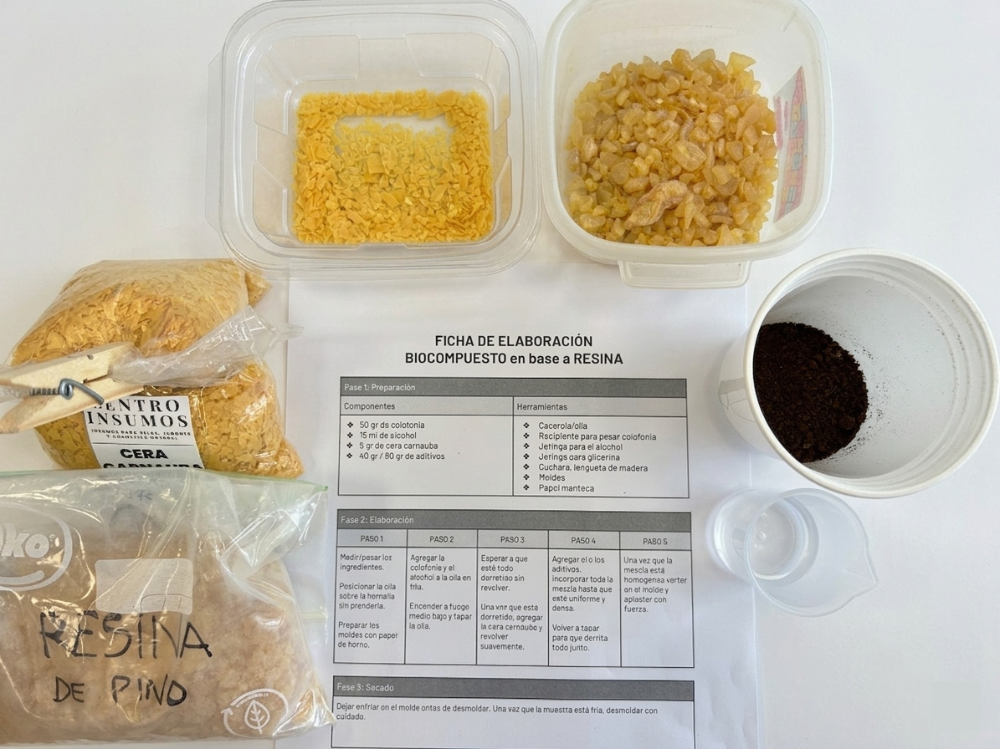
[_[ + info ~ MI02 BIOCOMPUESTO 1 ]_](https://https://drive.google.com/file/d/1UjrUSgAecJdGaavxHnt0KPnOQDl5YYvf/view?usp=share_link)

**PROCEDIMIENTO**
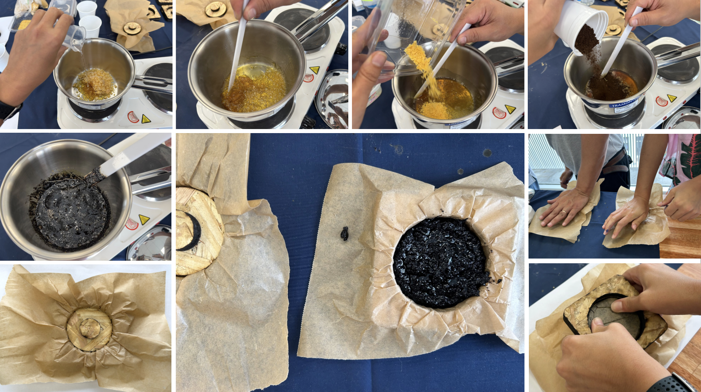

**MUESTRA ~ DESMOLDE**
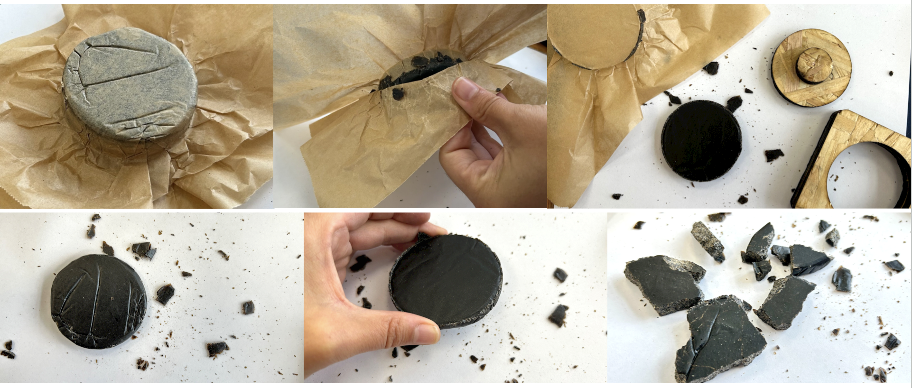

**OBSERVACIONES**

**BIOCOMPUESTO**: La fórmula de biocompuesto aplicada posibilita muestra compacta, que se percibe densa, maciza, rígida y quebradiza, frágil ante el impacto, producto de la resina como biopolímero protagonista. Variando las proporciones de aglutinante con plastificante se obtendría una mezcla más resistente al impacto.

**MOLDE**: Los moldes que llevé permiten compactar el conglomerado y definir una geometría tridimensional concreta semiesférica. Un molde blando facilita el desmolde, aunque un molde rígido facilita un mayor compactado y densidad en el conglomerado.

 
 

## **DINÁMICA**  2 ~ **ALGINATO DE SODIO** . Biocerámica 

**FÓRMULA + COMPONENTES**
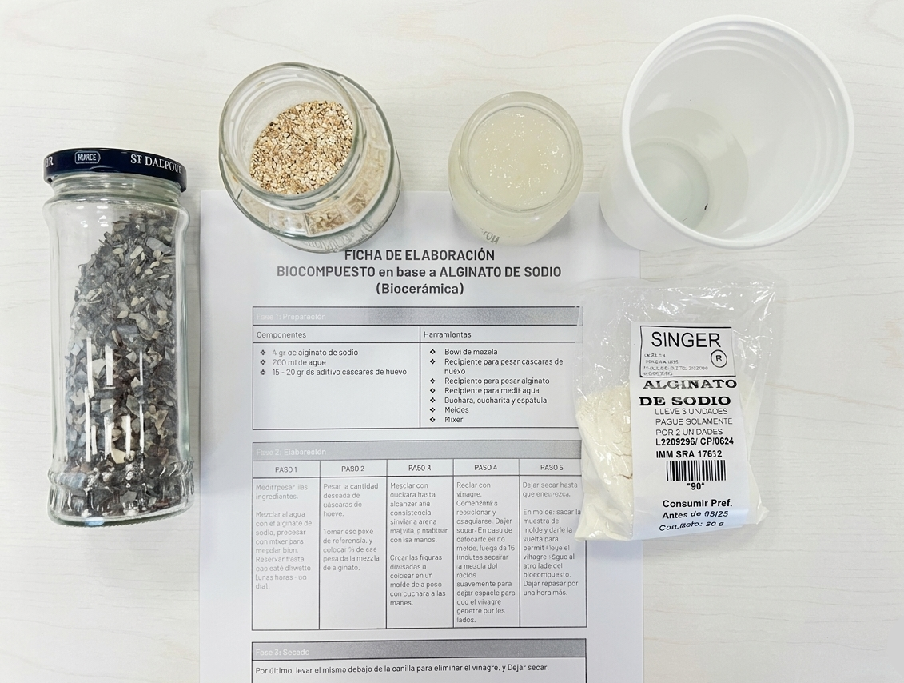
[_[ + info ~ MI02 BIOCOMPUESTO 2 ]_](https://https://drive.google.com/file/d/1UjrUSgAecJdGaavxHnt0KPnOQDl5YYvf/view?usp=share_link)

**PROCEDIMIENTO**
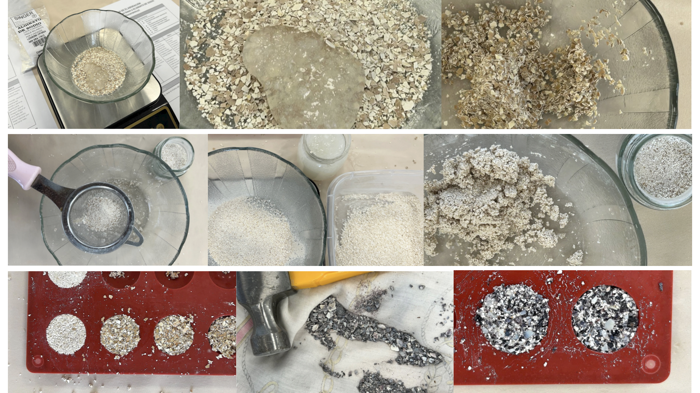

**MUESTRA ~ DESMOLDE**
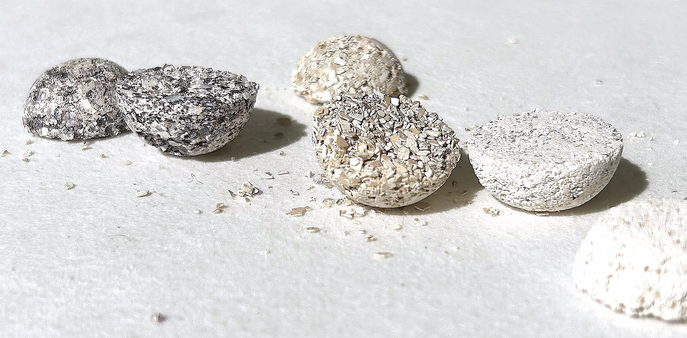
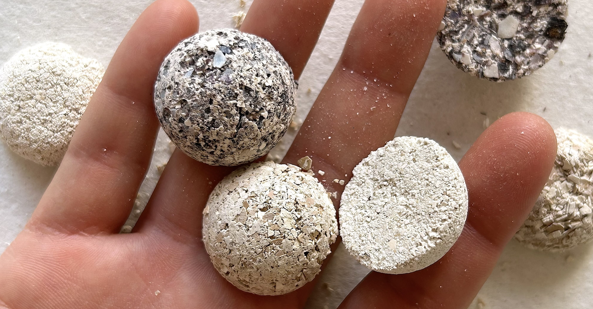

**OBSERVACIONES**

**BIOCOMPUESTO**: Para esta fórmula de biocompuesto las muestras obtenidas son frágiles. Luego de tres semanas de secado, las piezas se desgranan y quiebran, para las tres variantes de granulometrías aplicadas. Las proporciones de los componentes vs. las diversas granulometrías definen la solidez y densidad de la mezcla.  Se optimizaría el resultado ajustando; un menor grano (polvo), variantes en el aglutinante, (sumar plastificante), disminuiría la 'volatilidad’, y aumentaría la durabilidad/resistencia de la volumetría.

**MOLDE**: Los moldes que llevé permiten compactar el conglomerado y definir una geometría tridimensional concreta semiesférica. Un molde blando facilita el desmolde, aunque un molde rígido facilita un mayor compactado y densidad en el conglomerado.

 
 

## **DINÁMICA**  3 ~ **ALGINATO DE SODIO** . Biohilos 

**FÓRMULA + COMPONENTES**
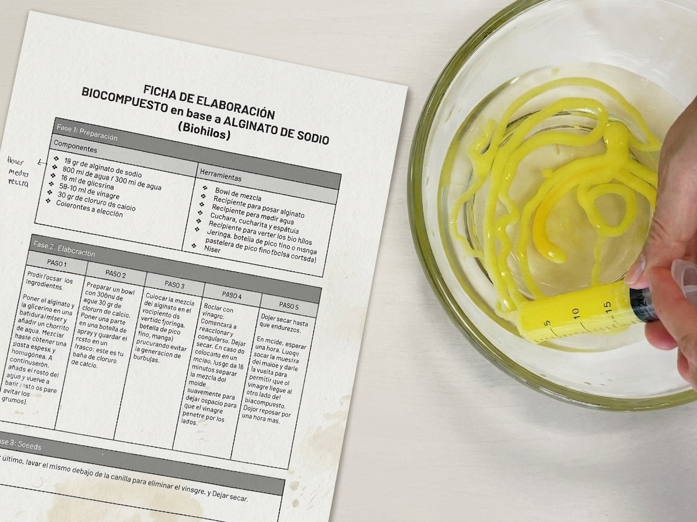

**PROCEDIMIENTO**
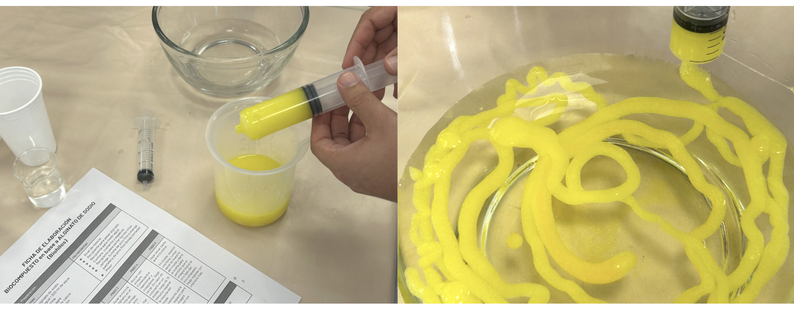

**MUESTRA ~ DESMOLDE**
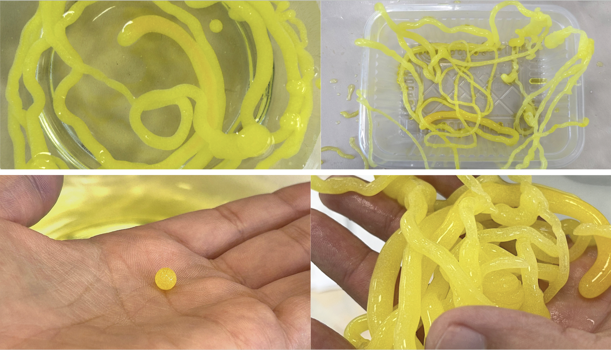

**OBSERVACIONES**

**BIOCOMPUESTO**: Bio-Hilos de geometría irregular, viscosidad, flexibilidad, y elasticidad limitada (al tensarlos se rompen). 
**MOLDE**: El 'molde' dinámico controlado por el pulso, supeditado por la técnica o habilidad manual con el instrumento extrusor,  es un desafío en sí mismo. Permite generar volumetría lineal y esférica, de un modo orgánico sin tener el dominio total sobre la morfología de la pieza bio-compuesta.  

 
 

## **DINÁMICA**  4 ~ **ALGINATO DE SODIO** . BioPlástico

**FÓRMULA + COMPONENTES**

**PROCEDIMIENTO**
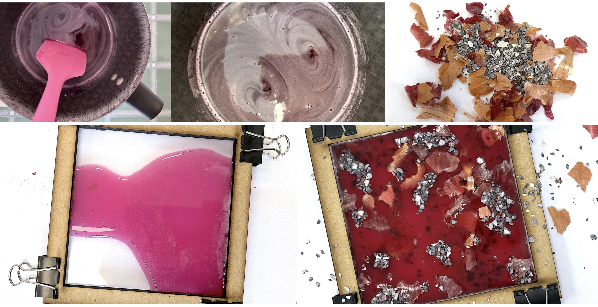
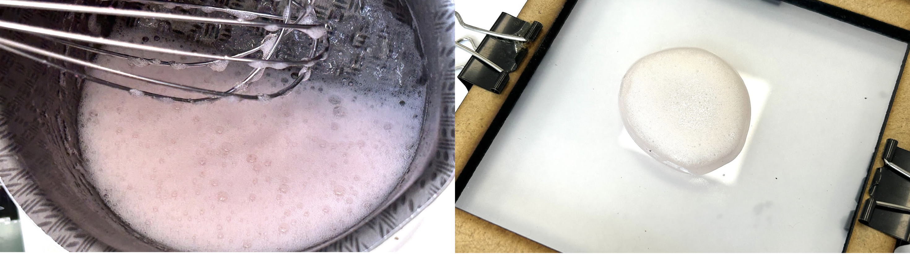 
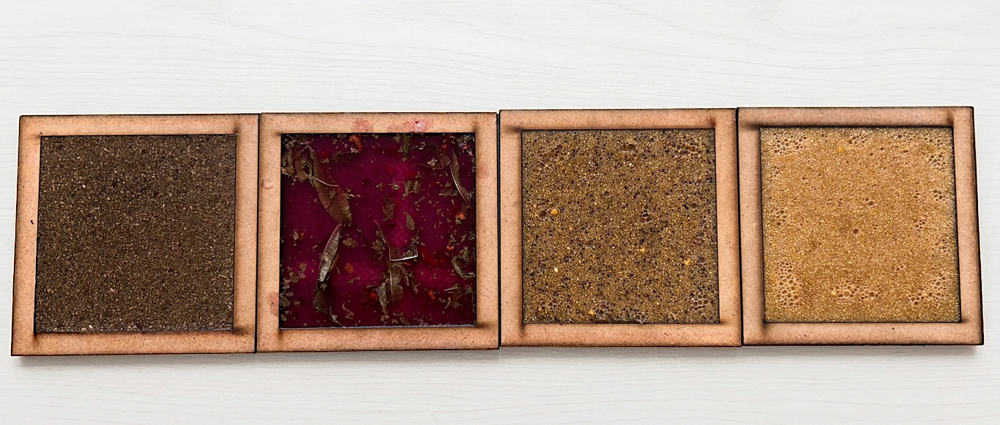
 Otras variantes de biocompuesto-plásticos del grupo de práctica del posgrado. 

**MUESTRA ~ DESMOLDE**
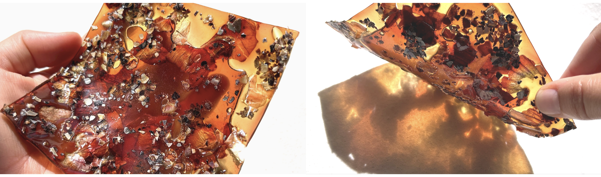

 [ _+ info 🎬 [ FP03_BIOMATERIAL 4 ]_ ]([https://](https://drive.google.com/file/d/1gQ80AuKCJTBdHRo6DFg-9oQ7F0muBJ0c/view?usp=share_link))

**PROCEDIMIENTO** ~ MOLDE EN IMPRESIÓN 3D (MT05)
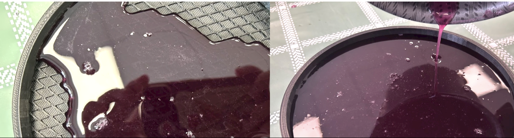

**MUESTRA ~ DESMOLDE**
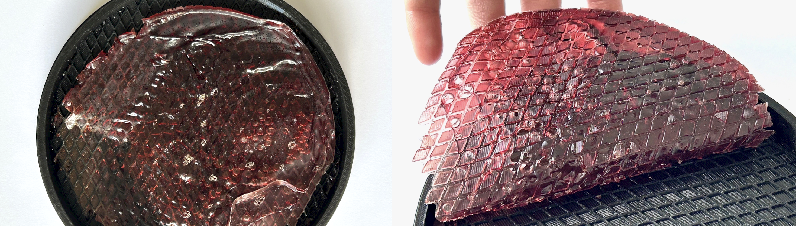
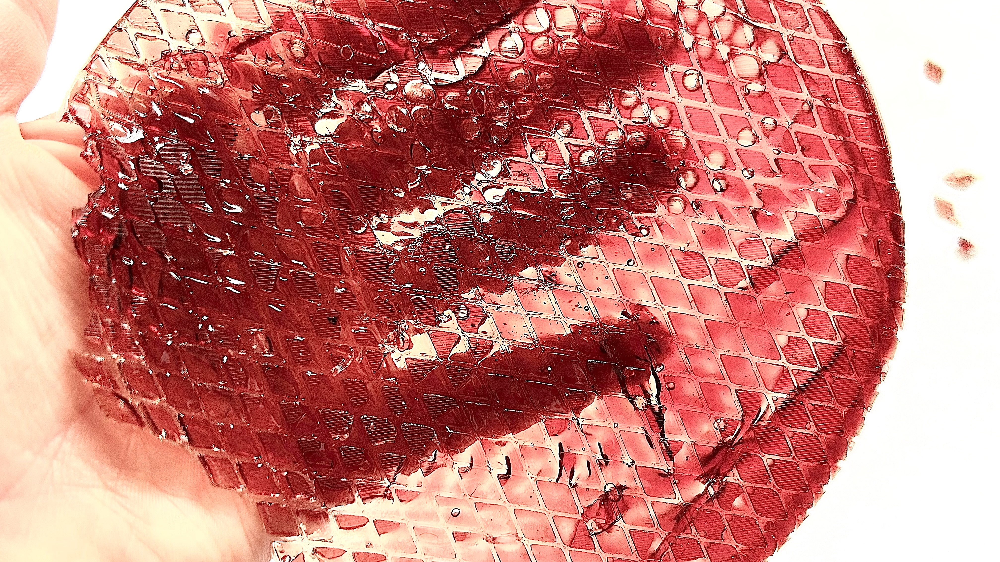
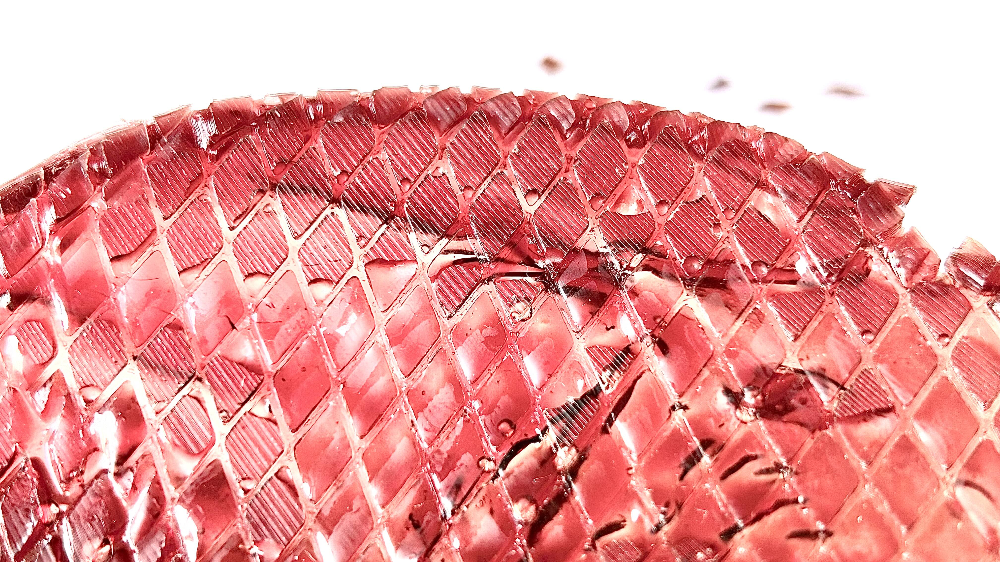

 [ _+ info 🎬 [ FP03_BIOMATERIAL 4_3Dprint ]_ ]([https://](https://drive.google.com/file/d/1J3PbtVbZ9SowtgoaZCivQYDJgWJxD_od/view?usp=share_link))

**PROCEDIMIENTO ~ BIS** . MOLDE EN IMPRESIÓN 3D (MT05)
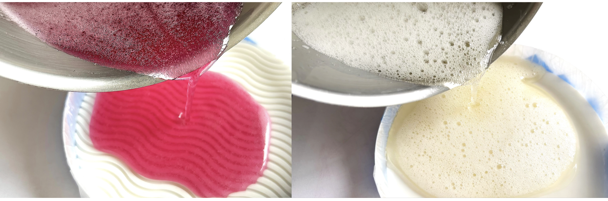
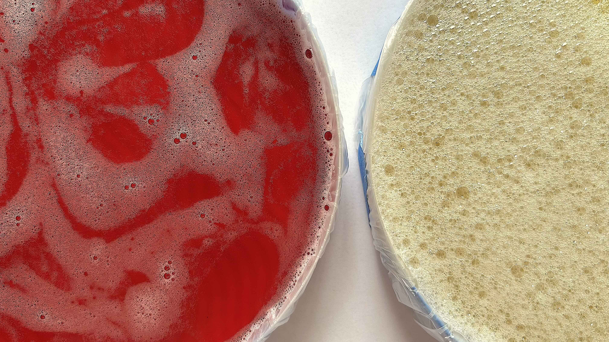

**MUESTRA ~ DESMOLDE**
 

**OBSERVACIONES**

**BIOCOMPUESTO**: Pasado el tiempo (aprox tres semanas), la ”pastilla”/lámina de bioplástico se deshidrata, y al liberar humedad, su apariencia (física/química) cambia. Deforma su geometría definida/regular del molde original a una lámina (de geometría ‘’random’ orgánica) a menor tamaño, se encoge su espesor y diámetro. El bioplástico deshidratado, pierde viscosidad, elasticidad, flexibilidad, adherencia de superficie y se torna rígido sin quebrarse, su color original intenso (de flor santa rita) se decoloró. 

**MOLDE MT05 EN IMPRESIÓN 3D**: Esta fórmula de biocompuesto copia fielmente todo detalle (virtudes, defectos),  texturas y formas del molde diseñado/fabricado en tecnología 3D (en el MT05) . A la semana de fabricada, la muestra, de consistencia gelatinosa y fuerte adherencia a la superficie no se podía desmoldar sin romperse. El molde/desmolde versus el material moldeado y condiciones de proceso secado/humedad del bioplástico (lámina/pastilla) es un aspecto relativo a revisar. Se optimizaría el resultado de la pieza ajustando algunos detalles; **modelado 3D**: (dimensiones, morfología) + **3Dprint**: calibración de la 3Dprint en favor de la calidad de impresión (ej: huecos/poros de filtración del líquido colada), orientaciones del modelo impresora, etc. Me pregunto si ¿será la impresión 3D una tecnología conveniente para fabricar moldes destinados a una colada líquida?. 

## **+BIOMATERIALES ~ OTRAS MUESTRAS** . Refs preexistentes

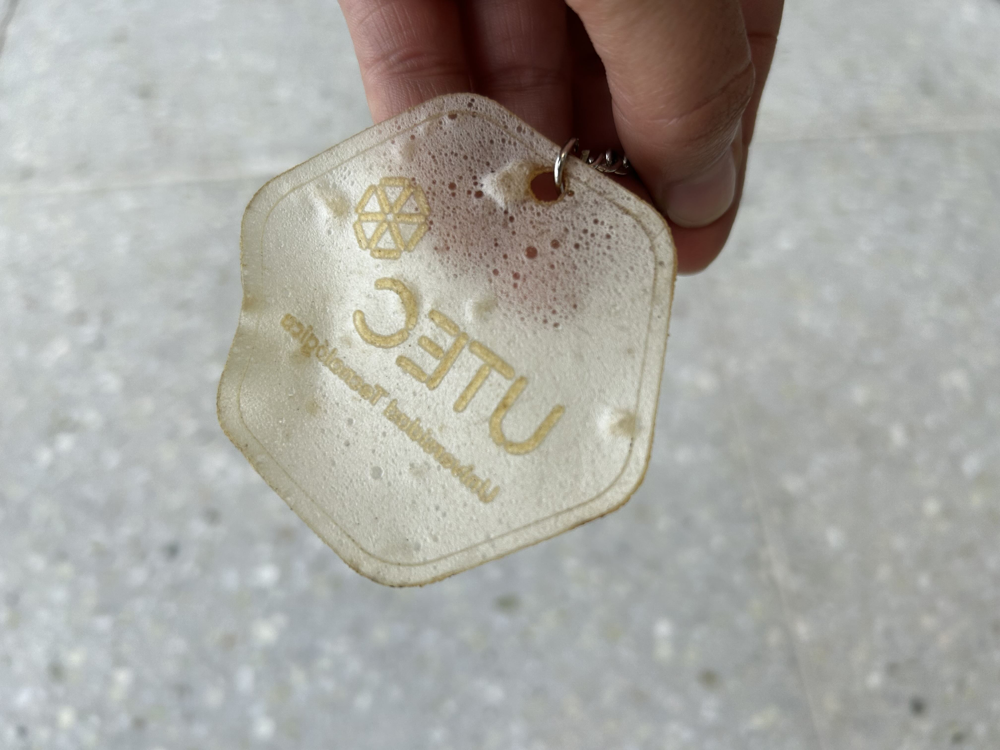
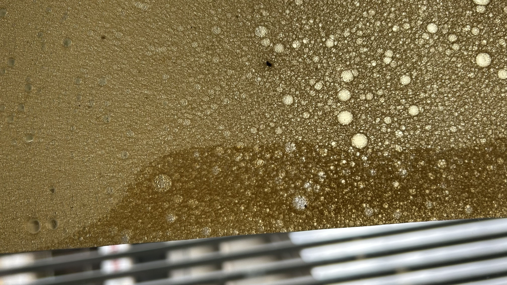
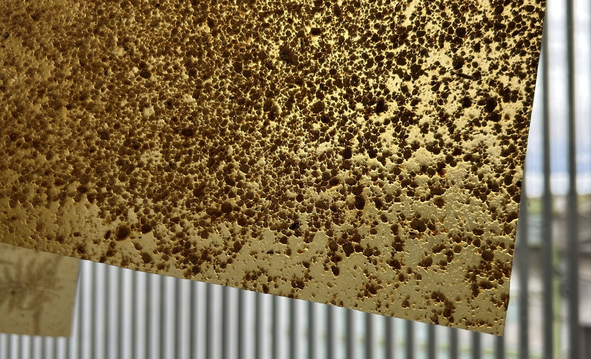
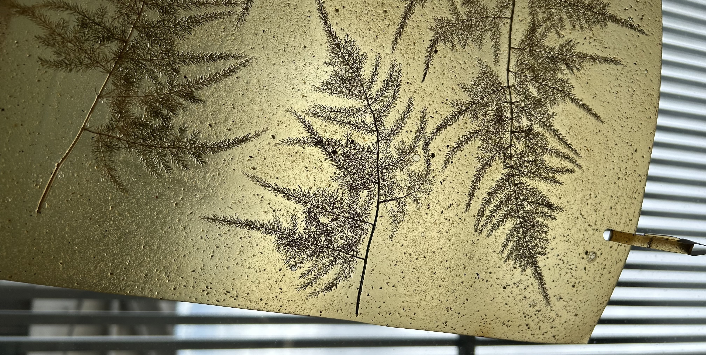

 

## **LINKS DE INTERÉS .** MI02

REDALCO
https://redalco.org/

BLUE PLANET
https://www.instagram.com/blueplanetuy?igsh=ZGIzNm9tbjg1ZXFl

FUNDACIÓN ELLEN MACARTHUR
https://www.ellenmacarthurfoundation.org/es

IDEMAT
https://idematapp.com/

INTERMATTER
https://www.intermatter.nl/

OPEN STRUCTURE
https://www.openstructures.net/

ENZO MARI 
https://syllabus.pirate.care/library/Enzo%20Mari/Autoprogettazione_%20(221)/Autoprogettazione_%20-%20Enzo%20Mari.pdf

LOW-TECH SOLUTIONS > HIGH-TECH PROBLEMS > OBSOLETE TECHNOLOGY
https://solar.lowtechmagazine.com/

BIOBASED MATERIAL
https://biobasedmaterials.org/

RAMÓN UBEDA ~ CAMINOS HACIA LA SOSTENIBILIDAD
https://drive.google.com/file/d/1f9RNMOSrmXKRfXRc9L_gCsuC91SN6aFe/view

LABORATORIO X
https://www.instagram.com/laboratorio_x?igsh=NjFoeHgyNm41aXFp

INSTITUCIONES
https://naifactorylab.com/
https://www.materiom.org/
https://www.materialdriven.com/new-nav-page

BIBLIOGRAFÍA: 
+ https://www.sciencedirect.com/science/article/abs/pii/S0144861713005055
+ https://repository.universidadean.edu.co/server/api/core/bitstreams/c55640cc-20bc-45d4-9326-13f54a3606e1/content
+ https://ri.uaemex.mx/bitstream/handle/20.500.11799/140148/Tesis%20repositorio.pdf?sequence=
+ https://www.researchgate.net/publication/359013573_Development_of_Bioplastic_from_Corn_Starch_and_Carrageenan_Reinforced_with_Eggshell_Powder_for_Packaging_Applications
+ https://pmc.ncbi.nlm.nih.gov/articles/PMC12391362/
+ https://www.nature.com/articles/s41598-025-00398-4
+ https://patents.google.com/patent/ES2286385T3/es#:~:text=Los%20agentes%20espesantes%20basados%20en%20prote%C3%ADnas%20incluyen%2C,case%C3%ADna%20(derivado%20de%20la%20leche%20de%20vaca).

RECETARIOS: 
https://issuu.com/nat_arc/docs/bioplastic_cook_book_3
https://acts.webs.upv.es/futuritat/docs/RECETARIO_BDC.pdf
__

MEETS MI02
[GRABACIÓN MEET_ MI02_CLASE 3/3](https://drive.google.com/file/d/1h_XlPvjGhUnTbHbA-H_q_2UGA7Gcw3kN/view?usp=sharing)
[PRESENTACIÓN_MI02_CLASE 3/3 ](https://drive.google.com/file/d/1Nmi7BngUu74TKlRtEV5mv2RaY0ZRHUCA/view?usp=sharing)
[PRESENTACIÓN_MI02_BIOMATERIAL_CLASE 6/3 ](https://drive.google.com/file/d/12t-37m943u3LyQt9iMvz92ukqo_nOBhj/view?usp=share_link)
