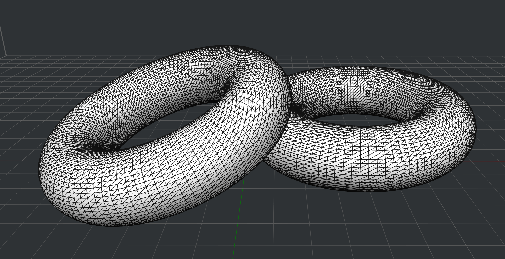
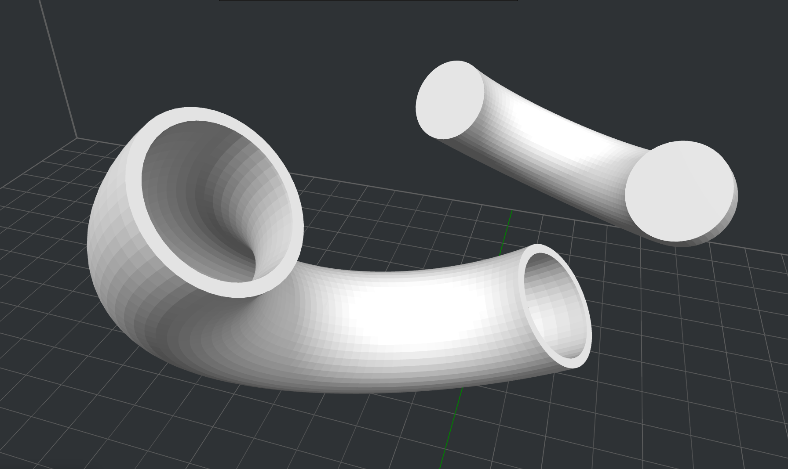
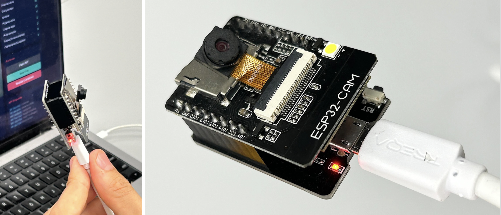
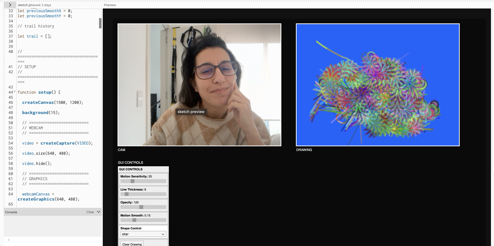

---
hide:
    - toc
---

> # **PROYECTO INTEGRADOR** 
> *' V I V O '*

 
 
 
_____

  
# **PROPUESTA ~ PROCESO IDEACIÓN**
*MARCO CONCEPTUAL*

### **PROBLEMA** . POR & PARA QUÉ

### **CONTEXTO** . COMUNIDAD

### **CONTEXTO** . SOCIAL, ECONÓMICO Y AMBIENTAL

### **PROPUESTA** . PARA QUIÉN

### **PROPUESTA** . de VALOR & NECESIDAD

### **PROPUESTA** . QUÉ 

 
 
 

# **PROPUESTA ~ PROCESO MATERIALIZACIÓN** 

### **PROPUESTA** . CÓMO ~ CRITERIOS DE DISEÑO

### **PROPUESTA**. CÓMO ~ ARQUITECTURA PROTOTIPADO

Una mirada del proyecto basada en los criterios/condicionantes (técnicas/conceptuales) del diseño, fueron la base del proceso de desarrollo de la arquitectura del sistema de prototipado de la interfaz; Este mapa de desarrollo de prototipado, regido principalmente por la electrónica como guía estructural, permitió determinar los **diversos caminos que configuran la resolución técnica y el avance potencial** y simultáneo entre Hardware + Firmware + Software + GUI, en cuanto al **alcance funcional y las dinámicas interactivas de uso** correlativas posibles. La arquitectura del sistema de prototipado y diseño de la interfaz (mapeados) se estructuró en tres niveles/fases macro: **A (0,1,2) + B (1,2) + C (1,2)**. 

Frente al objetivo de una **validación funcional inicial** (de fidelidad media/alta), este mapeo fue clave para identificar el potencial del proyecto, la evolución continua del prototipado, aciertos y obstáculos en la ejecución práctica, priorizar decisiones proyectadas e investigación desarrollada: ensayos exitosos vs. iteraciones fallidas, la dificultad de mercado costos vs. stock de insumos y la acotada disponibilidad logística del laboratorios y acceso a la tecnología de fabricación vs. la gran variable del tiempo real de entrega de esta etapa preliminar de proyecto.

### **PROPUESTA** . CÓMO ~ PROTOTIPADO ~ TECNOLOGÍA FABRICACIÓN 

Con los caminos elegidos en el abordaje de la fabricación digital del proyecto tuve la intención de desafiar mi zona de confort y sacarle el mayor provecho a áreas del conocimiento no exploradas anteriormente (al transcurso del posgrado) y profundizar en mayor medida entonces la capacidad de el diseno profesional en estas tecnologías y materiales de fabricación digital: **la ingeniería electrónica (hardware y software), lenguaje de programación de código y softwares CAD-CAM de modelado técnico 3D (y afines), destinado a la impresión 3d**. 

#### A0 . **‘DONNAS PINGPONG‘** 

Como antesala (a la segunda fase **‘A2‘** ) de validación técnica de prototipado proyecté en una primera instancia (y de forma paulatina), ensayos **‘A0 + A1‘** y testeos funcionales del concepto de experiencia de uso UX-UI idea a través de las piezas ‘bolígrafos **‘ A0 ‘** (pares macizas y huecas), destinadas al rodamiento y deslizamiento para la **modalidad de electrónica externa** (en la captación de movimiento leído a través de la modulo Board - ESP32CAM), y planeadas para la configuración de la dinámica lúdica interactiva # ‘0A‘. 

Este proceso inicial previo de aproximación electrónica conceptual de idea proyectual (A1 PingPong track paint 2D/3D), fue clave para avanzar con certeza al próximo testeo técnico, más exigente, profundo y desafiante para explotar y expandir los fundamentos y objetivos del proyecto. 

Por otra parte las piezas analógicas proyectadas en esta fase (A0), se modelaron tridimensionalmente para fabricarse en impresión 3D (con el fin de conocer las diversas cualidades técnicas que ofrecen distintos filamentos de impresión alineadas con el objetivo del proyecto). Aunque estas, no llegaron a imprimirse, dada la dificultad logística curricular de calendario/disponibilidad y acceso a la tecnología de fabricación en los LabA, vs. la incompatibilidad del tiempo/calendario real destinado al desarrollo proyecto. Esta fase de investigación (para la modalidad de electrónica externa) queda abierta para una profunda validación y testeo de la interfaz en próximas etapas de crecimiento técnico del proyecto.

#### A1 . **ELECTRÓNICA ~ OUT**

#### C1 . **GUI** [~ A1]

El proceso de prototipado electrónico de la **interfaz de diseño GUI**, transcurrió en un trayecto evolutivo gradual, desde la simulación virtual hacia la realidad analógica tangible y física de prototipos para el desarrollo del diseño de la experiencia de uso interactiva proyectada entre la combinatoria del: Hardware + Firmware + Software = GUI. 

El proceso comienza con prototipos basados en la una tecnología/protocolo comunicación y transferencia de datos un servidor WebSocket (en [_Processing_](https://processing.org)), una lógica de protocolo de comunicación bidireccional en tiempo real entre un cliente y un servidor, para ir hacia la comunicación y transferencia de datos física (sin depender de un servidor externo) y donde Processing lea directamente el puerto serie del 'servidor local’ del ESP32.

Comienzo con el desarrollo del [_PROTOTIPO C1-1_](https://processing.org); El objetivo fue obtener una aproximación y generación de los primeros bocetos de código de programación funcional para una GUI. 
En este trayecto de proceso gradual de prototipado de simulación virtual de avance clave para comprensión, claridad y depuración en la toma de decisiones de la configuración de programación del diseño de código, en un proceso creciente y enriquecido hacia la dimensión analógica y desarrollo del prototipo funcional electrónico de la UX-UI de la interfaz de diseño electrónico real/físico: 

C1: **PROTOTIPADO ‘virtual’** _INTERACCIÓN HÍBRIDA_ >  **+ VIRTUAL  &  – ANALÓGICO**
C2: **PROTOTIPADO ‘Físico’** _INTERACCIÓN HÍBRIDA_ >  **+ ANALÓGICO &  – VIRTUAL**

[_+info [ PROCESSING~ PROTOTIPO C1-1,2,3_]]([https://](https://processing.org))

[_+info [ PROCESSING ~ PROTOTIPO C1-3_]](https://https://processing.org)

#### C2 . **GUI** [~ A2]

Comienza con el desarrollo del [_PROTOTIPO C2-2_](https://docs.wokwi.com/?utm_source=wokwi); El objetivo inicial fue obtener una aproximación al sistema electrónico a nivel macro en formato netamente virtual y simulado del sistema, para visualizar el funcionamiento base del circuito de componentes, y generar un boceto primario de código de programación funcional de una GUI (basada en el Firmware + Software) proximamente depurada en la inclusión del Hardware.
El objetivo principal de este ensayo se centró en obtener la simulación virtual virtual de la posición en tiempo real de los módulos electrónicos componentes del sistema: la board [_ESP32-V1_](https://www.electronica.uy/producto/robotica/tarjetas-de-desarrollo/expressif-esp/modulo-esp32-wifi-bluetooth-30pines/) y el sensor [_MPU6050 GY-8710DOF (MPU6050 GY-52)_](https://www.electronica.uy/producto/robotica/modulos-posicion-inerciales/modulo-sensor-imu-gy-87-10dof-mpu6050-bmp180-hmc5883l/).

