---
hide:
    - toc
---

> # **PROYECTO INTEGRADOR** 
> *' V I V O '*

 
 
 
_____

  
# **PROPUESTA ~ PROCESO IDEACIÓN**
*MARCO CONCEPTUAL*

### **PROBLEMA** . POR & PARA QUÉ
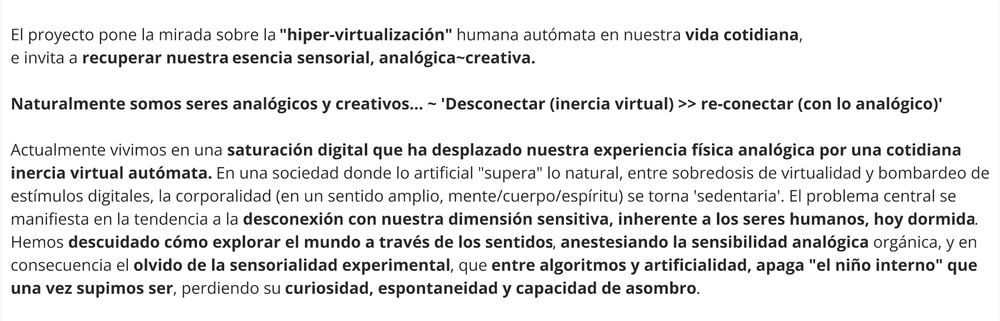
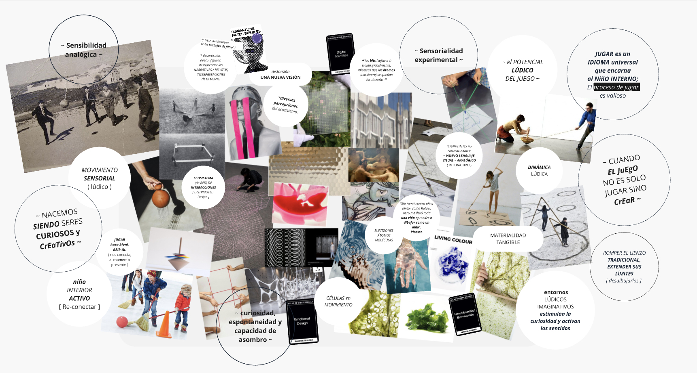

### **CONTEXTO** . COMUNIDAD
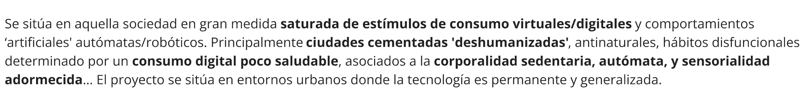

### **CONTEXTO** . SOCIAL, ECONÓMICO Y AMBIENTAL
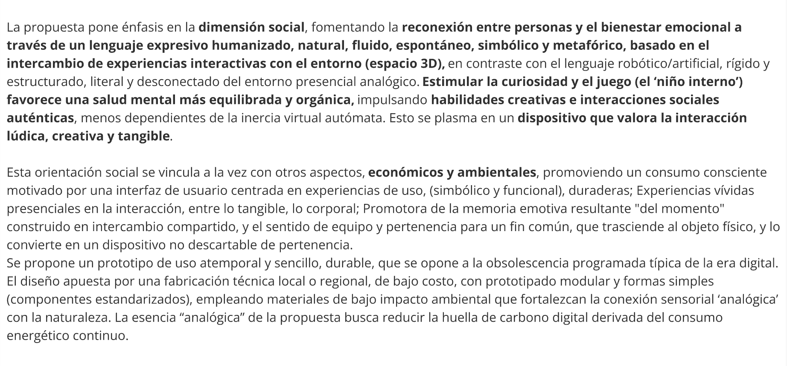

### **PROPUESTA** . PARA QUIÉN

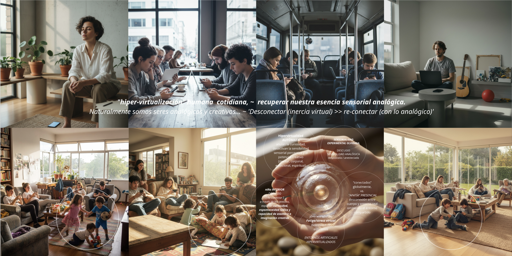

### **PROPUESTA** . de VALOR & NECESIDAD
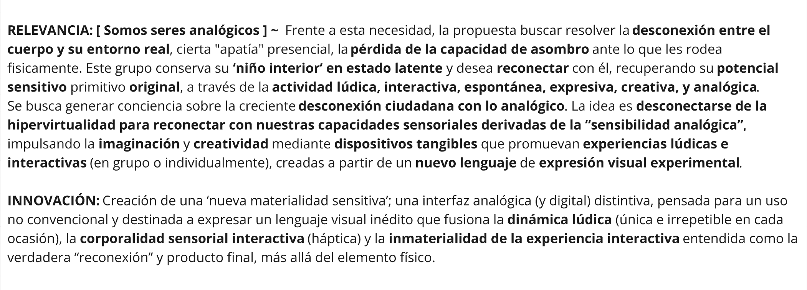

### **PROPUESTA** . QUÉ 
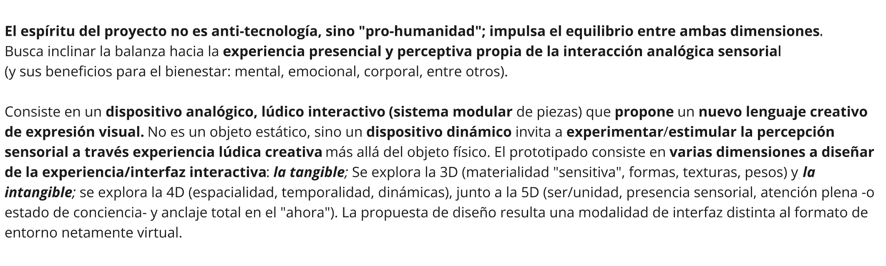
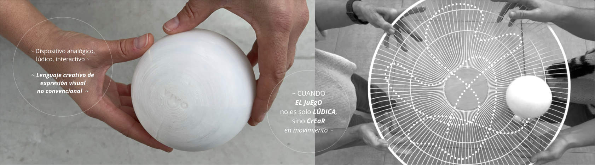

 
 
 

# **PROPUESTA ~ PROCESO MATERIALIZACIÓN** 

### **PROPUESTA** . CÓMO ~ CRITERIOS DE DISEÑO

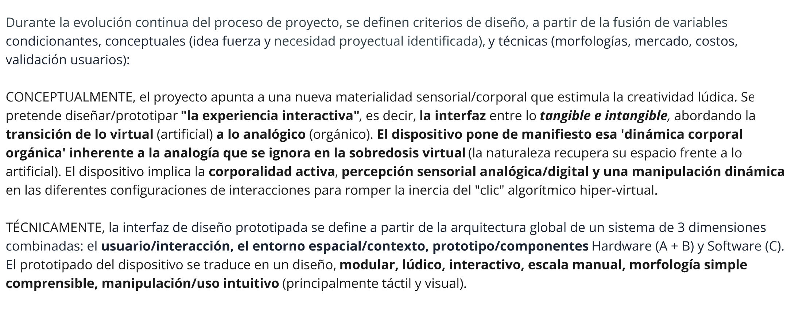
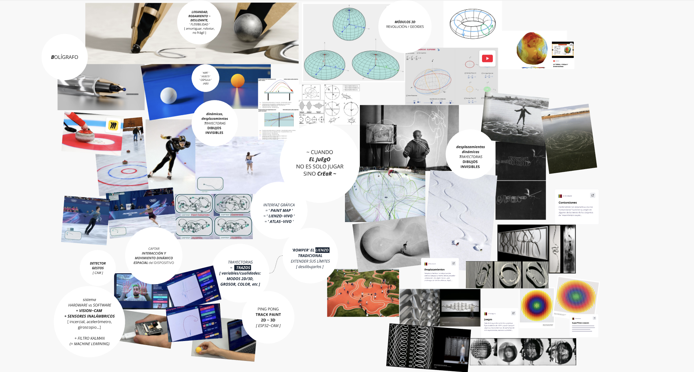

### **PROPUESTA**. CÓMO ~ ARQUITECTURA PROTOTIPADO

Una mirada del proyecto basada en los criterios/condicionantes (técnicas/conceptuales) del diseño, fueron la base del proceso de desarrollo de la arquitectura del sistema de prototipado de la interfaz; Este mapa de desarrollo de prototipado, regido principalmente por la electrónica como guía estructural, permitió determinar los **diversos caminos que configuran la resolución técnica y el avance potencial** y simultáneo entre Hardware + Firmware + Software + GUI, en cuanto al **alcance funcional y las dinámicas interactivas de uso** correlativas posibles. La arquitectura del sistema de prototipado y diseño de la interfaz (mapeados) se estructuró en tres niveles/fases macro: **A (0,1,2) + B (1,2) + C (1,2)**. 

Frente al objetivo de una **validación funcional inicial** (de fidelidad media/alta), este mapeo fue clave para identificar el potencial del proyecto, la evolución continua del prototipado, aciertos y obstáculos en la ejecución práctica, priorizar decisiones proyectadas e investigación desarrollada: ensayos exitosos vs. iteraciones fallidas, la dificultad de mercado costos vs. stock de insumos y la acotada disponibilidad logística del laboratorios y acceso a la tecnología de fabricación vs. la gran variable del tiempo real de entrega de esta etapa preliminar de proyecto.

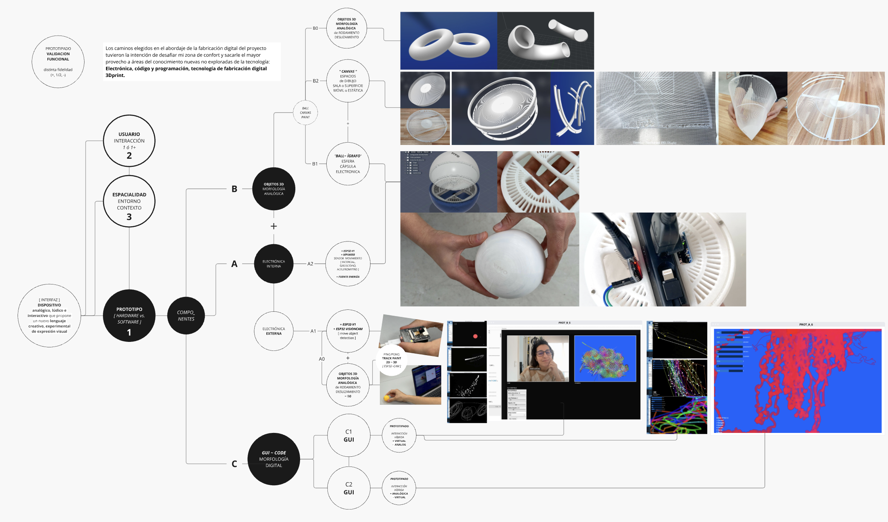

### **PROPUESTA** . CÓMO ~ PROTOTIPADO ~ TECNOLOGÍA FABRICACIÓN 

Con los caminos elegidos en el abordaje de la fabricación digital del proyecto tuve la intención de desafiar mi zona de confort y sacarle el mayor provecho a áreas del conocimiento no exploradas anteriormente (al transcurso del posgrado) y profundizar en mayor medida entonces la capacidad de el diseno profesional en estas tecnologías y materiales de fabricación digital: **la ingeniería electrónica (hardware y software), lenguaje de programación de código y softwares CAD-CAM de modelado técnico 3D (y afines), destinado a la impresión 3d**. 

A0 . **‘DONNAS PINGPONG‘**

Como antesala (a la segunda fase ‘A2‘ ) de validación técnica de prototipado proyecté en una primera instancia (y de forma paulatina), ensayos ‘A0 + A1‘ y testeos funcionales del concepto de experiencia de uso UX-UI idea a través de las piezas ‘bolígrafos ‘ A0 ‘ (pares macizas y huecas), destinadas al rodamiento y deslizamiento para la modalidad de electrónica externa (en la captación de movimiento leído a través de la modulo Board - ESP32CAM), y planeadas para la configuración de la dinámica lúdica interactiva # ‘0A‘. 