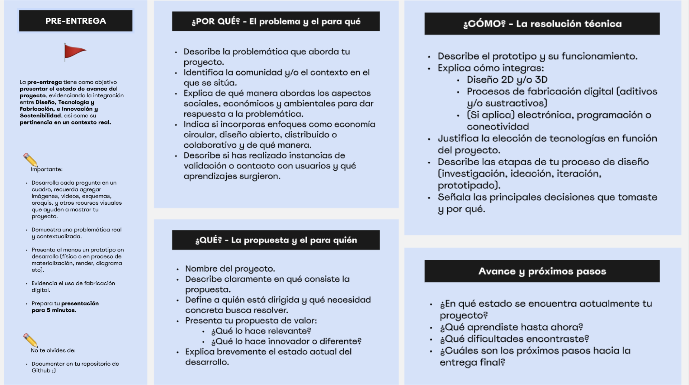
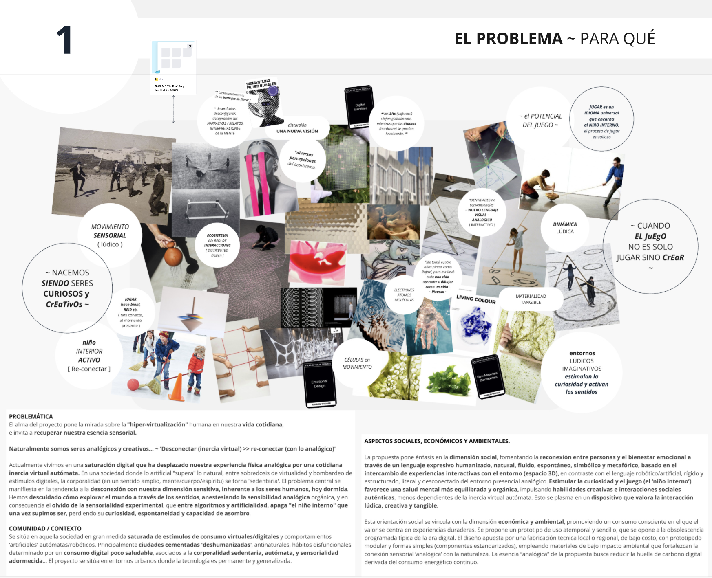
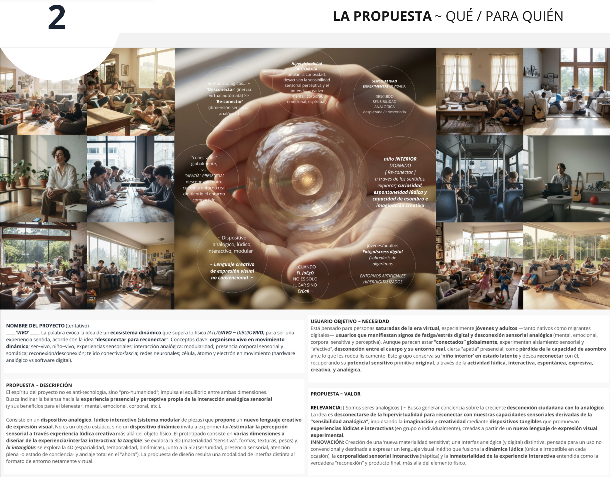
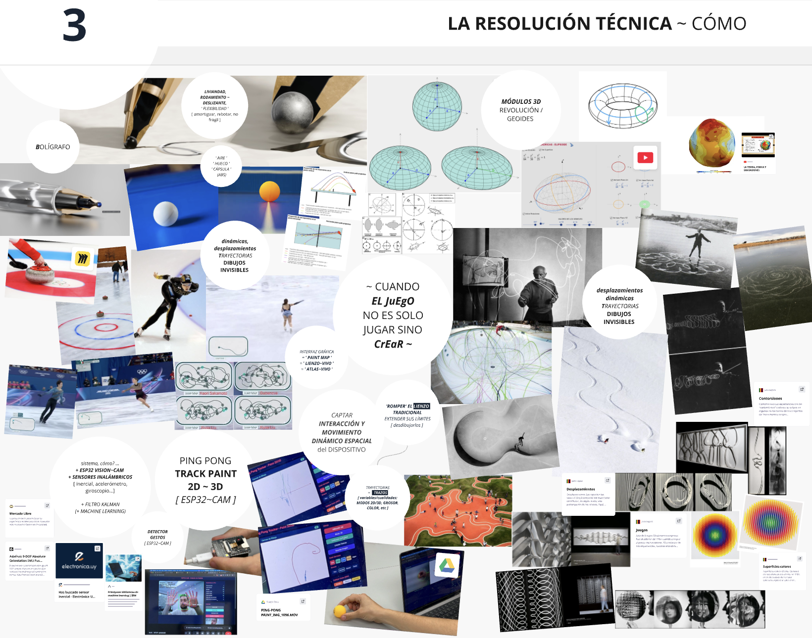
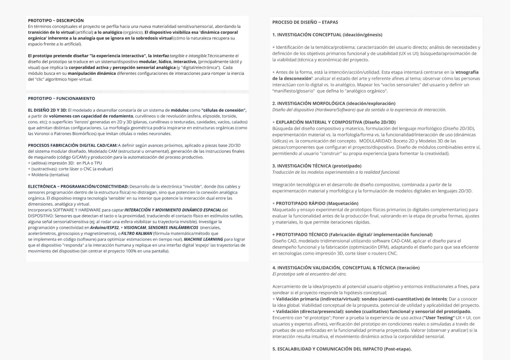
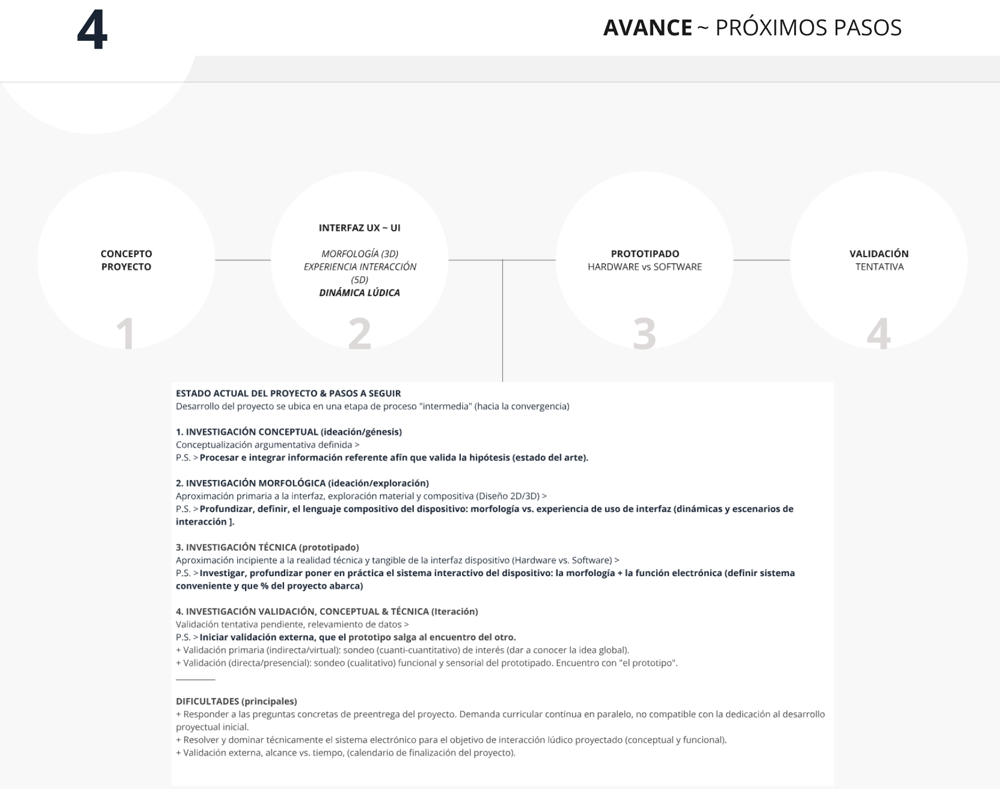

---
hide:
    - toc
---

# **PRE** ENTREGA

>
>**PROYECTO FINAL INTEGRADOR**
>
>*PFI01 . Práctica presencial en laboratorio*
>
>*PFI02 . Trabajo final*

 
_____

 

Enmarcados en el proceso de diseño del _**Proyecto Final Integrador (PFI)**_, esta etapa de avance intensiva, buscó el crecimiento y concreción de este, analizando las dimensiones claves estructurales del proceso proyectual. Ingresando en la convergencia de la fase "final” y a la vez preliminar de un proyecto con posibilidades de crecimiento futuro se configura a partir de aquí, una etapa de avance más enriquecida, asertiva y concreta del proyecto final, determinada por 4 dimensiones globales: **1) PORQUÉ [ el problema y para qué ]** +  **2) QUÉ [ La propuesta y para quíen ]** + **3) CÓMO [ La resolución técnica ]** + **4) Avances y próximo pasos** del _PFI_, desarrollándose de la siguiente forma:
 

[_+ info ~ [ PRESENTACIÓN MIRO > PFI ~ PREENTREGA ]_]([https://](https://miro.com/app/board/uXjVJ0RGljI=/?focusWidget=3458764661290711232))

 

### **PROBLEMA** . PARA QUÉ

 

### **LA PROPUESTA** . QUÉ & PARA QUIÉN

 

### **LA RESOLUCIÓN TÉCNICA** . CÓMO

 

### **PRÓXIMOS PASOS** . DE AVANCE

 
_____

## **REFLEXIONES** . PRE_ENTREGA

Instancia clave de avance contundente, útil para configurar la convergencia del proceso proyectual de cara a la fase preliminar de proyecto final, y proyección de las próximas fases evolutivas del proyecto, con potencial de crecimiento y a ser ampliado y profundizado en distintas dimensiones en futuros pasos de investigación.
