---
hide:
    - toc
---

# **MT** 01

>## **HERRAMIENTAS DIGITALES . INTRODUCCIÓN** 
*TECNOLOGÍA Y FABRICACIÓN*

 
 
 
 
 

_____

## **MARCO TEÓRICO/PRÁCTICO .** MT01
 


En términos generales el marco teórico de este Módulo Técnico abordó un panorama global sobre estos temas:

- Concepto del **_World Wide Web_** (sistema de redes neuronales) y su contexto histórico. 
- Conceptos tales como las **Competencias Digitales**, su implicancia y alcance en la **Alfabetización Digital**.
- Acercamiento y aplicación (instalación y seteo) de herramientas tecnológicas diversas, virtuales y digitales (Software MT01), como _**GitHub, Git, Visual Studio Code, (Markdown, Python)**_, basados en el concepto de Sistema de Control de Versiones (SCV), como un sistema tecnológico remoto de uso interactivo, colaborativo y sinérgico en tiempo real permanente. 
- Aproximación a conceptos básicos sobre desarrollo y diseño web para la edición del sitio, como Dominio y Hosting, diferentes códigos o lenguajes (HTML/CSS/**_Markdown_**), y junto al formato de  lenguaje de texto Markdown, el programa de edición de texto de desarrollo web **_Visual Studio Code_**.

- Desarrollo teórico/práctico del MT01 y entrega de un **GitHub WebSite** académico y personal (a partir de un GHWS-EFDI Template predefinido), basado en el lenguaje e interfaz de uso de “programación”. Este GitHub-WebSite utilizará GitHub como hosting y Git como control de versiones. Su finalidad consiste en llevar un registro del proceso de aprendizaje de las distintas etapas del posgrado como un workspace documental o bitácora virtual.

_[+ info en LINKS DE INTERÉS
](https://)_

 

_____

## **HERRAMIENTAS DIGITALES APLICADAS .** MT01
 

La práctica del MT01, requiere tener instaladas las siguientes herramientas técnicas digitales, (macOS en mi caso). Ver sección Instalación & Seteo.

- **GIT HUB (CUENTA)**: [Github.com](https://github.com/) 
GitHub es el servicio remoto o la plataforma web que alojará en la nube los repositorios _Git_, siendo Git la herramienta o sistema de control de versiones local que usa _GitHub_; (GitHub depende del sistema de control de versiones de _Git_ para su funcionamiento). Se deben sincronizar _GitHub_ con Git para trabajar en el flujo de contenido creado, cambios del proyecto a desarrollar.
(Opcional. Con _GitHub Desktop_, puedes realizar comandos de _Git_, en una interfaz gráfica de usuario, en lugar de mediante la línea de comandos). [GitHub Download Desktop](https://desktop.github.com/download/) /
[+ info Oficial GitHub Desktop](https://docs.github.com/es/desktop/overview/getting-started-with-github-desktop) 

- **GIT**: [Git Download (macOS)](https://git-scm.com/). _Git_ es una herramienta de control de versiones local (SCV), distribuido y de código abierto, que permite a los desarrolladores rastrear cambios en el código. 

- **VISUAL STUDIO CODE (VSC)**: editor de texto web [Visual Studio Code download (macOS)](https://code.visualstudio.com/)(o la alternativa Open Source Software Binaries of _VSCode_, [VSCodium)](https://vscodium.com/)). (La instalación de esta app es rápida, intuitiva y automática).

__

- **PYTHON/PIP**: [Python 3](https://www.python.org/downloads/) es el lenguaje de programación de múltiple estilo y de código abierto. PIP, (Package Installer for Python), es el gestor de paquetes estándar de _Python_, una herramienta que permite instalar, administrar, actualizar y desinstalar bibliotecas (o paquetes) de _Python_. 
[+ info Oficial Python tutorial](https://docs.python.org/es/3/tutorial/)

- **MARKDOWN (MD)**: Una vez instalada la app _VSC_, debemos instalar/vincular desde dentro de la misma, el plugin de _Markdown_. _MD_, es un lenguaje de código de texto sin formato que permite convertir, formatear y estructurar la escritura, asignando cualidades a través de una sintaxis sencilla y legible, sin necesidad de un editor especializado de procesamiento de texto más complejas. 
[+ info Markdown tutorial](https://www.markdowntutorial.com)
[+ info Markdown sintaxis](https://markdown.es/sintaxis-markdown/#parrafos)

- **MKDOCS**: Su utilidad es construir la estructura visual del sitio. _MkDocs_ es una herramienta que toma los archivos Markdown y los convierte en un sitio web estático, permite tener una vista previa local de la documentación. _MkDocs_ es la Librería de _Python_, así que primero debes asegurarte de tener instalados en tu sistema _Python_ y su administrador de paquetes (PIP).
[+ info Mkdocs install](https://www.mkdocs.org/getting-started/)


_____

## **HERRAMIENTAS DIGITALES / SET & INSTALL .** MT01

 


#### 1. **CREAR CUENTA EN GITHUB**
Debemos generar una cuenta en [GitHub](https://github.com/), la plataforma web que alojará (como Hosting) de forma remota los repositorios [Git](https://git-scm.com/), la herramienta de control de versiones local en nuestra PC.
 

#### 2. **INSTALAR GIT**
Instalar [Git para macOs](https://git-scm.com/downloads/mac) lo haremos a través de [Homebrew ](https://https://brew.sh) como un package manager.

_Nota:_ Pegar la linea de comando en macOS Terminal:
```bash
bin/bash -c "$(curl -fsSL https://raw.githubusercontent.com/Homebrew/install/HEAD/install.sh)" 
```
Al pegar la línea de comando dar “ENTER” e ingresar el Password personal de la PC/MAC y dar "ENTER” y la instalación empieza a correr durante unos 'minutos' (el tipeo del password es de modo invisible). [+ info Command Line Tutorial](https://blog.teamtreehouse.com/introduction-to-the-mac-os-x-command-line)
 

#### 3. **SETEAR GIT**
Una vez instalado GIT, debo sincronizar/configurar GitHub con Git para trabajar en el proyecto a desarrollar. 

**Paso 3.1**
Abrir la terminal y allí configurar mi usuario GitHub + email, ejecutando los siguientes comandos (dejar que corra en la terminal la acción de seteo): 
```bash
git config –global user.name “andrealorieto” 
git config –global user-email “tatulor@gmail.com”
```
**Paso 3.2**
Verificar la correcta configuración (del username + email), y ejecutamos en la terminal línea de comando: 
```bash
git config –global –list
```
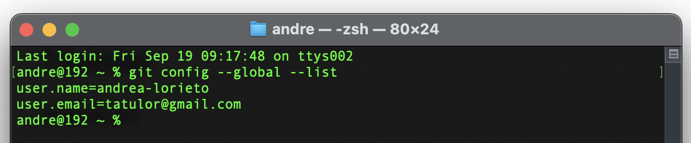
 

#### 4. **GENERAR UN SSH KEY**
Una clave SSH permite establecer una conexión segura entre la GIT (PC local) y GitHub.
Importante! Si utilizo otra PC debo crear otra SSH. Para realizar la autenticación de conexión segura entre GIT-PC y GitHub ("Git Authentication secure Key”) debemos seguir los siguientes pasos:

**Paso 4.1**  &ensp; **Verificar si ya tenemos una SSH KEY**.
Abrir la terminal y ejecutar línea de comando:
```bash
cat ~/.ssh/id_rsa.pub
```
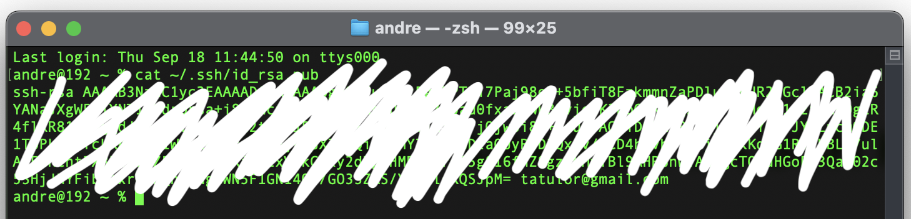
 
_Notas:_
- Asegurarnos que en el final de la cadena SSHkey figure el email seteado previamente al sincronizar Git con GitHub.

- Otro camino para ubicar manualmente en la PC la SSHkey generada es: abrir la carpeta de inicio en el Finder, hacer clic en Ver > Mostrar contenido de la carpeta > Ocultar (Comando + Mayús + Punto) y navegar hasta la carpeta `.ssh`. con ruta: `(Users/andre/.ssh/)`.

- MacOS oculta por defecto ciertas carpetas como la `.ssh`, entonces para visualizar contenido oculto: abrir el Finder, navegar hasta la ubicación deseada y presionar la combinación de teclas: Comando (⌘) + Mayúsculas (⇧) + Punto (.) y se abrirá la carpeta `.ssh` en una nueva ventana del Finder, donde podré ver mis archivos de clave (como `id_rsa` y `id_rsa.pub`). 

**Paso 4.2**  &ensp; **Generar mi PUBLIC SSH KEY**.
Puedo omitir este paso de generar mi public key ssh-keygen, si en el paso anterior de verificación, en la terminal aparece desplegada una cadena larga que comienza por ssh-rsa.
Abrir la terminal y ejecutar línea de comando:
```bash
ssh-keygen -t rsa -C “tatulor@gmail.com”
```
**Paso 4.3**  &ensp; **Copiar la PUBLIC SSH KEY en mi cuenta GITHUB**.
Para completar la _"Git Authentication secure Key”_ entre GIT-PC y GitHub.[+ info About SSHkey](https://docs.github.com/es/authentication/connecting-to-github-with-ssh/adding-a-new-ssh-key-to-your-github-account)

- Copiar la SSHKey de la terminal o a través de la ruta de carpetas `.shh/id_rsa.pub`
Copiar la SSHKey desde la terminal: ejecutando línea de comando (para macOS):
`pbcopy < ~/.ssh/id_rsa.pub` ó
- Pegar la SSH key en GitHub ingresando en: 
`Profile personal account > Settings > SSH and GPG Keys > New SSHkey > (PEGAR SSH Key agregando un título para identificarla) > Add SSH Key`.

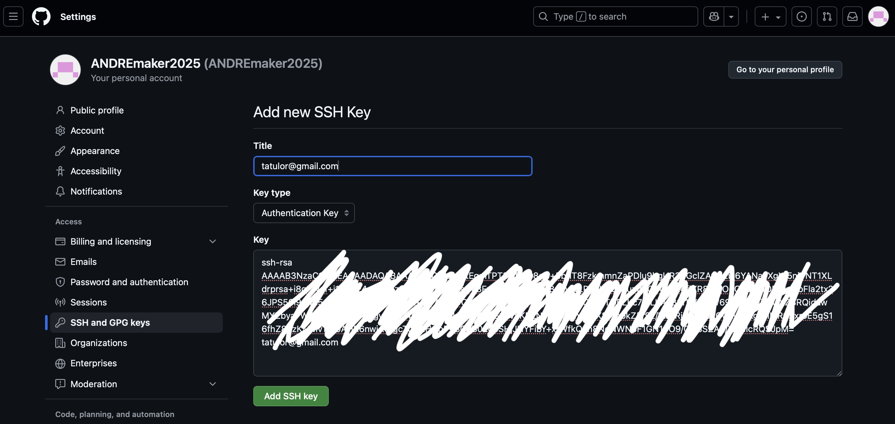
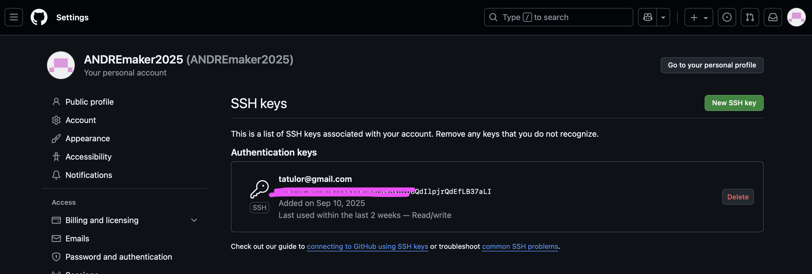

 

#### 5. **FORK TEMPLATE: EFDI-TEMPLATE**
Crear un *_Fork_* siguiendo la guía de pasos. Una vez creado el Fork tendremos listo para editar nuestro *repositorio remoto* del _*efdi-template*_ (Forked from fablabbcn/mdef-template).
Un Fork (bifurcación) es una copia de un _repositorio original "ascendente"_. El fork de un repositorio es un nuevo repositorio que comparte el código y la configuración de visibilidad con el repositorio pre-existente. Permite experimentar cambios libremente sin afectar el proyecto original. [+ info About Fork](https://docs.github.com/es/pull-requests/collaborating-with-pull-requests/working-with-forks/fork-a-repo)

**Paso 5.1**  
- Ingresar a: [Efdi Template](https://fablabbcn.github.io/efdi-template/) `> GitHub Repo efdi-template`

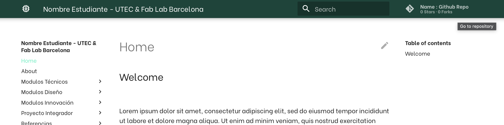

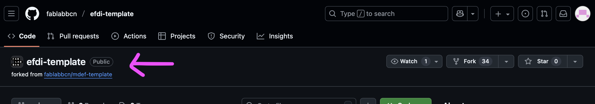

**Paso 5.2** 
Dentro de [GitHub Repo efdi-template](https://github.com/fablabbcn/efdi-template) ingresar a:  `Code > Create a new fork`. 

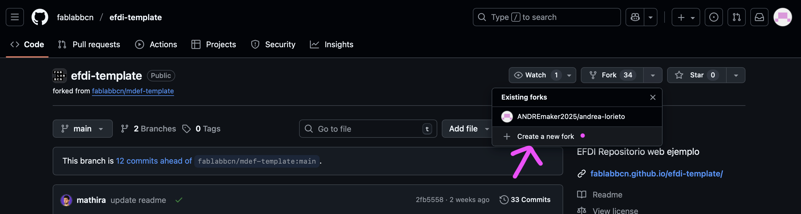

**Paso 5.3** 
Dentro de [GitHub Repo efdi-template](https://github.com/fablabbcn/efdi-template) y la nueva ventana `Create a new fork > (VERIFICAR) en “Owner” NOMBRE/PERFIL DE MI CUENTA GITHUB y en “Repository name” MI NOMBRE-APELLIDO > Check en "Copy the main branch only” > Create fork`. 
De forma opcional podemos agregar una descripcion que identifique nuestro repositorio futuro.

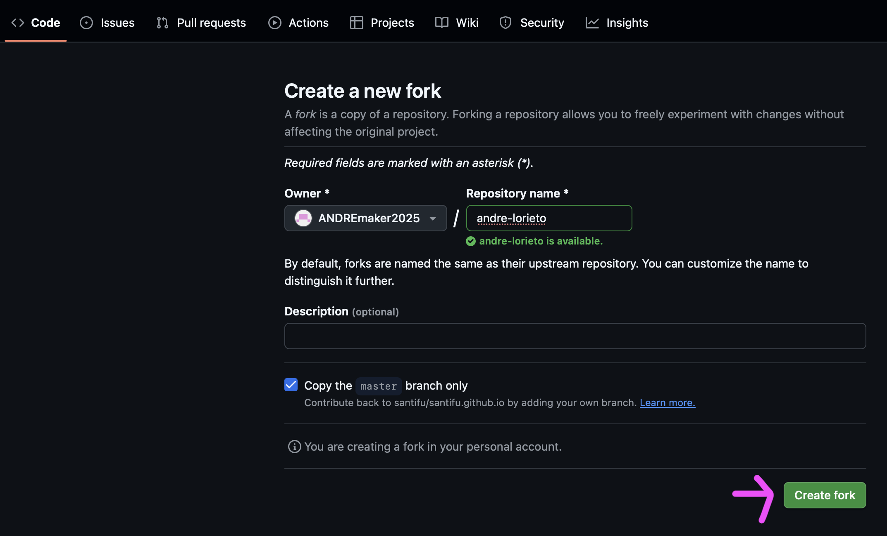


#### 6. **CREAR UN REPOSITORIO LOCAL EN LA PC (CLONE)**

Crear o clonar el repositorio remoto (o proyecto) para crear un repositorio local en PC. 
Un Repositorio remoto clonado desde GitHub nos permite trabajar desde la PC local. 
Necesitamos clonarlo desde GitHub hacia la PC local/carpeta "local-repo” (que alojará el repositorio clonado) a través de la cual importamos el Repositorio/Proyecto para su edición local en el editor de texto web _Visual Studio Code._

**Paso 6.1**  &ensp; **Crear una carpeta “Repo Local” en PC.** 
Para mayor practicidad, crear/ubicar la carpeta con una ruta corta de acceso, (ej: Escritorio).Mi ruta de carpeta “Repo Local”  = `C:\Users\andre\Desktop\GITHUB_REPOLOCAL_ANDREA-LORIETO`

**Paso 6.2**  &ensp; **Abrir la carpeta en PC**. 
Dos opciones: **1)** abrir desde la carpeta creada, abrir la terminal (botón derecho abrir terminal), y la terminal quedará abierta desde esa ubicación/ruta de apertura de la carpeta, o **2)** abrir desde la terminal, ir a la carpeta creada ingresando los siguientes comandos: `“cd”` + el nombre de carpeta o ruta consecutiva hasta llegar a la carpeta final de destino. (Antes de ingresar la carpeta/ruta a buscar atender la ubicación/ruta actual de la cual partiremos la búsqueda que muestra la  terminal Ej: `“~” ("C/Users/andre”)`. 
Ejecutar el siguiente comando:  
```bash
cd Desktop
cd GITHUB_REPOLOCAL_ANDREA-LORIETO
```
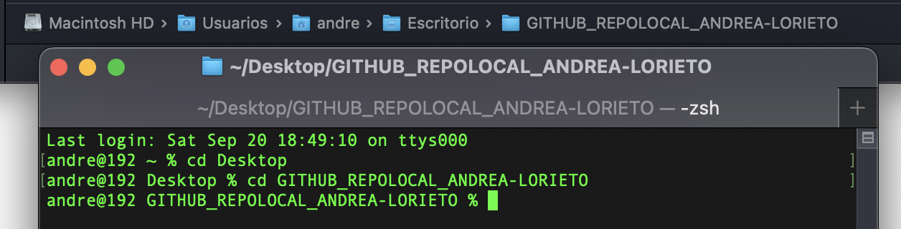

**Paso 6.3** &ensp; **Clonar el Repositorio remoto GitHub en PC** a partir de la copia de la SSH key extraída de GitHub (copy/paste en terminal).
- Abrir la terminal con la ruta acceso habilitada a la carpeta destino “Repo Local” `C:\Users\andre\Desktop\GITHUB_REPOLOCAL_ANDREA-LORIETO` y ejecutar el siguiente comando:  
```bash
git clone “SSH Key" 
```
es decir
```bash
git clone git@github.com:miusuariocuentagithub/miproyecto.git
```
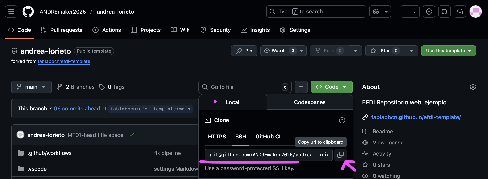
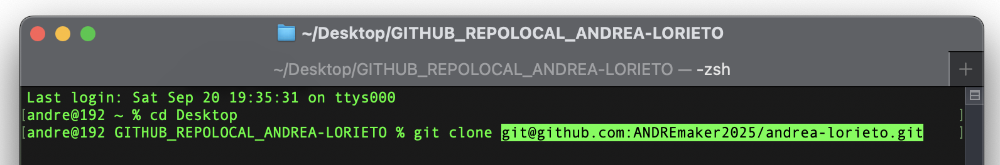

_Nota_: Al ejecutar “enter”, Git se vinculará con GitHub y generará el Clone en nuestra PC del Repositorio remoto (Forkeado anteriormente), quedando sincronizados para el flujo de trabajo continuo entre Repositorio remoto y PC local.


#### 7. **ACTIVAR LINK DE MI WEBSITE EN GITHUB** 

Ingresar a nuestra (cuenta de GitHub) Repositorio remoto (fork) del _**efdi-template**_, ingresar en:
```bash
Settings > Pages > (en “Build & deployment) Branch /gh-pages/root > Save. 
```

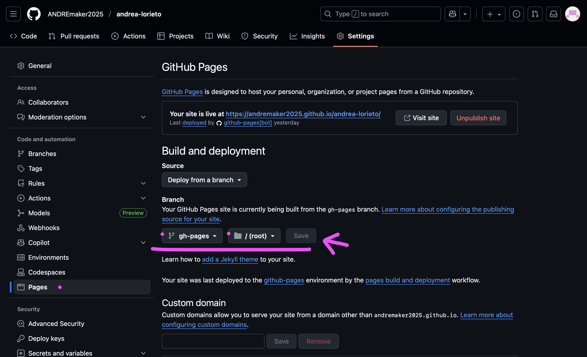


#### 8. **SINCRONIZAR VISUAL STUDIO CODE CON GITHUB** 
Debo Conectar VS con mi repositorio remoto de GitHub.

**Paso 8.1**
En nuestra cuenta de GitHub Repositorio remoto (fork del efdi-template), copiar la URL de mi repositorio y pegarla en Visual Studio, ingresar en: 

```bash
Menú Code > Code > Local > HTTPS > Copy URL 
```
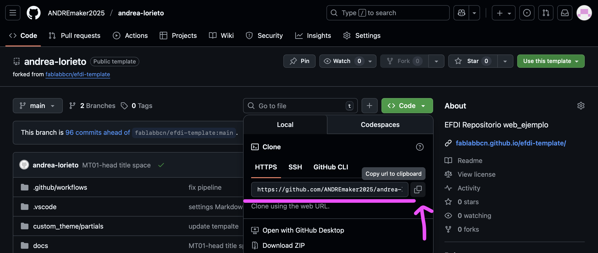


**Paso 8.2**
En Visual Studio ingresar a: 
```bash
Source control > Remote > Add Remote > (PEGAR URL para sincronizar Visual Studio con GitHub)  
```

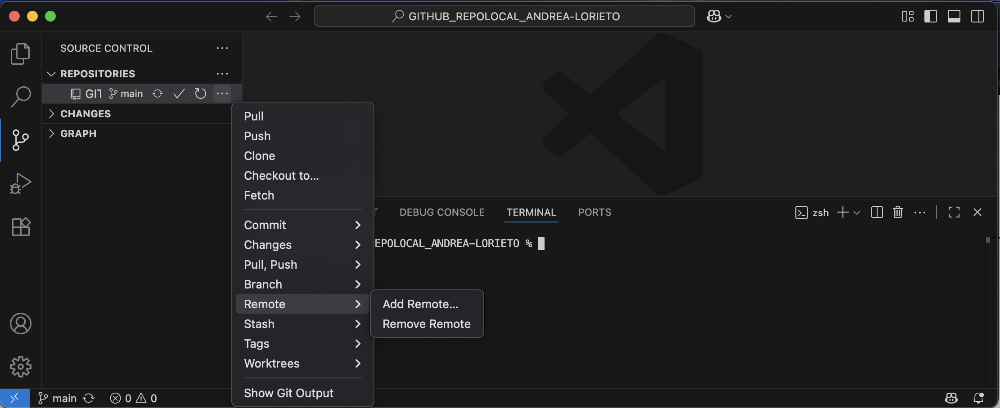
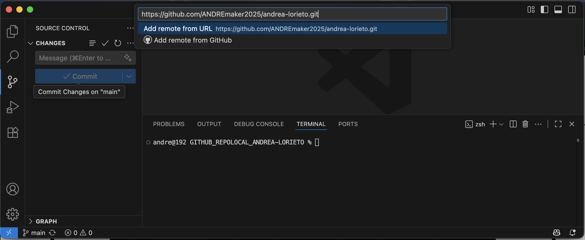


**Paso 8.3**
En Visual Studio abrir nuestra carpeta `“GITHUB_REPOLOCAL_ANDREA-LORIETO”` donde tengo los archivos de la página web e importarlo a VS de esta forma queda integrada la carpeta GitHub. Una vez heho esto simplemente daremos “OPEN FOLDER” al iniciar la edición de nuestro proyecto. Ingresar en: 
```bash
File > Add Folder to Workspace > (e IMPORTAR la carpeta al Workspace del VS).  
```
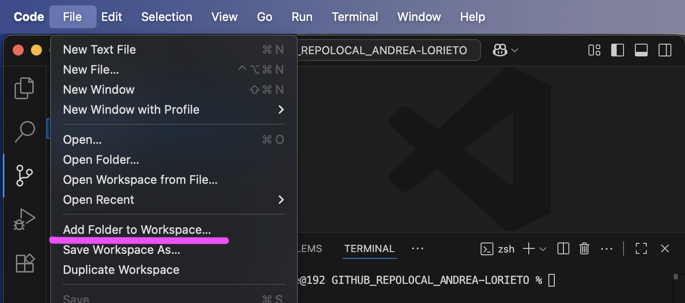


#### 9. **EDICIÓN EN VISUAL STUDIO / Workflow - mkdocs**
Una vez clonado el repositorio GitHub remoto en mi repositorio local y sincronizado con Visual Studio ya podemos editar el código en Visual Studio y subir los cambios de edición que realicé en en mi página web directamente desde VS. 

**Paso 9.1**
Una vez hecho esto simplemente daremos `“OPEN FOLDER”` al iniciar la edición de nuestro proyecto y visualizaremos el contenido “árbol de carpetas" que configuran la estructura del _Efdi-template_.

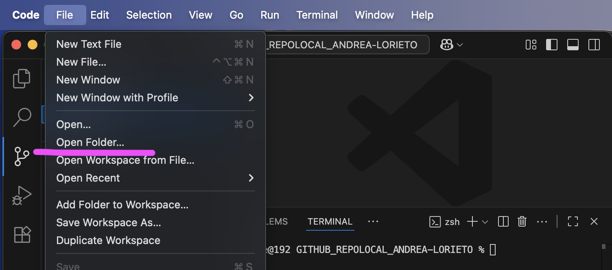


**Paso 9.2**
En cada edición del desarrollo de cambios de nuestro proyecto debemos realizar la siguiente secuencia en VS:
```bash
EDITAR cambio > SALVAR cambio > STAGE cambio + > 
NOMBRAR cambio > COMMIT (confirma el cambio) > 
SYNC CHANGES (Sincroniza con nube GitHub = "Push").  
```
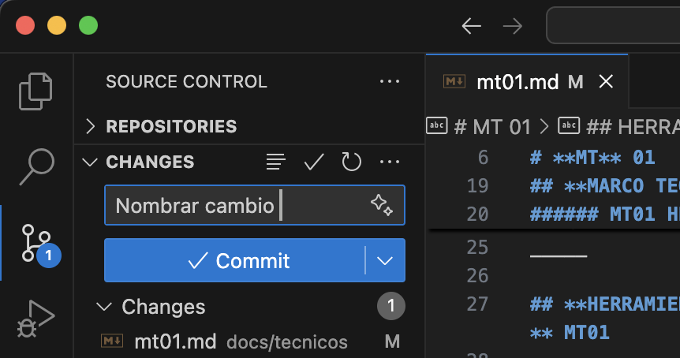
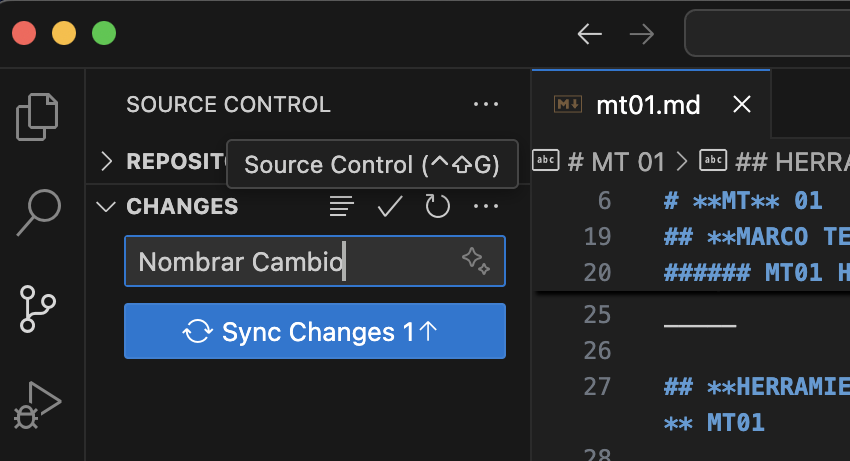

**Paso 9.3**
Dentro del repositorio remoto GitHub en el `menú ACTIONS > ALL WORKFLOWS` podremos verificar el proceso del desarrollo de edición del Proyecto en cuanto la ejecución de cambios.

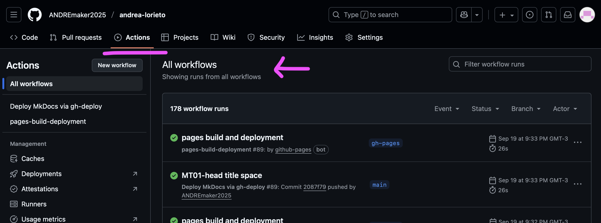


_____

## **LINKS DE INTERÉS .** MT01 

Aquí, un conjunto de referencias bibliográficas virtuales y diversos recursos online utilizados como fuente de información consultada para el desarrollo teórico/práctico del Módulo Técnico MT01 (Material académico e-learning/Moodle; Clases virtuales sincrónicas/Meets; otros Links de interés).

GitHub Websites_EFDI gen 2025 
<https://efdi-docs.github.io/efdi-page/student-websites/>

GitHub WebSites_EFDI gen anteriores: 
<https://efdi-docs.github.io/efdi-page/student-websites/>

GItHub Websites_FABLAB Barcelona: 
<https://fabacademy.org/2024/labs/barcelona/>

Lineamientos para hacer la documentación: https://
[Guía de Documentación](https://docs.google.com/document/d/17WyqWgCPyeTcVlHtk5DHF-f0aMlIOj5CXjm3gcGP-i8/edit?tab=t.0#heading=h.bdaq9dk1xq5v)


Markdown _ (qué es, guía de Sintaxi, etc)
<https://markdown.es/sintaxis-markdown/>
<https://dillinger.io/>


Herramienta para capturas de pantalla 
<https://flameshot.org/>
<https://shottr.cc/>


Herramienta para grabar pantalla 
<https://obsproject.com/es/download>
<https://getkap.co/>


MOODLE MT01
[🧑‍💻 MT01_EFDI_MOODLE](https://https://ev1.utec.edu.uy/moodle/course/view.php?id=15375)

MEETS  MT01 
[🎬 MT01_CLASE 01/09](https://ev1.utec.edu.uy/moodle/course/view.php?id=15375&section=13#tabs-tree-start)
[🎬 MT01_CLASE 08/09](https://https://drive.google.com/file/d/1JcN2wm2ZFkcQxv9aJR2IO1RcNqV-d9-8/view)
[🎬 MT01_CLASE 11/09](https://https://drive.google.com/file/d/1tUKY7SvsapyuycJs2GMeySRbk1v2SZ3s/view)

 

_____

## **REFLEXIONES .** MT01 

# ❝ 
Esta documentación ha sido un breve resumen sobre la experiencia MT01 y lo que de momento ha significado para mi.  
Me motivan los desafíos, y me apasiona aprender nuevas cosas. En este sentido, reafirmo, lo importante de tener bien presente y activa la neuroplasticidad para que adquirir nuevos contenidos de aprendizaje no se conviertan en un obstáculo emocional y mental que contribuya a "colapsar" nuestro sistema de redes neuronales, dificultando ser un camino disfrutable y armónico.

Desde mi formación en el campo de diseño industrial, y mi actividad como docente universitaria, habituada en la práctica cotidiana a la experiencia de uso intuitiva con interfaces técnicas visuales, tanto en software como en dispositivos, reflexiono, acerca de lo importante que es no olvidar el "ponerse sensiblemente en los zapatos del otro” cuando uno enseña, para que un otro aprenda de forma “disfrutable" algo… El desconocimiento sobre un tema de quien intenta aprehender la "novedad" puede ser "total" y ahí más que el entendimiento sobre el tema se pone en juego lo emocional, saliendo a flote por sobre la experiencia de aprendizaje, pudiendo impulsar o frenar el aprender la “novedad". _La manera_ es clave.

El MT01 fue un desafío a desaprender, forzosamente y sin anestesia “otras” formas de conocimiento atravesando multiplicidad de variables de modo poco intuitivo y confuso, tornando la dinámica del proceso aprendizaje frustrante. Una de esas variables tuvo que ver, para mi sorpresa, y a diferencia de lo habitual, la hasta entonces "amigable Apple UX”, y la "intuitiva experiencia de usuario" que no existió. En esta ocasión MacOS fue una decepción y complejizó gran parte del proceso de instalación del software necesario para la práctica del MT01. Me llevo bien con la tecnología y la técnica, pero en esta oportunidad de revés, me sentí por momentos una discapacitada tecnológica. ///…¿"Terminal"?, ¿línea de comandos?..what?... o.O
# ❞


 

_____

**ENTREGA .** MT01
1. Trabajar con tutoriales GIT/GITHUB. 
2. Crear mi WebSite GitHub, utilizando GitHub como hosting y Git como control de versiones.  
Objetivo final de mi WebSite personal: Registro Bitácora del desarrollo y práctica MT01;  (iniciar con el About me, herramientas digitales utilizadas y material académico, proceso y experiencia aprendizaje, etc). 
3. Entregar/Compartir link de mi sitio web Github. 

[Mi GitHub WebSite Template](https://https://andremaker2025.github.io/andrea-lorieto/)
[GitHub Websites_EFDI gen 2025 ](https://https://ev1.utec.edu.uy/moodle/mod/forum/view.php?id=678025)


