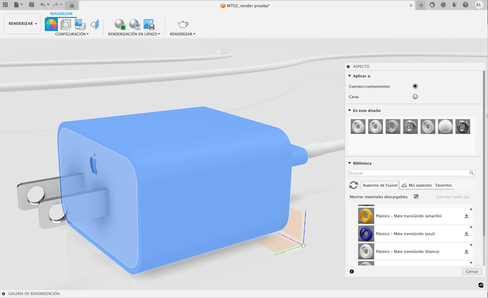
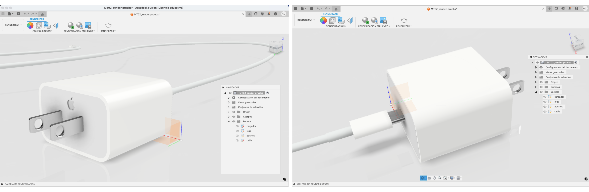
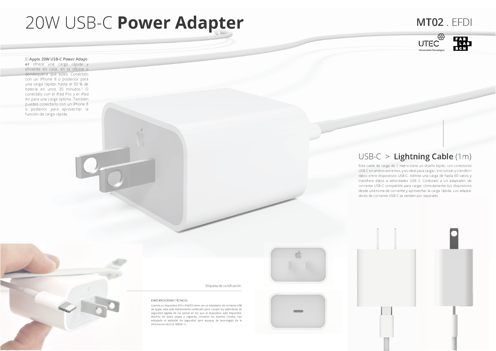
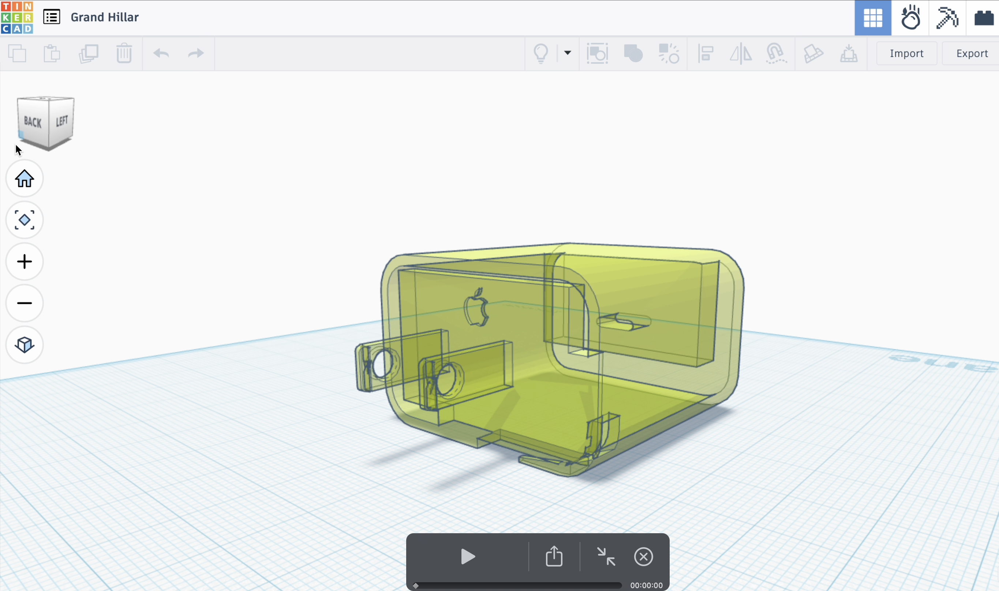
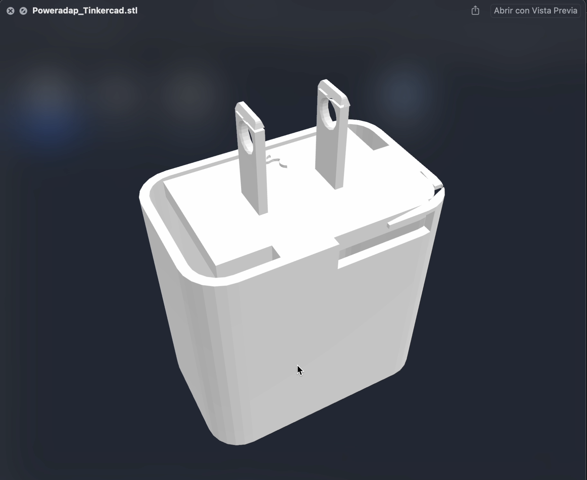
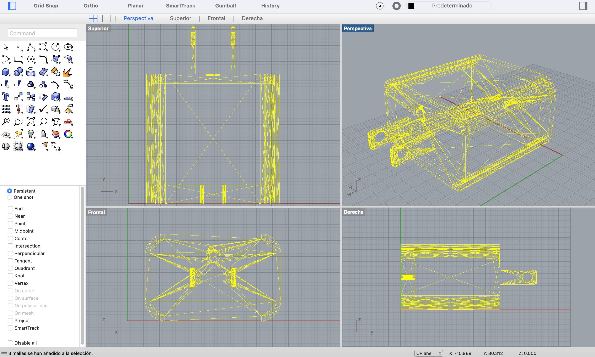
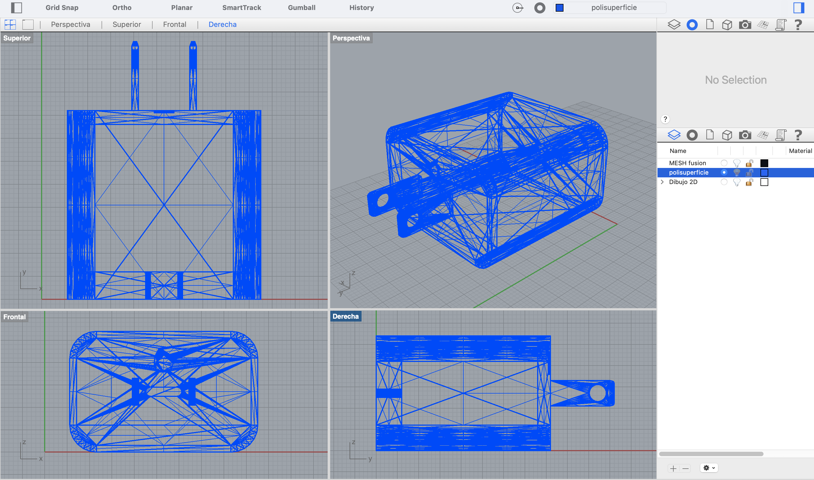

---
hide:
    - toc
---

# **MT** 02

>## **DISEÑO 2D Y MODELADO 3D** 
*TECNOLOGÍA Y FABRICACIÓN*

 
 
 
 
 

_____

## **MARCO TEÓRICO / GLOSARIO** MT02
 

>### **MODELADO 2D**
## **PIXEL & VECTOR** . Diseño y modelado 2D

La fabricación digital se origina básicamente a partir del archivo digital determinado por diversas tipologías de lenguajes: vectorial o pixelar (diseño bidimensional 2D), o modelado vóxel (diseño tridimensional 3D), adecuados a la tecnología que vayamos a emplear y conveniente al resultado buscado. 

**PÍXEL**: Los píxeles son la unidad mínima cuadrada o "punto 2D” de una imagen digital, que representa un área de color específica. 
La combinación de píxeles en relación a su cantidad configuran una imagen y su definición de imagen es decir, su calidad es decir su resolución/nitidez/detalle que esta puede alcanzar a mayor cantidad de píxeles mayor “HD” o calidad de imagen y menos “pixelada” el detalle amplificado de imagen.

**VECTOR**:  Los vectores son "objetos" o fórmulas matemáticas que definen puntos, líneas, formas, colores etc.. Los formatos de archivo de imagen vectorial son versátiles y escalables infinitamente sin pérdida de calidad o definición de imagen (a diferencias de las imágenes pixelares (raster o mapa de bits). 
Tipos de formatos de archivo de imagen para el lenguaje vectorial y pixelar (rasterizada o mapa de bits) respectivamente: [SVG, EPS, PDF, CDR, AI, D, DXF/DWG, PS] y  [JPG, BMP, PNG, TIFF, RAW]. 

 

>### **MODELADO 3D**

La fabricación digital se origina básicamente a partir del archivo digital determinado por diversas tipologías de lenguajes: vectorial o pixelar (diseño bidimensional 2D), o modelado vóxel (diseño tridimensional 3D), adecuados a la tecnología que vayamos a emplear y conveniente al resultado buscado.

**VÓXEL**: Una unidad mínima cúbica o “punto 3D” de un volumen digital o cuadrícula tridimensional (equivalente al píxel), inherente a la representación volumétrica de objetos modelados 3D. 

 

## **DISEÑO PARAMÉTRICO** . modelado 3D 

El diseño paramétrico es un método de modelado 3D (asistido por computadora (CAD)) que utiliza algoritmos y parámetros variables relacionados para definir y manipular formas y estructuras complejas, en lugar de depender de un diseño manual y estático. Permite establecer reglas y relaciones geométricas, lo que facilita la generación de múltiples variaciones de diseño y la adaptación a cambios de manera dinámica y controlada sobre la forma del modelo proyectado.
 

## **DISEÑO GENERATIVO** . modelado 3D 
El diseño generativo en modelado 3D es un proceso que utiliza software impulsado por inteligencia artificial (IA) para que un ordenador genere múltiples opciones de diseño optimizadas a partir de un conjunto de parámetros, objetivos y restricciones definidos por un diseñador o ingeniero. Este proceso automatiza la exploración de miles de alternativas, resultando en formas orgánicas y eficientes que son difíciles o imposibles de diseñar manualmente.
 
_"El diseño generativo no se trata de diseñar, se trata de diseñar el sistema que diseña"._
_"El diseño generativo es un nuevo flujo de trabajo que genera alternativas de diseño de alto rendimiento con geometría optimizada que a menudo están muy alejadas de un diseño tradicional."_

[_+ info: Introduction to generative design_](http://www.fuel4design.org/index.php/atlas-of-weak-signals/)
 

## **CAD** . Diseño

El _**Diseño Asistido por Computadora**_ (_CAD ~ Computer Aided Desing_), es el software especializado en la producción del diseño en el sistema de fabricación digital, capaz de crear y analizar diseños modelados en 2D o 3D. Esto posibilita proyectar una producción optimizada de diseño, aumentando la eficiencia y la calidad para su fabricación.

 

## **CAM** . Fabricación

La **_Manufactura Asistida por Computadora (CAM ~ Computer Aided Manufacturing)_** es el software especializado en configuración de producción en el sistema de fabricación digital, permitiendo automatizar el proceso de fabricación. Este sistema de producción utiliza el software de diseño CAD para traducirlos en instrucciones para máquinas de control numérico CNC.

El sistema CAD/CAM integra en un solo flujo de trabajo, el ciclo completo del proceso de tecnología de fabricación digital para aumentar la eficiencia y la precisión del diseño proyectado, desde la ideación del producto hasta la fabricación y materialización final. 

 

## **NURBS** . Modelado 3D / curvas

En modelado 3D, las NURBS (Non-Uniform Rational B-Splines), es "el modelado de superficies de "forma libre". Es una estructura curvilínea de modelado 3D, representada a partir de curvas y superficies de forma matemáticamente precisa y flexible. Permiten crear una variedad infinita de formas, desde líneas simples hasta superficies orgánicas complejas, utilizando puntos de control para definir y modificar la geometría de la forma. Su alta precisión las hace ideales para diseño industrial, fabricación y otras aplicaciones que requieren formas precisas. 

Es el método preferido para la impresión STL (3D). No es tan preciso como los Nurbs porque no promedia la curva entre puntos. [...] Se suele partir de un modelo NURBS y convertirlo en un modelo MESH para su fabricación CAM.' 

 

## **MESH** . Modelado 3D / polígonos

_'Una malla en modelado 3D es la construcción estructural de un modelo 3D formado por polígono'_ (o superficies planas) configurada por un conjunto de 'puntos 3D’ o vértices, líneas/aristas y caras/polígonos, de un objeto tridimensional. Los vértices, puntos en el espacio 3D, las aristas, segmentos de línea que los conectan, y las caras (triangulares), las superficies planas que delimitan la forma del objeto. La densidad de la malla (la cantidad de estos elementos), determina el nivel de detalle y la precisión del modelo. 

[_+ info: Nurbs & Mesh_](http://www.fuel4design.org/index.php/atlas-of-weak-signals/)

 

## **DIGITAL SCULPTING** .
## 3D sculpting

Refiere a otra técnica de construcción diferente a otros modelados 3D (Ej; estructura alámbrica, modelado poligonal, modelado sólido, etc). Es una técnica que permite esculpir y dar forma a modelos digitales como si fueran materiales físicos ‘analógicos’ (Ej; esculpir arcilla), utilizando herramientas que imitan pinceles y herramientas de escultura. Esta representación tridimensional digital se enfoca en crear objetos orgánicos o modelado más detallado.
[_+ info: Digital Sculpting:_](http://www.fuel4design.org/index.php/atlas-of-weak-signals/)

 

_____

## **HERRAMIENTAS TÉCNICAS DIGITALES** MT02

El objetivo principal del MT02 consistió en la práctica experimental de conocidas y nuevas herramientas técnicas de tecnología digital, para el diseño modelado 2D y 3D. La práctica del MT02, requirió la instalación y seteo de alguna de ellas (ej; Fusion 360) con modalidad de interfase de uso mixta: local y en la nube, mientras que otras simplemente de uso directo online (ej: Tinkercad 3D).
Existe un panorama amplio de software diverso orientado al Modelado 2D y 3D tanto bajo licencia de uso, como de tipo gratuito y de código abierto;  Aquí debajo, algunos ejemplos:

## **PIXELAR** . 
**_HTD. MODELADO 2D_**
[GIMP](https://https://www.gimp.org/downloads/)
[Krita](https://https://krita.org/en/download/)
[Photopea](https://https://www.photopea.com/)
[Pixlr](https://https://pixlr.com/es/)
[Adobe Photoshop](https://https://www.adobe.com/es/products/photoshop.html)

 

## **VECTORIAL**
_HTD. MODELADO 2D_

[Inkscape](https://https://inkscape.org/es/release/inkscape-1.1/) 
[Adobe Illustrator](https://https://www.adobe.com/es/products/illustrator.html)
[Corel Draw ](https://https://www.corel.com/la/)

 

## **MODELADO 3D**
_HTD_

[**Tinkercad**](https://https://www.tinkercad.com/)
Herramienta software educativa (STEM) gratuita, online de uso intuitivo para la edición de modelado 3D en tiempo real. Orientada a la introdución de diseño asistido por computadora (CAD), destinada al desarrollo de diseño prototipado e impresión de objetos 3D, y aplicable a estos principales usos: modelado 3D (de geometría básica), simulación electrónica (creación de circuitos, programación de placas Arduino, etc) y programación con bloques (desarrollo de código de forma visual mediante bloques en lenguaje código). 
Formatos de archivo compatibles: svg, gltf, obj, stl.

[**Rhinoceros**](https://https://www.rhino3d.com/)
Rhino 3D, Es un software técnico destinado al diseño modelado 3D y 2D. A diferencia de Fusion 360 permite dibujar de forma más libre y de forma más “improvisada” figuras planas y volumetría creando en tiempo real un proyecto a materializar. Principales formatos de archivo compatibles para importar y exportar: cad [dwg, dxf, iges, step, vda]; malla 3d [3dm, stl, obj, 3ds, ply, wrl, vrml].

[**Fusion 360 (Autodesk)**](https://https://www.autodesk.com/products/fusion-360)
Autodesk Fusion,  es una plataforma de software CAD, CAM, CAE y de circuitos impresos de modelado 3D basada en la nube para el diseño y la manufactura de productos.
Es un software estrictamente técnico y conveniente para modelar bidimensional y tridimensionalmente si se conoce de antemano y claramente la geometría del objeto proyectado. El software dispone de un sistema de modelado riguroso y estructurado (scketch y línea tiempo fases modelado). Es óptimo para ejecutar el modelado 3D 100% técnico directo para la materialización en tecnología de fabricación digital. 
A diferencia de Rhino permite desarrollar proyectos orientados hacia la mecánica y electrónica (posibilitando, asignar movilidad al modelado, cálculos matemáticos sobre las propiedades físicas, ensayos mecánicos sobre materialidad, etc). 
Formatos de archivo principales compatibles para importar y exportar formatos de diseño 2D y 3D para fabricación digital: dwg, dxf, stl, obj y 3mf.

[**Blender**](https://https://www.blender.org/)
Software Gratuito y de Código Abierto. Principales usos y aplicaciones diversas: creación y manipulación de contenido tridimensional, modelado 3D, animación, simulación de fenómenos físicos, efectos visuales (VFX), composición, edición de vídeo, diseño arquitectónico y la creación de juegos. 
Formatos de archivo compatibles: modelado 3D [.blend, .obj, .fbx, .stl, .dae] ;  imágenes [.png, .jpg, .tga]; alta dinámica [.exr] ; audio y video [.avi, .mpeg y .wav.]. 

[**OpenSCAD**](https://https://openscad.org/)
Es un software para crear modelos CAD 3D sólidos (de construcción geométrica sólida (CSG)) y la extrusión de perfiles 2D), basado en el lenguaje de código para programación y no un editor gráfico interactivo y de interfase visual e intuitiva, lo que permite diseños paramétricos y precisos para la impresión 3D, piezas mecánicas y prototipos funcionales. 
Formatos de archivo compatibles: con la importación de dibujos vectoriales 2d en formatos [dxf, svg y png] y con modelado 3d en formatos [stl, off, amf y 3mf].

 

_____

## **HERRAMIENTAS TEC. DIG. APLICADAS .** MT02

 

### **MODELADO 2D**  
###### Adobe Illustrator

ILLUSTRATOR . **ISOLOGO ~ PIXEL A VECTOR (PNG > SVG)**

### **MODELADO 3D** 
###### Fusion360 + Tinkercad + RhinoCero**

FUSION 360 . **MODELO 3D ~ SOLID**

FUSION 360 > EXPORT STL . **MODELO 3D ~  MESH BODY**

FUSION 360 . **MODELO 3D  ~ RENDER / APLICACIÓN DE MATERIALES** 

 

### **LÁMINA PRODUCTO '3D’** 
_**3D MODEL + PIXEL + VECTOR**_

**LÁMINA PRODUCTO ‘2D’ (MOCKUP)**
_**PIXEL + VECTOR**_

TINKERCAD . **MODELO 3D  > IMPORT (.STL)** 
Se importó el modelo 3D .stl desde Fusion a Tinckercad aunque este software no respetó la geometría original modelada en Fusion; (dicho archivo contenía generación de modelo sólido + generación de malla).

[TINKERCAD-IMP DEMO](https://https://drive.google.com/file/d/19cQVCQyzHgDsbVn_jMIwluue47H0Thfb/view?usp=share_link) 

TINKERCAD . **MODELO 3D  > EXPORT (.STL)** 

[TINKERCAD-EXP DEMO](https://https://drive.google.com/file/d/1QS7FGVC03VmDN2B8beY1GnDMF6Xz9DWy/view?usp=sharing) 

RHINOCEROS . **MODELO 3D  > IMPORT Fusion to Rhino  (Mesh ~ .STL)**

RHINOCEROS . **MODELO 3D  > CONVERT MESH to NURBS**
Generación de modelado 3D sólido (nurbs ~ Polisuperficie) a partir del .stl (Mesh). 
Generación de archivo .3dm

RHINOCEROS . **MODELO 3D  > Make 2D DRAW** 
Generación de dibujos 2D (command "Make 2D”) a partir de Modelo 3D (Polisuperficie ~ nurbs). El Dibujo de vistas bidimensional no se genera a partir del modelo en Mesh.

 

## **LINKS DE INTERÉS .** MT02
Aquí reúno un conjunto de referencias bibliográficas virtuales y diversos recursos online utilizados como fuente de información consultada para el desarrollo teórico/práctico del Módulo Técnico MT02 (Material académico e-learning/Moodle; Clases virtuales sincrónicas/Meets; otros Links de interés).

_+ info: Inkscape tutorial_ <https://https://inkscape.org/es/learn/tutorials/)>

_+ info: Gimp tutorial_ <https://docs.krita.org/en/>

_+ info: Krita tutorial_ <https://www.youtube.com/watch?v=wLSvubMGb8A>

Online Converter files:
https://www.online-convert.com/
SVG Repo (Open-licensed SVG icons)
https://www.svgrepo.com/

PNG Logos (Free HD images) 
https://www.freepnglogos.com

Upscale (Sotware Pixelar > calidad imagen)
https://www.upscale.media/es

Sketchfab
https://sketchfab.com/3d-models/exhibitor-despiece-27a5e41451344f7b91a35f7dbba6634d

Graphite (Free Online programme símil inkscape)
https://graphite.rs/

 

_____

## **REFLEXIONES .** MT02 

# ❝ 

