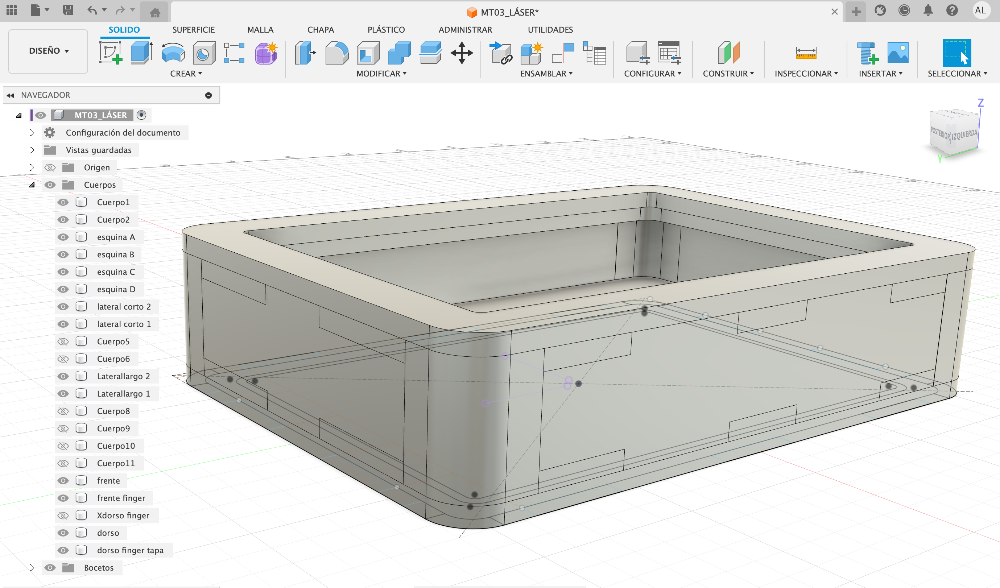
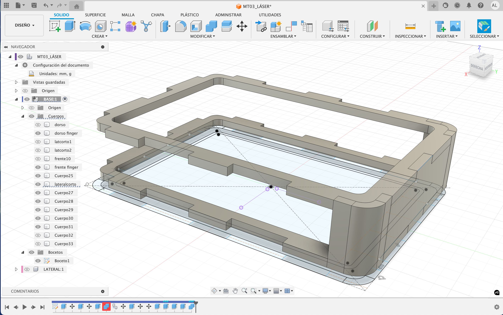
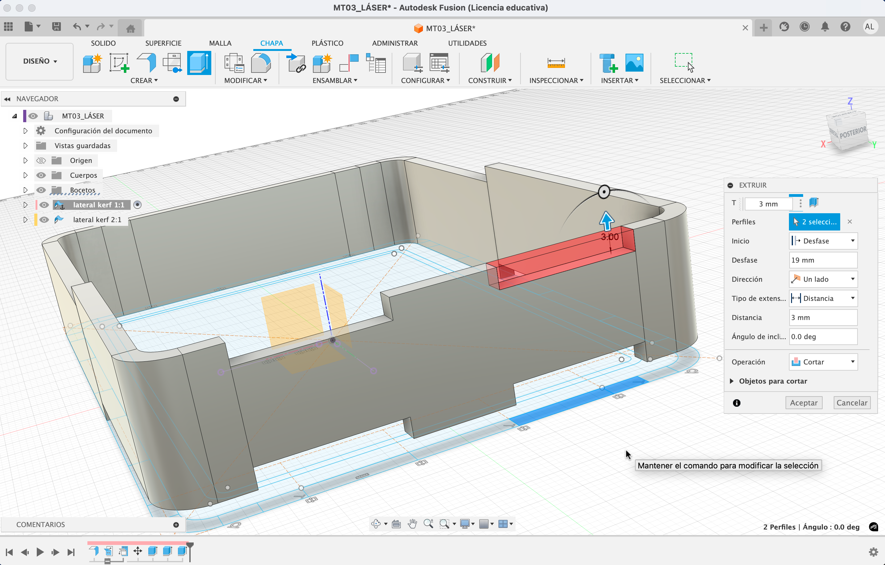
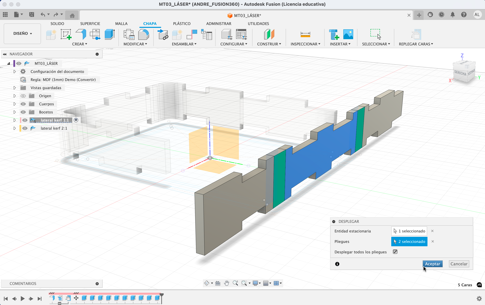

---
hide:
    - toc
---

# **MT** 03

>## **CORTE LÁSER CONTROLADO POR COMPUTADORA** 
*TECNOLOGÍA Y FABRICACIÓN*

 
 
 
 
 

_____

## **HERRAMIENTAS TÉC. DIG. APLICADAS .** MT03
 

Este Módulo Técnico pone en práctica el proceso de diseño de fabricación digital CAD-CAM a través de la herramienta/maquinaria **_CNC LÁSER_** de corte.

Así como en el desarrollo y documentación de todos los módulos me interesa incorporar nuevo conocimiento, en ese sentido, en esta oportunidad el foco de aprendizaje del MT03 lo centré en el _**KERF BENDING**_ _CNC LÁSER_ y en el _**MODELADO PARAMÉTRICO**_, aplicados en _FUSION 360_.
Mantener la práctica sostenida del _F360_ (como una nueva herramienta de software adquirida en el MT02) durante este módulo técnico CAD-CAM, fue un desafío ya que hizo más lenta la aplicación práctica de modelado 3D-2D, cuando podría haber sido resuelta aplicando otros software habitual. Por otra parte, atravesar la dificultad de _F360_ es un útil disparador para sumar nuevas habilidades futuras en un proceso de entrenamiento continuo.

 

FUSION 360 . **MODELADO 2D ~ 3D**  

Partiendo de la volumetría modelada en 3D en el MT02, realicé un nuevo modelado 3D~2D, manteniendo la tipología del volumen con algunas variantes proporcionales, aunque ahora modelando un dibujo desde la lógica de parametrización para su producción final CAM LÁSER. 

Habituada a dibujar a partir de las vistas para luego crear el modelado 3D, en esta ocasión cambié la lógica de dibujo modelado. Comencé a dibujar desde la 3D para luego llevar al plano y proyectar del 3D al 2D (combinando las pautas tutoriales sugeridas). Es decir dibujar tridimensionalmente, visualizando primero el volumen ensamblado y a partir de ello extraer los dibujos bidimensionales y figuras planas para el maquinado CAD-CAM láser. +info: [_Tutorial 1_meet_FUSION_](https://drive.google.com/file/d/1G-ayr7gxlyJEy5QHcmg_vT7lqwrbzu-N/view)+info: [_Tutorial 2_FUSION_](https://www.youtube.com/watch?v=ZrcqauNvt0M&t=258s)

El objeto modelado compuesto por 3 piezas independientes y parametrizado, puede ensamblarse mediante encastres (sin la utilización de pegamento o fijaciones externas). El objeto fabricado, contiene 3 operaciones básicas de la máquina láser (grabado raster, marcado sobre vector y corte sobre vector). 

 

FUSION 360 . **MODELADO 2D-3D ~ PARAMETRIZACIÓN**

Para el modelado 2D~3D del volumen comencé por definir previamente algunos parámetros básicos de las proporciones de la volumetría (largo, ancho, profundidad, holgura de las cara prismática), y a medida que avance el modelado iré sumando otros parámetros útiles (ej: valores de Kerfin). Estos parámetros primarios me sirvieron para dibujar el boceto estructural de mi modelado 2D~3D.

Si bien la parametrización general en _Fusion_ no me resultó compleja en principio (salvo en el caso del kerfin), mi mayor dificultad durante la práctica del modelado en Fusión fue modificar re-dimensionar lo dibujado bocetos/objetos de forma ágil una vez que están generados, tanto para el modelado 2d como 3D. En ambos casos, al editar sobre lo dibujado/bocetado, las figuras/volúmenes se “des-setean” y “desmonta" el modelado (las partes se desanclan, descentran, bloquean las cotas, etc). 

 

FUSION 360. **SHEET METAL 'BISAGRA VIVA'**

El proceso de modelado venía avanzado tenía la volumetría completa, pronta para el tramo final del despliegue/desdoble de -planos curvos _Kerfing_- (= placa mdf 3mm), hasta que de pronto encallé en un loop de comandos y pruebas fallidas. Luego de varios intentos entre revisióoonn y comparativas de tutoriales con mi modelado, me di cuenta que solamente podría desplegar un plano curvo/cáscara” conviertiendo un -cuerpo sólido- en chapa, modelándolo previamente dentro de la tipología _-Chapametálica/Sheetmetal > Flange-_  (+ el setting del tipo chapa > [_Modify/Sheet Metal Rule_](https://help.autodesk.com/view/fusion360/ENU/?guid=SM-CREATE-FLANGE)) / +info: [_Sheet metal_](https://www.youtube.com/watch?v=nt-44j15xeI)

 

FUSION 360. **NESTING (MADE-COMPONENT) ~ A PARTIR DE MODELADO 3D**

Trabajar el modelado a partir de -cuerpos- / -componentes- fue un peldaño más en el training Fusion”. Esto habilitó el siguiente paso hacia el _Solid/Modify > Arrange components-_. Dispuse las piezas modeladas 3D en un "simulacro de plano de corte” para la siguiente fase del proceso de corte láser, el **_Nesting_** en la futura "cama”de corte CAM. Desplegar ambas “chapas metálicas” de forma plana y fijando las piezas a la vez, no me resultó posible (de momento no ubiqué un comando o procedimiento exitoso).

**_Made Component_**: Previo al Nesting traduje cada cuerpo modelado 3D a piezas reales de corte; entonces cada pieza a cortar se transformará en un Componente (independientemente de como esté dibujado o modelado la estructura 3D). Definir cada cuerpo a cortar (más allá del cuerpo dibujado), como un componente me permitió activar la próxima acción del _Arrange Component_ para la siguiente etapa: **_Nesting_**. La organización de componentes fue un tanto tediosa por que toda operación modelada en _Fusion_ está condicionada por la línea de tiempo (automática e inevitable) de operaciones encadenadas y literales; Dificultando así, modificar o re-organizar de forma libre cambios futuros; Al realizar algún cambio espontáneo la línea de tiempo anuncia alertas de "error/defectos en el proceso de modelado. 

 

FUSION 360. **KERF BENDING > SOBRE PROYECCIÓN**

Dibujar el _Kerf_ combinando las restricciones de bocetado (del tutorial guía _Kerfin_) vs. proyectar el modelado 3D vs la parametrización, fue una tarea de obstáculos. Evidentemente el dominio sobre la interfase de este software exige mayor entrenamiento aún, su rigurosidad técnica, toda operación y comando debe ser pautado, lógica distinta a la espontaneidad de modelado posible en la herramienta _Rhino0_. 

 +info: [_Kerfin Parameters_](https://www.youtube.com/watch?v=nt-44j15xeI)

 

FUSION 360. **PROYECTAR VISTAS 2D DESDE MODELADO 3D  > EXPORTAR VECTOR DE CORTE**

Proyecté la silueta del modelado 3D (creando un nuevo boceto) a partir de los cuerpos. Resultado, un dibujo vectorial plano en bruto a ser exportado (como .dxf) a softwares de edición vectorial 2D (illustrator/Rhino) para su ajuste y edición, en la inclusión de logos (marcado/lineal y lleno/raster), configuración de capas/códigos de color como indicadores del tipo de operación CAM láser (corte, bajorelieve área/raster, marcado lineal). 

 

## **VECTORIAL CORTE LÁSER** . ARCHIVO DXF ~ GCODE

**EDICIÓN ’NESTING'  VECTORES DE CORTE + LAYERS CÓDIGOS DE CORTE**

La preparación de archivo vectorial combinó dos softwares CAD-2D distintos (illustrator/Rhino) para su ajuste y edición, como un ensayo de software en relación a la importación de formato de archivo **_.dxf_**. 
En illustrator generé los ajustes finales de diseño necesarios para preparar el archivo hacia la última fase del proceso de diseño y fabricación CAD-CAM, asjutando la inclusión de logos (marcado/lineal y lleno/raster), configuración de capas/códigos de color como indicadores del tipo de operación CAM láser (corte, bajorelieve área/raster, marcado lineal). 
Al probar en Rhino la importación de archivo .dxf  desde illustrator surgió esta dificultad; Rhino no conservó la distintas capas por color y tipo de piezas generadas previamente en la edición de Ai, fusionando variables en una única capa (aproveché y las rehice en Rhino). 

Pronto nuestro diseño, como última etapa del proceso CAD-CAM (aún pendiente) podemos procesar nuestro diseño en un software de tipo CAM generando el último archivo de corte **_.gcode (código G)_** a cargarse en la máquina, definiendo el setting de producción para cada pieza en la máquina en cuanto a que velocidad y a que potencia. 

 
_____

## **LINKS DE INTERÉS .** MT03

Corte con Láser
https://es.wikipedia.org/wiki/Corte_con_l%C3%A1ser

Fusion 360 ~ tutorial autodesk https://www.autodesk.com/es/support/technical/article/caas/sfdcarticles/sfdcarticles/ESP/How-to-switch-Y-and-Z-axes-of-origin-in-Fusion-360.html

Fusion 360 ~ Finger Joint Box
https://www.youtube.com/watch?v=ZrcqauNvt0M&t=258s

Fusion 360 ~ piezas COMPLEJAS como un PROFESIONAL
https://www.youtube.com/watch?v=LSIKwiwQ6Ys

Fusion 360 ~ Diseño Paramétrico 
https://youtu.be/ZrcqauNvt0M?si=wtMY4GvQ3FGmkr7F

Fusion 360 ~ Convert to sheet metal
https://help.autodesk.com/view/fusion360/ENU/?guid=SM-TO-CONVERT-TO-SM

Fusion 360 ~ Create sheet metal flanges  > Crear bridas de chapa metálica
https://help.autodesk.com/view/fusion360/ENU/?guid=SM-CREATE-FLANGE

Fusion 360 ~ Kerfin paramétrico ~ Sheet Metal 
https://youtu.be/nt-44j15xeI?si=lPOAhLrskS_GQrVQ

Kerfin ~ Living Hinge Swatches
https://obrary.com/products/living-hinge-patterns?variant=798259727

Kerfin ~ Técnica de corte
https://www.troteclaser.com/es/centro-de-ayuda/material/tecnicas-de-aplicacion/tecnica-de-doblado

 
_____

## **REFLEXIONES .** MT03
# ❝ 
LA IMPORTANCIA DEL ERROR, de HACER para ERRARLE!  Me encontré hablandome a mi misma, "fulana, te tiene que salir un poco no del todo"  y en el recorrido de aprender, contar el backstage de mi experiencia casi en crudo,  evidenciando el proceso errático (o asertivo) es lo que cuenta; Eso es lo que casi nunca se expone en un mundo que en su mayoría está seteado para el resultado efectista o productivista que habitualmente cuenta el final 'limpio de una historia'.

La importancia del proceso versus el error; En el transcurso del proceso recorrido hasta el momento, siento que documentar el proceso de aprendizaje le quita libertad al propio proceso de aprendizaje, a fluir espontáneamente si es que se pretende registrar/relevar en tiempo real lo hecho a la par del aprendizaje; Obliga a pautar interrumpidamente gran parte de los pasos que se dan en el propio proceso, obliga a planear y dificulta fluir durante el aprendizaje. Creo que este acuerdo o "condición adulta” documental rigidiza el proceso de aprendizaje, aunque se podría contrarrestar reflotando el niño interno que llevamos dentro. Qué quiero decir con esto, si bien he tenido siempre presente “a mi niña interior”,jajja y no dicho como un cliché, sino como la comprobación física (más que emocional o espiritual), que es necesario jugar más en el hacer, con todo lo que esto significa. Como adultos nos rigidizamos inconcientemente, por eso nos cuesta desaprender y des-haprendernos de lo conocido de las cosas; si nos moviéramos en la diaria jugando más al hacer las cosas, y aprendieramos 'jugando' como lo hacen los niños intuitivamente, como "esponjas libres” que absorben el entorno con frescura, soltura, con imaginación, sin prejuicio, con disfrute natural, con desparpajo más allá y en mayor medida que la frustración, que sin querer, también sale a flote (como un niño herido"), lograríamos un aprendizaje paso a paso más liviano. 

Entonces en este proceso "más que nunca", desde la vivencia del MT02 hasta este mojón MT03, y por ende, de aquí en adelante, intentaré a conciencia hacer click rescatando esta actitud "lúdica" de disfrute, y cumplirme con eso, por que es inherente a mí, para que el adulto de a ratos no lo olvide, simplemente más que recordarlo, debo hacerlo presente, consciente y aplicarlo orgánicamente.

# ❞

 
