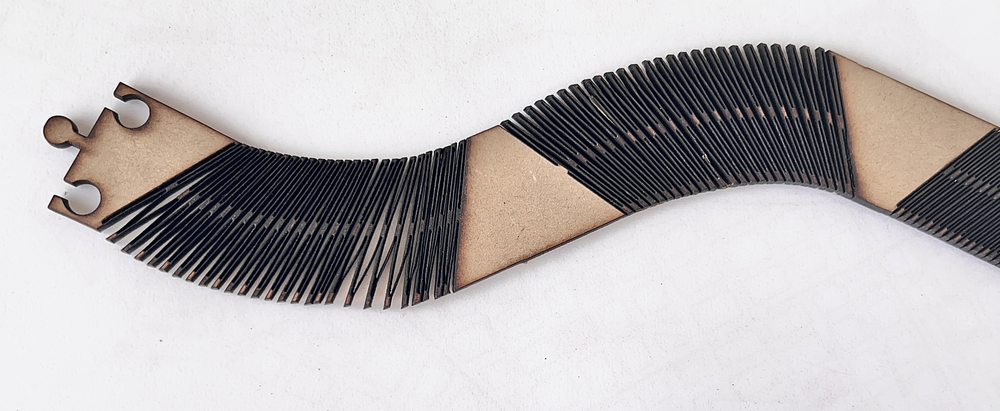
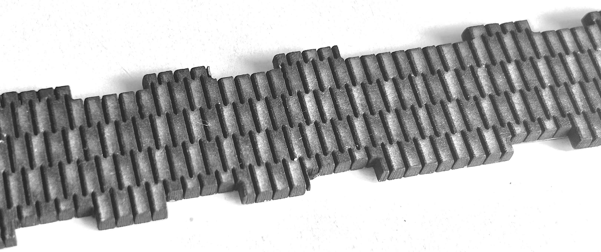
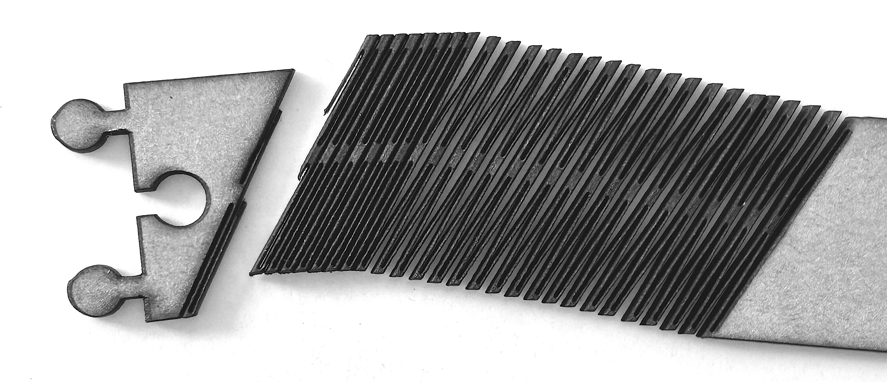

---
hide:
    - toc
---

# **MT** 03

>## **CORTE LÁSER CONTROLADO POR COMPUTADORA** 
*TECNOLOGÍA Y FABRICACIÓN*

 
 
 
 
 

_____

## **HERRAMIENTAS TÉC. DIG. APLICADAS .** MT03
 

Este Módulo Técnico pone en práctica el proceso de diseño de fabricación digital CAD-CAM a través de la herramienta/maquinaria **_CNC LÁSER_** de corte.

Así como en el desarrollo y documentación de todos los módulos me interesa incorporar nuevo conocimiento, en ese sentido, en esta oportunidad el foco de aprendizaje del MT03 lo centré en el _**KERF BENDING**_ _CNC LÁSER_ y en el _**MODELADO PARAMÉTRICO**_, aplicados en _FUSION 360_.
Mantener la práctica sostenida del _F360_ (como una nueva herramienta de software adquirida en el MT02) durante este módulo técnico CAD-CAM, fue un desafío ya que hizo más lenta la aplicación práctica de modelado 3D-2D, cuando podría haber sido resuelta aplicando otros software habitual. Por otra parte, atravesar la dificultad de _F360_ es un útil disparador para sumar nuevas habilidades futuras en un proceso de entrenamiento continuo.

 

FUSION 360 . **MODELADO 2D ~ 3D**  

Partiendo de la volumetría modelada en 3D en el MT02, realicé un nuevo modelado 3D~2D, manteniendo la tipología del volumen con algunas variantes proporcionales, aunque ahora modelando un dibujo desde la lógica de parametrización para su producción final CAM LÁSER. 

Habituada a dibujar a partir de las vistas para luego crear el modelado 3D, en esta ocasión cambié la lógica de dibujo modelado. Comencé a dibujar desde la 3D para luego llevar al plano y proyectar del 3D al 2D (combinando las pautas tutoriales sugeridas). Es decir dibujar tridimensionalmente, visualizando primero el volumen ensamblado y a partir de ello extraer los dibujos bidimensionales y figuras planas para el maquinado CAD-CAM láser. +info: [_Tutorial 1_meet_FUSION_](https://drive.google.com/file/d/1G-ayr7gxlyJEy5QHcmg_vT7lqwrbzu-N/view)+info: [_Tutorial 2_FUSION_](https://www.youtube.com/watch?v=ZrcqauNvt0M&t=258s)

El objeto modelado compuesto por 3 piezas independientes y parametrizado, puede ensamblarse mediante encastres (sin la utilización de pegamento o fijaciones externas). El objeto fabricado, contiene 3 operaciones básicas de la máquina láser (grabado raster, marcado sobre vector y corte sobre vector). 

 

FUSION 360 . **MODELADO 2D-3D ~ PARAMETRIZACIÓN**

Para el modelado 2D~3D del volumen comencé por definir previamente algunos parámetros básicos de las proporciones de la volumetría (largo, ancho, profundidad, holgura de las cara prismática), y a medida que avance el modelado iré sumando otros parámetros útiles (ej: valores de Kerfin). Estos parámetros primarios me sirvieron para dibujar el boceto estructural de mi modelado 2D~3D.

Si bien la parametrización general en _Fusion_ no me resultó compleja en principio (salvo en el caso del kerfin), mi mayor dificultad durante la práctica del modelado en Fusión fue modificar re-dimensionar lo dibujado bocetos/objetos de forma ágil una vez que están generados, tanto para el modelado 2d como 3D. En ambos casos, al editar sobre lo dibujado/bocetado, las figuras/volúmenes se “des-setean” y “desmonta" el modelado (las partes se desanclan, descentran, bloquean las cotas, etc). 

 

FUSION 360. **SHEET METAL 'BISAGRA VIVA'**

El proceso de modelado venía avanzado tenía la volumetría completa, pronta para el tramo final del despliegue/desdoble de -planos curvos _Kerfing_- (= placa mdf 3mm), hasta que de pronto encallé en un loop de comandos y pruebas fallidas. Luego de varios intentos entre revisióoonn y comparativas de tutoriales con mi modelado, me di cuenta que solamente podría desplegar un plano curvo/cáscara” conviertiendo un -cuerpo sólido- en chapa, modelándolo previamente dentro de la tipología _-Chapametálica/Sheetmetal > Flange-_  (+ el setting del tipo chapa > [_Modify/Sheet Metal Rule_](https://help.autodesk.com/view/fusion360/ENU/?guid=SM-CREATE-FLANGE)) / [_+info:Sheet metal_](https://www.youtube.com/watch?v=nt-44j15xeI)

 

FUSION 360. **NESTING (MADE-COMPONENT) ~ A PARTIR DE MODELADO 3D**

Trabajar el modelado a partir de -cuerpos- / -componentes- fue un peldaño más en el training Fusion”. Esto habilitó el siguiente paso hacia el _Solid/Modify > Arrange components-_. Dispuse las piezas modeladas 3D en un "simulacro de plano de corte” para la siguiente fase del proceso de corte láser, el **_Nesting_** en la futura "cama”de corte CAM. Desplegar ambas “chapas metálicas” de forma plana y fijando las piezas a la vez, no me resultó posible (de momento no ubiqué un comando o procedimiento exitoso).

**_Made Component_**: Previo al Nesting traduje cada cuerpo modelado 3D a piezas reales de corte; entonces cada pieza a cortar se transformará en un Componente (independientemente de como esté dibujado o modelado la estructura 3D). Definir cada cuerpo a cortar (más allá del cuerpo dibujado), como un componente me permitió activar la próxima acción del _Arrange Component_ para la siguiente etapa: **_Nesting_**. La organización de componentes fue un tanto tediosa por que toda operación modelada en _Fusion_ está condicionada por la línea de tiempo (automática e inevitable) de operaciones encadenadas y literales; Dificultando así, modificar o re-organizar de forma libre cambios futuros; Al realizar algún cambio espontáneo la línea de tiempo anuncia alertas de "error/defectos en el proceso de modelado. 

 

FUSION 360. **KERF BENDING > SOBRE PROYECCIÓN**

Dibujar el _Kerf_ combinando las restricciones de bocetado (del tutorial guía _Kerfin_) vs. proyectar el modelado 3D vs la parametrización, fue una tarea de obstáculos. Evidentemente el dominio sobre la interfase de este software exige mayor entrenamiento aún, su rigurosidad técnica, toda operación y comando debe ser pautado, lógica distinta a la espontaneidad de modelado posible en la herramienta _Rhino0_. 

 +info: [_Kerfin Parameters_](https://www.youtube.com/watch?v=nt-44j15xeI)

 

FUSION 360. **PROYECTAR VISTAS 2D DESDE MODELADO 3D  > EXPORTAR VECTOR DE CORTE**

Proyecté la silueta del modelado 3D (creando un nuevo boceto) a partir de los cuerpos. Resultado, un dibujo vectorial plano en bruto a ser exportado (como .dxf) a softwares de edición vectorial 2D (illustrator/Rhino) para su ajuste y edición, en la inclusión de logos (marcado/lineal y lleno/raster), configuración de capas/códigos de color como indicadores del tipo de operación CAM láser (corte, bajorelieve área/raster, marcado lineal). 

 

## **VECTORS ~ LASER CUTTING** . ARCHIVO DXF

**EDICIÓN ’NESTING'  VECTORES DE CORTE + LAYERS CÓDIGOS DE CORTE**

La preparación de archivo vectorial combinó dos softwares CAD-2D distintos (illustrator/Rhino) para el ajuste y edición del modelado. Esto fue útil como ensayo de software para probar compatibilidad de softwares y la importación de formato de archivo .dxf . 

En illustrator importé el archivo .dxf y edité los ajustes finales de diseño necesarios para preparar el archivo hacia la última fase del proceso de diseño y fabricación CAD-CAM, editando: la inclusión de logos; el área/dimensión del material MDF 600x450 mm; Nesting de componentes (a fin de optimizar el rendimiento del material y maquinado); la configuración de **capas/códigos de color** como indicadores del tipo de operación CAM láser a realizar: **corte, bajorelieve área/raster, marcado lineal.**  

Al probar en Rhino la importación de archivo **.dxf** desde illustrator surgió este "inconveniente"; Rhino no conservó la distintas capas por color y tipo de piezas generadas previamente en la edición de Illustrator, fusionando las variables en una única capa (reedité las capas en Rhino). 

 
_____

## **FP01 .** MT03

Continuado al panorama sobre las diversas tecnologías de fabricación digital que integran el _FABLAB UTEC_ Durazno (presentado por Facundo ~) , a grandes rasgos, la **Práctica Presencial de Fabricación FP01** en Corte Láser del MT03, se enfocó en el proceso de montaje del trabajo de LáserCNC. Consistió en dos fases finales consecutivas: la **Fase-CAD** previa: instalación software CAD-CAM, preparación/**testing de archivos CAD** edición/ajuste, para la **Fase-CAM** final: transferencia de archivos CAD a CAM, **setting de archivos CAM** sobre los parámetros de producción y cortado material. 

 

## **SOFTWARE + HARDWARE ~ CAM**

En la _FP01_ desarrollada en el _FABLAB_UTEC_ utilizamos la cortadora láser **SKL-6090**, con una superficie de corte de _900 x 600 mm_, y el software CAM correspondiente a la _SKL6090_ fue el [_RD works_](https://www.thunderlaser.com/) ~ Thunder Laser **destinado al setting de corte.**

Usualmente cada equipo de corte láser viene con su propio software CAM, pero también existen softwares independientes que tienen el mismo fin. En los FABLAB_UTEC se suele utilizar el RD Works, compatible solo con el sistema operativo Windows, y no MacOs.  En ese sentido, el factor ‘sin Software CAM' desarticuló bsatante mi proceso de práctica, no pudiendo ser ágil como lo tenía planeado. No poder trabajar con mi propia PC retrasó la 'Fase CAM’, (a diferencia de mis compañeros de equipo), implicó sortear tecnicismos de interfaz distinta para la edición y transferencia de archivos. Fue un obstáculo sortear tiempo ‘muerto’ por la espera de (otra PC) y Software CAM disponible para el Setting de parámetros de corte imprescindible y recién poder verificar los cortes al final de la jornada sin margen para la reedición del diseño in situ. No contaba con los imprevistos técnicos, quedando sin completar el setting CAM de algunos archivos vectoriales modelados y cortes planificados. 

 

#### **RD WORKS** ~ ARCHIVOS CORTE LASER

**LAYERS** 
Cada operación/atributo distinta (grabado, marcado y corte) se separa en capas secuenciales asignando los siguientes valores: 
**CÓDIGO DE COLOR:  NEGRO corte (CUT)**  ~ potencia 60% > velocidad 15 mm/s. **ROJO marcado (CUT)**  ~ potencia 11% > velocidad 50 mm/s . **VERDE/AZUL raster (SCAN)** ~ 11% > velocidad 100 mm/s. **CRITERIO DE ORDEN**: de capas (SCAN, CUT, CUT), según la lógica productiva del maquinado láser > Tener en cuenta!: el -Inside/Out- ruta secuencial de corte del láser + el -Independent output- setearlo cuando hay más de una figura independiente con la misma operación de corte, independiza la ruta de corte completa por figura (sin saltar de una a otra). 

**ÁREA** ~ CANVAS / BED
El Área trabajo 900 X 600 mm en "rd works" debe corresponder con la cama en máquina SKL -6090, así como tb. identificar la posición cero virtual (esquina sup-izquierda) coincidente con el cero físico de la máquina 

**SAVE FILE**
Save to file formato .RDL para el editable (si quiero continuar con la configuración de parámetros). 
Save to file formato .RD para transferir el archivo a la máquina (pasar del formato CAD al CAM). Se carga el archivo en máquina por conexión USB seteamos últimas variables desde el display. 

**CUTTING SIMULATOR**
Una vez finalizado el Setting de parámetros vs layers, podemos realizar un Preview de simulación de corte, estimando tiempos y ruta secuencial del proceso de corte.

 

## **ENSAYOS** ~ LÁSER CNC

Desde el comienzo del MT03, me interesó aprovechar al máximo esta técnica de fabricación sencilla Laser Cutting; Razón por la cual generé para el proceso de práctica un pool de modelados vectoriales dviersos donde pudiera explorar la técnica de Kerf Bending y a partir de distintos cortes evaluar la funcionalidad sobre la material MDF.  

[_FP01_LASER ENSAYOS_DEMO_](https://drive.google.com/file/d/1kzUnW7J7cpqlAKJLdEAGNpcSSAocSR08/view?usp=share_link)
 

### **ENSAYO LÁSER 1** 
CORTE ~ MISMO PATRÓN KERF ~ DIFERENTE MODELADO/VECTOR #1

 

### **ENSAYO LÁSER 2**
CORTE ~ MISMO PATRÓN KERF ~ DIFERENTE MODELADO/VECTOR #2

 

### **ENSAYO LÁSER 3** 
CORTE ~ DISTINTO PATRONE KERF ~ DIFERENTE MODELADO/VECOR #3

 

El desafío de centrarme en nuevos aprendizajes atravesó por una serie de obstáculos y algunos errores técnicos del modelado vectorial experimentados durante la práctica de fabricación. Concretamente, producto del fallo en el **dibujo modelado del kerf**, al ser una réplica fiel paso a paso del [tutorial](https://www.youtube.com/watch?v=nt-44j15xeI), 
aplicando las medidas literales y una fórmula de patrón de dibujo sugerida, pero errandole a la 
**relación de proporción del patrón modular de ranurado/kerf vs. las características del material** (espacios, alturas, largos, superposición ranuras/vaciado). Al priorizar esas dimensiones literales sugeridas del -kerf tutorial- por encima de las proporciones conceptuales del patrón kerf general, el kerfing/vaciado colapsó el material. Al diseñarlo/dibujarlo, creí que respetar y replicar las medidas idénticas del patrón tutorial sugeridas, sería garantía de un kerf funcional al momento del corte más allá de la dimensión. 

**ENSAYO # 1 & 2**; A grandes rasgos el 'fallo' funcional del kerf, fue producto de haber proyectado el kerf literalmente a partir de un tutorial 'riguroso' para el dibujo modelado, a tal punto que **omití lo importante: lo relativo de la proporción en el diseño vs. el concepto de sustracción material**, dejando mi capacidad de modelar/dibujar el kerf de forma intuitiva; siguiendo ese camino hubiese dominado la operación Kerfing. **ENSAYO # 3**; si bien el dibujo de kerf 3 fue distinto (con mayor % de vaciado material), el 'fallo' estuvo en haber reducido al límite la capacidad de escala del modelado vectorial colapsando el material en el Kerfin.

 

_____

## **REFLEXIONES .** FP01

❝ 
La práctica presencial resultó una experiencia enriquecedora y breve al mismo tiempo, sin la capacidad de atravesar la ‘investigación-acción’ y ampliar el alcance de la práctica tecnológica digital FP01. En ese sentido el tiempo acotado (quincena) disponible para 'explorar', combinado con la secuencia de imprevistos técnicos, dificultó completar exitosamente el objetivo de corte Kerfing planeado. 

Kerfin! mi desafío a superar… Es esencial profundizar en la práctica y prototipado experimental en favor de la calidad productiva y material del diseño proyectado. La técnica Kerfing es delicada y exige un estudio exhaustivo para sortear errores iniciales. Habiendo identificado la potencial solución sobre los fallos técnicos en el Kerf, pretendo próximamente, completar mis expectativas, corrigiendo los ensayos kerfin planeados y ampliar mi conocimiento sobre la técnica. 

Tendría que haber confiado más en mi intuición… El dominio sobre lo que se proyecta es necesario, aunque tanto más valioso, es diseñar a la vez de forma intuitiva y fluida, no limitados por el avance riguroso racional en cada paso del proceso. Las recetas, lo mecánico anulan en cierta forma la capacidad intuitiva de avance o mejor dicho proponer creativamente una solución.

La teoría es relativa frente a la práctica y viceversa, haciéndose evidente comúnmente, la "brecha digital” , entre lo proyectado y lo materializado. La práctica abre una nueva dimensión de aprendizaje en la ideación, que para su evolución real requiere tiempo de HACER, ensayar, redescubrir, reinventar, acertar, tropezar, solucionar, iterar, y profundizar haciendo, etc. La profundidad técnica requiere tiempo disponible para la investigación práctica considerando la totalidad de lo que implica un proceso experimental desde lo virtual a lo analógico. 
❞

 
 

_____

## **MARCO TEÓRICO ~ GLOSARIO .** MT03
 

## **LÁSER** 

Se presentaron tres tecnologías láser: Láser CO2, Láser de fibra y Láser de Neodimio (y se desarrollaron algunas de sus aplicaciones). 
La tecnología CNC láser CAD-CAM posibilita tres operaciones básicas de maquinado láser; grabado raster, marcado sobre vector y corte sobre vector. Las diferentes tecnologías láser determinan la eficiencia del maquinado asociado al tipo de material al que se aplican según las características que cada tipo de láser brinda. Las principales diferencias entre estas variantes CNC láser CAD-CAM radican en la longitud de onda y el medio láser. 

### **LÁSER CO₂**

El láser de CO₂ es útil para corte y grabado principalmente, destinada a materiales no metálicos, mientras que los de CO₂ utilizan una longitud de onda más larga y son más eficientes en materiales orgánicos y tienen un costo inicial más bajo (aunque se considera menos eficiente para cortar metales, especialmente los finos). Los materiales de aplicación principal son: madera, acrílico, vidrio, cuero y papel.

### **LÁSER DE FIRBA**

En el láser de Fibra la función principal es el corte. Es superior para metales y tienen una longitud de onda más corta, permitiendo un corte de mayor precisión en metales y mayor velocidad de corte para metales finos y menor costo operativo a largo plazo debido a su larga vida útil (aunque se considera menos eficaz para cortar materiales gruesos). Los materiales de aplicación principal son: metales, incluyendo acero, aluminio, cobre y latón.

### **LÁSER DE NEODIMIO**

El láser de Neodimio es muy versátil y preciso para una variedad de aplicaciones, actuando como una "navaja suiza". Su longitud de onda varía, permite un maquinado especializado como soldadura, grabado y corte de metales gruesos. Vida útil más limitada en comparación con los láseres de CO₂ y de fibra. 

 

## **PLOTTER DE CORTE** . Vinyl Cutter

Un **_Plotter de Corte de Vinilo_** es una máquina que “imprime” operando a través de un sistema de cuchilla móvil (en lugar de tinta), cortando material laminar tipo vinilo (adhesivo) y otros **materiales** flexibles y delgados (únicamente) o de similares características para diversos campos de aplicación (ej: papel, acetato, telas termotransferibles, cartulina, goma EVA o stencil film). Los **espesores** típicos van de 0,1 a 1 mm, dependiendo de la densidad del material y la presión máxima del cabezal. Entre las ventajas los plotters de corte ofrecen gran velocidad, bajo costo operativo y alta precisión en materiales delgados. No generan calor ni residuos, y requieren un mantenimiento mínimo.

Existen dos tipos de sistemas de corte:

- Cuchilla de arrastre (drag knife): la más común. La cuchilla gira libremente y se orienta por la dirección del movimiento, lo que la hace rápida y económica, aunque menos precisa en ángulos cerrados.
- Cuchilla tangencial: el cabezal ajusta el ángulo de corte de manera activa mediante servomotores, permitiendo cortes más nítidos y detallados, especialmente en materiales gruesos o rígidos.

 

## **DISEÑO PARAMÉTRICO** . En modelado 3D

El diseño paramétrico es un método de diseño de modelado 3D (diseño asistido por computadora (CAD)) que utiliza algoritmos y parámetros variables relacionados para definir y manipular formas y estructuras complejas, en lugar de depender de un diseño manual y estático o formas directas. Permite definir el diseño de modelado definiendo parámetros/pautas a través relaciones geométricas, restricciones, lo que facilita la generación de múltiples variaciones de diseño y la adaptación a cambios de manera dinámica y controlada sobre la forma del modelo proyectado. 

El sistema de diseño paramétrico (a diferencia del diseño Directo, no paramétrico) ofrece ventajas tales como el trabajar sobre un diseño variable (como longitud, anchura, altura, ángulos) y modificar estos parámetros variables actualizando automáticamente la geometría del modelo, permitiendo un control total y cambios rápidos sin necesidad de redibujar directamente sobre el modelo. 

 

## **KERF BENDING** . Bisagra viva 

La técnica del _Kerf Bending_ (o Kerfin), es una técnica de corte (láser y fresadora CNC), que consiste en generar patrones de corte o serie de cortes paralelos (ranuras) angostas/lineales sobre materiales rígidos y planos con el fin de debilitar su estructura de forma controlada y así asignarles a la superficies rectilíneas la cualidad de curvado flexible transformando el material físicamente y no químicamente.  

 

## **TOLERANCIA** . vs holgura 

En el diseño de piezas funcionales, nos referimos a ''tolerancia'' como la variación esperable de la dimensión de una pieza respecto al diseño original. La tolerancia define la precisión de fabricación de una pieza, es la desviación máxima permitida en el tamaño de una pieza individual respecto a su medida de diseño. 

Dependiendo del espesor y del material, la precisión del corte láser puede ser muy rigurosa, llegando a +/- 0,1 mm. Lo que hace el corte láser no solo es un servicio preciso, sino también económico. Requerir mayor precisión cuando no es necesaria puede encarecer el servicio inútilmente. La tolerancia estándar en corte láser ronda los +/- 0,2 mm en los bordes, y para los entre centros es de +/- 0,05 mm para piezas que no superen 500 x 500 mm.

 

## **HOLGURA** . vs tolerancia

La _'holgura'_ es la diferencia de espacio/tamaño planificada entre dos piezas ensambladas.
La holgura es el espacio que se establece y que debemos dejar libre para que dos piezas encastren para lograr un ajuste funcional deseado, (movimiento libre o una unión firme). 
La holgura se basa y se calcula utilizando las tolerancias de ambas piezas.

La _holgura_ depende directamente del grado de error esperable de la técnica de fabricación que vayamos a utilizar. **A mayores rangos de tolerancia, mayor holgura será requerida**. Por ejemplo, si la tecnología que vamos a usar tiene un grado de error de 0.2 mm, es esperable que ese encastre requiera de una holgura de aproximadamente 0.4 mm.

La _holgura_ también determina el grado de resistencia o fuerza con el que se encastran las piezas. 'Holgura libre': es la separación o ‘juego' entre dos piezas, permitiendo su libre movimiento. 'Holgura forzada': es cuando el espacio entre piezas es negativo e interfiere en el movimiento entre piezas, lo que requiere fuerza para ensamblarlas y crea una conexión firme.

Frente al diseño planificado que pretende controlar el ensamble y movilidad entre piezas, realizar ensayos previos; para un encastre más estable (ajuste forzado) deberíamos reducir esta holgura o en caso contrario aumentarla. 

 

## **NESTING** . En tecnología CNC-CAD-CAM 

El _nesting_ en corte láser es el proceso de organizar de modo eficiente el diseño de múltiples piezas en una sola plancha material para optimizar/minimizar el desperdicio y maximizar el uso del material (en la futura cama CAM). Utiliza software para calcular la mejor disposición de las piezas, considerando su forma y tamaño, y a menudo puede reducir el tiempo total de corte. 
Estas dos herramientas gratuitas y open source facilitan la ardua tarea de determinar la mejor disposición de piezas automaticamente:[_SVGnest_](https://svgnest.com/) + [_Deepnest.io_](https://deepnest.io/)
 

## **+ SOFTWARE CAD** . En corte láser 

Sumado a las herramientas software para el Nesting CNC-CAD-CAM, existen otras herramientas/software CNC dirigidas al corte láser como: 

### FLATLAB

Software de diseño y fabricación 3D que permite a los usuarios diseñar objetos 3D a partir de gestos en 2D y luego convertirlos en piezas planas de encastre listas para ser cortadas con láser o CNC y ensamblarlas. Tiene una versión gratuita pero con limitaciones.
+info [_Flatfab_](http://flatfab.com/)

### SLICER FOR FUSION 360
Software que permite transformar modelos 3D en piezas planas encastrables para cortar en láser o CNC. El programa ya no tiene soporte pero se puede seguir descargando de la página oficial de Autodesk. +info [Slicer Fusion 360](https://www.youtube.com/watch?v=puh35b5SX3Q&t=3s)

 

## **SOFTWARE CAM** . En corte láser

### RDWORKS
Usualmente cada equipo de corte láser viene con su propio software CAM, pero también existen softwares independientes que tienen el mismo fin. En los FABLAB_UTEC se suele utilizar el [RDWorks](https://www.thunderlaser.com/), compatible solo con sistema operativo Windows, y no MacOs.  [ + info  [ RDworksDownload ] ](https://entorno-docente.utec.edu.uy/assets/courseware/v1/68b547fa0a647731796b7abe3d3f1bfa/asset-v1:UTEC+EFDI+2025+type@asset+block/RDWorksV8-20230809T215009Z-001.zip)

 
_____

## **LINKS DE INTERÉS .** MT03

Corte con Láser
https://es.wikipedia.org/wiki/Corte_con_l%C3%A1ser

Fusion 360 ~ tutorial autodesk https://www.autodesk.com/es/support/technical/article/caas/sfdcarticles/sfdcarticles/ESP/How-to-switch-Y-and-Z-axes-of-origin-in-Fusion-360.html

Fusion 360 ~ Finger Joint Box
https://www.youtube.com/watch?v=ZrcqauNvt0M&t=258s

Fusion 360 ~ piezas COMPLEJAS como un PROFESIONAL
https://www.youtube.com/watch?v=LSIKwiwQ6Ys

Fusion 360 ~ Diseño Paramétrico 
https://youtu.be/ZrcqauNvt0M?si=wtMY4GvQ3FGmkr7F

Fusion 360 ~ Convert to sheet metal
https://help.autodesk.com/view/fusion360/ENU/?guid=SM-TO-CONVERT-TO-SM

Fusion 360 ~ Create sheet metal flanges  > Crear bridas de chapa metálica
https://help.autodesk.com/view/fusion360/ENU/?guid=SM-CREATE-FLANGE

Fusion 360 ~ Kerfin paramétrico ~ Sheet Metal 
https://youtu.be/nt-44j15xeI?si=lPOAhLrskS_GQrVQ

Kerfin ~ Living Hinge Swatches
https://obrary.com/products/living-hinge-patterns?variant=798259727

Kerfin ~ Técnica de corte
https://www.troteclaser.com/es/centro-de-ayuda/material/tecnicas-de-aplicacion/tecnica-de-doblado

 
_____

## **REFLEXIONES .** MT03
# ❝ 
LA IMPORTANCIA DEL ERROR, de HACER para ERRARLE!  Me encontré hablandome a mi misma, "fulana, te tiene que salir un poco no del todo"  y en el recorrido de aprender, contar el backstage de mi experiencia casi en crudo,  evidenciando el proceso errático (o asertivo) es lo que cuenta; Eso es lo que casi nunca se expone en un mundo que en su mayoría está seteado para el resultado efectista o productivista que habitualmente cuenta el final 'limpio de una historia'.

La importancia del proceso versus el error; En el transcurso del proceso recorrido hasta el momento, siento que documentar el proceso de aprendizaje le quita libertad al propio proceso de aprendizaje, a fluir espontáneamente si es que se pretende registrar/relevar en tiempo real lo hecho a la par del aprendizaje; Obliga a pautar interrumpidamente gran parte de los pasos que se dan en el propio proceso, obliga a planear y dificulta fluir durante el aprendizaje. Creo que este acuerdo o "condición adulta” documental rigidiza el proceso de aprendizaje, aunque se podría contrarrestar reflotando el niño interno que llevamos dentro. Qué quiero decir con esto, si bien he tenido siempre presente “a mi niña interior”,jajja y no dicho como un cliché, sino como la comprobación física (más que emocional o espiritual), que es necesario jugar más en el hacer, con todo lo que esto significa. Como adultos nos rigidizamos inconcientemente, por eso nos cuesta desaprender y des-haprendernos de lo conocido de las cosas; si nos moviéramos en la diaria jugando más al hacer las cosas, y aprendieramos 'jugando' como lo hacen los niños intuitivamente, como "esponjas libres” que absorben el entorno con frescura, soltura, con imaginación, sin prejuicio, con disfrute natural, con desparpajo más allá y en mayor medida que la frustración, que sin querer, también sale a flote (como un niño herido"), lograríamos un aprendizaje paso a paso más liviano. 

Entonces en este proceso "más que nunca", desde la vivencia del MT02 hasta este mojón MT03, y por ende, de aquí en adelante, intentaré a conciencia hacer click rescatando esta actitud "lúdica" de disfrute, y cumplirme con eso, por que es inherente a mí, para que el adulto de a ratos no lo olvide, simplemente más que recordarlo, debo hacerlo presente, consciente y aplicarlo orgánicamente.

# ❞

 
