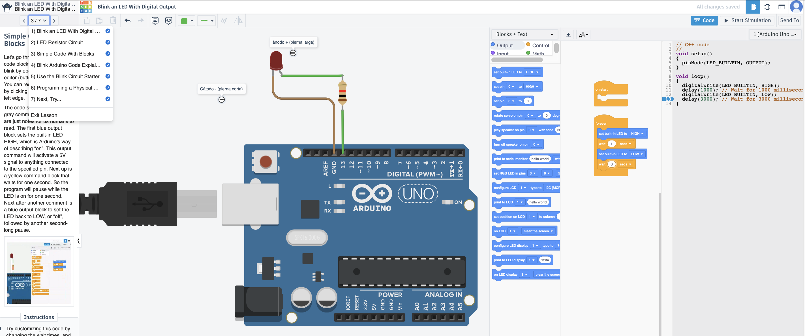
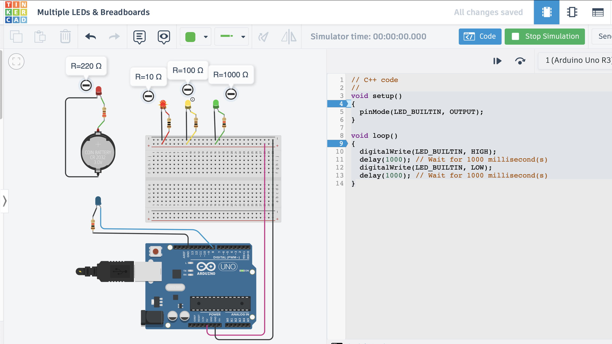
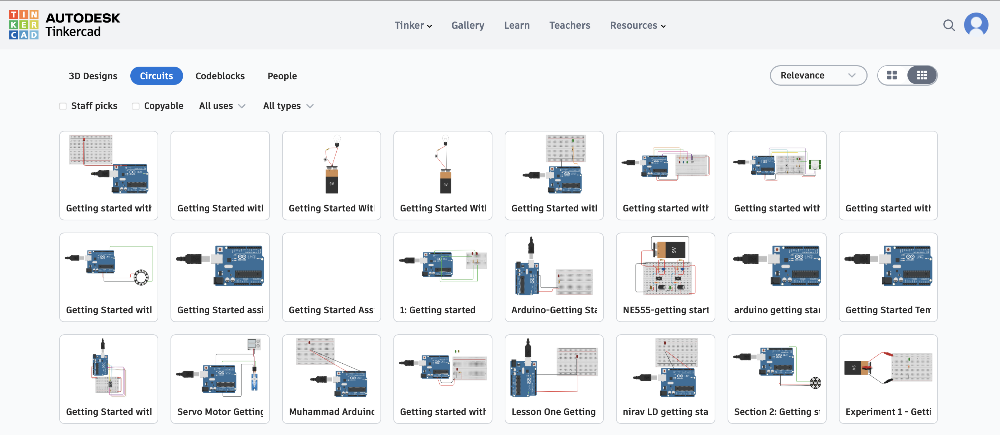
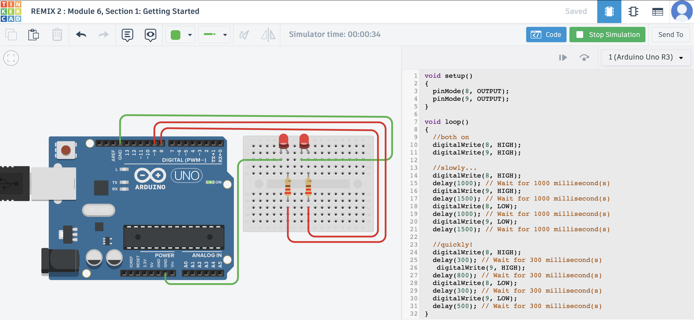
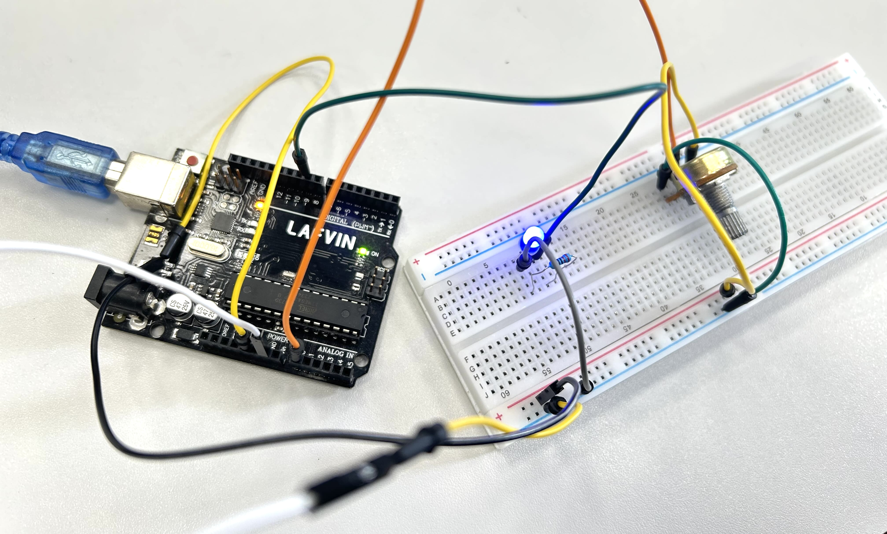
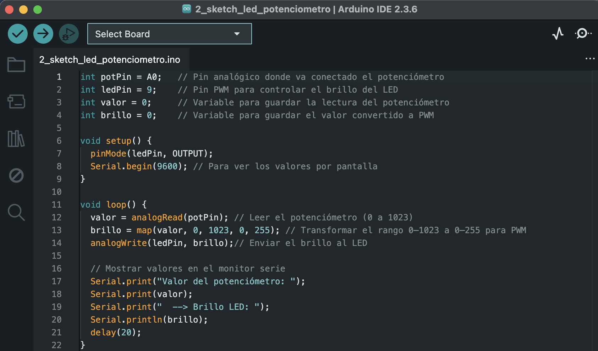
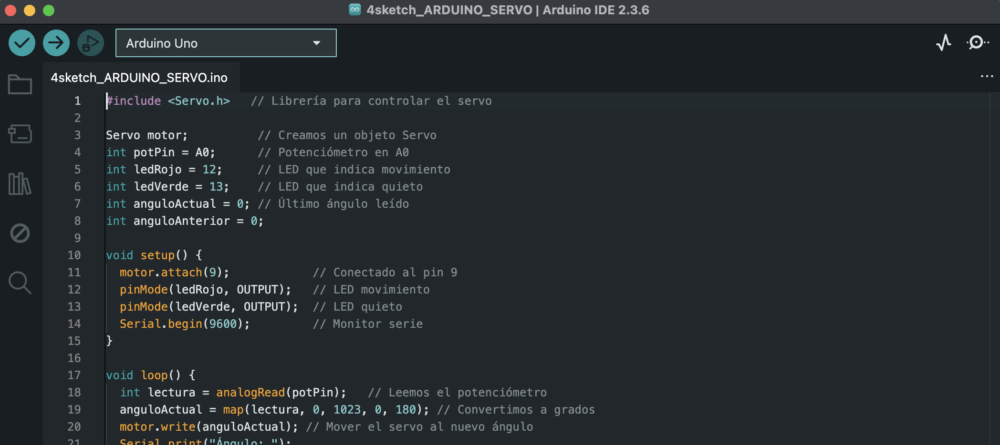
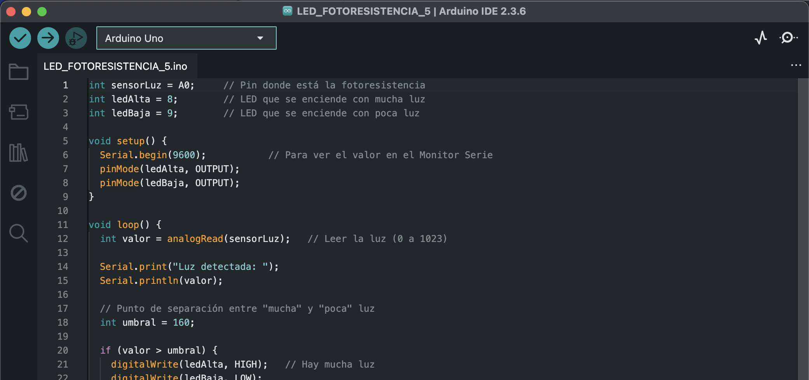
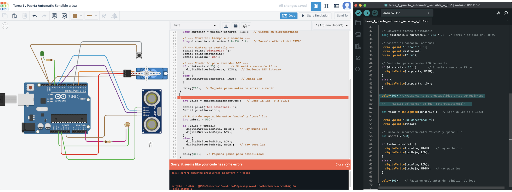
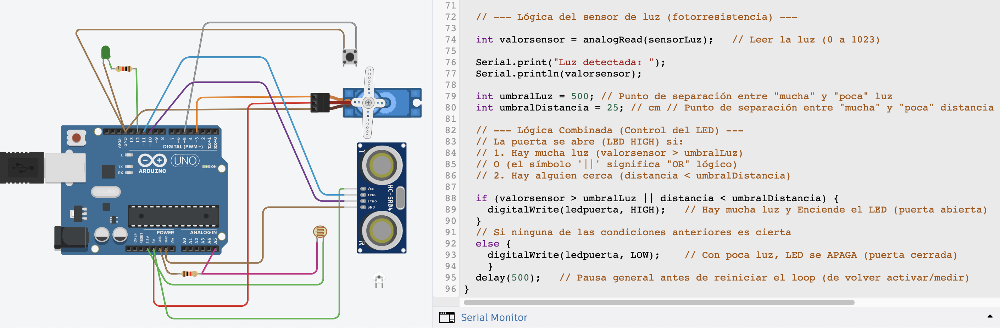

---
hide:
    - toc
---

# **MT** 04

>## **ELECTRÓNICA Y PROGRAMACIÓN (ARDUINO IDE) . INTRODUCCIÓN** 
*TECNOLOGÍA Y FABRICACIÓN*

 
 
 
 
 

_____

## **HERRAMIENTAS PRÁCTICAS APLICADAS .** MT04
 

Este _Módulo Técnico 04_ pone en práctica la tecnología de fabricación digital electrónica a través de programación **_ARDUINO IDE_**. Electrónica, un universo nuevo se abre para mí, un nuevo desafío para moverme de la zona de confort. Allá vamos…

 

# ARDUINO PROJECTS ~ TUTORIALS . *TINKERCAD* 
ELECTRÓNICA vs CIRCUITOS vs ARDUINO y más… 
El punto de partida de mi proceso de aprendizaje comenzó principalmente desde la PRÁCTICA VIRTUAL, (plataforma virtual Tinkercad), desde de tutoriales útiles, **SIMULADORES centrados en ensayos de Circuitos Electrónicos Arduino**, para comprender desde ahí, la teoría. Esos conceptos básicos que dan sentido a la Electrónica y su alcance a través del lenguaje de programación code. Simultáneamente la práctica se potenció bastante a partir de material teórico afín a la temática complementaria [(meets + literatura)](https://ev1.utec.edu.uy/moodle/mod/book/view.php?id=693254&chapterid=3083). + info [[ArduinoBook](https://candy-ho.com/Drivers/librodeproyectosdearduinostarterkit-151212174250.pdf)] & + info [[Circuits/ArduinoProject/tutorials](https://www.tinkercad.com/learn/circuits/collection/arduino)] 


### **TUTORIAL 1 .** ARDUINO PROJECTS ~ TINKERCAD

**BLINK AN LED WITH DIGITAL OUTPUT** ~ [[ TUTORIAL 1 ]](https://https://www.tinkercad.com/things/d8DqJlrxdm1/editel?lessonid=EIC0NAWJD0K8S1O&projectid=OMX1W9AL26F9EMF&collectionid=undefined&title=Blink%20an%20LED%20With%20Digital%20Output#/lesson-viewer) OBJETIVO . _❝ Aprendamos a parpadear un LED (diodo emisor de luz) usando la salida digital de Arduino. Si eres nuevo en Arduino, este es un gran lugar para empezar. Conectaremos un LED al Arduino Uno y compondremos un programa sencillo para encender y apagar el LED. ❞_




Durante el recorrido práctico tutorial fue útil integrar en la interfase de **edición de código**, el sistema de guía “Simple code with Blocks” & “Blink arduino block Explain”;  Visualizar combinadamente el editor de código de programación en formatos [ bloque & texto ] me sirvió como ’traductor’ del lenguaje de código lineal, para comprender con mayor facilidad la programación electrónica en cuanto a estructura y elementos de configuración ```[ void setup() {}, void loop() {} … ]``` del lenguaje de código de la secuencia de acciones aplicadas al dispositivo electrónico de circuito Arduino Uno R3. + info [[Electronic/Circuits/ArduinoProject/1]](https://www.tinkercad.com/things/d8DqJlrxdm1/editel?lessonid=EIC0NAWJD0K8S1O&projectid=OMX1W9AL26F9EMF&collectionid=undefined&title=Blink%20an%20LED%20With%20Digital%20Output#/lesson-viewer)


 

### **TUTORIAL 2 .** ARDUINO PROJECTS ~ TINKERCAD

**MULTIPLE LEDS & BREADBOARDS** ~  [[ TUTORIAL 2 ]](https://https://www.tinkercad.com/things/6TDWUMmH4lw/editel?lessonid=ELB4FYAJD0K8TZV&projectid=O94BCSIL26F9EV3&collectionid=undefined&title=Multiple%20LEDs%20&%20Breadboards=#/lesson-viewer)
OBJETIVO . _❝ Aprendamos a controlar múltiples LED usando las salidas digitales de Arduino y una placa de pruebas. Conectaremos algunos LED al Arduino Uno y compondremos un programa simple para iluminarlos en un patrón. Explore el circuito de muestra aquí en el plano de trabajo y construya el suyo propio a lo largo de él. Para construir opcionalmente el circuito físico, reúna su placa Arduino Uno, cable USB, placa de pruebas sin soldadura, algunos LED, resistencias (cualquier valor de 100-1K ohmios será útil) y cables de placa de pruebas. ❞_

‘Jugando' con el simulador y la variedad de **resistencias y sus valores** (Ω Ohms) posibles para entender su funcionamiento, verifiqué la relación adecuada entre resistencias y el power (𝓥olts) de alimentación y voltajes de la placa arduino. Lo solucioné aumentando el valor de la resistencia adecuada al voltaje de entrada. 




<!-- SUMAR +++ TEXTO FINAL de TUTORIAL 2 -->


 

## **REMIX TUTORIALS .** ARDUINO PROJECTS ~ TINKERCAD

A través de los referencias de los [_Circuit Design / Getting Started with MakerBot_](https://www.tinkercad.com/search?q=Getting%20Started%20with%20MakerBot&staffPicks=0&type=circuits&size=small&types=original) pude ir (de menos a más), observando los circuitos _(REMIXES 1,2, 3, 4)_ preexistentes ya construidos y comparar el lenguaje de código configurado con la interfaz visual del circuito activo en funcionamiento y comprender mejor las lógicas, de programación electrónica: significado del lenguaje de código vs la conexión entre componentes (estructuras, geometrías, orientaciones, sentidos y rutas de flujo energético, etc), y las resultantes de las dinámicas de movimientos.





+info [[ REMIX 1 ]](https://www.tinkercad.com/things/jywfyEhQmhy-remix-1-getting-started) ~ [[ REMIX 2 ]](https://www.tinkercad.com/things/00MWLfaNS0T-remix-2-module-6-section-1-getting-started) ~ [[ REMIX 3 ]](https://www.tinkercad.com/things/flyNIGiDncg-remix-3-getting-started-with-tinkercad-circuits) ~ [[ REMIX 4 ]](https://www.tinkercad.com/things/hLQehz1CDFz-remix-4-of-lcd-interfacing-with-arduino-uno) 

 


# ARDUINO ~ *LATU*

### **DINÁMICA 1 .** PRÁCTICA ARDUINO ~ LATU 

La práctica presencial constó de una sesión extensa en las instalaciones del LATU, a través de una dinámica a cargo de Mathías Rodríguez y un intercambio grupal entre docentes y estudiantes. Se desarrolló en **5 etapas a partir de 5 premisas** , desafíos electrónicos arduinos con distintos objetivos circuitales e instrucciones para la movilidad energética. [ + info [ PrácticaArduino~Latu ]]([https://](https://docs.google.com/presentation/d/1Ly0JR6jeLuPuMEq7Lt6N3M1PTVMk8FXvjujsZb0qju8/edit?usp=sharing))


__

#### 1 . LED ~ BUTTON . Arduino sketch 1

Una vez instalado el [Arduino IDE]([https://](https://www.arduino.cc/en/software/)) software (MacOS AppleSilicon), armamos primero el **Circuito Arduino #1** y segundo lo vinculamos en conexión USB con la PC/Software al
[[EDITOR Arduino IDE + MonitorSerie-integrado]]([https://](https://docs.arduino.cc/software/ide-v2/tutorials/ide-v2-serial-monitor/)), configurando allí su respectivo código de programación en correspondencia con las conexiones físicas establecidas. Si ambos, [circuito físico + código programación digital] se corresponden, el circuito se activa encendiéndose, de lo contrario, no. Una vez sincronizados y funcionales, salvamos ```[Upload Code "→"]``` el código programado.

OBJETIVO . ❝ _Programar el Arduino para que **lea un botón y encienda un LED únicamente mientras el botón está presionado**. Cuando el botón se suelta, el LED debe apagarse.❞_

CONEXIONES  . #1 
1) ```BOTÓN: Un pin del botón → Pin 2 del Arduino +  El otro pin del botón → GND```
2) ```LED: Ánodo (pata larga) → Pin 13 del Arduino  + resistencia  +  Cátodo (pata corta) → GND```


CÓDIGO . #1 
En la generación del código hay que tener en cuenta cada detalle expresado en las líneas de texto; El lenguaje de código es sensible y literal sobre la edición de texto, frente a cualquier variante, suma o resta de carácteres, espacios, interlineados, etc. El armado electrónico exige exactitud total, un código preciso garantiza un circuito funcional y viceversa. 
A continuación se ilustran ciertos errores ocurridos en la configuración digital en línea de código ingresada/editada en _ArduinoIDE_ ```[Verify Code > "✓”]``` hasta lograr su resolución final y compatibilidad de conexión con el circuito analógico Arduino. 


+info [[ SoluciónTinkercad~1BOTONPULLUP ]]([https://](https://docs.google.com/presentation/d/1Ly0JR6jeLuPuMEq7Lt6N3M1PTVMk8FXvjujsZb0qju8/edit?usp=sharing)) / [[ SoluciónTinkercad~2BOTTONPULLUP ]]([https://](https://docs.google.com/presentation/d/1Ly0JR6jeLuPuMEq7Lt6N3M1PTVMk8FXvjujsZb0qju8/edit?usp=sharing))


🎬 [LINK DEMO ~ CIRCUITO 1_LATU_MT04](https://drive.google.com/file/d/1E6LTHpaeHcRkWRFO5kVzwKjBrdiTuRA6/view?usp=share_link)


__
#### 2 . LED ~ POTENTIOMETER . Arduino sketch 2

OBJETIVO ❝ _Programar el Arduino para que lea el valor de un potenciómetro y controle el brillo de un LED. Cuando el potenciómetro esté en valores bajos, el LED debe estar tenue; cuando el potenciómetro esté en valores altos, el LED debe brillar más fuerte. **El cambio debe ser progresivo: a mayor giro del potenciómetro → mayor brillo.❞**_


CONEXIONES  . #2  
```POTENCIÓMETRO: Pin del medio → A0 (entrada analógica del Arduino)  +  Un pin lateral → 5V  +  Otro pin lateral → GND```
```LED: Ánodo (pata larga) → Pin 9 del Arduino  +  Cátodo (pata corta) → GND```

```El pin 9 es PWM, necesario para controlar el brillo del LED.```



CÓDIGO . #2



__
#### 3 . LED ~ POTENTIOMETER . Arduino sketch 3

OBJETIVO
❝ *Programar el Arduino para que use el **sensor de distancia SRF05** y encienda un LED cuando un objeto esté a menos de **20 cm**. Si el objeto está más lejos, el LED debe permanecer apagado. Además, el programa debe **mostrar en el Monitor Serie** (del Editor ArduinoIDE) **la distancia** medida en centímetros.❞*

CONEXIONES  . #3  
``SRF05: VCC → 5V  +  GND → GND  +  TRIG → pin 9  +  ECHO → pin 8``
``LED: Ánodo (pata larga) → Pin 13  +  resistencia  +  Cátodo (pata corta) → GND``


CÓDIGO . #3 

+info [ SoluciónTinkercad~SRF05ultrasonic ](https://www.tinkercad.com/things/4WlhMhtlIyp-ejercicio-3-srf05-ultrasonic?sharecode=oCsP1qqaiwoV649f0iR_su7nfGuJUqK55gTaRjFWsvQ) 


🎬 [[ LINK DEMO ~ CIRCUITO 3_LATU_MT04 ]]([https://](https://drive.google.com/file/d/1aDUlhFK0nH-TPvH0bvmcz27s-hj3-wEZ/view?usp=share_link))

__

#### 4 . LED ~ DISTANCE SENSOR  . Arduino sketch 4

OBJETIVO . *❝ Programar el Arduino para que lea un potenciómetro y controle el ángulo de un servo SG90 en tiempo real. Mientras el servo esté moviéndose (cambiando de ángulo), debe encenderse un **_LED rojo_**. Cuando el servo esté quieto (el ángulo no cambió respecto a la lectura anterior), debe encenderse un_ **_LED verde_**.❞*

CONEXIONES  . #4  
``POTENCIÓMETRO: Patita izquierda → GND  +  Patita derecha → 5V  +  Patita central → A0``
``SERVO SG90: Cable marrón/negro → GND  +  Cable rojo → 5V  +  Cable naranja → Pin 9 (PWM)``
``LED rojo (servo moviéndose): Ánodo (+) → Pin 12 + resistencia  + Cátodo (–) → GND``
``LED verde (servo quieto): Ánodo (+) → Pin 13 + resistencia   +  Cátodo (–) → GND``


CÓDIGO . #4

+info [[ SoluciónTinkercad~SERVO ]](https://www.tinkercad.com/things/9Lvh7katej7-ejercicio-4-servo?sharecode=CIluGHgZTD6tOKGOqU25zfLe5yJWgsw8Im2VWeDc4eo) 


🎬 [LINK DEMO ~ CIRCUITO 4_LATU_MT04](https://drive.google.com/file/d/1NGNUyMDVSp4n7wmhkyrfmNgkwh51o--5/view?usp=share_link)

__

#### 5 . LED ~ DISTANCE SENSOR  .  Arduino sketch 5

OBJETIVO ❝ *Programar el Arduino para que lea una fotoresistencia conectada a un pin analógico. Si la luz ambiente es alta, debe encenderse un **_LED_**. Si la luz es baja, debe encenderse otro **_LED diferente_**. Solo uno de los dos LEDs debe estar encendido a la vez. Además, el valor leído debe mostrarse en el [[ Monitor Serie ]]([https://](https://docs.arduino.cc/software/ide-v2/tutorials/ide-v2-serial-monitor/)).❞* 

CONEXIONES  . #5
``FOTORESISTENCIA: Un extremo → 5V  +  El otro extremo → Nodo central del divisor (va al pin A0)``
``RESISTENCIA FIJA (10 KΩ): Un extremo → Nodo central del divisor (misma fila que la pierna 2 de la LDR)  +   Otro extremo → GND``
``LED DE LUZ FUERTE (LED1: Ánodo (pata larga) → Pin 8 + resistencia  +  Cátodo (pata corta) → GND``
``LED DE LUZ BAJA (LED2):  Ánodo → pin 9 + resistencia  +  Cátodo → GND``


CÓDIGO . #5

+info [[ SoluciónTinkercad~SENSOR-LDR ]]([https://](https://www.tinkercad.com/things/44YUqUbCAqa-ejercicio-5-sensor-ldr?sharecode=acfif3MbyYKxtJFMlmvOG5ddA4PM39jTTkxO2zoZyd8)) 


🎬 [LINK DEMO ~ CIRCUITO 5_LATU_MT04](https://drive.google.com/file/d/1dgIgqbN-Q4PV_pCChqtyou1PA7FLHBBz/view?usp=share_link)

_____
## DINÁMICA 2 
PRÁCTICA ARDUINO ~ LATU 

Realicé esta dinámica como una práctica extra complementaria a la práctica presencial Latu de circuitos físicos. El **OBJETIVO** electrónico constó del siguiente enunciado: [Tarea 1 – Puerta Automática Sensible a la Luz](https://ev1.utec.edu.uy/moodle/mod/assign/view.php?id=693237)


CONEXIONES . TAREA FINAL 


CÓDIGO . TAREA FINAL  

Fui armando el [Circuito Arduino MT04_T1](https://www.tinkercad.com/things/g6dOhp5rRJ2-ok-tarea-1-puerta-automatic-sensible-a-luz-ok/editel?returnTo=https%3A%2F%2Fwww.tinkercad.com%2Fdashboard%2Fdesigns%2Fall) en el simulador virtual Tinkercad, en simultáneo con la generación/edición del código respectivo. Ese proceso en simultáneo fue muy útil, porque a través de la comparativa de configuración entre relación de componentes y código programación, comprendí un tanto más el sistema lógico electrónico. 

Avancé poco a poco, intentando (e intentando), solucionar obstáculos durante el proceso de edición del código. Enfrentarse al lenguaje de programación/código es un desafío al tratarse de una disciplina ajena a mi formación. La complejidad está dada por la interpretación conceptual sobre los “errores a modificar” que indica corregir el serial monitor, a medida que construimos la programación digital del circuito.



Durante el proceso, con la ayuda de _AI_, logré modificar errores de código, por ejemplo, el señalado en el bloqueo de simulación de encendido del circuito en Tinkercad. Si bien el código general del circuito ahora era correcto, al activar la simulación de funcionamiento del sistema Circuital, el sensor de luz fotosensible al moverlo no encendía el LedPuerta; por lo tanto se deduce que faltaba una instrucción no indicada/expresada en la programación del código. Con la ayuda de la _AI_ nuevamente, busqué identificar el error de funcionamiento (promt): **“¿_Podrías indicarme por qué no se enciende el sensor de luz para este circuito tinkercad?_** ”; A partir de la solución propuesta por la _AI_ sumé un concepto más a la expresión de programación de código --- **_Lógica Combinada_** ---  entre las variables  ``[valorsensor > umbralLuz || distancia < umbralDistancia]`` aplicada a las funciones/instrucciones **control del LED vs activación del sensor de luz (fotorresistencia).**

[Solución AI propuesta:](https://www.google.com/search?q=podr%C3%ADas+indicarme+cual+es+el+error+de+c%C3%B3digo+arduino+uno+que+oucrre+en+este+cicuito%3A%C2%A0https%3A%2F%2Fwww.tinkercad.com%2Fthings%2Fg6dOhp5rRJ2%2Feditel&client=safari&sca_esv=cca2da7e58596d6a&rls=en&sxsrf=AE3TifMnyZ0nvJi5mTr-0zYnwPxf710Nsw%3A1764375900122&udm=50&fbs=AIIjpHx4nJjfGojPVHhEACUHPiMQ_4u4Ko-HqjGhQ6Lh6-VOgLxZ5iwgGKQkA-aOQUErlB3A8R-uPBGUVf2JdeWQXB5HdEM7TLg6CmTbPC3QqF0I2GxaiSVheT-clZ5QksHKg7uGpGCoxf2VwxM2jhYTkVPPZ9A8FJhoNQFxzRfyqBYXlpfbYnrwwWPQEanyhhSj_HRbvy7oGbc56ES8UawgUm-3wbqsSg&aep=1&ntc=1&sa=X&ved=2ahUKEwimtZu2jJaRAxWJjpUCHSsvKKkQ2J8OegQIERAE&biw=1464&bih=813&dpr=2&mstk=AUtExfB9CCL1aca8XLyFKaPFsmJVmFbK1i3vABOUU7ABC7LbjeRkC66E5633Rg4ovZLhnCIgOUQ-De7iToG4yAbUxzowJdPoh17HOpQqN4opjzbeBt0Eym61Ktysl_9L6TzJPTl3Palhul70hVSv9yDXPQNzYPOQmsCijoMLbnF5NE2SbynHlu-WPLeq-5UJ3gCmGfRONJmUO1Qal3SwTgigxoqbKktAmV4Kyg8sb834TUeQ0ljPY-TrHAF5BS4uaTAgZN5adCcxqH5D4aoZtsCP4nPSju2fxxWQR9p6h_Frg7snvPTk6MlWVLSTPZZYMtmHCjpoPzMxdmigfA&csuir=1) ❝ _Para que ambos sensores puedan controlar la "puerta automática", necesitas combinar la lógica utilizando un solo conjunto de condiciones ``if o else if``. Decide cuándo se debe abrir la puerta (encender el LED): (se abre si se cumplen Ambas condiciones),  ¿Se abre si alguien se acerca o si hay mucha luz?. . .❞_

A continuación se presenta el código modificado que combina las condiciones para que el LED se encienda si se detecta proximidad o si hay mucha luz. 



La activación del Servo no fue sencilla. LedPuerta se encendía pero el Servo conectado no se movía; faltaba incluir en el código: Al servo como componente del circuito y (incluir librería) expresar sus respectivas instrucciones en la programación del código. Logré activar el Servo finalmente luego de mucho intentar, la edición del código vs la observación del la línea de código correspondiente al [ejercicio #4 .](https://docs.google.com/presentation/d/1Ly0JR6jeLuPuMEq7Lt6N3M1PTVMk8FXvjujsZb0qju8/edit?slide=id.g390f6dd2a1d_0_239#slide=id.g390f6dd2a1d_0_239)


🎬 [LINK DEMO ~ CIRCUITO MT04_T1 Tinkercad ](https://drive.google.com/file/d/1kP7PI0ylyzevORJ85kAejCZJCoY47FOI/view?usp=share_link)

Como revisión final del código programado para la función deseada del circuito móvil consulté a la _IA_ identificar aquellas fallas (6 ERRORES encontrados) en las líneas de código que provocaron fallos en la movilidad del sistema sincronizado. Seguramente esta práctica virtual requiere una revisión experta para su mejora y óptimo funcionamiento integral. 

 

_____


## **MARCO TEÓRICO / GLOSARIO** . MT04


Paralelamente a las prácticas, exploré también dos referencias teórico/prácticas muy útiles:  **_ArduinoBook y Directorio Docs.Arduino_**, para profundizar en la lógica y comprensión electrónica y observar comparativamente distintos casos o tipologías de circuitos, sus componentes, y sus correspondientes CÓDIGOS y ESQUEMAS, y significado circuital de programación. 


## ARDUINO BOOK
Entre otros, algunos de los contenidos consultados ejs.: **_"Medidor de enamoramiento"_**: Conceptos y Componentes electrónicos + Esquemas/símbolos circuitales + herramientas Hardware/Software + A/Z Glosario + Indicador del estado de ánimo + "Medidor de enamoramiento"... +info [[ ArduinoBook ]]([https://](https://candy-ho.com/Drivers/librodeproyectosdearduinostarterkit-151212174250.pdf)) 


## ARDUINO DOCS 
Ruta de consulta útil para una mirada y comprensión de lo macro a lo micro: **_Home / Programming / Built-in Examples_**. +info [[ Directorio Docs.Arduino ]]([https://](https://docs.arduino.cc/built-in-examples/))


## SOFTWARE . 
_Electronic programming ~ Simulators & Physics_

TINKERCAD
https://www.tinkercad.com/learn/circuits/collection/arduino

WOKWI
https://wokwi.com/

ARDUINO IDE 2.36 ~ (macOS apple Silicon)
https://www.arduino.cc/en/software/


____


## **LINKS DE INTERÉS** . MT04

TINKERCAD TUTORIALS ~ Circuit Arduino Project
https://www.tinkercad.com/learn/circuits/collection/arduino

MORSE CODE 
https://en.wikipedia.org/wiki/Morse_code

ARDUINO BOOK PROJECT
https://candy-ho.com/Drivers/librodeproyectosdearduinostarterkit-151212174250.pdf


GUÍA ELECTRÓNICA INET ~ RESISTENCIAS 
https://www.inet.edu.ar/wp-content/uploads/2020/07/ELECTRONICA_Gu--a01-Resistencias.pdf

Descargables de los esquemas de circuitos + software para dibujar circuitos electrónicos
https://fritzing.org/
https://www.tinkercad.com/dashboard 

ELECTRÓNICA PROYECTOS MAKER 
https://www.instructables.com/
https://www.hackster.io/

ELECTRÓNICA venta e ideas
https://www.adafruit.com/

ESCULTURAS ELECTRÓNICAS 
https://bhoite.com/sculptures/

____


## **REFLEXIONES** . MT04
# ❝ 
Déjà-vu! forzando nuevamente la zona de confort del aprendizaje…Nuevos lenguajes implican nuevos desafíos! Este módulo tuvo principalmente ese espíritu, una nueva oportunidad para ampliar la neuroplasticidad jaja y sortear la dificultad de ni saber como arrancar a aprender. 
Me salvan las ganas de aprender, la curiosidad, lo estimulante que me resulta tener un desafío en frente, no lo puedo evitar, ¡así soy!, jajja. 


Entre los conceptos de electrónica/Robótica leídos me sedujo esta idea; 
❝ *Los servomotores son los **músculos de los robots**, proporcionando un encendido y apagado suave y un posicionamiento preciso. Ya sea en un brazo robótico en una línea de montaje o en un robot explorador en Marte, los servomotores **hacen posible el movimiento**.❞* , **idea de -movimiento-** que integro como una metáfora transferible a este proceso de aprendizaje, reflexiono sobre lo clave de esos "músculos interiores", activos, dinámicos, que en el "andar" (valga la redundancia) de esta 'experiencia electrónica’ me permitieron dejar de lado la frustración y avanzar.

A pesar de la dificultad por ingresar a un universo nuevo del conocimiento, el concepto madre que hay detrás de la electrónica, los electrones y la energía para mover algo… una analogía con lo que le sucede al ser humano al moverse físicamente, sus neuronas, sus pensamientos se activan al ponerse en movimiento mucho más que cuando pensamos en una "corporalidad sedentaria", caminando, duchandonos, lavándose los dientes, etc etc,,, la actividad corporal de los electrones humanos desencadena el pensamiento activo, "ese momento desatanudos" donde las ideas ocurren mentalmente y fluyen en nuestro cerebro, como si se activara un circuito electrónico.

Al leer esto me sentí identificada; ❝ *Todo el mundo, todos los días, usa la tecnología. La mayoría de nosotros dejamos la programación a los ingenieros porque pensamos que la codificación y la electrónica son complicadas y difíciles; pero en realidad pueden ser actividades divertidas y emocionantes. Gracias a Arduino, diseñadores, artistas, aficionados y estudiantes de todas las edades están aprendiendo a crear cosas que iluminen, muevan y respondan a personas, animales, plantas y el resto del mundo.* ❞,  antes lo sentía así 100%, y aunque (falta mucho por entrenarme), ahora no lo siento tan inalcanzable. ; ) 
# ❞

 