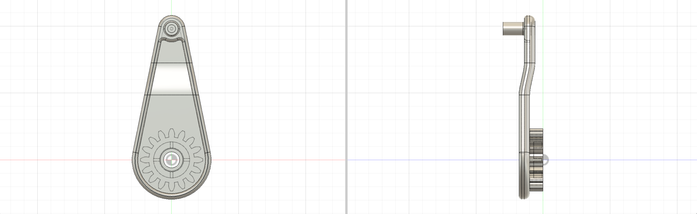
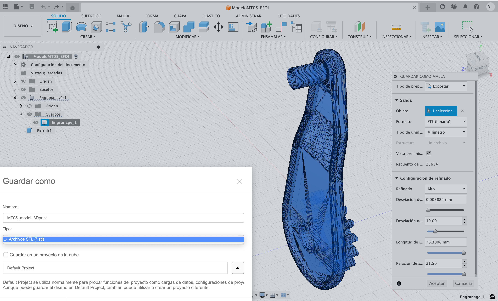
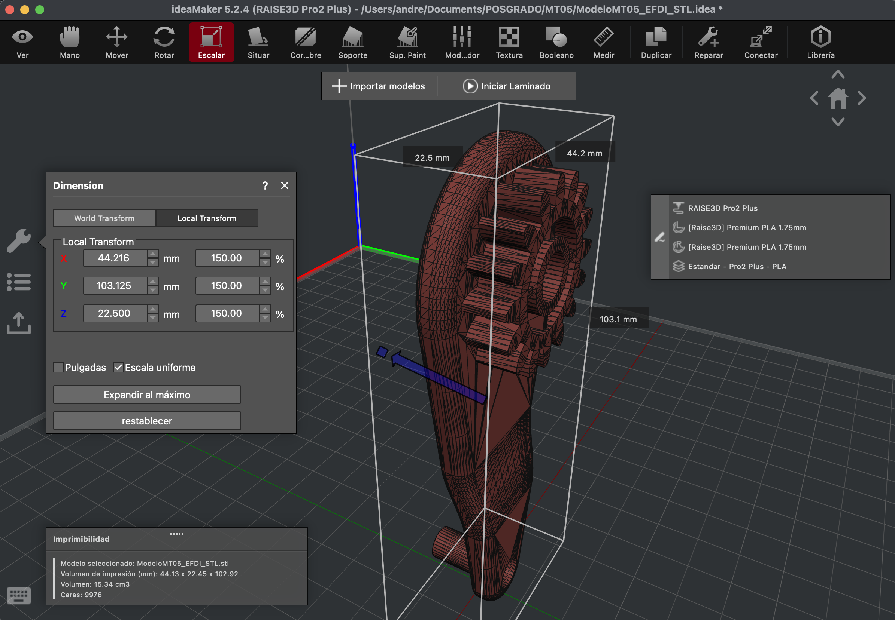
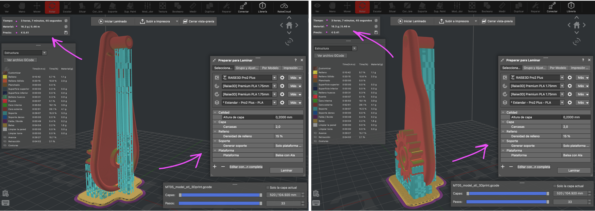
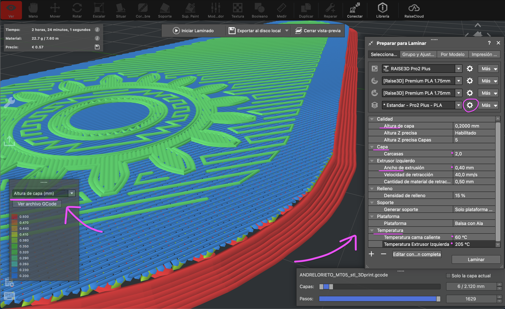
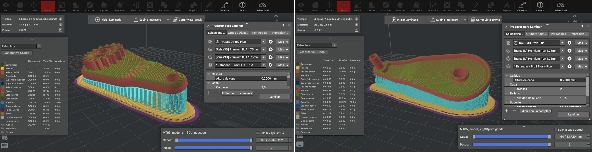
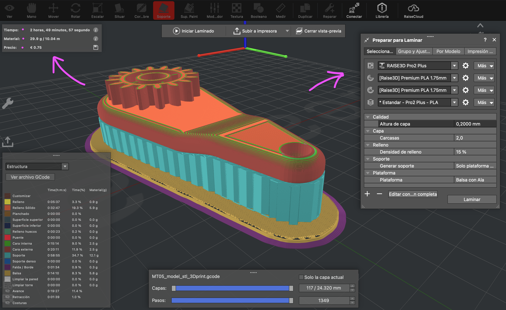
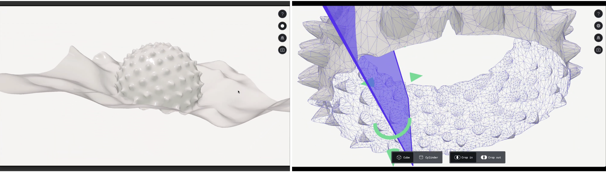

---
hide:
    - toc
---

# **MT** 05

>## **IMPRESIÓN 3D y ESCANEO**
*TECNOLOGÍA Y FABRICACIÓN*

 
 
 
 
 
 
_____

Este _Módulo Técnico 5_ se enfocó en la tecnología de fabricación aditiva **'3D PRINT ~ CAM' manufactura asistida por computadora aplicada a la impresión 3D**, considerando el proceso completo: tecnologías de impresión (filamento, resina, polvo, entre otras), tipos de máquinas, formatos de archivo, materiales y sus propiedades, y criterios de diseño específicos para la fabricación. Entre los objetivos del módulo se:
- Comprender el flujo de trabajo en impresión 3D
- Adquirir las habilidades/conocimientos para: elegir la tecnología más adecuada, preparar, leer y evaluar archivos de **fabricación con criterio técnico**.
- Analizar las decisiones que tomamos en cada **instancia del flujo de trabajo** —desde el **modelo digital** hasta la **configuración en el slicer**—,(y cómo estas) impactan en la calidad, el tiempo de fabricación, la resistencia y el comportamiento del objeto impreso. 

## **HERRAMIENTAS PRÁCTICAS TECH APLICADAS . MT05**

El proceso de práctica se desarrolló explorando, analizando y valorando las variables directas asociadas a la impresión 3D (sistema de fabricación aditiva), siendo estas, decisiones estratégicas previas a la práctica de SLICER 3D printing. 
_"La fabricación aditiva introduce un conjunto de **_factores_** que condicionan directamente el **_comportamiento y la calidad de las piezas_** obtenidas. En impresión 3D, especialmente FDM (Fused Deposition Modeling), **_variables como la altura de capa, el número de perímetros de pared, el tipo y porcentaje de relleno, la generación de soportes, la estrategia de adherencia a la plataforma y la orientación de la pieza definen no solo el aspecto visual, sino también la precisión dimensional, la resistencia mecánica, el peso, el tiempo de fabricación y el costo de cada componente._**

## 3D PRINT ~ PRÁCTICA TECH B . *3D PRINTING SIMULATION PROCESS*

 

#### **DISEÑO MODELO 3D**

**CALIDAD DE LA MESH**: Previo al proceso del Slicer/laminado es necesario preparar/verificar el modelo 3D. Un diseño de modelo con errores geométricos (mallas rotas, etc.) de superficie, no se segmentará correctamente y puede fallar la impresión (generando áreas/huecas, interrumpiendo el proceso, etc). 

_**FUSION**_ . Importé en Fusion el **_Modelo 3D_** (previa descarga: [[FILE: Fusion .f3d]]([https://](https://drive.google.com/file/d/1o6KqFnxxvC0-Z8-tAhfEiRM_EWMPbV23/view?usp=share_link)), y lo exporté en formato de **_malla .STL (binario)_** [[ FILE: 3D Model .STL ]]([https://](https://drive.google.com/file/d/1s_sk-Gf7MJs3IfKVURqEHdy8_r0nOyiR/view?usp=share_link))
Sería el análogo en modelado 2d, como al convertir un texto editable (o un pixel) al lenguaje de edición figura/vectorial. MESH EXPORT/(click derecho sobre Modelo) menú: ```SAVE AS MESH (settings) = format STL BINARY > units mm > refined HIGH.```






🎬 [_FUSION EXPORT STL ~  IDEAMAKER_](https://drive.google.com/file/d/1ffP9baiuF14obTiHfNKjZykeQr7p0Bna/view?usp=share_link) 

 

#### **SETTING PRINT SLICER 3D**

_**IDEAMAKER**_: Instalé el software LAMINADOR/SLICER 3D printing: [_ideaMaker_](https://ev1.utec.edu.uy/moodle/mod/book/view.php?id=700110&chapterid=3182) y abrí Modelo .STL en _**ideaM**_. para el _**3D PRINT SETTINGS**_. 

Verifiqué la configuración de impresora y correspondencia correcta entre software y el hardware a utilizar en Fablab, la **_Raise3D Pro2 Plus_** como impresora destino. Del tipo de Impresora depende en parte, el **PERFIL DE IMPRESIÓN DEL SOFTWARE SLICER 3D FMD, el cual determinará cómo se traducirá el modelo 3D en instrucciones para el proceso de impresión en función de VARIABLES DIVERSAS preconfiguradas** (diámetro de boquilla, material, temperaturas, velocidades, alturas de capa, relleno, ventilación, retracciones, etc) **que impactarán en la calidad de impresión final**. [+info [iM~Download]]([https://](https://www.raise3d.com/download/)) /[+info [IDEAMAKER ~ texturas ~ tools]]([https://](https://www.ideamaker.io/blogDetail.html?id=62&utm_source=ideamaker&utm_medium=referral&utm_content=5.2.4.8581))  / [+info [ ideaMaker ~ Guide 3D print settings ] ]([https://](https://www.ideamaker.io/dictionaryDetail.html?name=Retraction%20Speed&category_name=Extruder))


Entre otras, las variables principales de configuración son:

**ESCALA DEL MODELO**: escalé proporcionalmente la pieza a un 150% (a mayor tamaño mayor tiempo de maquinado).


[_FILE 3D PRINT ~ .IDEAMAKER_](https:https://drive.google.com/file/d/1IVcEFEwCxdrrJ3htQK0O7tdaEbCgeB7v/view?usp=share_link)


**ORIENTACIÓN DEL MODELO**: La orientación del volumen en la cama, es clave para determinar la resistencia mecánica, la necesidad de soportes y el acabado de las superficies visibles. Una mala orientación puede comprometer la integridad estructural del volumen laminado/impreso.
**Exploré distintas posiciones del modelo en cada 'Simulación Slicer’, observando su conveniencia**, buscando favorecer un óptimo resultado técnico en la impresión 3D, a partir de la calidad y rendimiento eficiente del proceso de maquinado en la impresión consecuente al objetivo de diseño proyectado. A partir de esta variable se van desencadenando otras directamente relacionadas, como ser:

**SOPORTE/ADHESIÓN DE CAMA**: La correcta configuración de estos sistemas asegura que la pieza se mantenga estable durante la impresión y que las partes voladizas se construyan correctamente.




Otros parámetros a tener en cuenta en la impresión 3D CAD-CAM directamente ligadas con las **características del MATERIAL** y su tecnología de impresión. A medida que se ejercita la práctica CAM Slicer 3D print, podemos explorar y profundizar en el resultado material y cómo incidirá el conjunto de variables en la geometría/función del diseño vs. la calidad de impresión: 
[+info [ Ideamaker/configruración/materiales ]]([https://](https://drive.google.com/file/d/1k_vscybWQGVummHYbg2wlqNd1RfMWyFg/view?t=65)) 

**BOQUILLA ~ DIÁMETRO, y resolución en XY:**
La variable seleccionada de diámetro de apertura de boquilla fue la estándar (= Nozzle 0,4 mm). ```PRINT SETTING/Menú: IMPRESORA > Asistente de configuración > Raise Pro2 Plus > mm Nozzle```. Otra variable a seleccionada: el _**extrusor IZQUIERDO**_ de salida/boquilla filamento/plástico fluido de la impresora. La impresora contempla en principio 2 extrusores de alimentación (con distintos roles asignados) pero este diseño en particular no demanda  utilizar ambos. 

_"En FDM el material sale por la boquilla (nozzle) de la impresora y la pieza se genera capa a capa. Por lo tanto,_ **_la boquilla define la resolución mínima de impresión en el plano XY_**. _El diámetro estándar suele ser de 0,4 mm, aunque existen boquillas de 0,25 mm, 0,6 mm, 0,8 mm o más._ _**Este diámetro determina el ancho mínimo del cordón de material que la impresora puede depositar. Una boquilla de mayor diámetro deposita más plástico por unidad de tiempo y permite alturas de capa más grandes: es posible imprimir piezas grandes de forma más rápida y con cordones más anchos y robustos, a costa de perder resolución en XY y obtener un acabado más grueso**_. _Por el contrario, boquillas pequeñas combinadas con capas finas producen superficies suaves y detalles delicados, pero multiplican el número de capas y el tiempo total de fabricación."_

**CAPA ~ ALTURA, y resolución en Z**: La altura de capa establecida para este modelo 3D fue la estándar de 0,2 mm. Esta variable define la resolución vertical en el proceso de extrusión del material. Es imprescindible para el equilibrio entre detalle fino y velocidad de impresión. Aumentar la altura de capa puede reducir de forma significativa el tiempo total de impresión, pero también disminuye la definición de los detalles y hace más visibles los escalones entre capas. 




**VELOCIDAD DE IMPRESIÓN ('TIEMPO')**: Afecta directamente la precisión y definición de la extrusión. Demasiado rápido suele reducir la calidad. 

**TIEMPO DE IMPRESIÓN, consumo de material y acabado**: Cada decisión condiciona las variables y estas impactan en el tiempo/duración de impresión. Por ej: _"Las decisiones sobre boquilla y altura de capa no solo afectan la calidad visual, sino también los tiempos de impresión y el consumo de material"_. Si bien el tiempo total de impresión no es una variable de ajuste directa en sí misma, sino más que nada el resultado combinado de otras variables imprescindibles que afectan la calidad de impresión. De todos modos, existe una relación directa entre el tiempo disponible (velocidad) y la calidad del prototipo: a mayor tiempo de impresión (velocidad más lenta) se favorece el resultado de impresión en cuanto: el nivel de detalle visual del diseño y en ciertos casos, la resistencia esperada de la pieza. 




**MODELO 3D VS RESISTENCIA MECÁNICO**
Sino me equivoco orientar horizontalmente el modelo sobre la cama garantizaría mayor resistencia mecánica para una pieza funcional (suponiendo que probablemente funcione como una palanca), la pieza recibiría una fuerza perpendicularmente a su eje principal, entonces imprimirla horizontalmente haría que las capas/filamentos de extrusión (impresas paralelas a la cama), queden paralelas a la dirección de la fuerza de tracción 'aplicada'. Esto permitiría que la pieza sea más resistente a la rotura en los encuentros de planos a 90°, zona de mayor fragilidad en la geometrías de impresiones 3D de tecnología FDM . 
Seleccionar esta opción de orientación del objeto tendría la desventaja en cuanto al tiempo de impresión que insumiría según simula el Print Slicer; si bien no es el tiempo más extenso entre las alternativas simuladas, a medida que avanzamos en los ajustes de configuración de variables podría optimizarse el Print Slicer.


 

#### **G CODE FILE**
Generé el laminado y exporté el Código G de impresión 3D

[_FILE 3D PRINT ~ .GCODE_ ](https://drive.google.com/file/d/1IVcEFEwCxdrrJ3htQK0O7tdaEbCgeB7v/view?usp=share_link)

## SCANNING 3D ~ PRÁCTICA TÉCNICA B . *3D SCAN SIMULATION PROCESS*

#### POLYCAM 

Entre la variedad de software para el escaneo 3D, experimenté con Polycam. El proceso de relevamiento/medición geométrica para generar un modelo digital, en forma de nube de puntos y malla 3D, fue a partir de un objeto simple y regular morfológico, con la intención de un ensayo sencillo para obtener un relevo geométrico digital ejecutivo y fiel al objeto original. 

A partir de varios ensayos explorados con el escáner (dispositivo móvil) analizé la superficie registrando millones de puntos con posición en el espacio, y a partir de estos datos se reconstruyó la forma/color/textura del objeto.

La experiencia de escaneo por fotogrametría "manual", para la obtención del modelo 3D-mesh como procedimiento inverso del diseño, requiere un uso del escaneo delicado y sensible, tal es así que en este caso frente a este objeto de geometría simple la práctica de escaneo tuvo un resultado fotogramétrico digital inconsistente, poco fiel al objeto real presentando fallas: geometría amorfa poco realista, confusa, huecos de malla, asemejando a geometría orgánica o galáctica  y no regular similar a un pez globo, un fruto, etc… 

La fotogrametría o Structure from Motion reconstruye un objeto o escena a partir de muchas fotos solapadas tomadas desde distintos ángulos. El software detecta puntos en común entre imágenes, estima la posición de la cámara en cada toma y calcula una nube de puntos 3D, que luego se convierte en malla y textura. 

A diferencia del resultado obtenido en la fotogrametría "manual", (donde el resultado geométrico del objeto obtenido no fue fidedigno), este se optimizó a partir de la opción de relevamiento manual asistida por AI (PolycamFree). Esta combinación de escaneo analógica-digital + AI, con tan solo 3 ensayos asistidos, facilitó la reconstrucción estructural geométrica digital del objeto escaneado, a través de la misma cantidad de fotos superpuestas, simulando un escaneo de fotogrametría de réplica más “sensible”, real.


_'MESH' (malla)_; estructura geométrica, hecha de polígonos (triángulos o cuadriláteros), como estructura de ‘alambre’ que representa el objeto/escena 3D escaneada. 


_‘CLAY’ (arcilla)_; modo de renderizado que simplifica visualmente el modelo 3D, quitándole colores, texturas reales mostrándolo como un sólido, permitiéndote apreciar su forma, volumen y detalles geométricos de manera limpia. 


 

🎬 [_LINK DEMO ~ VOLUMEN SCAN 1 MT05_](https://drive.google.com/file/d/1vC59fD7kVF8Qa5-VTjYf7yYx9S4DaqNH/view?usp=sharing) 
🎬 [_LINK DEMO ~ VOLUMEN SCAN 2 MT05_](https://drive.google.com/file/d/16b-biOZ2afr2Kt-1k6YypWiUASMn-5DN/view?usp=sharing) 
____


## **REFLEXIONES** . MT05
# ❝ 
Observando los procesos históricos sobre la 3DPrint,  la tecnología, y la "evolución en la de creación humana" en general a lo largo del tiempo, reflexionaba cuan clave es, -más allá de la calidad del planteo innovador creado-, el momento adecuado para convertir esa idea “innovadora” en asertiva; Ser pertinente en la época y conveniente en tiempo y espacio le da sentido y significado a la ideación, la válida y da trascendencia social, de lo contrario, la idea práctica muere a pesar de su potencial hipotético.

A partir de esta evolución histórica, la impresión 3D deja de ser un experimento de laboratorio para convertirse en una familia de procesos de fabricación aditiva con impacto real en diseño, ingeniería, medicina, arquitectura, arte y emprendimientos tecnológicos, donde podemos encontrar gran diversidad de opciones según los requerimientos del caso. El alcance masivo de esta tecnología en constante crecimiento es de momento inagotable; Estamos frente a un 'nuevo paradigma' para concebir la 3D, permitiendo un vuelo morfológico distinto, con mayor peso digital. Abarcando un amplio espectro de desarrollo, esta herramienta posibilita y expande la capacidad productiva yendo de lo 'doméstico a lo industrial', en multiplicidad de áreas y sectores de aplicación curiosa.

De lo errático, surge la oportunidad; de la falla en el escaneo, al hallazgo morfológico. El Scanning doméstico o analógico/manual como método de relevamiento espacial 3D sensible, inexacto y espontáneo, se amplifica en su función principal hacia una herramienta experimental creativa a través de un 'nuevo uso', lo aleatorio, posibilitando obtener diversidad de formas volumétricas (modelos 3D), amorfas y distintas a la antecedente; En otras palabras, en la pérdida de control de la herramienta, la creatividad puede quedar al descubierto como un útil instrumento de ideación constructivo para la fabricación.
# ❞