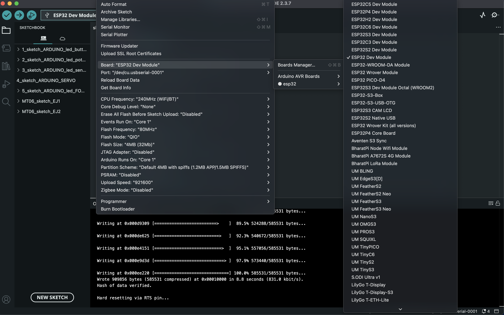
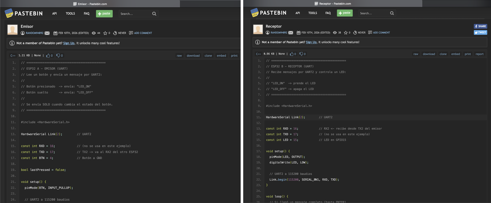
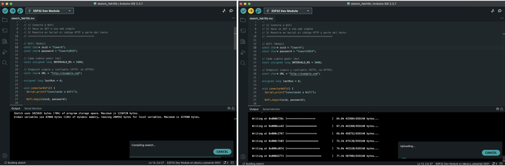

---
hide:
    - toc
---

# **MT** 06

>## **NETWORKING** 
*TECNOLOGÍA Y FABRICACIÓN*

 
 
 
 
 

_____

Este _*Módulo Técnico*_ 06 nos introdujo al Networking y Comunicaciones para Fabricación Digital, con el objetivo de comprender principalmente:  **qué son las comunicaciones, para qué sirven y cómo funcionan** a nivel conceptual-teórico, a través de ejemplos técnico-prácticos sencillos y analogías cotidianas.

❝ _En el mundo de la tecnología y la fabricación digital,_ **_la habilidad de que diferentes dispositivos se "hablen" entre sí_** _es fundamental. Esto es lo que llamamos comunicación o_ _**networking**._ ❞  [ _+ info ~ [Introducción a Networking ]_]([https://drive.google.com/file/d/1GAydsQ3LZKZzK2P6FtbNLVRa-y8HHwwn/view?usp=share_link)

## **HERRAMIENTAS PRÁCTICAS APLICADAS** . MT06

## NETWORKING DEVICES ~ *LATU*

La práctica presencial constó de una breve sesión en las instalaciones del LATU, a través de una dinámica de intercambio entre estudiantes y equipo docente a cargo de Mathías Rodríguez. 
Bajo el objetivo de consigna **_'Comunicación entre dispositivos' (Networking Devices)_** desarrollamos 
[ 3 consignas teórico-prácticas,](https://docs.google.com/presentation/d/1mC3iBvWMkmjyKwrU4qxjnVaWNS6LDlBpFUY7jH2f0k0/edit?usp=sharing) con distintos desafíos circuitales e instrucciones para la 'movilidad energética' y transferencia de datos electrónicos. 
[ _+ info ~ [ Práctica Network_ESP32 Arduino ~ LATU ]_ ](https://docs.google.com/presentation/d/1mC3iBvWMkmjyKwrU4qxjnVaWNS6LDlBpFUY7jH2f0k0/edit?usp=sharing)

En el EDITOR Arduino IDE software: Incluimos el microcontrolador ESP32, el "cerebro" ya programando es mucho más potente, rápido y capaz del Arduino Uno tradicional, (el chip ESP32 contiene 2 núcleos físicos (Dual-Core), la memoria y las radios de Wi-Fi/Bluetooth) en estos pasos guía: 
 
```1) Ir a “Preferences” (menú: Arduino IDE (o File) → Preferences/settings) > Agregar el link del ESP32 (menú: Additional Boards Manager URLs) > Pegar estos link:``` 

- https://dl.espressif.com/dl/package_esp32_index.json

- https://resource.heltec.cn/download/package_heltec_esp32_index.json
https://resource.heltec.cn/download/package_heltec_esp32_index.json

❝ _Estos enlaces sirven para que el Arduino IDE pueda reconocer, descargar e instalar las herramientas necesarias (el "core" o núcleo) para programar placas basadas en el chip ESP32. Sin estos links, el IDE solo sabe trabajar con placas oficiales de Arduino (como el Uno o Nano)._ ❞


 

```2) Abrir Boards Manager > Ir a: Tools → Board → Boards Manager```



 


__
#### DINÁMICA 1 . Arduino ESP32 ~ Serial UART . *sketch 1*
 
**OBJETIVO**
_Implementar una comunicación **Serial UART entre dos ESP32**:_
- _ESP32 A - EMISOR (UART) : cuando el usuario aprieta un botón, envía un mensaje por UART._
- _ESP32 B RECEPTOR (UART) : recibe el mensaje por UART y prende/apaga un LED según el comando recibido._

**CONEXIONES . #1**


Armamos el **circuito ESP32 #1** vinculando el microcontrolador ESP32 en conexión USB con la PC/Software al 
[ EDITOR Arduino IDE + MonitorSerialTool ]([https://](https://docs.arduino.cc/software/ide-v2/tutorials/ide-v2-serial-monitor/))(integrado). Este circuito se compuso de un EMISOR y un RECEPTOR para la transmisión de datos en comunicación combinada y sincrónica entre 2 computadoras:  


```Dispositivo A (Irene-compa) = EMISOR (boca)  →```     
```Dispositivo B (Andre-yo) = RECEPTOR (oído)```
[ + info ~ _[ Introducción a Networking ~ pág 1-2 ]_]([https://](https://drive.google.com/file/d/1GAydsQ3LZKZzK2P6FtbNLVRa-y8HHwwn/view?usp=share_link))


[🎬 _LINK DEMO ~ CIRCUITO ESP32 1_LATU_MT06_ ](https://drive.google.com/file/d/1ZnSnKseEqlPLL6TSI0uTwzEuMqSi9MOy/view?usp=share_link)


```Emisor: https://pastebin.com/1ue5XRCQ```
```Receptor: https://pastebin.com/3FQbShiS```

Configuramos [(Serial Monitor)](https://docs.arduino.cc/software/ide-v2/tutorials/ide-v2-serial-monitor/) su código de programación en correspondencia con las conexiones físicas establecidas. Si ambos, [circuito físico + código programación digital] se corresponden, el circuito se activa encendiéndose, de lo contrario, no. Una vez sincronizados y funcionales, ```[Verify Code “✓” + Compiling Code "→"] + Upload sketch, finalmente guardamos el archivo de código programado.```



__

#### DINÁMICA 2 . Arduino ESP32 ~ WiFi + HTTP GET . *sketch 1*
 
**OBJETIVO**

_**_Programar un microcontrolador ESP32** para que:_
- _Se conecte a una red WiFi._
- _Haga una petición HTTP GET a una página web simple._
- _Muestre en el Serial Monitor: Si se conectó correctamente + La IP asignada + El código HTTP de respuesta + Los primeros caracteres del contenido recibido_

**CONEXIONES . #2**

Armamos el circuito ESP32 #2 vinculando el microcontrolador ESP32 en conexión USB con la PC/Software al [EDITOR Arduino IDE + MonitorSerialTool](https://https://docs.arduino.cc/software/ide-v2/tutorials/ide-v2-serial-monitor/)(integrado).


**CÓDIGO . #2**

```Solución: https://wokwi.com/projects/455582534712036353```

Configuramos [(Serial Monitor)](https://docs.arduino.cc/software/ide-v2/tutorials/ide-v2-serial-monitor/) su código de programación en correspondencia con las conexiones físicas establecidas. Si ambos, [circuito físico + código programación digital] se corresponden, el circuito se activa encendiéndose, de lo contrario, no. Una vez sincronizados y funcionales, ```[Verify Code “✓” + Compiling Code "→"] + Upload sketch, finalmente guardamos el archivo de código programado.```



