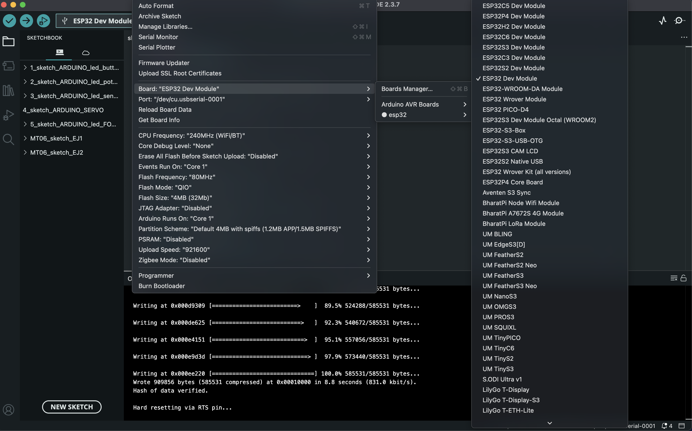
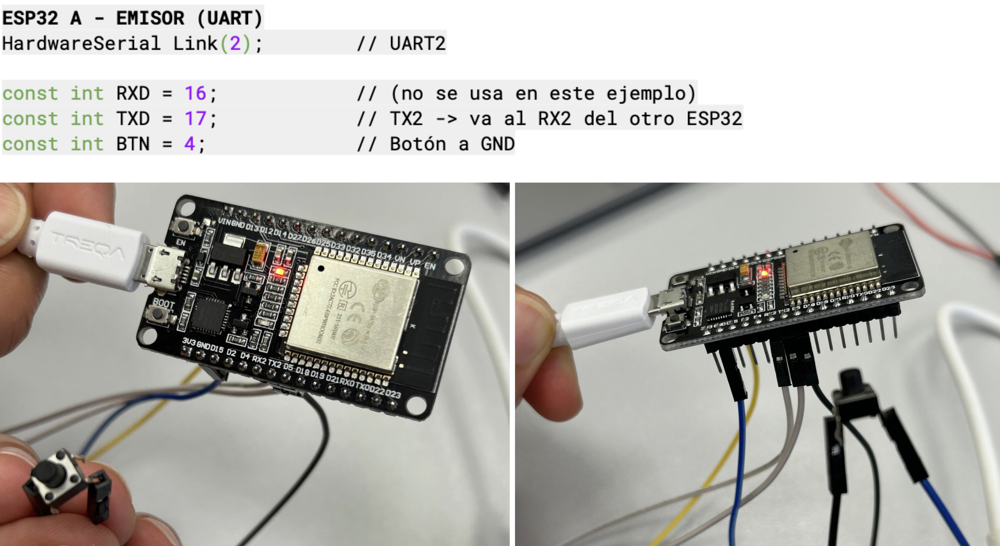
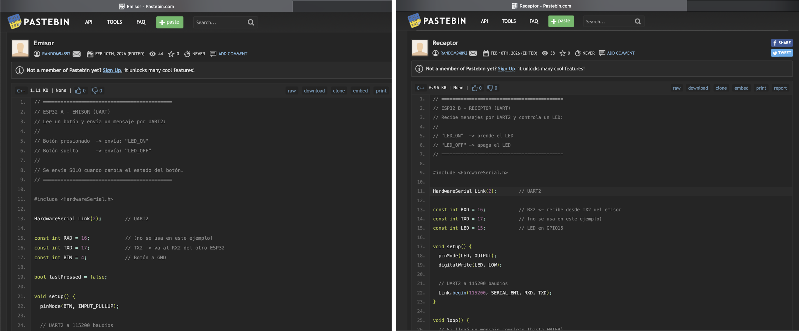
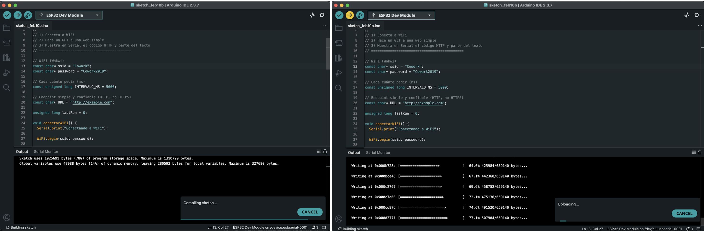
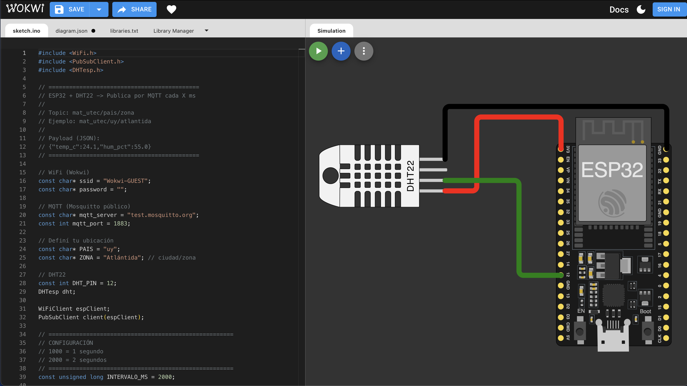
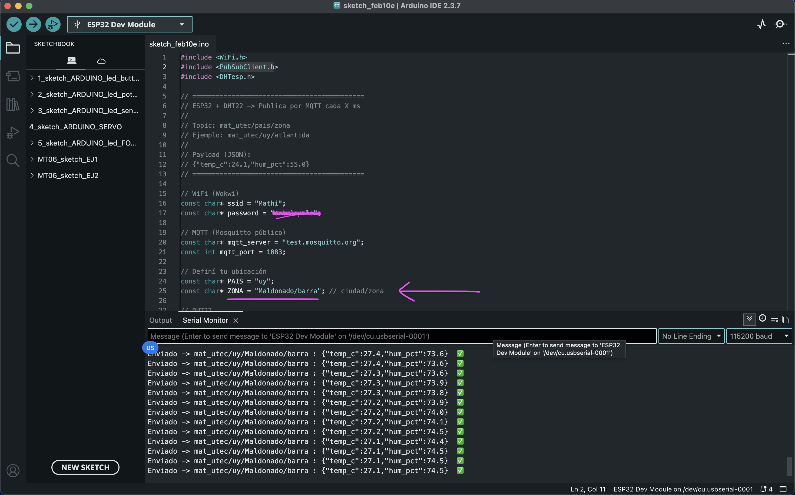
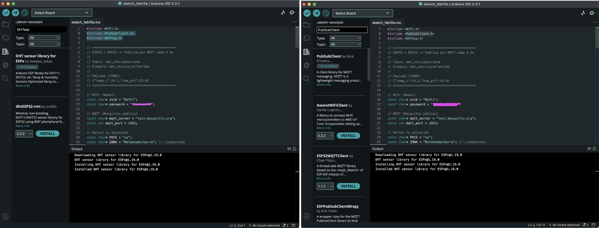

---
hide:
    - toc
---

# **MT** 06

>## **NETWORKING** 
*TECNOLOGÍA Y FABRICACIÓN*

<br>
<br>

_____

Este _*Módulo Técnico*_ 06 nos introdujo al Networking y Comunicaciones para Fabricación Digital, con el objetivo de comprender principalmente:  **qué son las comunicaciones, para qué sirven y cómo funcionan** a nivel conceptual-teórico, a través de ejemplos técnico-prácticos sencillos y analogías cotidianas.

❝ _En el mundo de la tecnología y la fabricación digital,_ **_la habilidad de que diferentes dispositivos se "hablen" entre sí_** _es fundamental. Esto es lo que llamamos comunicación o_ _**networking**._ ❞  [ _+ info ~ [Introducción a Networking ]_]([https://drive.google.com/file/d/1GAydsQ3LZKZzK2P6FtbNLVRa-y8HHwwn/view?usp=share_link)

## **HERRAMIENTAS PRÁCTICAS APLICADAS** . MT06

## NETWORKING DEVICES ~ *LATU*

La práctica presencial constó de una breve sesión en las instalaciones del LATU, a través de una dinámica de intercambio entre estudiantes y equipo docente a cargo de Mathías Rodríguez. 
Bajo el objetivo de consigna **_'Comunicación entre dispositivos' (Networking Devices)_** desarrollamos 
[ 3 consignas teórico-prácticas,](https://docs.google.com/presentation/d/1mC3iBvWMkmjyKwrU4qxjnVaWNS6LDlBpFUY7jH2f0k0/edit?usp=sharing) con distintos desafíos circuitales e instrucciones para la 'movilidad energética' y transferencia de datos electrónicos. 
[ _+ info ~ [ Práctica Network_ESP32 Arduino ~ LATU ]_ ](https://docs.google.com/presentation/d/1mC3iBvWMkmjyKwrU4qxjnVaWNS6LDlBpFUY7jH2f0k0/edit?usp=sharing)

En el EDITOR Arduino IDE software: Incluimos el microcontrolador ESP32, el "cerebro" ya programando es mucho más potente, rápido y capaz del Arduino Uno tradicional, (el chip ESP32 contiene 2 núcleos físicos (Dual-Core), la memoria y las radios de Wi-Fi/Bluetooth) en estos pasos guía: 
 
```1) Ir a “Preferences” (menú: Arduino IDE (o File) → Preferences/settings) > Agregar el link del ESP32 (menú: Additional Boards Manager URLs) > Pegar estos link:``` 

- https://dl.espressif.com/dl/package_esp32_index.json

- https://resource.heltec.cn/download/package_heltec_esp32_index.json
https://resource.heltec.cn/download/package_heltec_esp32_index.json

❝ _Estos enlaces sirven para que el Arduino IDE pueda reconocer, descargar e instalar las herramientas necesarias (el "core" o núcleo) para programar placas basadas en el chip ESP32. Sin estos links, el IDE solo sabe trabajar con placas oficiales de Arduino (como el Uno o Nano)._ ❞


<br>

```2) Abrir Boards Manager > Ir a: Tools → Board → Boards Manager```


<br>
<br>

#### DINÁMICA 1 . Arduino ESP32 ~ Serial UART . *sketch 1*
<br>

**OBJETIVO**
_Implementar una comunicación **Serial UART entre dos ESP32**:_
- _ESP32 A - EMISOR (UART) : cuando el usuario aprieta un botón, envía un mensaje por UART._
- _ESP32 B RECEPTOR (UART) : recibe el mensaje por UART y prende/apaga un LED según el comando recibido._


**CONEXIONES . #1**




Armamos el **circuito ESP32 #1** vinculando el microcontrolador ESP32 en conexión USB con la PC/Software al 
[ EDITOR Arduino IDE + MonitorSerialTool ]([https://](https://docs.arduino.cc/software/ide-v2/tutorials/ide-v2-serial-monitor/))(integrado). Este circuito se compuso de un EMISOR y un RECEPTOR para la transmisión de datos en comunicación combinada y sincrónica entre 2 computadoras:  


```Dispositivo A (Irene-compa) = EMISOR (boca)  →```     
```Dispositivo B (Andre-yo) = RECEPTOR (oído)```
[ + info ~ _[ Introducción a Networking ~ pág 1-2 ]_]([https://](https://drive.google.com/file/d/1GAydsQ3LZKZzK2P6FtbNLVRa-y8HHwwn/view?usp=share_link))


[🎬 _LINK DEMO ~ CIRCUITO ESP32 1_LATU_MT06_ ](https://drive.google.com/file/d/1ZnSnKseEqlPLL6TSI0uTwzEuMqSi9MOy/view?usp=share_link)


**CÓDIGO . #1**
```Emisor: https://pastebin.com/1ue5XRCQ```
```Receptor: https://pastebin.com/3FQbShiS```

Configuramos [(Serial Monitor)](https://docs.arduino.cc/software/ide-v2/tutorials/ide-v2-serial-monitor/) su código de programación en correspondencia con las conexiones físicas establecidas. Si ambos, [circuito físico + código programación digital] se corresponden, el circuito se activa encendiéndose, de lo contrario, no. Una vez sincronizados y funcionales, ```[Verify Code “✓” + Compiling Code "→"] + Upload sketch, finalmente guardamos el archivo de código programado.```


<br>

#### DINÁMICA 2 . Arduino ESP32 ~ WiFi + HTTP GET . *sketch 2*

<br>

**OBJETIVO**

_**Programar un microcontrolador ESP32** para que:_
- _Se conecte a una red WiFi._
- _Haga una petición HTTP GET a una página web simple._
- _Muestre en el Serial Monitor: Si se conectó correctamente + La IP asignada + El código HTTP de respuesta + Los primeros caracteres del contenido recibido_

<br>

**CONEXIONES . #2**

Armamos el circuito ESP32 #2 vinculando el microcontrolador ESP32 en conexión USB con la PC/Software al [EDITOR Arduino IDE + MonitorSerialTool](https://https://docs.arduino.cc/software/ide-v2/tutorials/ide-v2-serial-monitor/) (integrado).

<br>

**CÓDIGO . #2**

```Solución: https://wokwi.com/projects/455582534712036353```

Configuramos [(Serial Monitor)](https://docs.arduino.cc/software/ide-v2/tutorials/ide-v2-serial-monitor/) su código de programación en correspondencia con las conexiones físicas establecidas. Si ambos, [circuito físico + código programación digital] se corresponden, el circuito se activa encendiéndose, de lo contrario, no. Una vez sincronizados y funcionales, ```[Verify Code “✓” + Compiling Code "→"] + Upload sketch, finalmente guardamos el archivo de código programado.```



<br>

#### DINÁMICA 3 . Arduino ESP32 ~ WiFi + DHT22 + MQTT . *sketch 3*


**OBJETIVO**

_Programar un ESP32 para que:_
- _Se conecte a una red WiFi_
- _Se conecte a un broker MQTT público_
- _Lea temperatura y humedad desde un sensor DHT22_
- _Publique periódicamente (configurable) un mensaje JSON en un topic con formato:_ ```mat_utec/<pais>/<zona> + Ejemplo: mat_utec/uy/atlantida```


**CONEXIONES . #3**

>```SENSOR DHT22 (temp/hum) → Esp32 :``` 
```(DHT) pin 2 VCC → 3V3 (esp32) +``` 
```(DHT) pin 3 DAT → pin12 (esp32) +```  
```(DHT) pin 1 GND → GND (esp32)``` 

* VCC/IN (Voltage Common Collector) conexión: al **pin de alimentación energía positiva (+)**.
Este sensor suele funcionar en un rango de 3.3V a 5.5V. En proyectos con ESP32, se recomienda conectarlo al pin de 3.3V, mientras que en Arduino suele ir al de 5V.

* DAT/OUT (Datos) conexión: al **pin digital (ej:D12)**.
Utiliza un protocolo de comunicación de un solo hilo (1-Wire) para enviar los valores de temperatura y humedad al microcontrolador.

* GND conexión: al **pin negativo o tierra (-)**. 

Armamos el **circuito ESP32 #2** y lo vinculamos en conexión USB con la PC/Software al [EDITOR Arduino IDE + MonitorSerialTool](https://https://docs.arduino.cc/software/ide-v2/tutorials/ide-v2-serial-monitor/) (integrado), configuramos allí su código de programación en correspondencia con las conexiones físicas establecidas. Si ambos, [circuito físico + código programación digital] se corresponden, el circuito se activa encendiéndose, de lo contrario, no. Una vez sincronizados y funcionales,```[Verify Code “✓” + Compiling Code "→"] + Upload sketch, finalmente guardamos el archivo de código programado.```


**CÓDIGO . #3**

```Solución: https://wokwi.com/projects/455570934245246977```



Luego de ingresar/vincular en el codeline el dato de red wifi al microcontrolador: 
>```// WiFi (Wokwi)```
```const char* ssid = "TUREDWIFI";```
```const char* password = "TUPW"```

Indicamos/cambiamos en el codeline los datos geográficos a georeferenciar, para la lectura sensorial de las **variables temperatura y humedad**:
>```// Definí tu ubicación```
```const char* PAIS = "uy";```
```const char* ZONA = "Maldonado/barra"; // ciudad/zona```



Una vez efectivizada en _ArduinoMonitorSerial_ la conexión remota entre el EPS32 y el WIFI, se envía el _mensaje de dato JSON_, publicándose sincrónicamente en la interfase visual/pantalla (o periódicamente, según se configure).


[🎬 LINK DEMO ~ ESP32 3_ARDUINORUN ACTION - SENSORHUM_LATU_MT06](https://drive.google.com/file/d/1m4OxKNEYOo3fmS0jOPOst37lyH9-p7zr/view?usp=share_link)
[🎬 LINK DEMO ~ ESP32 3_SENSORHUM_LATU_MT06](https://drive.google.com/file/d/1GHLS7MPzq7fhE-GlnlWkURz2j_WocznZ/view?usp=share_link)

<br>

En el [EDITOR Arduino IDE + MonitorSerialTool](https://docs.arduino.cc/software/ide-v2/tutorials/ide-v2-serial-monitor/) (integrado) software: 

Incluimos  ```#include <WiFi.h>```, (indicadas al inicio del código) para importar la biblioteca oficial de conectividad Wi-Fi al software de Arduino IDE. Esta línea de código, **habilita la conexión inalámbrica** permite que la placa (como un ESP32, ESP8266 o un Arduino UNO R4 WiFi) se conecte a redes locales y a internet, y **brinda funciones de red** (dando acceso a comandos sencillos para realizar tareas complejas).

Incluimos la [_Installing Libraries:_](https://docs.arduino.cc/software/ide-v1/tutorials/installing-libraries/) 
>```(#include <Nombre.h):``` 
```#include <PubSubClient.h>  +```
```#include <DHTesp.h>```, 

Indicadas al inicio del código relevado de internet, (si el programa nos da un error de compilación (letras rojas) diciendo _"No such file or directory"_, significa que esa biblioteca no está instalada en mi computadora). ```menú: [LIBRARY MANAGER → PubSubClient + DHTesp```
 
La instalación de este **_Library plugin_** son 'paquetes de herramientas' externos al Arduino IDE (que no vienen incluido por defecto), y su utilidad permite **ahorrar tiempo** (evitando tener que escribir lineas de código desde cero), **simplificar** (en lugar de programar la comunicación bit por bit, solo usamos comandos sencillos como ```_lectura.getTemperature_```), **compatibilidad** nos aseguramos que nuestra placa (ESP32, Arduino Nano, etc.) sepa interpretar correctamente los datos del hardware externo.




____


## **LINKS DE INTERÉS** . MT06

WOKWI
https://wokwi.com/projects/454858670976591873

WIKI_EN - DFRobot
https://lora-alliance.org/about-lorawan/
​​https://www.dfrobot.com/product-1121.html

LoRaWAN
https://lora-alliance.org/about-lorawan/

LoRaWAN in 60 minutes
https://youtu.be/ZsVhYiX4_6o?si=kPHcQl4yef0c_AHi


SERIAL vs PARALLEL
https://youtu.be/-iDaeZt-pYM?si=DnIKb6wxrOdOPLt2

ESP32 
https://youtu.be/X4movA5xtBU?si=yCFi-8Lkn0yUPTqu

ARDUINO IDE ~ ALL DOCS
https://docs.arduino.cc/

ARDUINO IDE (DOCS) ~ INSTALLING BOARD PACKAGE
https://docs.arduino.cc/software/ide-v2/tutorials/ide-v2-board-manager/

ARDUINO IDE (DOCS)  ~ INSTALLING LIBRARIES
https://docs.arduino.cc/software/ide-v1/tutorials/installing-libraries/

ARDUINO IDE (DOCS) ~ LANGUAGE REF
https://docs.arduino.cc/language-reference/

ARDUINO DOCS ~ DIRECTORIO
https://docs.arduino.cc/built-in-examples/

ARDUINO BOOK
https://candy-ho.com/Drivers/librodeproyectosdearduinostarterkit-151212174250.pdf
