---
hide:
    - toc
---

# **MT** 07

>## **MINTERFASES Y APLICACIONES**
*TECNOLOGÍA Y FABRICACIÓN*

<br>
<br>
_____

<p></p>

Este **_Módulo Técnico 07_** enmarcado en la fabricación digital nos introdujo en las **_Interfases y aplicaciones en el contexto de los microcontroladores electrónicos_**, para el IoT (Internet de las Cosas). Con el objetivo de comprender la utilidad y funcionamiento básica de una **interfaz electrónica**, como un sistema que facilita la **comunicación (ver estados/variables) e interacción (ejecutar acciones) entre diferentes dispositivos electrónicos en la transmisión de señales de datos**. Frente a un área ajena a mi formación (la ingeniería electrónica), me desafié un paso más, intentando profundizar en el tema, y a partir de lectura/literatura afín, (e infinidad de dudas liberadas a través de consultas y razonamiento conjunto con la IA), desarrollé este esquema sintético para comprender la configuración de la UI + UX en el ECOSISTEMA ELECTRÓNICO ~ ESP32: 
<br>

_❝ La interfaz no es un objeto sino un proceso, el lugar de la interacción. No es un simple adorno (...) que se añade al final para que el hardware sea más bonito; es el dispositivo de interacción que vincula a los actores humanos y tecnológicos ❞._ _[ Carlos A. Scolari . Universitat Pompeu Fabra . Barcelona ]_
<br>

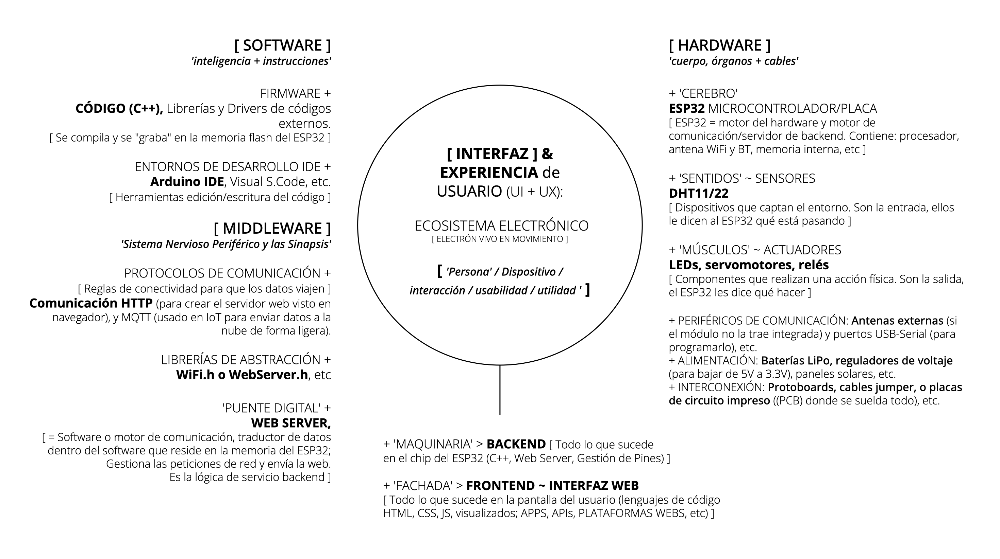

**ECOSISTEMA ELECTRÓNICO BASADO EN ESP32**:  Un ecosistema basado en ESP32 se compone de hardware (el chip ESP32, sensores, actuadores y PCB) y software (firmware, IDEs y protocolos). El hardware maneja la lógica física y conectividad RF, mientras el software gestiona la ejecución de tareas, Wi-Fi/Bluetooth y la interacción del usuario. En la **interacción entre el Hardware y Software**: El código creado en el IDE (Software) se compila y carga en la memoria del módulo ESP32 (Hardware). Este software utiliza las librerías para controlar en los microcontroladores los pines físicos GPIOs (Hardware), enviando datos a través de Wi-Fi a Webs Servers y plataforma-backend/frontend (como, Blynk IoT, Node-RED (Dashboards), etc). _[ VER LINKS DE INTERÉS ~ pie pág.]_
[+ info [ Interfaz IoT en Microcontroladores ]
]([https://](https://drive.google.com/file/d/1uoIoQ5oStyLSrF2NZlNSjfPO9Z6wg87E/view?usp=share_link))
[+ info [ Interfaz electrónica ] 
]([https://](https://www-sciencedirect-com.translate.goog/topics/computer-science/electronic-interface?_x_tr_sl=en&_x_tr_tl=es&_x_tr_hl=es&_x_tr_pto=wa))

## **HERRAMIENTAS PRÁCTICAS APLICADAS** . MT07

## INTERFACES & APPLICATIONS ~ *LATU*

En este marco, la práctica presencial en el LATU-UTEC constó de una breve sesión técnica de ensayos experimentales sencillos y analogías cotidianas, a través de una dinámica bajo la [ CONSIGNAS ](https://drive.google.com/file/d/1eX8Km33iMBBomt5oW5LipNYb0raxE06_/view?usp=share_link) siguientes: 

_❝ Diseñar e implementar una **_interfaz de control_** (software) para operar uno o más **_actuadores_** (hardware) conectados al **_ESP32_**. Cada equipo podrá elegir libremente qué actuador utilizar, por ejemplo: **_LED, servo, buzzer, relé, motor_** u otro similar trabajado en clase.❞_

### DINÁMICA 1 . **ESP32 ~ INTERFAZ USO ~ BLYNK** . Arduino ESP32 Connectivity . sketch 1

**OBJETIVO**
La dinámica 1 se focalizó en montaje de una **INTERFAZ DE USO (UI) a través de la '_BLYNK_'**(interfaz virtual de control y plataforma de software: APP + API + CLOUD), **mediante la guía asistida de la [_AI Google Gemini Web_](https://gemini.google.com/u/2/gems/view?pageId=none)** (como co-creador del sistema circuital e instrucciones para la 'movilidad energética' y transferencia de datos electrónicos): 

**_Conectar la placa ESP32 a_ _Blynk_ _y controlar un LED incorporado con conexión a la red wifi > Prender y apagar un LED integrado en el módulo microcontrolador SP32._** 

_Resolverse mediante alguna la Interfaz a elección de las siguientes opciones, o una alternativa equivalente:_
+ _Interfaz física, ej. una pantalla junto con un encoder rotativo c/ pulsador integrado_
+ _Node-RED_
+ **_Blynk_**
+ _HTML + JavaScript servido desde el propio ESP32_
+ _Cualquier otra interfaz que permita interactuar de forma clara con el sistema_

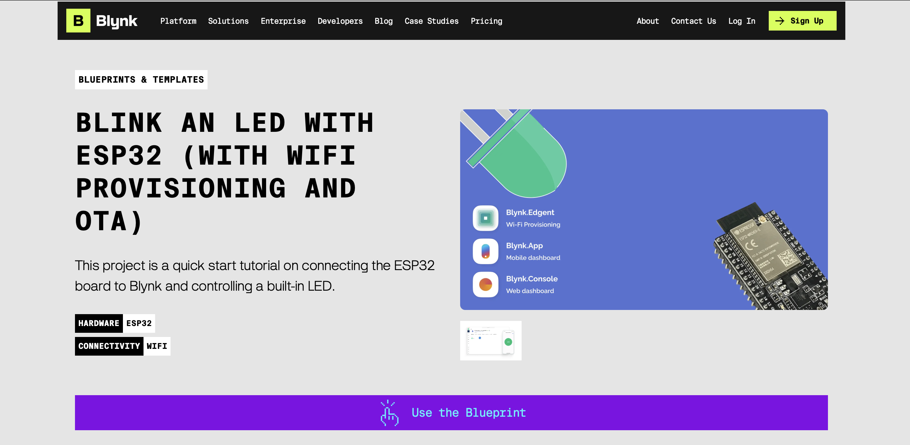

_[+ info [ BLYNK ~ blueprints/blink an led with ESP32 ]
]([https://](https://www.blynk.io/blueprints/blink-an-led-with-esp32))_ _[+ info [ BLYNK ~ BLUEPRINTS & TEMPLATES ]
]([https://](https://www.blynk.io/blueprints/blink-an-led-with-esp32))_

**PROMPT AI + PROCEDIMIENTO . #1**

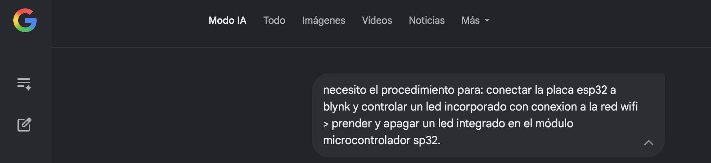

**PASO 1** ~ BLYNK WEB CONSOLE SETTING
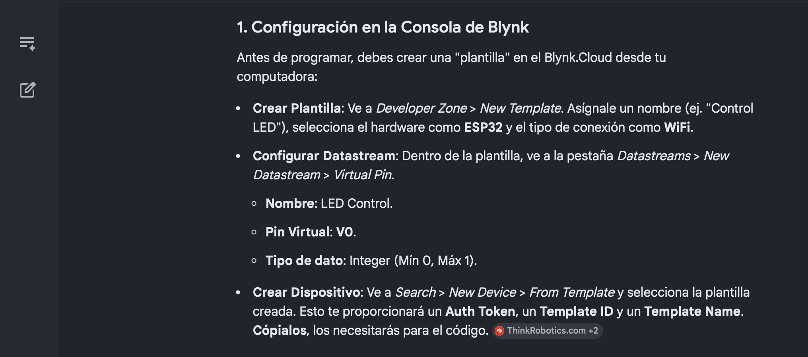

P 1.1 ~ DEVELOPER ZONE . (Blynk Web Console)
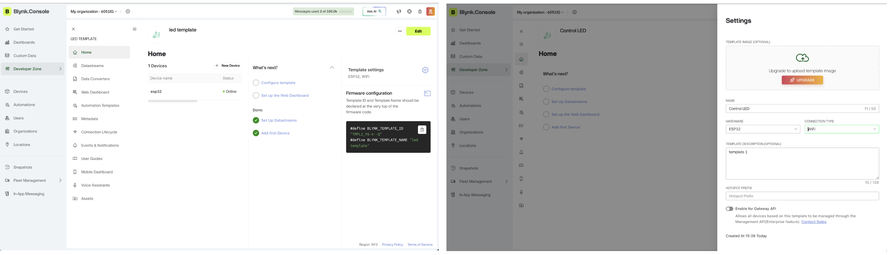

P 1.2 ~ DATASTREAM/Flujo de datos . (Blynk Web Console)
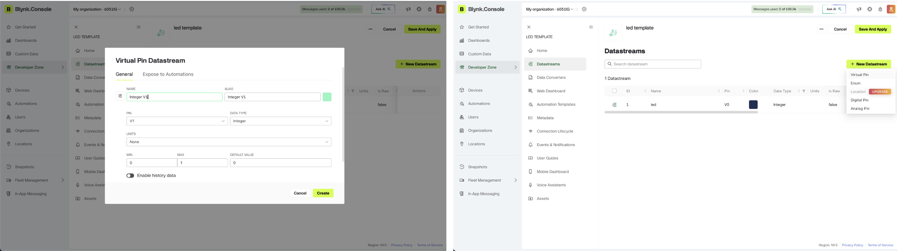

P 1.3 ~ DEVICE CREATE . (Blynk Web Console)
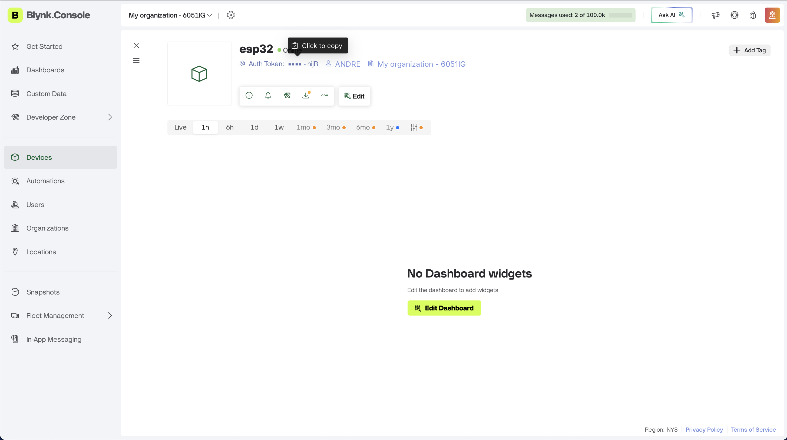

**PASO 2** ~ ARDUINO IDE SETTING UP 
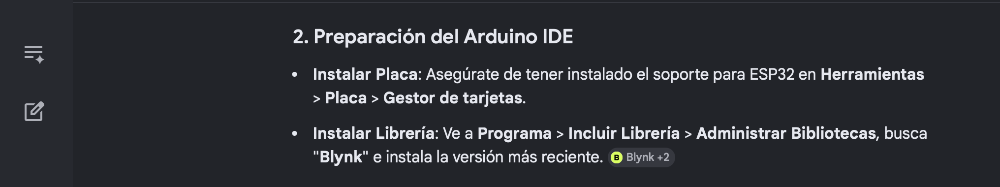

P 2.1 ~ ESP32 BOARD INSTALLED . (Arduino IDE)
P 2.2 ~ LIBRARY INSTALL . (Arduino IDE) 
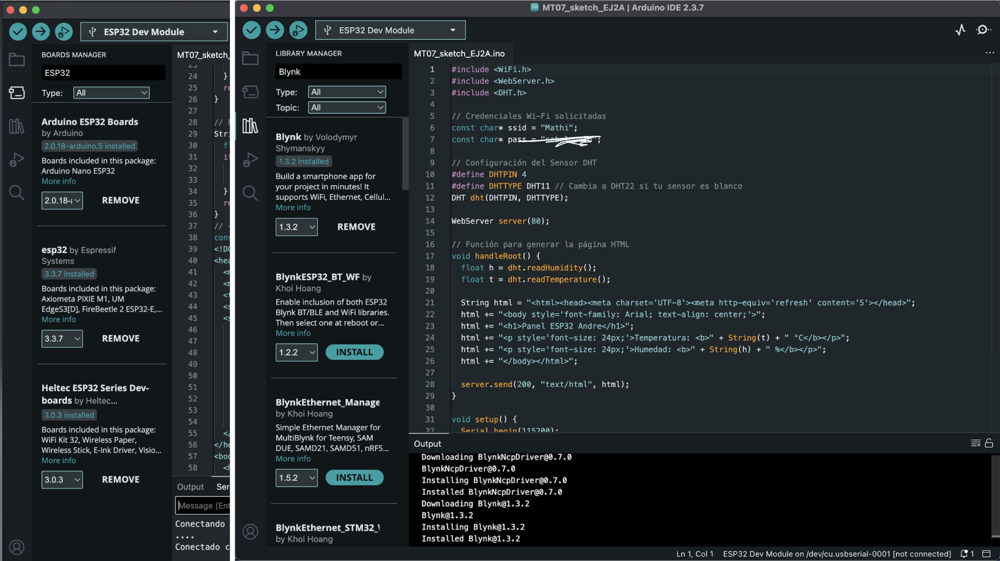

**PASO 3** ~ PROGRAMMING CODE


P 3.1 ~ CODE #1 . (Arduino IDE)
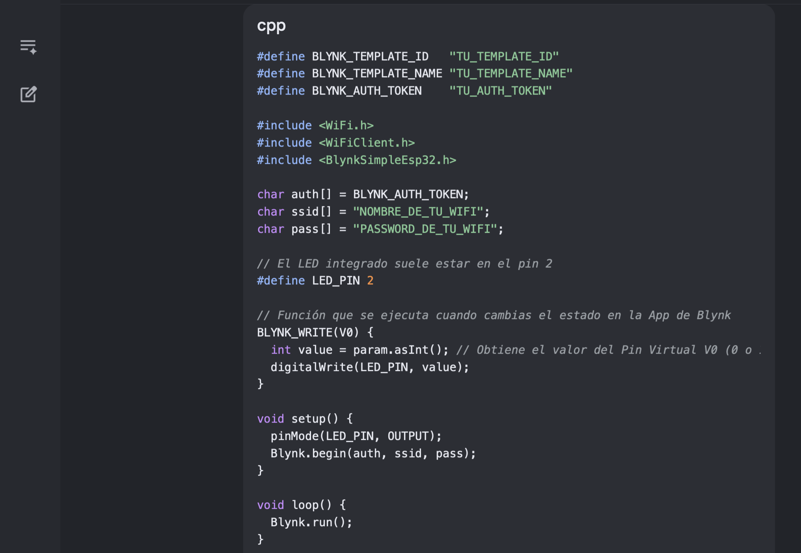

**PASO 4**  ~ APP MOBILE SETTING 
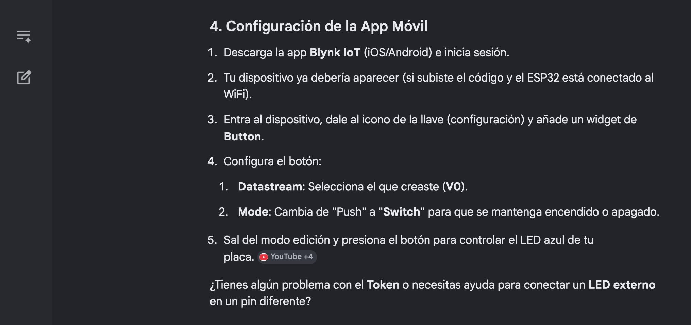

P 4.1 ~ BUTTON SETTING . (Blynk Mobile) 
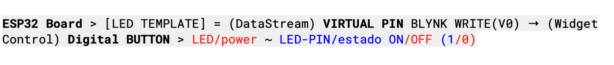

```bash
ESP32 Board > [LED TEMPLATE] = (DataStream) VIRTUAL PIN BLYNK WRITE(V0) → (Widget Control) Digital BUTTON > LED/power ~ LED-PIN/estado ON/OFF (1/0)
```


P 4.1 ~ WEB DASHBOARD . DEVICE SAVE/APPLY . (Blynk Web Console) 
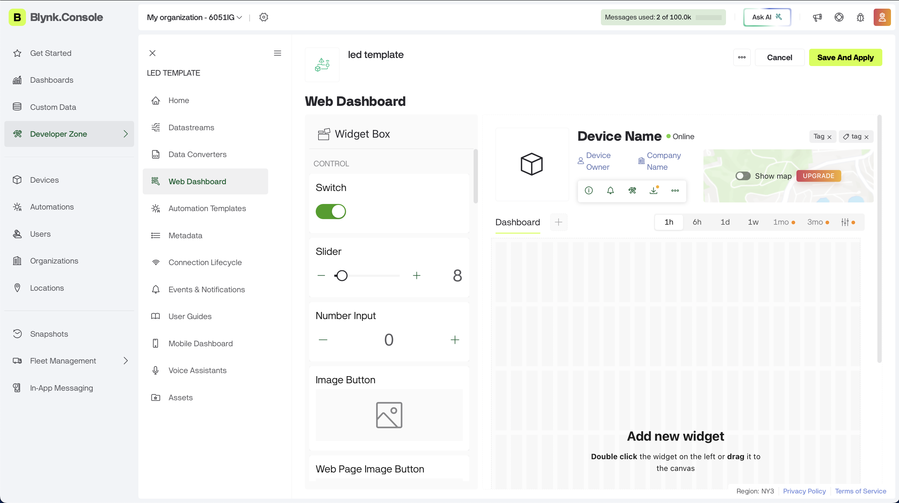


**CONEXIONES . #1**
Una vez completadas correctamente las 4 etapas del proceso, se logra la **RESPUESTA de confirmación** para la **COMUNICACIÓN DIGITAL**: transferencia de señal/dato, **expresado con el control de encendido ('SWITCH' VIRTUAL BUTTON) de leds integrados** ```LED/power vs LED-PIN/estado ON/OFF```,  a partir de la combinación exitosa de la configuración entre componentes del sistema electrónico: WI-FI network + **_(hardware)_** MICROCONTROLADOR ESP32 + **_(software)_** [ BLYNK WEB + BLYNK MOBILE + ArduinoIDE & CODE ]

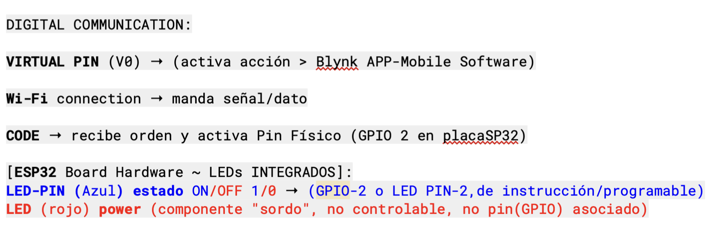

```bash
DIGITAL COMMUNICATION:

VIRTUAL PIN (V0) → (activa acción > Blynk APP-Mobile Software)

Wi-Fi connection → manda señal/dato

CODE → recibe orden y activa Pin Físico (GPIO 2 en placaSP32)

ESP32 Board Hardware ~ LEDs INTEGRADOS:

LED-PIN (Azul) estado ON/OFF 1/0 → (GPIO-2 o LED PIN-2,de instrucción/programable)

LED (Rojo) power (componente "sordo", no controlable, no pin(GPIO) asociado)
```

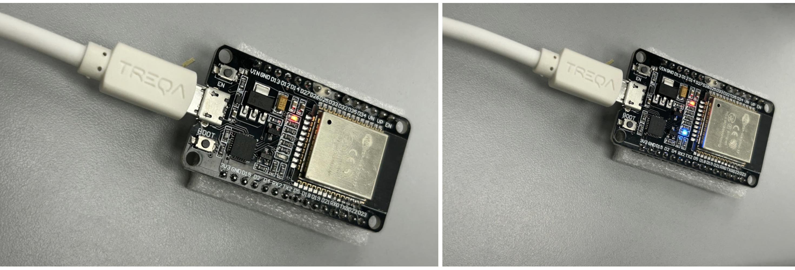

<br>


### DINÁMICA 2 . **ESP32 ~ INTERFAZ USO + ACTUADOR FÍSICO** . Arduino ESP32 Connectivity . sketch 2

**OBJETIVO**
La propuesta debe permitir que el usuario pueda enviar acciones o cambios de estado al actuador desde la interfaz elegida. Además, se debe explicar brevemente:
+ qué actuador fue seleccionado,
+ qué interfaz se utilizó,
+ cómo se comunica la interfaz con el ESP32,
+ qué acción realiza el actuador al recibir la orden.

La 2da dinámica consistió en: Generar un sistema de conectividad, ESP32 / Web Server / Sensor DATA DHT Display. Configurar el ESP32 como servidor web para monitorear variables ambientales (Humedad/Temp),  un proceso que mezcla electrónica, redes y desarrollo web básico. 


**PROMPT AI + PROCEDIMIENTO**
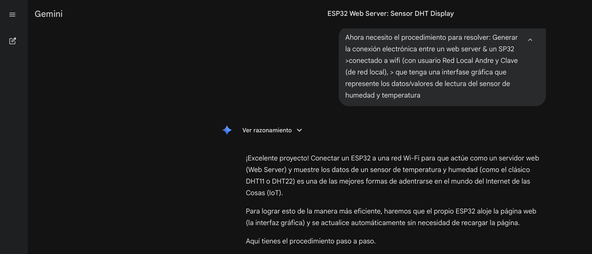

**PASO 1** ~  SENSOR DHT22 CONNECT . (Hardware)
```bash
SENSOR DHT22 (temp/hum) → Esp32 : 
(DHT) pin 3 DAT → pin D4 GPIO-4 (esp32) + 
(DHT) pin 2 VCC → 3V3 (esp32) + 
(DHT) pin 1 GND → GND (esp32)
```
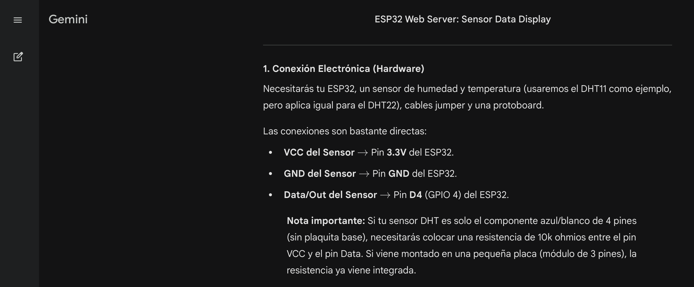

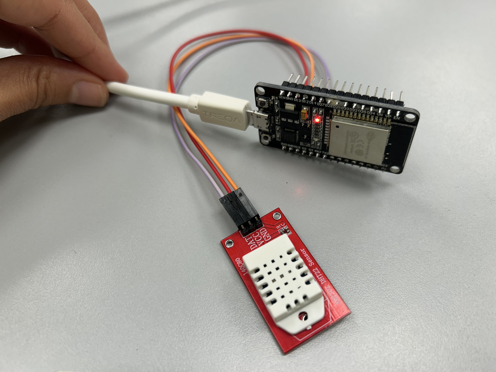
[_+ info [ Sensores DHT11 y DHT22 (con/sin PCB) ]_]([https://](https://www.makerguides.com/e/dht11-dht22-arduino-tutorial-es/))
[_+ info [ Sensor DHT22 + Resistencia ~ Tutorial ]_]([https://](https://youtu.be/olosoz7oqGc?si=Rvjklg_lL3SjukEl))
[_+ info [ PROTOBOARD y código resistencias ]_]([https://](https://youtu.be/5npwcVLtcl0?si=mIRjhWsObOjCPU7t))

**PASO 2** ~ ARDUINO-IDE SETTING . (Software)

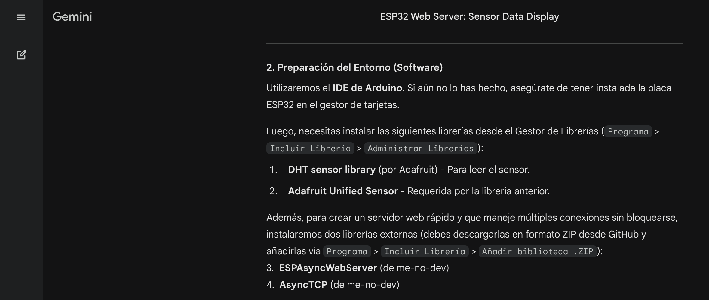


P 2.1 ~ BOARD ESP32 INSTALL . (Arduino IDE)

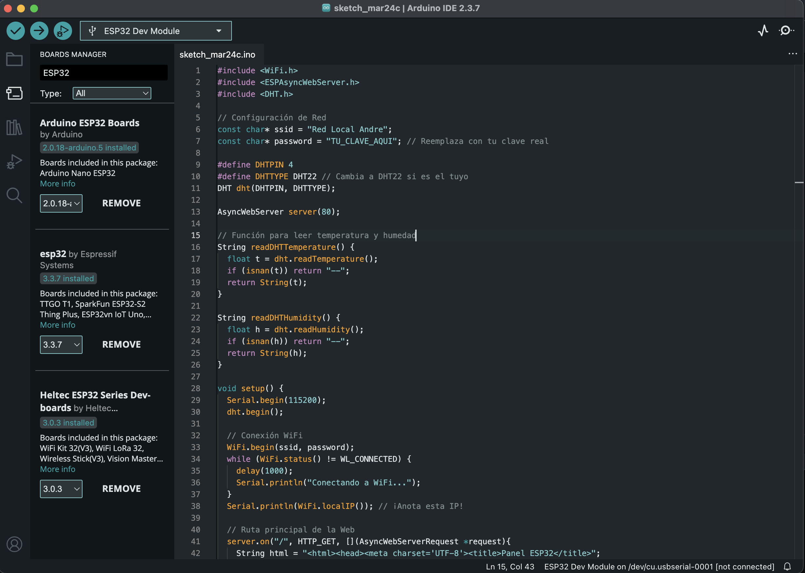


Según las indicaciones de conexión del circuito y características descritas sobre el Sensor DHT, mi Sensor DHT (con placa base PCB [*]), no necesita resistencia al estar integrada. 

[*] En el contexto de los sensores DHT (DHT11/DHT22), PCB se refiere a la Printed Circuit Board (Placa de Circuito Impreso) en la que viene montado el sensor. Esta PCB facilita su uso al integrar resistencias de pull-up (generalmente 5kΩ o 10kΩ) y pines soldados, convirtiendo el sensor de 4 pines a un módulo de 3 pines (VCC, GND, Datos) más seguro y sencillo para conectar a Arduino, ESP8266 o ESP32.

P 2.2 ~ LIBRARY INSTALL . (Arduino IDE)

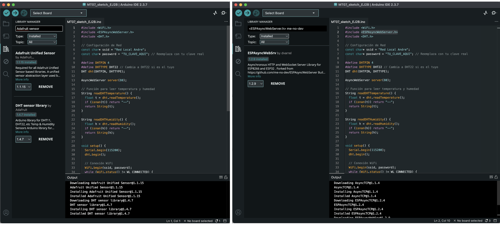
[_+ info LIBRARY INSTALL ~ ESP32 - DHT - WEBSERVER Connectivity_]([https://](https://www.youtube.com/watch?v=dE5C5OBfkIA))

**PASO 3** ~ CODE + WiFi CONNECT PROCESS . (Software/Backend) 
Configurar la conectividad WiFi del sistema electrónico para activar el (paso 4), Web Server WiFi y la comunicación efectiva del flujo de datos (entre Software y Hardware), en el código (_Firmware y Web_), las credenciales (id. user + password) para mi red local. 

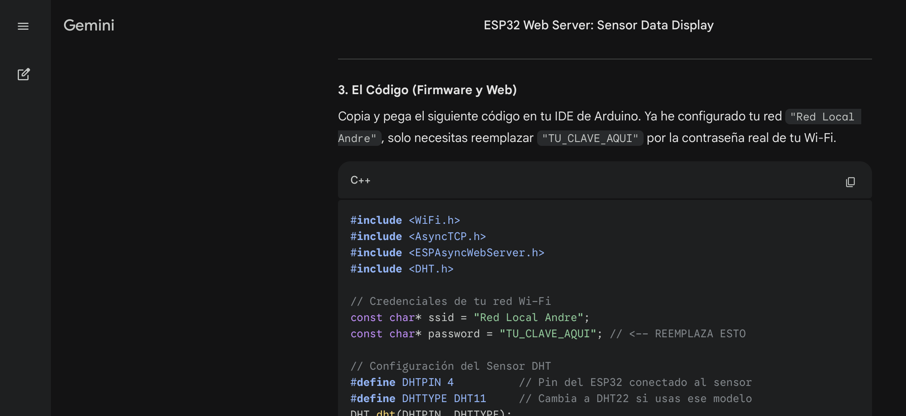
[ _+ info CODE + WiFi ~ ESP32 - DHT - WEBSERVER Connectivity_ ]([https://](https://gemini.google.com/u/2/app/6f9c541196f5c5fa?utm_source=app_launcher&utm_medium=owned&utm_campaign=base_all&pageId=none))

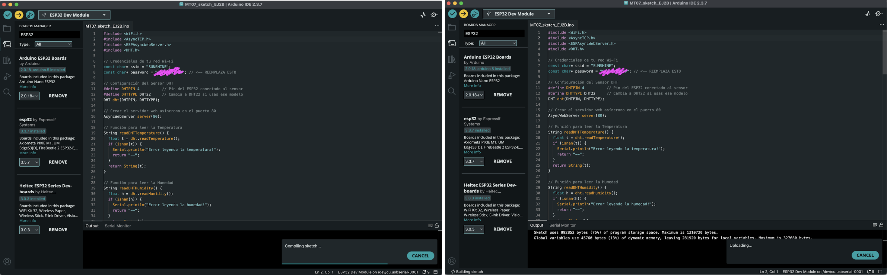
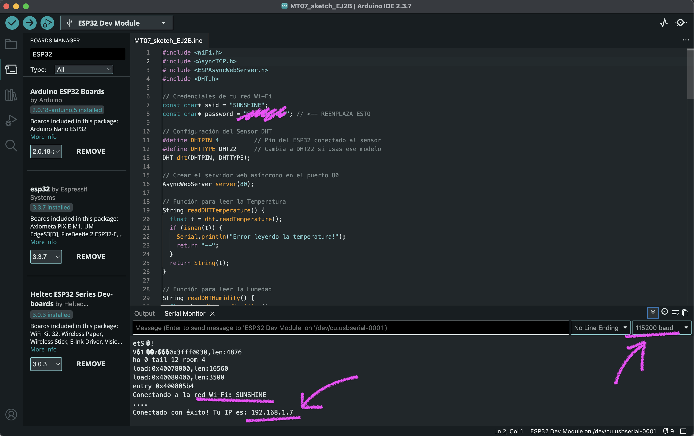
[ Figs.: Compiling + Uploading Sketch + Connected WiFi - IP ] 


**PASO 4** ~ GRAPHICAL UI DISPLAY & Web Server - WiFi . (Software/Frontend + Backend)

Activar Web Server WiFi (a través de la IP generada) para el sistema del circuito electrónico, vinculando sus componentes; Software-Backend [ Code arduino IDE + Red WiFi ] + Hardware [ ESP32 + DHT + PC ], para la visualización de la Interfaz Visual de Usuario (UI-Frontend).


Para visualizar la **interfaz gráfica** de usuario **(UI Visual/Canvas - Frontend)**, es decir el resultado visual de instrucciones (código/Script - Backend) que genera el microcontrolador ESP32, el dispositivo, "se convierte en un mini servidor" de internet (Web Server) privado dentro de "casa” a través del cual veremos la interfaz con el flujo de datos de temp. y hum. actualizados en tiempo real. Entonces, el ESP32 que actúa como un Webservidor que envía código (web) HTML al navegador, habilita el siguiente flujo de datos:

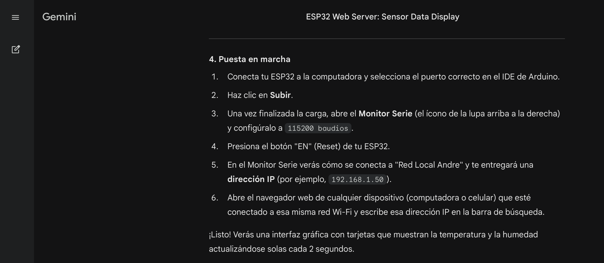

1. LECTURA: El ESP32 lee los valores de ```dht. readTemperature() y dht. readHumidity().```
2. SERVIDOR: Crea una instancia (servicio) de WiFiServer = Server(80).
3. INTERFAZ GRÁFICA de USUARIO (UI) ```<canvas>``` : El código debe generar un documento HTML que incluya los valores. Para que sea "gráfica" y se actualice sola, puedo usar:
**Meta Refresh**: Para recargar la página automáticamente cada pocos segundos.
**CSS/Gráficos**: Se puede incluir/incrustar _estilos CSS_ directamente dentro del mismo archivo HTML utilizando las etiquetas ```<style> y </style>```(ubicadas en la sección ```<head>```), para crear tarjetas visuales o usar librerías como ThingSpeak (para crear una nube con gráficas avanzadas).

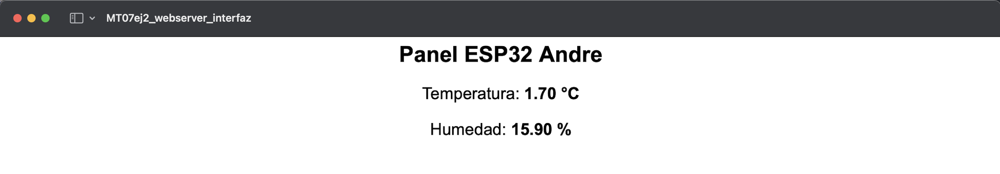
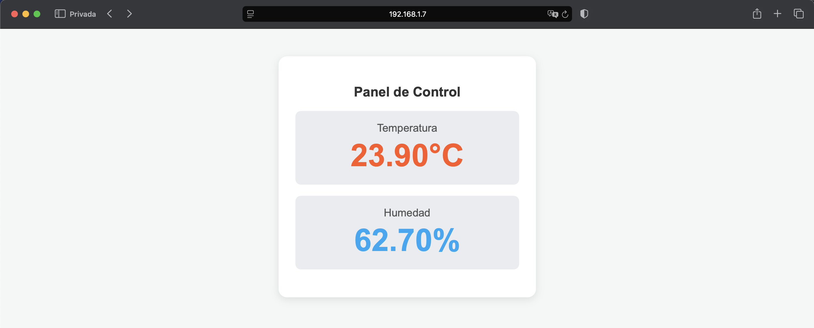

**PASO 5** ~ GRAPHICAL UI DISPLAY INTERACTION (Software/Frontend)

Ahora que la lógica "backend" (la comunicación de red y la lectura del sensor) funciona a la perfección, podemos enfocarnos 100% en el "frontend" (la interfaz que ve e interactúa el usuario).
Explorando distintas versiones de Código y sus variables de instrucciones (script/Backend)para enriquecer el Canvas Visual  (UI "Frontend”), identifiqué dos versiones de INTERFAZ GRÁFICA DE USO posibles:  ```1.INTERFAZ GRÁFICA (HTML + CSS + JS NATIVO Y OFFLINE) y 2.INTERFAZ GRÁFICA (HTML + CSS + JS CON HIGHCHARTS).```

**1. // --- INTERFAZ GRÁFICA (HTML + CSS + JS NATIVO Y OFFLINE) —--**

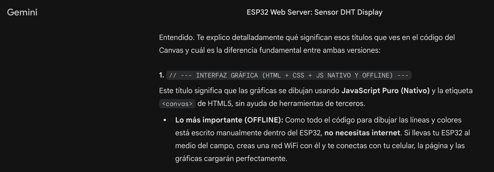

**UI VERSIÓN NATIVA/OFFLINE**: En este caso, modifiqué (por partes) algunas variables que necesitaba para enriquecer el código e ir entendiendo cómo se comunican las distintas partes del programa de código de instrucciones (el "Front-end" o diseño, y el "Back-end" o cerebro) y así obtuve **distintas variantes de UI enriquecidas**:

**A . UI enriquecida básica** (offline): Apliqué un cambio visual de estilo tipo "Dark Mode" con cajas de sombras, diseño adaptable (responsive) a otros formatos de dispositivos (ej. Mobile).

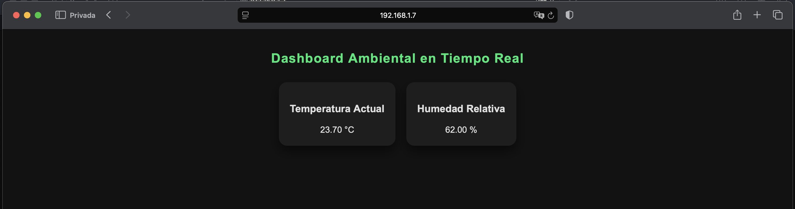

**CÓDIGO** NUEVO ~ INTERFAZ Web A
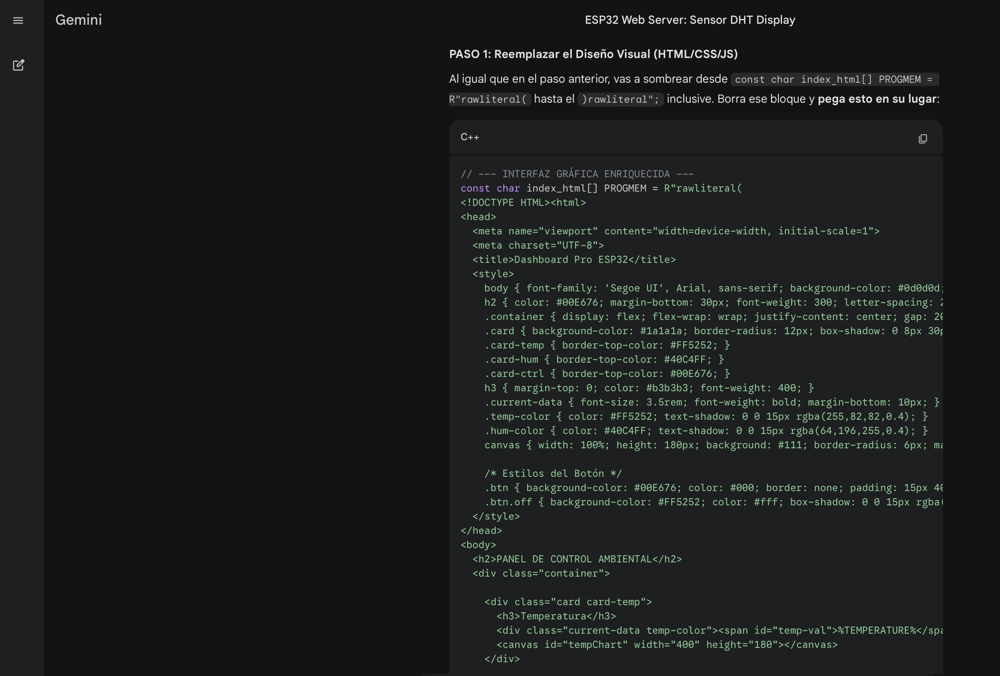


**B. UI enriquecida interactiva** (offline): En este caso para hacer la interfaz más interactiva, añadí gráficas en tiempo real que dibujaran el historial reciente de temperatura y humedad, aplicando un cambio visual de estilo tipo "Dark Mode". Este resultado de interfaz interactiva es una fusión entre ambas versiones básicas combinando entre sí distintos componentes variables de interés de ambos códigos.

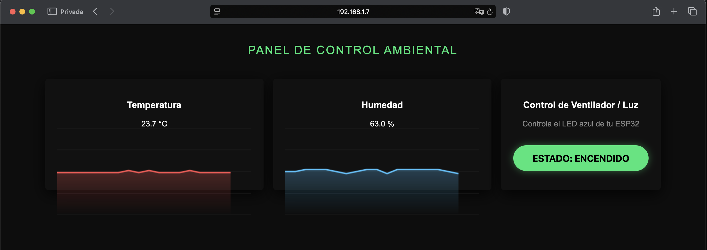
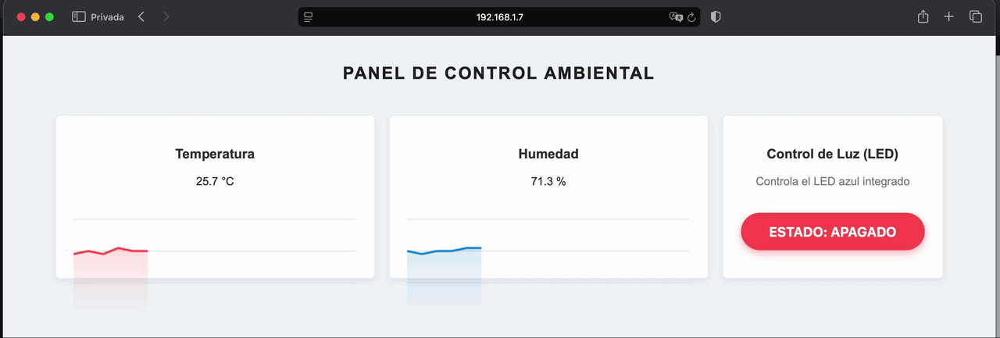

**CONEXIÓN** ~ **Hardware + WebServer** para última versión de interfaz enriquecida.


**CÓDIGO** NUEVO ~ INTERFAZ Web B 
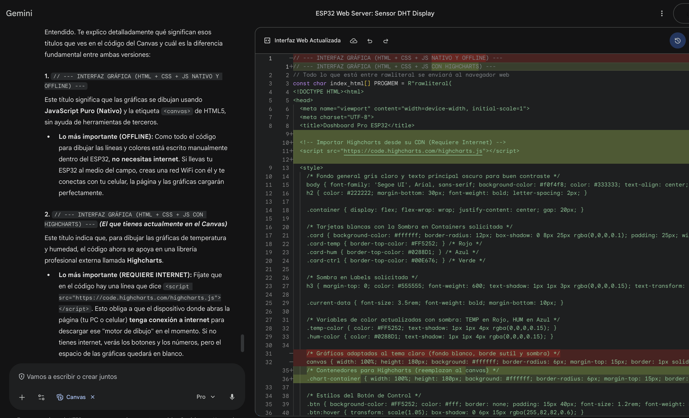

**Componentes del código redefinidos para UI (interfaz B):**

**UI_1 ~ Code Canvas:**
Agregué Gráficas ilustrativas que expresen de forma dinámica el flujo de datos variable Temp/Hum. La inclusión y funcionamiento de los gráficos se divide exactamente en tres bloques clave. 

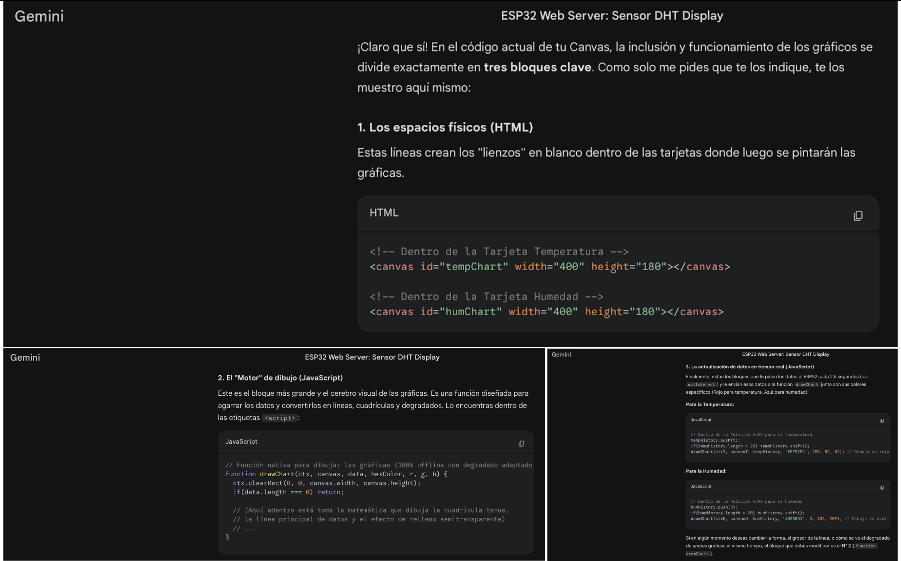


**UI_2 ~ Code Botón interactivo:** 
Agregué botón interactivo (Tarjeta control LED) + la función clic que envía la orden al ESP32 al hacer clic en botón on/off luz led azul integrado en la ESP32.
Agregar el "Cerebro" del botón al ESP32 >  LED PIN Sensor: definición + configuración + ruta web recepción clic LED on/off. 

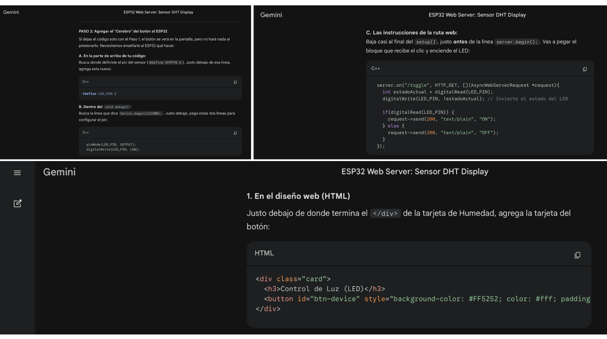

**UI_3 ~ Code Iteración flujo de datos Hum/Temp:** 
Cambié la solicitud de flujo de datos, variando la velocidad de consultas de flujo de datos de TEMP y HUM de 2000 a 2500, para que las gráficas visualicen con agilidad el flujo de datos variable.

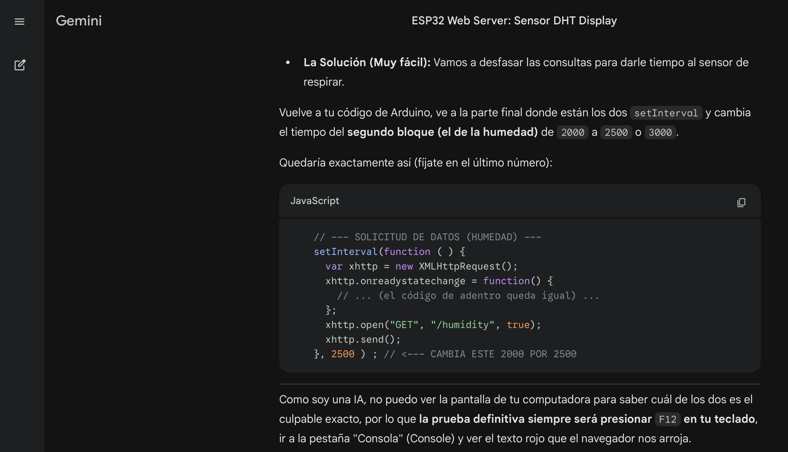


**2.// --- INTERFAZ GRÁFICA (HTML + CSS + JS CON HIGHCHARTS) ---**


**UI VERSIÓN HIGHCHARTS**: En este caso para hacer la interfaz más avanzada, para las gráficas se podría usar una **_librería Highcharts_**, gratuita profesional externa al ESP32 (el código no está guardado dentro de la memoria del ES32). En la versión Highcharts la librería es muy potente y ofrece un paquete de código inmenso, pesado y muy avanzado creado por otra empresa. Cómo es demasiado grande para guardarlo cómodamente dentro de la pequeña memoria del ESP32, ese código "vive" en servidores en Internet. [_+ info [ Librería JavaScript HIGHCHARTS ]_]([https://](https://www.highcharts.com/))

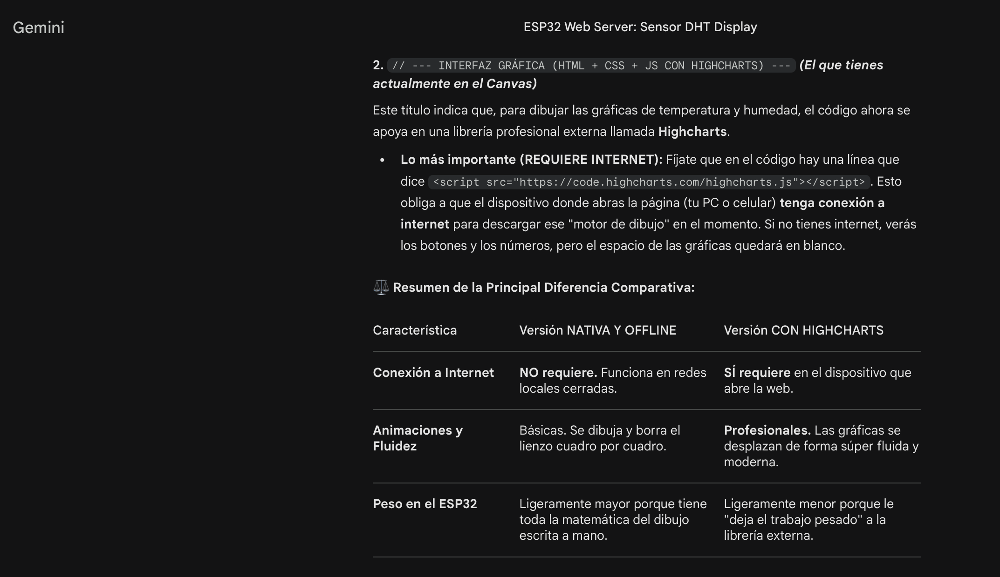

**CÓDIGO NUEVO** ~ INTERFAZ Web C HIGHCHARTS
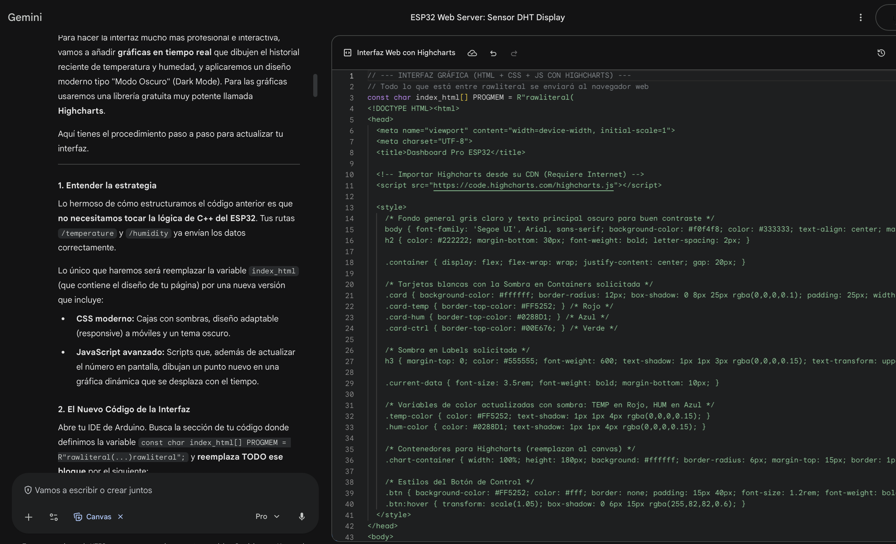


____


## **LINKS DE INTERÉS** . MT07


ESP32 
https://youtu.be/X4movA5xtBU?si=yCFi-8Lkn0yUPTqu


SENSORES  DHT11 y DHT22 (con/sin PCB) 
https://www.makerguides.com/es/dht11-dht22-arduino-tutorial-es/


SENSOR DHT22 + Resistencia ~ Tutorial 
https://youtu.be/olosoz7oqGc?si=Rvjklg_lL3SjukEl


TARJETA PERFORADA 
https://es.wikipedia.org/wiki/Tarjeta_perforada


INTERFAZ ELECTRÓNICA 
https://www-sciencedirect-com.translate.goog/topics/computer-science/electronic-interface?_x_tr_sl=en&_x_tr_tl=es&_x_tr_hl=es&_x_tr_pto=wa


INTERFAZ / MICROCONTROLADORES 
https://es.scribd.com/document/908956032/Apuntes-Micros-Part-3


INTERFAZ / PROTOCOLOS
https://www.tme.eu/es/news/library-articles/page/60826/interfaces-y-protocolos-de-comunicacion-populares/


SENSORES ELECTRONICOS / MOVIMIENTO 

+ https://www.electronica.uy/?s=sensor+inercial&post_type=product&dgwt_wcas=1
+ https://www.adafruit.com/product/2472
+ https://www.electronica.uy/producto/robotica/robotica-robotica/modulo-9-ejes-imu-mpu9250/
+ https://kalmanfilter.net/ES/default_es.aspx
+ https://docs.arduino.cc/libraries/kalman-filter-library/

__

HIGHCHARTS
https://www.highcharts.com/

LOVABLE 
https://lovable.dev/

P5JS
https://p5js.org/es/

WOKWI
https://wokwi.com/projects/454858670976591873
https://wokwi.com/

NODE-RED ~ DASHBOARD
https://aprendiendoarduino.wordpress.com/2020/03/10/dashboard-en-node-red/

Node-red - que es?
https://nodered-org.translate.goog/?_x_tr_sl=en&_x_tr_tl=es&_x_tr_hl=es&_x_tr_pto=tc

Node red - install
https://nodered.org/docs/faq/interacting-with-arduino#installation
