---
hide:
    - toc
---

# **MT** 08

## **CONTROL NUMÉRICO COMPUTARIZADO (CNC)**
*TECNOLOGÍA Y FABRICACIÓN*

 
 
_____

Este Módulo Técnico 08 se enfocó en la tecnología de fabricación sustractiva, manufactura CAD-CAM aplicada al 'Control numérico computarizado ~ CNC', a partir de un abordaje mayormente teórico-digital antes que práctico, dado el tiempo destinado disponible para una tecnología de fabricación exigente en tiempo y técnica de maquinado y que demandan ineludiblemente amplia presencialidad real de práctica para lograr ensayos y errores iterativo reales.

El proceso curricular pautado para la fabricación tecnológica en CNC se centró en el uso de Fusion 360 CAM ~ Módulo Fabricación (sección técnica digital CAD de seteo y simulación del maquinado CNC dentro del software), para el setting y generación del archivo CAM en router CNC. 

Este potente módulo dentro de Fusion 360, nos permite realizar todo tipo de operaciones de mecanizado y guardarlas en un código G (archivo CAM). El código G para poder operar el Router CNC es de extensión .nc . Dentro de éste módulo exploré las principales operaciones de la Interfaz para lograr realizar un archivo .nc

 
## **HERRAMIENTAS PRÁCTICAS TECH APLICADAS . MT08**

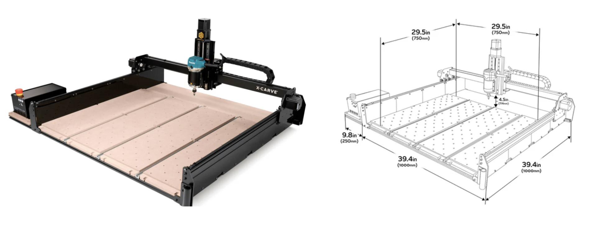

[+info [ FABLabA Durazno ~ Router CNC XCarve ]]([https://](https://www.inventables.com/products/x-carve-1?srsltid=AfmBOor3yNgIeon-ZGiJfPWZfAEsEu29VkrGMSuf_JFgEA4q0Ax-fWx_))

En los laboratorios (Lab-A UTEC), trabajamos con el [_Router CNC X-CARVE_](https://). Los **Router CNC de 3 ejes**, son los equipos más comunes y accesibles, tanto en costo como en operación y programación, son maquinas simples, económicas y de bajo mantenimiento. Se caracterizan por ser máquinas ideales para trabajos planos o con geometrías relativamente sencillas. Se componen de tres ejes lineales: X, Y y Z. Permiten realizar cortes, tallados y grabados sobre placas y bloques de material, trabajando principalmente en dirección vertical respecto a la mesa. **Dimensiones de trabajo** (mesa de trabajo): Eje X 750 mm, Eje Y 750 mm, Eje Z 114 mm.

 
### DISEÑO MODELO 3D ~ CNC 1

En este proceso se exploraron dos caminos experimentales para el maquinado CNC, uno propio (CNC 1), y otro curricular (CNC 2). Para el CNC 1, se proyectó un modelo 3D como una potencial pieza de prototipo afin al proyecto final de posgrado. La generación de esta pieza tiene el objetivo de desafiarme e ir más allá del resultado volumétrico plano CNC y explotar el potencial del CNC de 3 ejes XYZ, logrando un resultado tridimensional y curvilíneo con énfasis en el eje Z sobre el material maquinado. El modelo tridimensional proyectado fue el siguiente, un Toroide de sección 20 mm de diámetro:

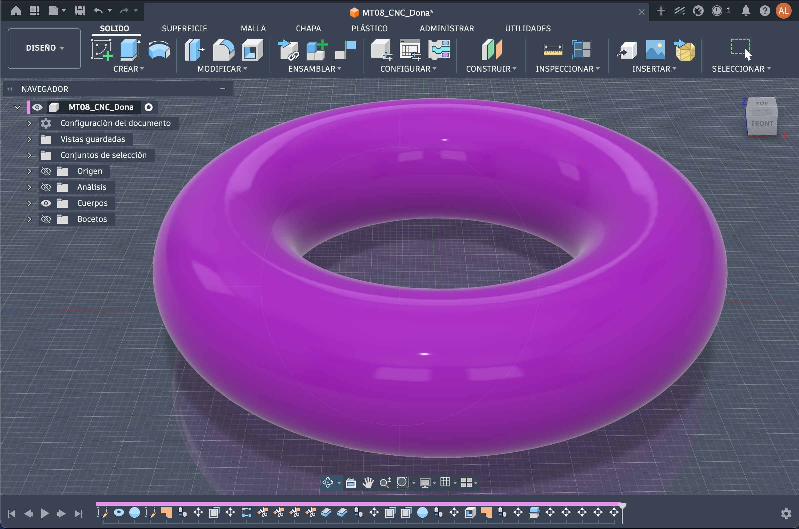
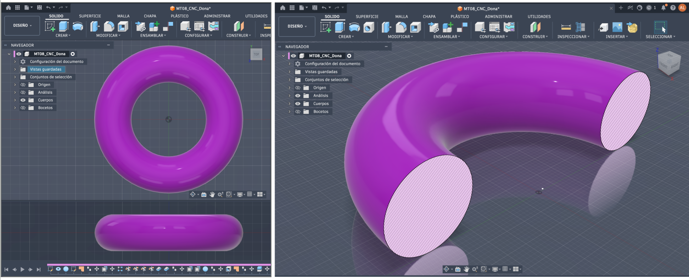

Dado que la CNC es de 3 ejes, solo permite un trabajo plano de maquinado, obliga a adaptar el objetivo tridimensional original hacia un proceso que exige un proceso de maquinado mayor en cantidad de pasos a diferencia de un CNC de 4 o 5 ejes. 
El proceso de maquinado requiere, primero generar un Toroide de 24 mm (sección) y dividir el Toroide modelado en 2 mitades longitudinales (luego al finalizar el maquinado CNC esas ½ se unirán en un único volumen final). Segundo, **(opción A)** maquinar/facetar el volúmen ½ Toroide en capas/curvas de nivel regulares y concéntricas, para luego desbastar por completo las aristas prominentes que alisarán la superficie curvilínea u **(opción B)** maquinar el volúmen, ½ Toroide; como se ilustra los modelos a continuación:

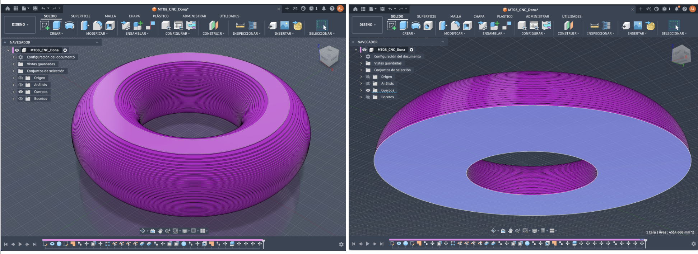
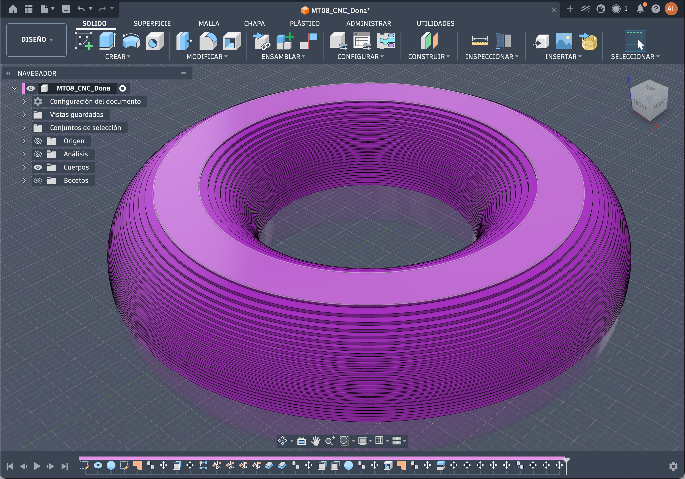
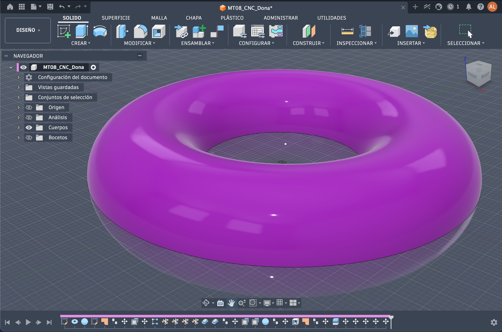
 

#### **EASEL ~ CNC 1** . Software CAM

Frente a estas dos opciones de superficie (facetada o lisa) se deben setear distintas variables en el Easel software CAM, que incidirán, en tiempo y calidad del maquinado (cualidades de desbaste, acabado, etc).
Dicho setting y maquinado lo he simulado virtualmente (free version) sin poder realizar la exploración de ensayo y error por el tiempo de uso práctico que demanda la tecnología CNC. Este trabajo de maquinado ameritaba Dado el escaso tiempo presencial curricular disponible en LabA, el tiempo de maquinado de cada trabajo, la no disponibilidad de maquinaria para abarcar varios otros trabajos en simultáneos, el setting particular que requiere entender la configuración CAM para cada pieza a maquinar (y en este caso el desafío de un maquinado tridimensional), afectó el maquinar/cortar la pieza volumétrica. Entre estas condiciones, ni el apoyo del equipo docente ni yo (en calidad de aprendiz) pudimos resolver este desafío. Quedó pendiente el corte tangible de la pieza. 

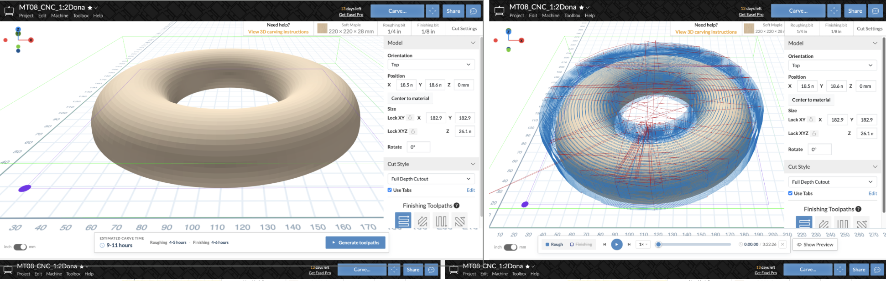
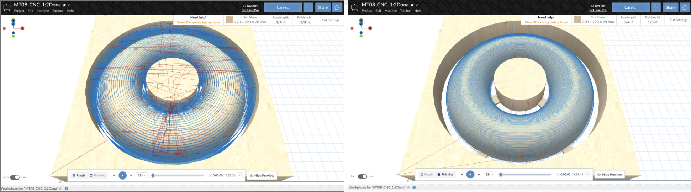
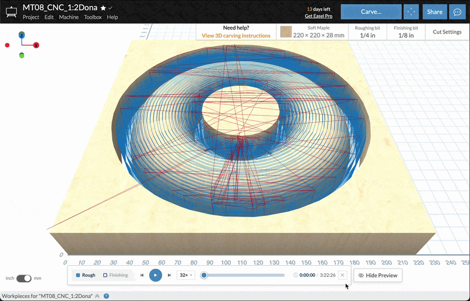
[🎬  [ Easel ~ complete simulate preview ]]([https://](https://drive.google.com/file/d/1WNF6XljBgtEXtb9I639idSyjfXqz71p3/view?usp=share_link))

 
### SETTING MODELO 3D ~ CNC 2

En este proceso a partir de una guía pautada se realizó la preparación del siguiente modelo 3D preexistente y correspondiente archivo para prototipar en router CNC. Esto implicó ampliar el conocimiento, enfrenar un nuevo desafío y adentrarse en una nueva sección de la Interfaz de Fusion 360: **módulo de FABRICACIÓN** y sus diversas operaciones secuenciales de mecanizado. 
 
El material base utilizado fue una tabla de (200 x 200 x 10) mm de madera multilaminada. 

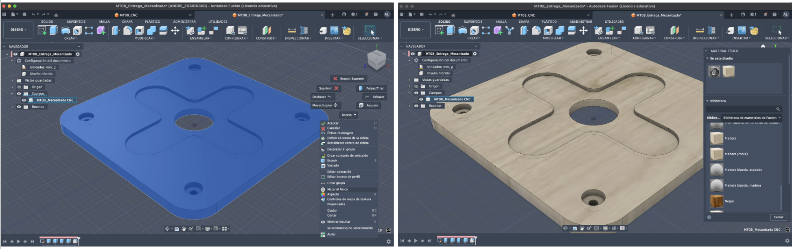

Descargamos el archivo5.f3d: [MODELO 3D](https://drive.google.com/file/d/1ZYWWS8ZjT-IKuC65fll52j4DFn_RKEVR/view?usp=sharing) > Lo abrimos en FUSION 360. Dentro de la interfaz de Fusion 360 ingresamos al **módulo de FABRICACIÓN**:

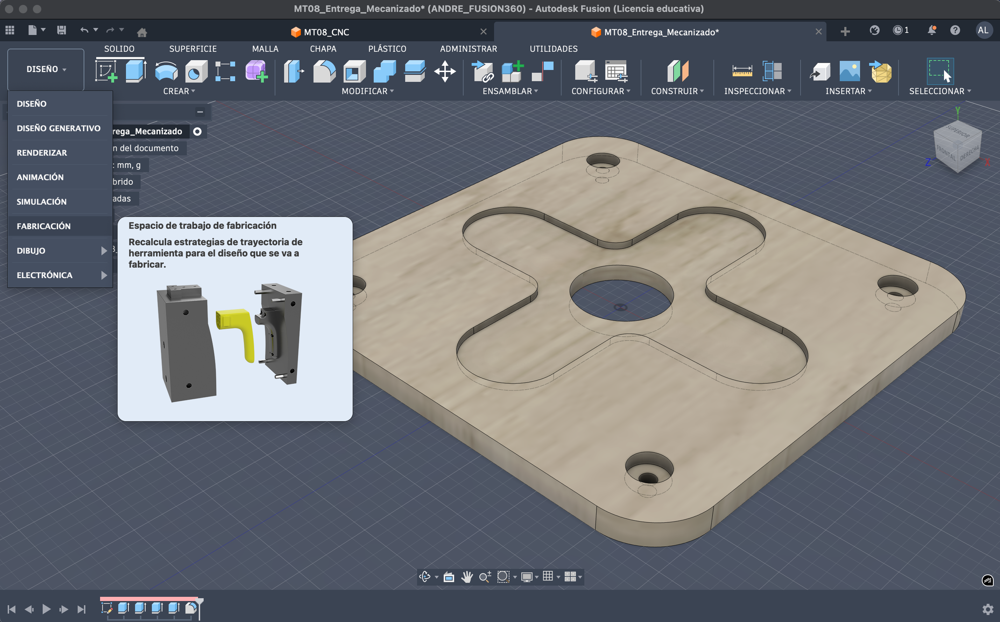

Una vez dentro del módulo FABRICACIÓN, **configuramos la máquina** a utilizar como fresadora (dentro de la galería de máquinas disponibles, y seteamos como máquina definida para el trabajo), como se indica a continuación:

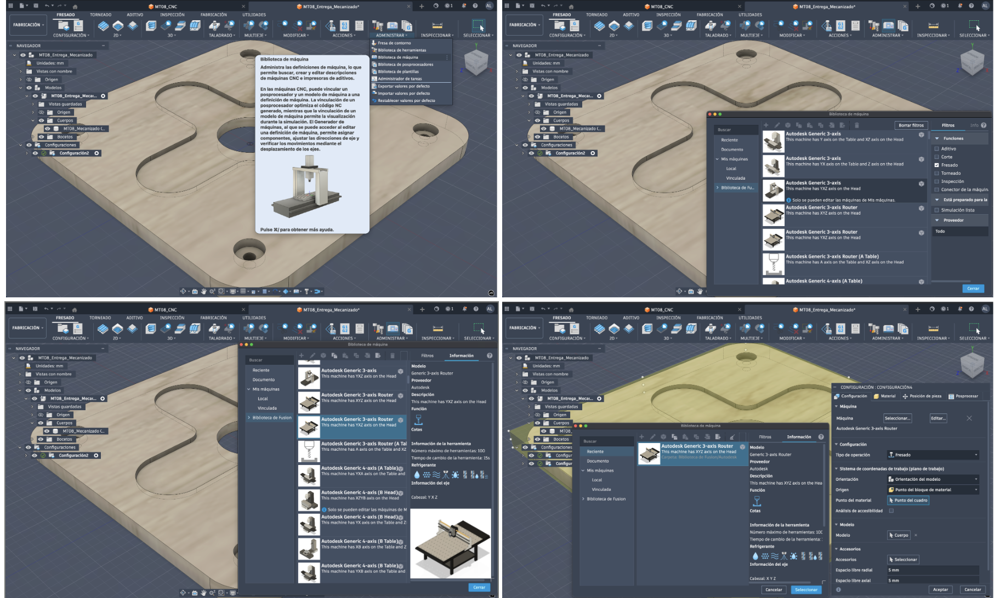

Utilizando los menúes **'2D’** las estrategias/operaciones de mecanizado aplicadas fueron: 
**2D CAJERAS + TALADRADO + CONTORNEADO**, y para cada una se replicó una extensa configuración de parámetros y etapas secuenciales ineludibles para la factibilidad del mecanizado, ilustradas a continuación:

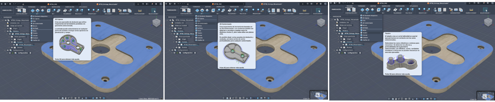

Para cada una de las operaciones, se **configuraron los EJES** y el **Punto de Origen** (debe quedar como se detalla en la imagen para que quede lo más cerca posible al origen de la máquina _“Router CNC X-CARVE”_). 

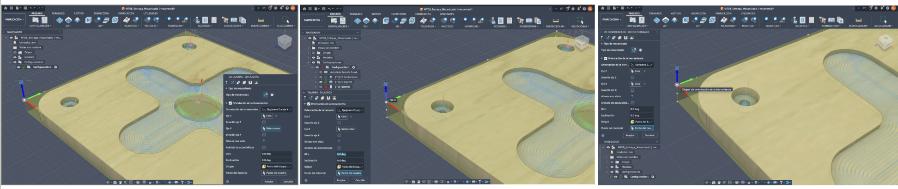
 

#### **2D CAJERAS** . *Módulo de Fabricación*
Una vez editado el origen del modelo y el punto del material  como se muestra en la imágen, seleccionamos el área a mecanizar mediante CAJERA 2D. 
Se seleccionó (para cada operación de mecanizado) la siguiente **HERRAMIENTA** de maquinado del menú de fresas: 

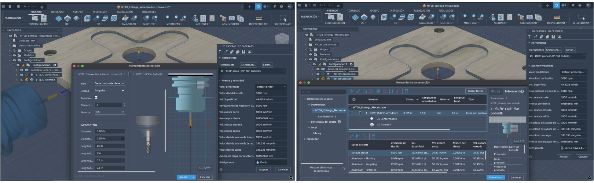
 

**[ 2D CAJERAS ]  . _GEOMETRÍA ~ CADENA CERRADA_**

El segundo paso para configurar el material es entrar a la solapa ¨Geometría¨, donde  seleccionamos  la opción de _CADENA CERRADA_.

Luego debemos seleccionar la sección que queremos mecanizar mediante la estrategia de CAJERAS 2D. En este ejemplo, vamos a seleccionar el círculo central para realizar éste mecanizado. 

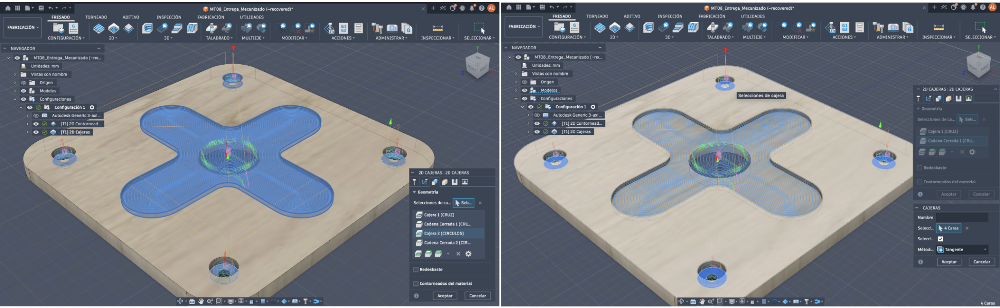

Realizados los pasos previos, quedarán configurado: el material, la orientación de la herramienta y la selección para la cajera 2D
 

**[ 2D CAJERAS ] . _ALTURAS_**

A continuación vamos a configurar las alturas de seguridad, con esto vamos a asegurar el desplazamiento del husillo junto con la fresa a lo largo de la placa de material seleccionada para el trabajo. Al tener que descender para realizar los movimientos de fresado, es necesario colocar una altura prudente para que el husillo (y la herramienta que posee) no colisionen con ningún objeto en la mesa de trabajo, ni con el propio material a fresar.

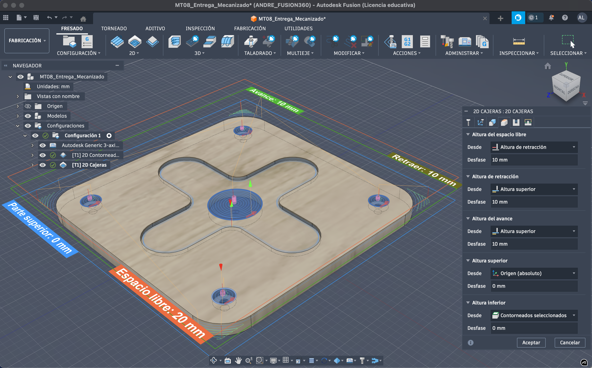

En este menú tenemos opción de configurar las siguientes variables de altura:

**Altura del espacio libre**: es la distancia  de seguridad que va aplicarse desde la parte superior del material hasta la punta de la herramienta al momento de desplazarse desde el punto de inicio hasta comenzar a realizar las operaciones de fresado.

**Altura de retracción**: es la distancia  de seguridad que va aplicarse desde la parte superior del material hasta la punta de la herramienta al momento de desplazarse entre las operaciones de fresado (retracción de la herramienta antes de comenzar el siguiente comando de fresado).

**Altura del avance**: es la distancia  de seguridad que va aplicarse desde la parte superior del material hasta la punta de la herramienta al momento de desplazarse entre las operaciones de fresado (avance de la herramienta antes de comenzar el siguiente comando de fresado).

**Altura Superior**: es la distancia  desde la cual se van a aplicar las alturas anteriormente mencionadas. Se recomienda para un cálculo simple, colocar 0 que es igual  a la superficie superior del material a mecanizar. 

**Altura Inferior**: es la distancia desde la cual se van a aplicar las alturas anteriormente mencionadas. Se recomienda para un cálculo simple, colocar 0 que es igual  a la superficie superior del material a mecanizar. De este modo, evitaremos confusiones en las alturas del material que afecten las alturas de seguridad.

El valor sugerido a colocar en las 3 alturas es de 5 a 10 mm. Con esta distancia nos aseguramos de no colisionar con ningún objeto ni parte del modelo a mecanizar, preservando la fresa y el trabajo. Cabe destacar que cuánto más altura se coloca, más demora en realizarse el trabajo.  En caso de utilizar FIJACIONES EXTRA de altura Específica, repasar la altura máxima de dichos elementos de fijación y sumarla a la medida sugerida. Para no equivocarnos y mezclar los valores de las alturas desde el punto donde son tomadas, colocar siempre desde ALTURA SUPERIOR.

 

**[ 2D CAJERAS ] . _PASADAS_**

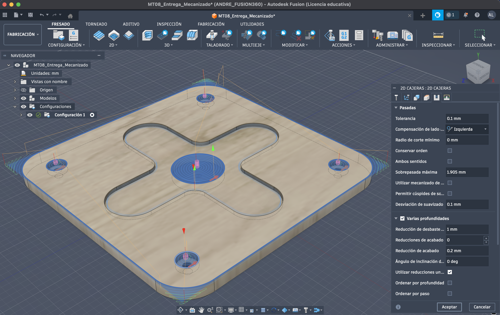

El menú _PASADAS_, permite controlar si queremos mecanizar desde la superficie superior del modelo hasta la profundidad indicada en una o varias pasadas. Dependiendo de la dureza del material, el diámetro de la fresa y la velocidad de la operación, podemos precisar realizar la extracción del material en varias pasadas.
En esta sección, centralizamos en la solapa **¨Varias Profundidades¨** del menú _PASADAS_.

El único valor que vamos a modificar para tener control sobre las pasadas en profundidad va a ser la **¨reducción de desbaste¨**. En este ejemplo, en el campo  se indicó 1 mm de a vez, significa que la fresa va  a bajar en **¨escalones¨** de 1mm hasta alcanzar la profundidad deseada. El resto de los parámetros no se modificaron.

**Multi Ejes**: Este menú no va a ser seleccionado, ni modificado, dado que la máquina de este ejemplo es de 3 ejes.

**CONEXIONES o TABS**: _“Utilizarlas en el corte final para evitar que la pieza se desprenda antes de terminar la última pasada de corte.”_ . Este menú "_Conexiones"_, no va a ser seleccionado,ni modificado , dado que en las operaciones de  CAJERAS 2D NO es necesario colocar conexiones para evitar el desprendimiento de la pieza.

 

#### **TALADRO** . *Módulo de Fabricación*

Se seleccionó (para cada operación de mecanizado) la siguiente **HERRAMIENTA** de maquinado del **menú de fresas**, (con profundidad de pasada igual a 1 mm) : 
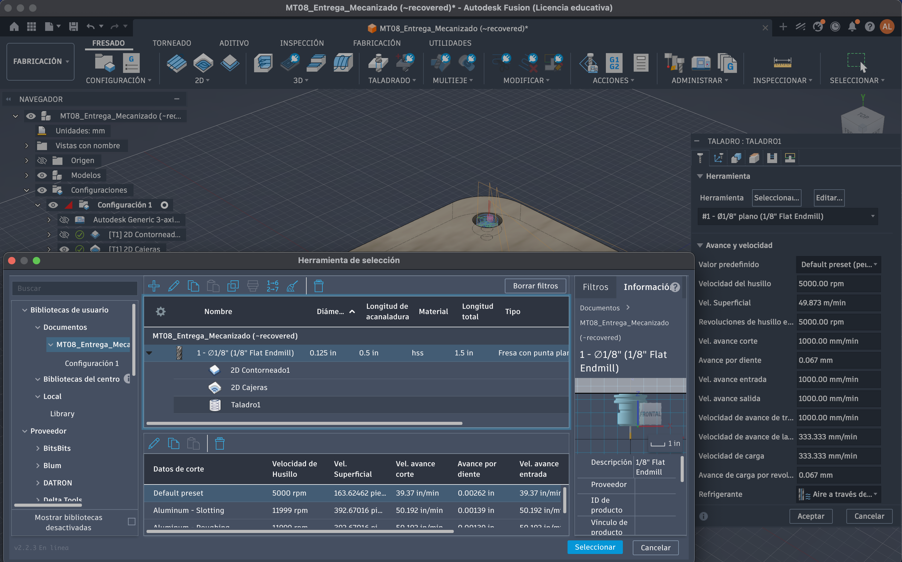

**[ TALADRO ]  . _GEOMETRÍA ~ CADENA CERRADA_**
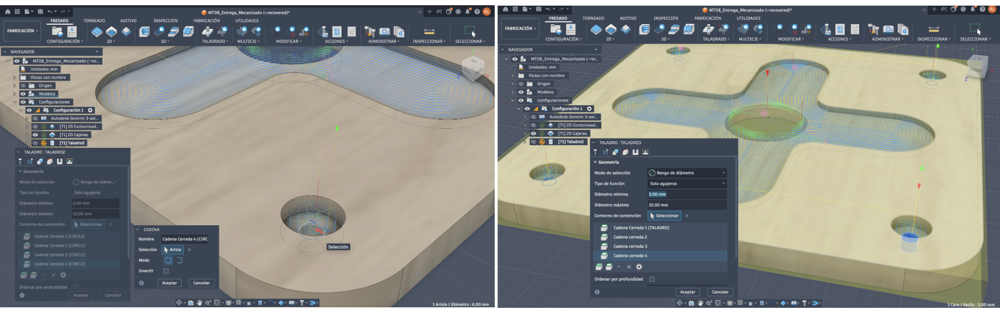

**[ TALADRO ]  . _ALTURAS_**
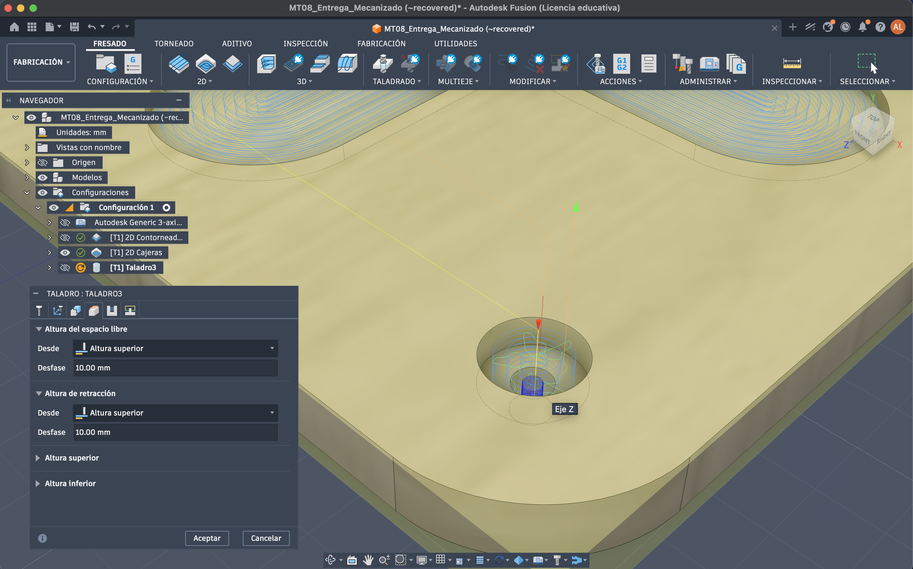
 

#### **CONTORNEADO** . *Módulo de Fabricación*

Se seleccionó (para cada operación de mecanizado) la siguiente **HERRAMIENTA** de maquinado del **menú de fresas**: 

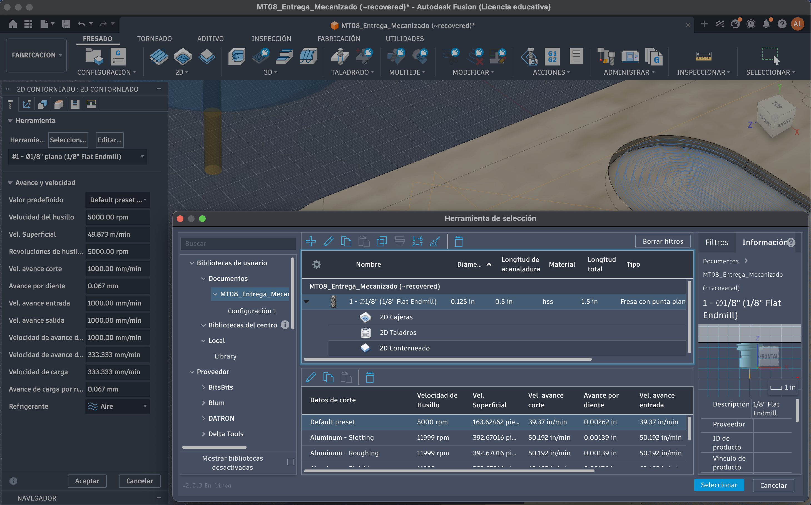

**[ CONTORNEADO ]  . _GEOMETRÍA ~ CADENA CERRADA_**
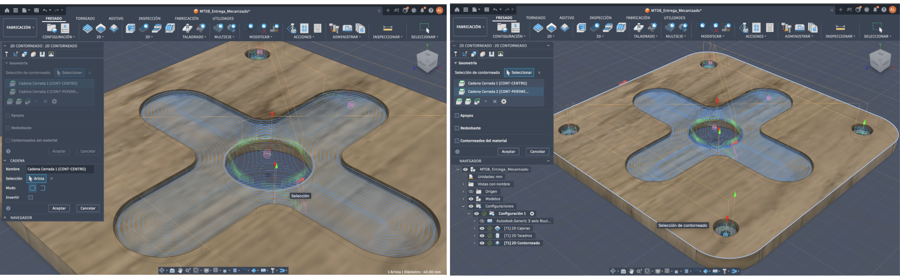

**[ CONTORNEADO ]  . _ALTURAS_**
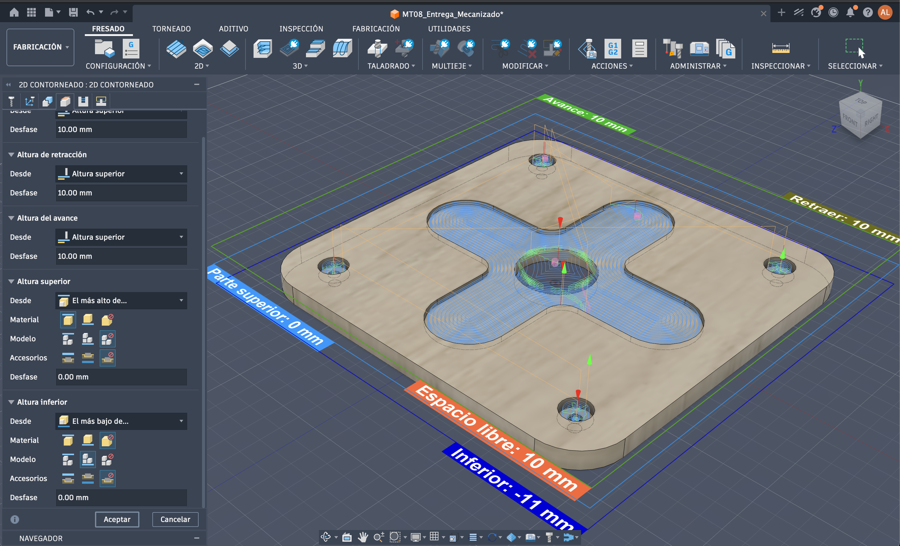

**[ CONTORNEADO ]  . _PASADAS_**
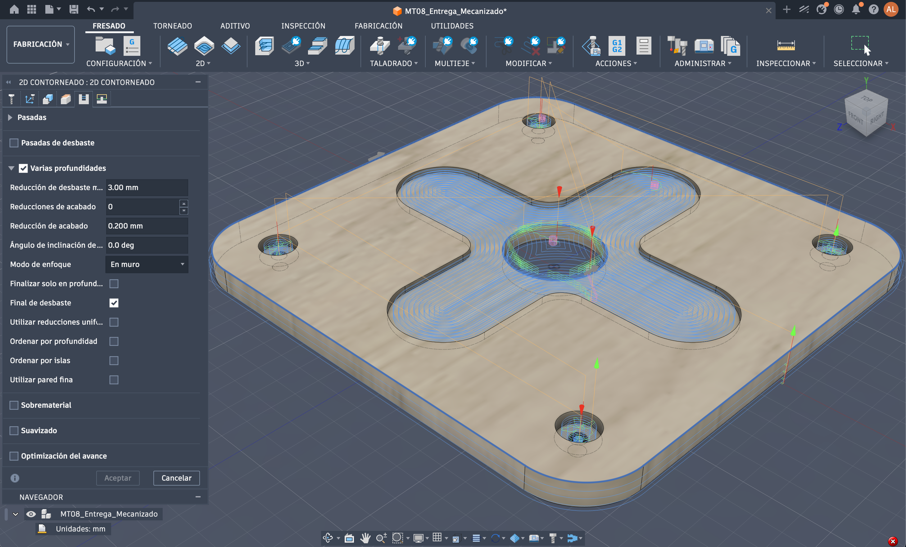
 

#### **SIMULACIÓN MECANIZADO** 

Una vez generadas las 3 operaciones de mecanizado, **SIMULA** cada una de las operaciones y chequea que se cumplan los objetivos del mecanizado (ver si el material a mecanizar toma la forma de la pieza suministrada en el archivo adjunto).

**[ SIMULACIÓN ]  . _PREVIEW_**
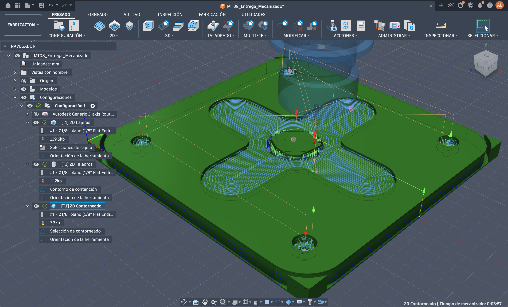

**[ SIMULACIÓN ]  . _REAL_**
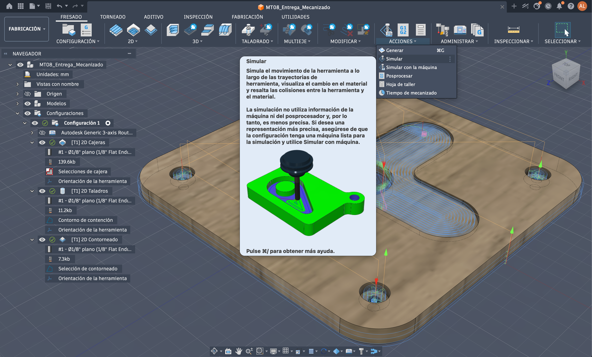
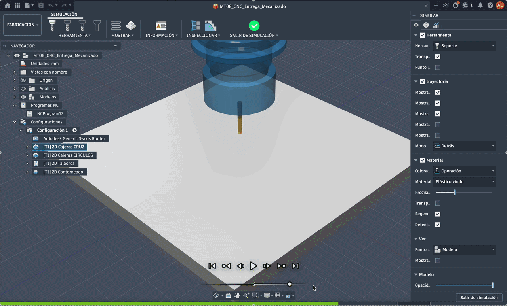
 

#### **POSTPROCESADOR F360 ~ CNC X-CARVE** 

Generé el CÓDIGO G (en formato .NC) siguiendo las siguientes configuraciones:
**Post-procesador de Easel para F360**: este post procesador permite generar un código G apto y compatible con la máquina X-CARVE comandada por el software Easel.
Seleccionamos el [archivo de descarga del post-procesador](https://drive.google.com/file/d/1awccpPvpL28sB1gJozI6dwUnpSIph6Kb/view?usp=sharing). Este archivo debe instalarse dentro de la carpeta F360 generada en nuestro disco rígido al momento de instalar el Software Fusion 360. Una vez descargado e instalado el archivo post-procesador dentro de Fusion 360, podemos generar el archivo .nc. [ + info [ Fusion CNC ~ código G ]](https://ev1.utec.edu.uy/moodle/mod/book/view.php?id=704874&chapterid=3242) 

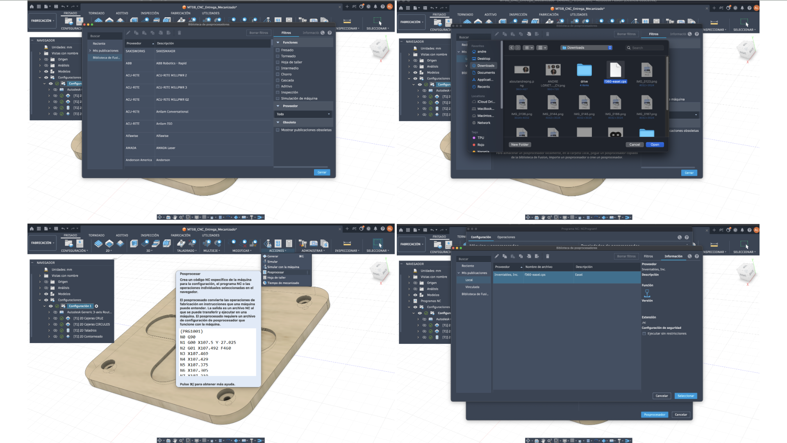

#### **CÓDIGO G** 
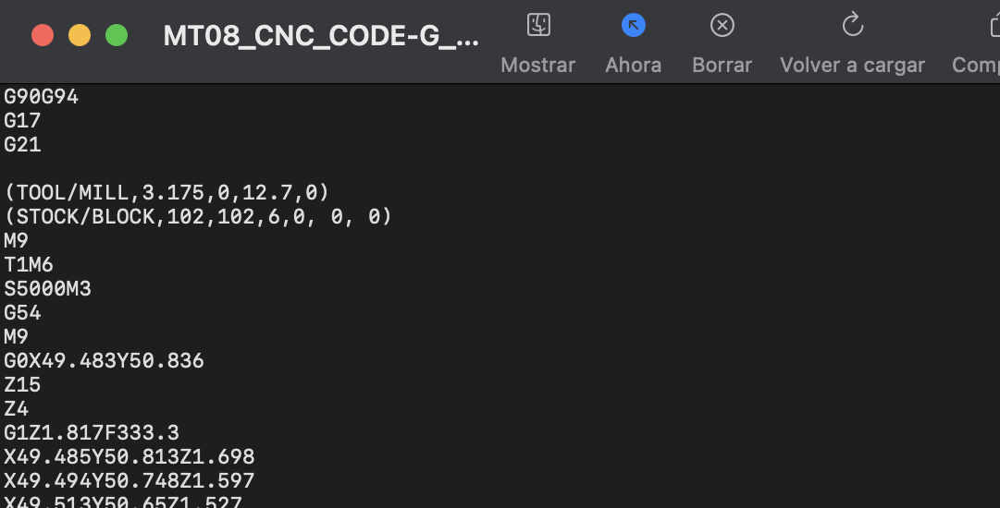

EASEL ~ CNC 2
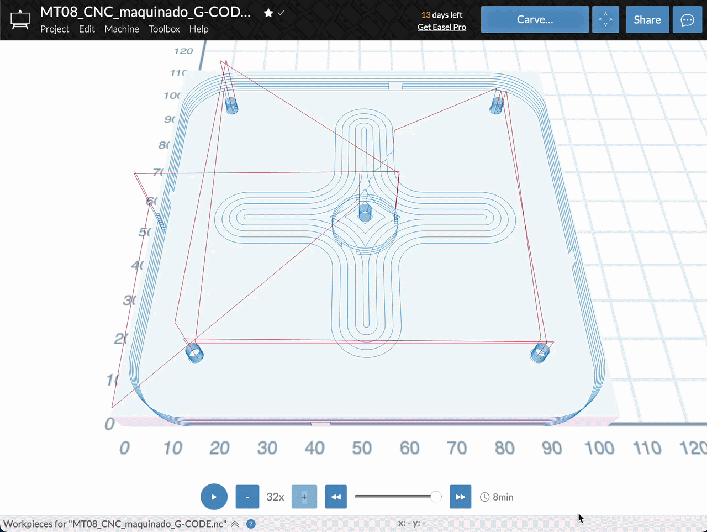

[🎬 [ CAD-CAM ~ Easel CNC preview]
]([https://](https://drive.google.com/file/d/1x4tXF0BDvgr-Yy4ucN7lfAPWOb0SICwX/view?usp=share_link))

## **FP03 . MT08**

#### **MECANIZADO CNC ~ X-CARVE**

Mecanizado CNC realizado en 3 repeticiones cada una correspondiente a una fresa distinta con el objetivo de mitigar los defectos visuales en la secuencia de ensayos, (ver debajo).

**Settings CAM Easel vs XCarve:**

+ Ubicamos el Cero espacial en la máquina CNC, correspondiente al Cero virtual del modelo en Easel. Marcamos físicamente, el Cero virtual  con una fibra sobre el material, (punto negro).
+ Fijamos el material a la cama, asegurarnos que la placa no se mueva durante el proceso de mecanizado. 
+ Ajustamos la altura (posición en Z) de la herramienta/fresa, hasta que la misma lo sujete, presionando ligeramente el espesor de un papel sobre la placa.

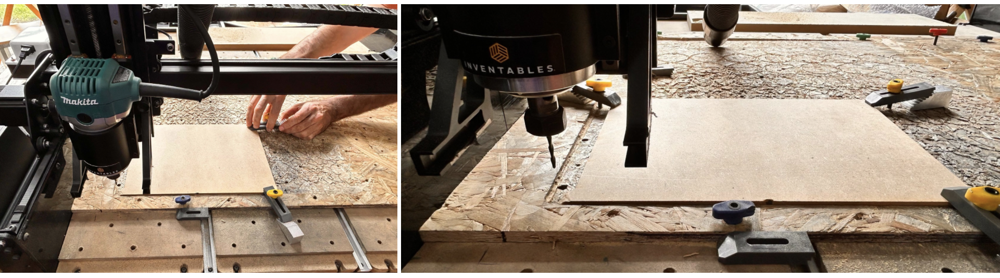
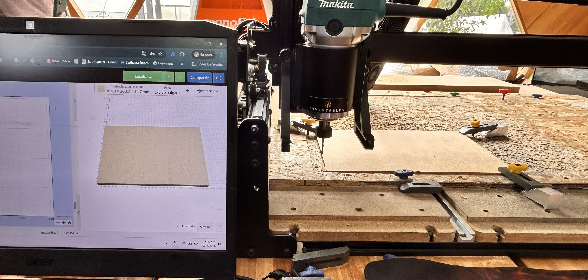
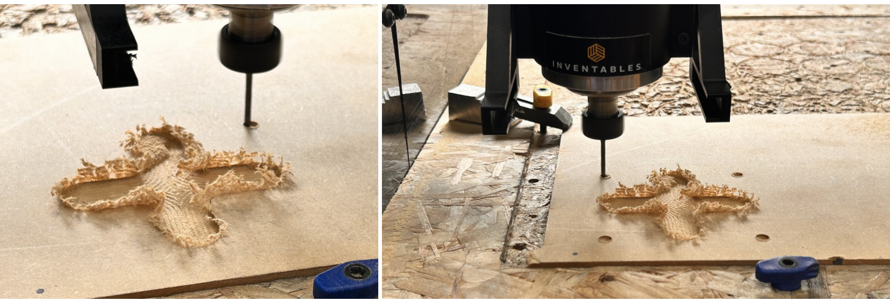
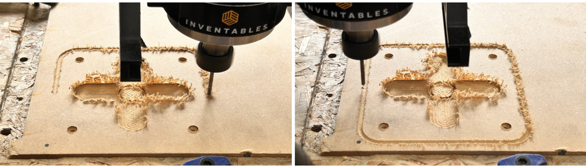
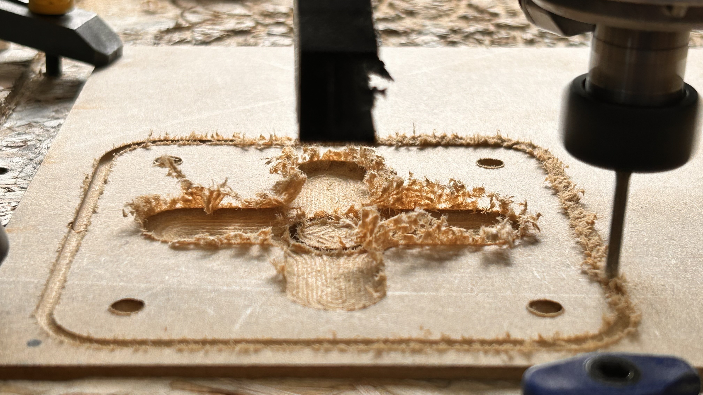

🎬 [[ Maquinado CNC X-Carve ]
](https://https://drive.google.com/file/d/19ZH4-nNhusZRdBbH30ntyi3NUKvYHaOu/view?usp=share_link)

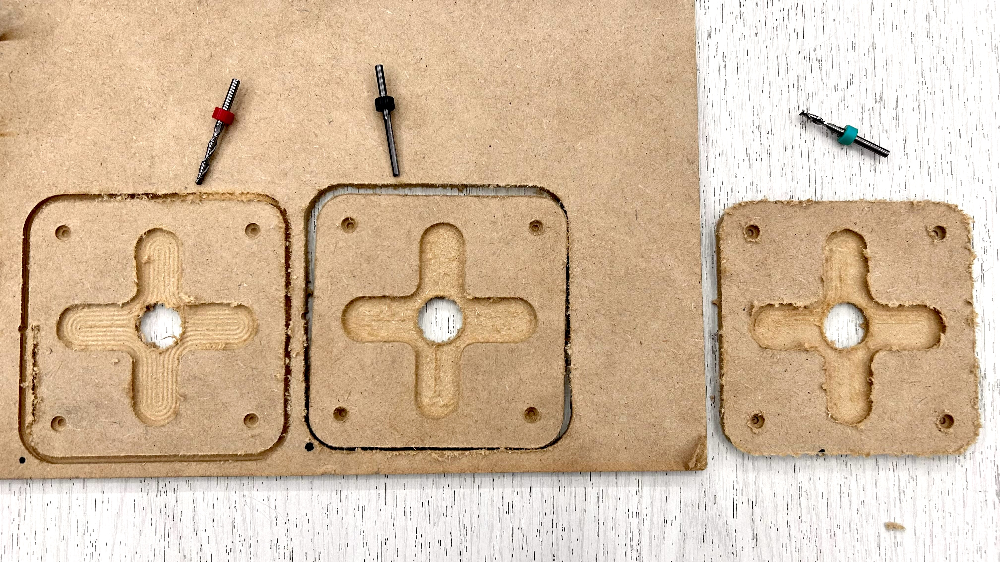

____

## **REFLEXIONES** . MT08
# ❝ 
El Router CNC comparativamente a las tecnologías de fabricación previas exploradas en las prácticas es de las más demandantes en el seteo de parámetros y secuencia de pasos de mecanizado. Fusión/fabricación como software permite una compresión integral paso a paso del proceso de maquinado CNC. Ofrece un realismo de simulación útil permitiendo mitigar errores, previo al prototipado CAM CNC. Al mismo tiempo, exige un proceso tedioso, extenso en setting de variables a diferencia de Easel, de un uso intuitivo y ágil para el setting y simulación del prototipado de proyecto (aunque completo solo en su versión premium); En este sentido queda bastante por explorar aún, para visualizar un punto intermedio práctico de la herramienta de Setting digital compatible con las dinámicas ágiles del hacer profesional fuera del contexto “romántico” del entorno de aprendizaje. 
____

## **LINKS DE INTERÉS** . MT08

SOFTWARE CAM ~ CNC

EASEL 
https://easel.com/
EASEL ~ INSTRUCTABLES  ~ SOFTWARE CAD-CAM https://content.instructables.com/ORIG/FW1/4AF2/I2VLGSNJ/FW14AF2I2VLGSNJ.pdf

Post-procesador de Easel para F360 ~ máquina X-CARVE
https://drive.google.com/file/d/1awccpPvpL28sB1gJozI6dwUnpSIph6Kb/view

KICAD
https://www.kicad.org/

CARBIDE ~ SOFTWARE CAM ~ CNC
https://carbide3d.com/carbidecreate/pro/

CAMOTICS 
https://camotics.org/

GRID KIRI 
https://grid.space/kiri/

REF FABACADEMY
https://fabacademy.org/2024/labs/barcelona/students/riichiro-yamamoto/01_Task//Week4/W4_Documentation.html

REF CNC 3D
https://fabacademy.org/2020/labs/kamplintfort/students/kais-alila/assignments/week10/

MÁQUINAS DURAZNO FABLAB
https://www.inventables.com/products/x-carve-1?srsltid=AfmBOor3yNgIeon-ZGiJfPWZfAEsEu29VkrGMSuf_JFgEA4q0Ax-fWx_

https://www.rolanddga.com/es-la/productos/3d/srm-20-fresadora-compacta

Blend Curve en Fusion 360
https://youtu.be/vwRSThN4jKM?si=rHdxiV791KsMiIQP

Fusion 360: Slicing Organic Forms for Laser Cutting
https://youtu.be/dWYMBVTUvDA?si=j2uK1YS77l4FZ9FT

Programación de estrategias de mecanizado en Fusion 360
https://youtu.be/3jEjvuGqJh4?si=YMVW0l4xj8dk9sOB
