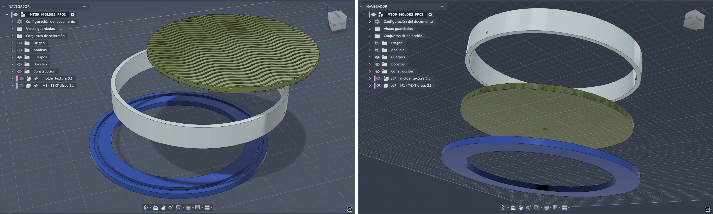
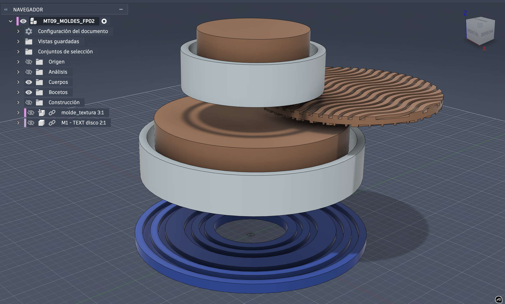
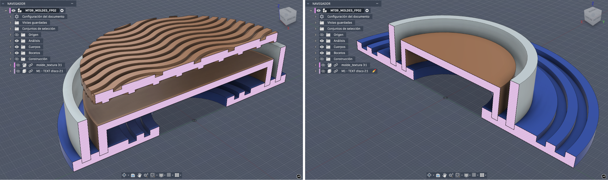
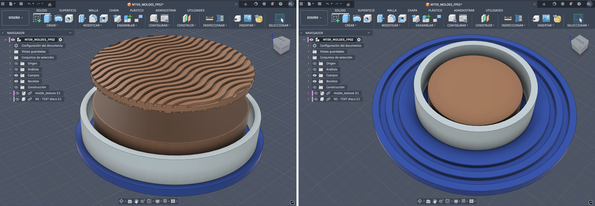
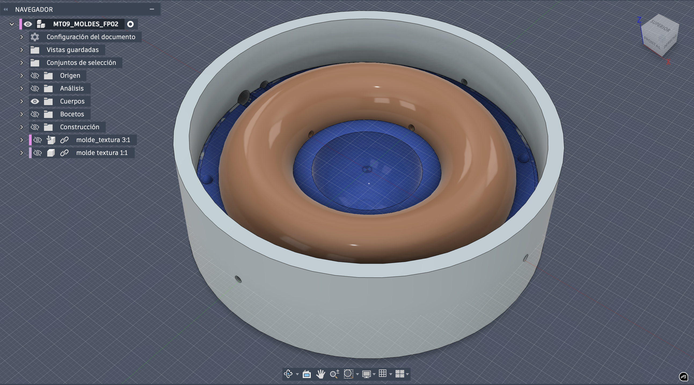
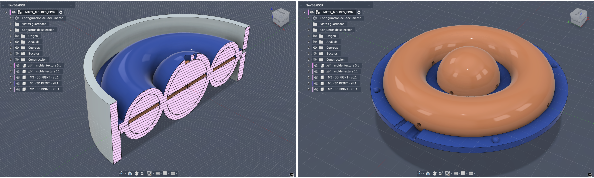
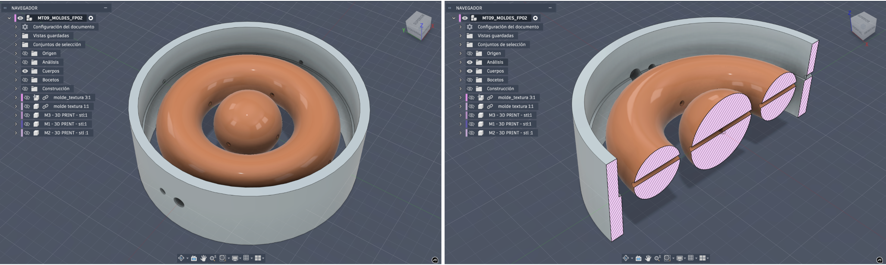
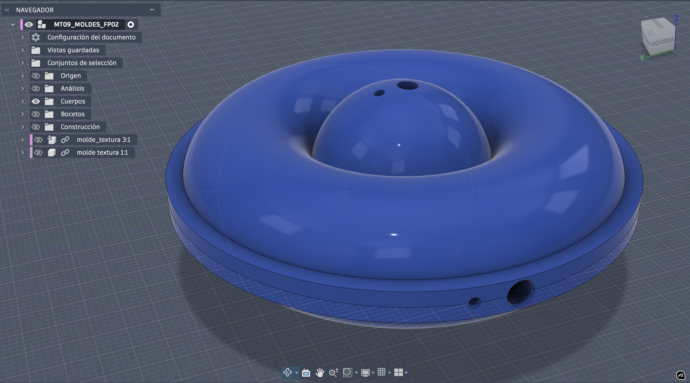

---
hide:
    - toc
---

# **MT** 09

>## **MOLDES**
*TECNOLOGÍA Y FABRICACIÓN*

 
 
 
 
_____

Este **_Módulo Técnico 09_** se centró en la técnica de fabricación de **Moldería 3D**, a partir de un abordaje mayormente teórico-digital (y potencial práctico hacia el proceso experimental y ensayos futuros) con una mirada sobre: 
- Comprensión de principios fundamentales del diseño, fabricación y uso de moldes, reconociendo su rol en los procesos de prototipado.
- Aplicación de criterios de diseño para la fabricación de moldes con tecnologías de impresión 3D y/o router CNC. 

 
## **HERRAMIENTAS PRÁCTICAS TECH APLICADAS . MT09**

En este proceso de aprendizaje pautado por la -ideación proyectual- de _Moldería Tridimensional_, exploré, analicé y valoré de forma teórica y digital, las diferentes variables que implican a la técnica de **fabricación analógica de Moldería 3D** en relación directa con la técnica de **fabricación digital Impresión 3D** (sistema de fabricación aditiva), combinando decisiones estratégicas que surgen de ambos recursos (moldería + 3d Print) como sistemas de prototipado de un posible 'diseño’ material (réplica) proyectado.

_"Los moldes pueden variar ampliamente según su aplicación, la complejidad de la pieza, el nivel de detalle requerido, el material a moldear y el proceso específico que se utilice (si se aplica calor, presión, entre otras consideraciones)."_

 
### **MOLDERÍA '2D & 3D'** . 3D PRINTING PROCESS 

En la moldería proyectada generé un ‘mini kit' de Moldes **_Maestro/Original_** (primarios), integrados por geometría simple 3D y 2D, con algunas piezas combinables/encastrables (a través del 3d print) destinado a los **_Moldes Matriz_** (secundarios), de tipo rígido y flexible para obtener como resultante _Réplicas/Prototipos_ en material rígido y flexible. El _Molde Maestro (MM)_ el "master", en ciertos procesos de moldeo (como silicona), es la pieza original positiva utilizada para crear la matriz negativa (molde secundario).

 
### MOLDE . 2D


 
### **MOLDE A . 2D** ~ réplica 2D flexible


Molde **rígido** (a partir de impresión 3D), destinado a **RÉPLICA/PROTOTIPO 2D** en materiales **flexibles**. 

```4 PIEZAS > disco (base) + aro (continente) + planos reversibles (4 texturas, contraforma positiva.```




 
### **MOLDE B . 2D** ~ molde 3D flexible / réplica 2D rígida

Molde Maestro 3D **rígido** (a partir de impresión 3D), destinado a Molde/Matriz 3D **flexible**, para **RÉPLICA/PROTOTIPO 2D** en materiales **rígidos** o similares.  

```6 PIEZAS > disco (base) + aros (continente) + cilindros huecos (contraforma positiva) + plano reversible (2 texturas, contraforma positiva).```





 
### MOLDE . 3D




 
### **MOLDE C . 3D** ~ molde 3D flexible / réplica 3D rígida

Molde Maestro 3D **rígido** (a partir de impresión 3D), destinado a Molde/Matriz 3D **flexible**, para **RÉPLICA/PROTOTIPO 3D** en materiales **rígidos** o similares.  

```3 PIEZAS > aro (continente) + toroide (contraforma positiva).```



 
### **MOLDE D . 3D** ~ réplica 3D flexible

Molde **rígido** (a partir de impresión 3D), destinado a distintas **RÉPLICA/PROTOTIPO 3D** (toroide/esfera), para materiales **flexibles**.


```2 PIEZAS > ½ toroide/esfera (concavidades encastrables, sup/inf).```




____


## **REFLEXIONES** . MT09
# ❝ 
_Def 1: Molde = matriz, patrón, modelo, módulo // def. 2:  Cercano al Método o procedimiento, receta, para replicar algo" // Moldear = ahormar, vaciar, fundir, moldurar, forjar, troquelar, acuñar, adaptar, formar…_ Es decir me resulta interesante la acción de **_Moldear_** junto al concepto implícito o cualidad del **_Molde_** de la "receta” de algo para llegar a su réplica; Ej: puedo sin un molde propiamente dicho dar forma a algo, en diversidad de formatos, sustrayendo material a un sólido (molde), adicionando materia prima, solidificando material líquido, fundiendo material sólido, combinando todas en simultáneo, sin obligatoriamente continentar la materia de forma directa…  

La capacidada productiva DE UN MOLDE es INFINITA y su alcance es poderoso; brindando versatilidad y  agilidad regenerativa/reproductiva y permitiendo ensayar geometrías, materiales y procesos antes de producir a gran escala, dinamizando y enriqueciendo las etapas técnicas del proceso proyectual de diseño en una sinergia lúdica del ensayo y error hacia la definición de fabricación del producto final.

A diferencia de otras técnicas/tecnologías de fabricación, la moldería demanda presencialidad, lo tangible es inevitable y compite fuertemente con la dimensión digital frente al universo digital a tal punto de completar y complementar con sentido.

Siendo la moldería una temática técnica que requiere una dimensión tangible, la importancia de tener acceso directo a la tecnología de impresión 3D, para la manualidad analógica, sensorialidad, tiempo de proceso para materializar los moldes maestros e iteraciones del ensayo y error, es necesario y clave.

A través del 3D print el acercamiento al proceso experimental y de ensayo práctico quedó en lo teórico;
El módulo MT09 no ha tenido práctica real quedando inconcluso (de momento…); 
Frente a una temática de fabricación técnica amplia y diversa como la moldería ameritaba experimentar la práctica con una consigna curricular de ensayo inmediato para atravesar el proceso tangible y matérico clave e inherente a la técnica de moldería del ensayo y error. A partir de la consigna curricular dada la experiencia práctica quedó reducida en su mayoría al modelado a la impresión 3D. Hubiese sido motivador enfrentarse a un desafío no limitado por la impresión 3D (ya conocida) que impusiera explorar la técnica en moldería creativamente abierta con resultados tangibles sincrónicos al periodo de dictado del módulo. 
